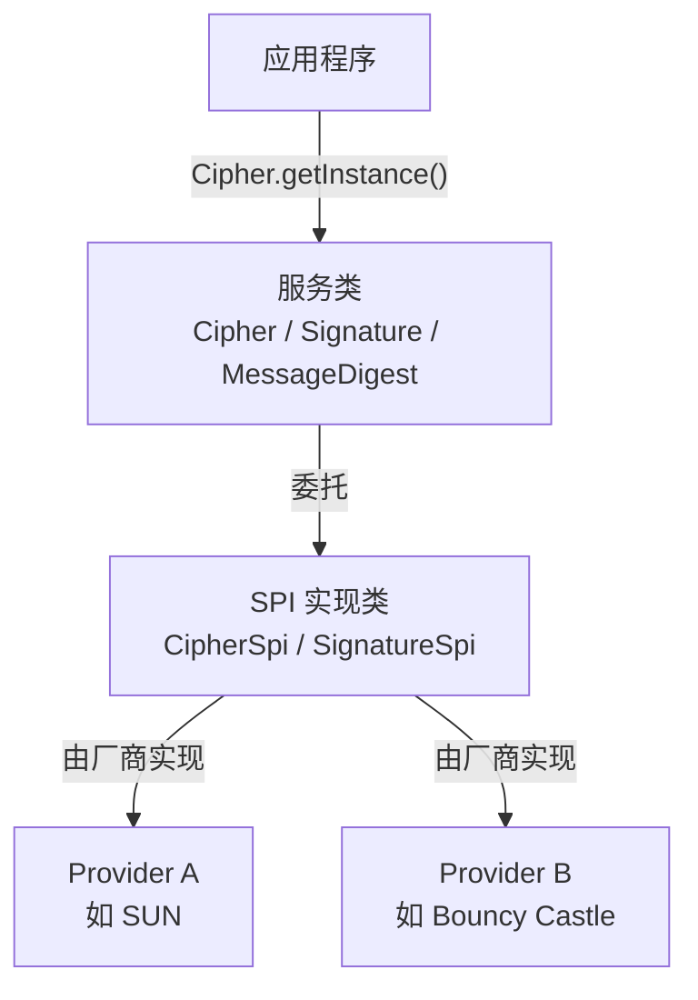
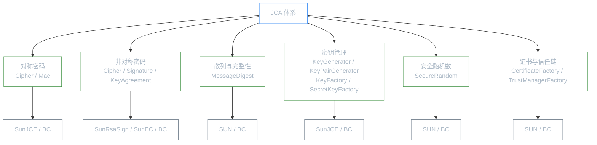
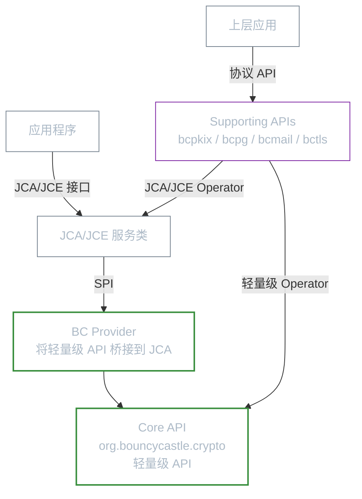

# Java 密码学架构

**本文你会学到**：

- Java 密码学框架（JCA/JCE）的 Provider 架构如何实现「一套接口，多种实现」
- Bouncy Castle 的分层 API 设计理念与安装方式
- 为什么 `SecureRandom` 的质量比你想的更重要
- 「安全位数」的含义以及如何为应用选择合适强度的算法

## 为什么 Java 需要密码学框架？

假设你正在开发一个需要加密数据的应用。面对几十种加密算法（AES、RSA、ECDSA……）、每种算法又有多种模式（CBC、GCM、CTR……），如果每个厂商的加密库都提供完全不同的 API，你的代码将变成厂商锁定（vendor lock-in）的重灾区——换一家厂商，整个加密层就要重写。

这就像早期的手机充电器：每家厂商一个接口，换手机就要换线。直到 USB 标准出现，一根线走天下。

Java 密码学架构（Java Cryptography Architecture，JCA）就是密码学领域的「USB 接口标准」。它定义了一套统一的服务类（如 `Cipher`、`Signature`、`MessageDigest`），开发者只需要知道「我要用 AES 加密」，而不需要关心底层是哪个厂商的实现在工作。

⚠️ 早期（Java 1.4 之前），Java Cryptography Extension（JCE）是单独发布的，与 JCA 分离。Java 1.4 之后两者合并，现在通常统一视为 JCA 的一部分。

### 密码学工程的两大陷阱：自制算法与错误实现

理解了"为什么需要密码学框架"之后，有必要先认识两个工程实践中最常见的陷阱——Wong 在《Real-World Cryptography》中反复强调，绝大多数密码学灾难都来自这两个方向。

**陷阱一：自制算法（"Don't roll your own crypto"）**

想象你家的门锁。你可以自己弯几根铁丝做一把锁，看起来挺复杂——但"看起来复杂"和"真正安全"之间有天壤之别。没有经过专业锁匠测试的锁，可能被有经验的人在几秒内撬开。

密码算法同理。Bruce Schneier 有句名言："任何人，从最无知的业余爱好者到最顶尖的密码学家，都能设计出一个他自己无法破解的算法。" 难的不是创造算法，而是创造**别人也无法破解**的算法。

正确做法是选用经过公开竞争和广泛密码分析的标准算法。`AES` 的诞生就是典范：NIST 组织历时数年的国际竞赛，来自全球的密码分析师对每个候选算法轮番轰炸，最终脱颖而出的才是值得信任的算法。这正是 Kerckhoffs 原则的精髓：**算法可以公开，秘密只在密钥**。

JCA 通过标准化接口，让开发者只能使用已知算法名称（如 `"AES/GCM/NoPadding"`），从根本上引导大家使用经过验证的算法，而非自造轮子。

**陷阱二：正确算法 + 错误实现（弄错了锁的用法）**

即使选了最好的锁，如果装反了门，锁也没用。一项针对 269 个 Android 应用密码学使用情况的研究显示：**83% 的密码学漏洞来自对密码库的错误使用，而非密码库本身的 bug**。

常见的错误实现：

- 重用 `Nonce`/`IV`（AES-GCM 下重用 IV 会完全暴露明文差分）
- 不验证 MAC 就使用解密结果
- 用 `java.util.Random` 而非 `SecureRandom` 生成密钥
- 手动拼接 `Cipher` + `Mac`，在 IV 处理或密钥派生的细节上出错

在 JCA 体系中，选择高层抽象（直接使用 `AES/GCM/NoPadding` 的 AEAD 模式）比手动组合底层原语更安全。`Bouncy Castle` FIPS API 和 Google Tink 等库更进一步，通过接口设计约束（如禁止手动指定 IV）来防止开发者射自己的脚。

## JCA Provider 架构

### 服务类与 SPI

JCA 的核心设计是一个**分层架构**：上层是开发者使用的服务类，下层是厂商实现的 SPI（Service Provider Interface，服务提供者接口）。



从开发者的角度看，创建一个 `Cipher` 对象只需要一行代码：

``` java title="使用 getInstance() 获取 Cipher 实例"
// 不指定 Provider，JCA 按优先级自动选择
Cipher cipher = Cipher.getInstance("AES/CBC/PKCS5Padding");
```

而在幕后，JCA 找到了支持 AES/CBC/PKCS5Padding 的 Provider，并用该 Provider 提供的 `CipherSpi` 子类来创建实际的加密引擎。开发者永远不需要直接接触 `CipherSpi`——这就是 SPI 设计的价值。

### Provider 优先级

当你不指定 Provider 时，JCA 如何决定用哪一个？答案是**优先级**。JVM 维护一个 Provider 有序列表，排在前面的优先级更高。

``` java title="Provider 优先级演示"
// 将 BC 添加到优先级列表末尾
Security.addProvider(new BouncyCastleProvider());

// 未指定 Provider → 返回优先级最高的实现（此处为 SUN）
System.out.println(
    MessageDigest.getInstance("SHA1").getProvider().getName()); // SUN

// 指定 Provider 名称 → 返回指定实现
System.out.println(
    MessageDigest.getInstance("SHA1", "BC").getProvider().getName()); // BC
```

也可以通过传入 Provider 对象来指定：

``` java title="通过 Provider 对象指定实现"
Cipher cipher = Cipher.getInstance(
    "Blowfish/CBC/PKCS5Padding",
    new BouncyCastleProvider()
);
```

JVM 启动时，Provider 的优先级由 `java.security` 文件中的列表决定。Java 8 及之前位于 `$JAVA_HOME/jre/lib/security/java.security`，Java 9+ 位于 `$JAVA_HOME/conf/security/java.security`。文件中的 `security.provider.1=...` 表示最高优先级，数字越大优先级越低。

### 常见 Provider

JDK 内置了多个 Provider，每个负责不同领域的安全服务。Java 9 起有 12 个内置 Provider（Java 1.4 只有 5 个）。

| Provider | 职责 |
|----------|------|
| `SUN` | 标准 JCA 服务（`MessageDigest`、`Signature` 等基础实现） |
| `SunRsaSign` | RSA 签名算法 |
| `SunEC` | 椭圆曲线密码学（ECC） |
| `SunJSSE` | SSL/TLS 实现（Java Secure Socket Extension） |
| `SunJCE` | JCE 服务（`Cipher`、`Mac`、`KeyAgreement`） |
| `SunJGSS` | Java Generic Security Services（Kerberos 等） |
| `SunSASL` | 简单认证与安全层 |
| `SunPKCS11` | PKCS#11 支持，对接硬件安全模块（HSM） |

你可以通过代码查看当前 JVM 安装了哪些 Provider：

``` java title="列出已安装的 Provider"
Provider[] providers = Security.getProviders();
for (Provider p : providers) {
    System.out.println(p.getName() + ": " + p.getInfo());
}
```

### 从 JCA 角度看密码学原语全景

JCA 将密码学服务分为若干类引擎（Engine Class），每类引擎对应一种密码学原语。理解这张全景图，能帮助你快速定位"我需要用哪个 JCA 类"：



各引擎与密码学原语的对应关系：

| JCA 引擎类 | 对应密码学原语 | 典型算法 | 相关笔记 |
|-----------|--------------|---------|---------|
| `Cipher` | 对称/非对称加密 | AES-GCM、RSA-OAEP | 「[对称加密](../symmetric-encryption/)」 |
| `Signature` | 数字签名 | ECDSA、EdDSA、RSA-PSS | 「[数字签名](../digital-signatures/)」 |
| `MessageDigest` | 散列函数 | SHA-256、SHA3-256 | 「[散列函数与完整性保护](../hashing-and-integrity/)」 |
| `Mac` | 消息认证码（MAC） | HMAC-SHA256、GMAC | 「[散列函数与完整性保护](../hashing-and-integrity/)」 |
| `KeyAgreement` | 密钥协商 | ECDH、X25519 | — |
| `KeyGenerator` | 对称密钥生成 | AES 密钥 | — |
| `KeyPairGenerator` | 非对称密钥对生成 | RSA、EC 密钥对 | — |
| `SecureRandom` | 密码学安全随机数 | NativePRNG、DRBG | — |

### JCA Provider 选择指南

面对 `SunJCE`、`Bouncy Castle`、PKCS#11 硬件 Provider 等多种选择，如何决定用哪个？

| 场景 | 推荐 Provider | 原因 |
|------|-------------|------|
| 日常 AES、HMAC、SHA-2 等通用算法 | `SunJCE` / `SUN`（不指定 Provider） | JDK 内置，零依赖，经 Oracle 长期维护 |
| 需要 EdDSA、SM2/SM3/SM4、AES-CCM 等扩展算法 | `Bouncy Castle`（`BC`） | 算法覆盖最全，更新活跃 |
| 政府/金融合规（FIPS 140-2/3） | `Bouncy Castle FIPS`（`BCFIPS`）或 OS 级 FIPS 模式 | 需要 FIPS 认证，不可用标准 BC |
| 密钥必须保存在硬件安全模块（HSM） | `SunPKCS11` + HSM 厂商驱动 | 硬件隔离，密钥不出 HSM |
| 云端密钥管理 | AWS KMS / GCP Cloud HSM 等 SDK | 将加密计算卸载到云端，密钥零接触 |

💡 **经验原则**：能不加依赖就不加。`SunJCE` 对 AES-GCM、HMAC、RSA、ECDSA 的支持已能覆盖绝大多数业务场景。只有当你需要 `SunJCE` 不支持的算法（如国密 SM 系列）或需要 FIPS 认证时，才引入 `Bouncy Castle`。

``` java title="Provider 选择决策示例"
// ✅ 推荐：不指定 Provider，JCA 自动选择最优实现
Cipher aes = Cipher.getInstance("AES/GCM/NoPadding");

// ✅ 需要国密算法时，明确指定 BC
Cipher sm4 = Cipher.getInstance("SM4/CBC/PKCS7Padding", "BC");

// ✅ 需要 FIPS 合规时，切换到 BC-FIPS Provider
// Security.addProvider(new BouncyCastleFipsProvider());
// Cipher fipsAes = Cipher.getInstance("AES/GCM/NoPadding", "BCFIPS");
```

## Bouncy Castle 架构

JDK 内置 Provider 涵盖了常见需求，但当你要用 AES-GCM、EdDSA、SM2/SM3/SM4（国密）等算法时，往往会发现内置支持不够全面。Bouncy Castle（简称 BC）是最广泛使用的第三方密码学 Provider，它几乎实现了你能想到的所有密码学算法。

### API 分层

BC 的 API 采用分层设计，从底层的轻量级 API 到上层的协议支持 API，逐层构建：



各层职责如下：

- **Core API**（`org.bouncycastle.crypto`）：轻量级 API，提供加密、摘要、MAC、签名等基础组件。设计理念是「密码学代数」——你可以自由组合不同的算法、模式和编码。但它不会阻止你组合出不安全的方案，所以使用时需要清楚自己在做什么
- **BC Provider**：基于轻量级 API 构建的 JCA/JCE Provider，将底层算法通过 SPI 接口暴露给 JCA
- **Supporting APIs**：构建在 Core API 之上的高层协议支持，分为 4 个 JAR 包

| JAR 包 | 覆盖协议 |
|--------|---------|
| `bcpkix` | CMS、PKCS#10、PKCS#12、X.509 证书、OCSP、TSP、CMP 等 |
| `bcpg` | OpenPGP |
| `bcmail` | S/MIME |
| `bctls` | TLS/DTLS（包含 BCJSSE Provider）

### 安装 Bouncy Castle

最简单的方式是通过 Maven 添加依赖：

``` xml title="Maven 依赖（核心 Provider）"
<dependency>
    <groupId>org.bouncycastle</groupId>
    <artifactId>bcprov-jdk18on</artifactId>
    <version>1.80</version>
</dependency>
```

如果你需要处理证书、S/MIME 等，还要加上对应的 Supporting API 依赖（如 `bcpkix-jdk18on`）。

添加依赖后，有两种方式让 JVM 识别 BC Provider：

**运行时注册**（简单，但 Provider 在 `java.security` 文件中没有记录）：

``` java title="运行时注册 Provider"
Security.addProvider(new BouncyCastleProvider());

// 之后就可以用 "BC" 名称指定 Provider 了
Cipher cipher = Cipher.getInstance("AES/GCM/NoPadding", "BC");
```

**静态配置**（推荐，JVM 启动即生效）：

在 `$JAVA_HOME/conf/security/java.security`（Java 9+）中添加：

```
security.provider.N=org.bouncycastle.jce.provider.BouncyCastleProvider
```

`N` 是优先级数字，越小优先级越高。确保 BC 的 JAR 在 classpath 上即可。

### 密码学的合规要求（FIPS 140-2/3 简介）

如果你的系统要接入政府机构、金融机构或医疗系统，经常会遇到一个硬性要求：**FIPS 140-2/3 合规**。

`FIPS 140`（Federal Information Processing Standard 140）是美国 NIST 针对密码模块（Cryptographic Module）发布的安全标准，从 FIPS 140-2（2002 年生效）到最新的 FIPS 140-3（2019 年），它定义了密码模块在设计、实现和运行方面必须满足的安全要求，分为 Level 1～Level 4 四个等级：

| 等级 | 要求 | 典型场景 |
|------|------|---------|
| Level 1 | 算法必须通过 FIPS 认证，软件实现即可 | 普通商业 SaaS |
| Level 2 | 需要防篡改证据（如封条） | 政府信息系统 |
| Level 3 | 防篡改 + 身份认证 + 密钥清零 | 金融、军事 |
| Level 4 | 完整物理防护，任何入侵尝试触发密钥销毁 | 最高安全场景 |

**FIPS 合规对 Java 开发者意味着什么？**

在 FIPS 模式下，有以下限制：

- 只能使用 FIPS 认证的算法（如 AES、SHA-2、RSA-2048+、ECDSA P-256+）
- 禁用非 FIPS 算法（如 MD5、SHA-1 用于签名、RC4、DES）
- 密钥必须由 FIPS 认证的 DRBG 生成

`Bouncy Castle` 提供了独立的 FIPS 认证版本（`bc-fips`），Maven 依赖与标准版不同：

``` xml title="Bouncy Castle FIPS 依赖"
<!-- FIPS 认证版，不能与标准 bcprov 同时使用 -->
<dependency>
    <groupId>org.bouncycastle</groupId>
    <artifactId>bc-fips</artifactId>
    <version>1.0.2.5</version>
</dependency>
```

``` java title="注册 BC-FIPS Provider"
import org.bouncycastle.jcajce.provider.BouncyCastleFipsProvider;

// 通常放在应用启动时（如 static 块或 main 方法中）
Security.addProvider(new BouncyCastleFipsProvider());

// 使用 FIPS 认证的 AES-GCM
Cipher cipher = Cipher.getInstance("AES/GCM/NoPadding", "BCFIPS");
```

⚠️ `bc-fips` 和标准 `bcprov`（`BouncyCastleProvider`）不能在同一 JVM 中同时注册——两者 Provider 名称分别是 `"BCFIPS"` 和 `"BC"`。需要 FIPS 合规的项目应从一开始就选择 `bc-fips`，不要混用。

### 迁移指南：从 SunJCE 到 Bouncy Castle

当业务需求超出 `SunJCE` 的算法覆盖范围（如需要国密算法、新曲线或 FIPS 合规），你需要将加密代码迁移到 `Bouncy Castle`。好消息是：因为 JCA 接口统一，迁移成本非常低。

``` java title="AES-GCM 加密：SunJCE 与 Bouncy Castle 接口对比"
import javax.crypto.*;
import javax.crypto.spec.*;
import java.security.*;
import org.bouncycastle.jce.provider.BouncyCastleProvider;

// 通常放在应用启动时
Security.addProvider(new BouncyCastleProvider());

byte[] key = new byte[32]; // 256-bit AES 密钥
byte[] iv  = new byte[12]; // GCM 推荐 12 字节 IV
new SecureRandom().nextBytes(key);
new SecureRandom().nextBytes(iv);

SecretKeySpec keySpec = new SecretKeySpec(key, "AES");
GCMParameterSpec gcmSpec = new GCMParameterSpec(128, iv); // 128-bit 认证标签

// ✅ SunJCE（不指定 Provider）
Cipher sunjce = Cipher.getInstance("AES/GCM/NoPadding");
sunjce.init(Cipher.ENCRYPT_MODE, keySpec, gcmSpec);

// ✅ Bouncy Castle（指定 "BC"）— 接口完全相同，只换 Provider 名称
Cipher bc = Cipher.getInstance("AES/GCM/NoPadding", "BC");
bc.init(Cipher.ENCRYPT_MODE, keySpec, gcmSpec);
```

``` java title="EdDSA 签名：仅 Bouncy Castle 完整支持 Ed25519"
import org.bouncycastle.jce.provider.BouncyCastleProvider;
import java.security.*;

Security.addProvider(new BouncyCastleProvider());

// 生成 Ed25519 密钥对
KeyPairGenerator kpg = KeyPairGenerator.getInstance("Ed25519", "BC");
KeyPair kp = kpg.generateKeyPair();

// 签名
Signature signer = Signature.getInstance("Ed25519", "BC");
signer.initSign(kp.getPrivate());
signer.update("要签名的消息".getBytes());
byte[] sig = signer.sign();

// 验签
Signature verifier = Signature.getInstance("Ed25519", "BC");
verifier.initVerify(kp.getPublic());
verifier.update("要签名的消息".getBytes());
boolean ok = verifier.verify(sig); // true
```

迁移时需要确认的要点：

- 引入 `bcprov-jdk18on` 依赖，并在应用启动时调用 `Security.addProvider(new BouncyCastleProvider())`
- 将 `Cipher.getInstance("...")`、`Signature.getInstance("...")` 等调用添加第二参数 `"BC"`（或将 BC 设置为最高优先级后不再指定）
- 算法名称基本兼容，但部分填充名称有差异（`PKCS5Padding` vs `PKCS7Padding`，在 BC 中两者等价）
- 迁移后运行原有测试套件；若有已有密文/签名需要向后兼容，先做解密/验签回归测试

## 熵与安全位数

### 为什么随机数质量至关重要

密码学中有一个残酷的真相：**用质量差的随机数生成的密钥，比没有密钥更危险**。为什么？因为「没有密钥」意味着你知道自己不安全，会采取其他保护措施；而「以为自己有密钥但实际很容易被猜到」则让你在毫无防备的情况下被攻破。

这就好比你家门的锁——如果没装锁，你知道要小心；如果装了一把看起来很结实但实际用牙签就能撬开的锁，你反而会放松警惕。

JVM 中的随机数来源于操作系统的熵池。Linux 系统提供两个接口：

| 接口 | 行为 |
|------|------|
| `/dev/random` | 熵不足时**阻塞等待**，保证质量 |
| `/dev/urandom` | 熵不足时**继续输出**，不阻塞，但质量可能下降 |

在虚拟化环境中（如 Docker 容器），硬件 RNG 可能不可用，导致 `/dev/random` 长时间阻塞——如果你的应用突然「卡住」了，这往往是熵耗尽的表现。安装 `rng-tools` 或配置硬件 RNG 可以解决这个问题。

### SecureRandom 的两种服务

BC Provider 提供了两种 `SecureRandom` 服务，适用于不同场景：

``` java title="BC 的两种 SecureRandom 服务"
// DEFAULT：每次请求前都 reseed，适合生成密钥
SecureRandom keyRandom = SecureRandom.getInstance("DEFAULT", "BC");

// NonceAndIV：周期性 reseed，适合生成 IV 和 Nonce
SecureRandom ivRandom = SecureRandom.getInstance("NonceAndIV", "BC");
```

| 服务 | Reseed 策略 | 适用场景 |
|------|------------|---------|
| `DEFAULT` | 每次请求前 reseed（prediction resistant 模式） | 密钥生成、任何对随机质量要求极高的场景 |
| `NonceAndIV` | 周期性 reseed | IV（初始化向量）、Nonce 等非密钥用途 |

两者的核心区别在于 **prediction resistance**（预测抵抗性）。`DEFAULT` 在每次处理请求前都会从熵源重新获取种子，确保即使攻击者知道了之前的输出，也无法预测下一次输出。这对密钥生成至关重要——但对 IV/Nonce 来说要求过高了，因为 IV 本身不需要保密，只需要不重复。

### PRG 安全性与 SecureRandom

**伪随机生成器（PRG，Pseudorandom Generator）** 的安全定义是：$G(s)$ 的输出与真随机串在计算上不可区分。即任何高效算法都无法区分"PRG 的输出"和"抛硬币产生的等长随机串"。

`SecureRandom` 本质上就是 PRG 的工程实现。它从一个真随机种子（来自操作系统的硬件随机源）出发，用 PRG 算法扩展出任意数量的伪随机字节。

**Prediction resistance** 是 PRG 的一个重要安全属性：即使攻击者在某个时刻获得了 PRG 的内部状态，也无法预测之后生成的随机数。Java 中 `SecureRandom.reseed()` 方法通过注入新的熵来恢复 prediction resistance——每次调用 `reseed()` 都会将操作系统的真随机源混入内部状态。

💡 `SecureRandom.getInstanceStrong()` 使用操作系统的真随机源（Linux 的 `/dev/urandom`、Windows 的 `CryptGenRandom`），适用于生成长期密钥；默认的 `SecureRandom.getInstance("NativePRNG")` 性能更好，适用于生成 nonce 和 IV。

### 安全位数的含义

你在 NIST 文档或算法说明中会看到「80 位安全」「128 位安全」等表述。这里的「安全位数」指的是**破解该算法所需的计算量**：如果算法的安全强度是 2^80，意味着攻击者需要进行约 2^80 次运算才能破解。

那 2^80 到底有多大？一组对比：

| 安全强度 | 大致含义 | 状态 |
|---------|---------|------|
| 2^80 | 已被 2010 年代的专用硬件攻破边界 | ⚠️ 不再推荐 |
| 2^112 | 3DES 的安全强度 | ⚠️ 最低可接受 |
| 2^128 | AES-128 的安全强度 | ✅ 当前推荐 |
| 2^192 | AES-192 | ✅ 长期安全 |
| 2^256 | AES-256 | ✅ 超长期安全 |

NIST SP 800-57 对常用对称密码的安全强度给出了权威评估：

| 算法 | 密钥长度 | 安全强度 |
|------|---------|---------|
| 2-Key Triple-DES | 112 bit | ≤ 80 bit |
| 3-Key Triple-DES | 168 bit | 112 bit |
| AES-128 | 128 bit | 128 bit |
| AES-192 | 192 bit | 192 bit |
| AES-256 | 256 bit | 256 bit |

一个有趣的现象：3-Key Triple-DES 用了 168 位的密钥，但安全强度只有 112 位。这是因为 DES 的设计存在「meet-in-the-middle」攻击，将有效强度减半。而 AES 则是密钥长度等于安全强度的理想情况。

**实用建议**：

- 当前至少使用 **112 位**安全强度（即 AES-128 或 3-Key Triple-DES）
- 如果数据需要保密超过 6 年，至少使用 **128 位**（即 AES-128 或更高）
- 新项目直接上 AES-256，没有理由用更弱的
- 2-Key Triple-DES（安全强度 ≤ 80 位）应该彻底淘汰

### 安全强度与 negligible 函数

密码学中"安全"到底意味着什么？答案是：攻击者的优势是**可忽略的（negligible）**。

negligible 函数 $\varepsilon(n)$ 的精确定义是：增长速度比任何多项式的倒数都快。直觉上，negligible ≈ "在实践中等于零"——比如 $2^{-100}$ 的概率比宇宙中原子数量分之一还小，完全可以忽略。

为什么用"位数"表达安全强度？因为 $n$ 位安全强度意味着攻击者需要 $O(2^n)$ 次运算才能攻破——当 $n \geq 128$ 时，$\varepsilon(n)$ 是 negligible 的。NIST SP 800-57 的安全强度表（112/128/192/256 位）就是基于这个量化标准。

💡 你可以理解为：AES-128 提供的安全保证是"即使攻击者有无限的预算，也只能以 $2^{-128}$ 的概率猜对密钥"——这比任何现实中需要担心的事情都小。

### 密码学的理想抽象接口

AE 安全的密码等价于一个"理想加密接口"：密文只是一个不透明的句柄，消息通过安全通道直接传输——攻击者既看不懂密文，也无法篡改密文。

这个等价性有重要的实践意义：开发者应该使用 AE 模式（GCM/CCM/EAX）而不是手动组合 `Cipher` + `Mac`。"手动组合 = 自定义加密协议 = 自找麻烦"——即使你正确地实现了 Encrypt-then-MAC，也容易在密钥管理、IV 处理、错误恢复等细节上犯错。

💡 如果你不确定用哪个模式，就用 `AES/GCM/NoPadding`。它是目前最广泛部署的 AEAD 模式，有硬件加速支持，且 Java 7+ 原生支持。

## 参考来源（本笔记增强部分）

- David Wong, *Real-World Cryptography* (Manning, 2021), Chapter 1 & 16
- 章节文本：会话工作区 `files/rwc-chapters/ch01.txt`、`ch16.txt`
