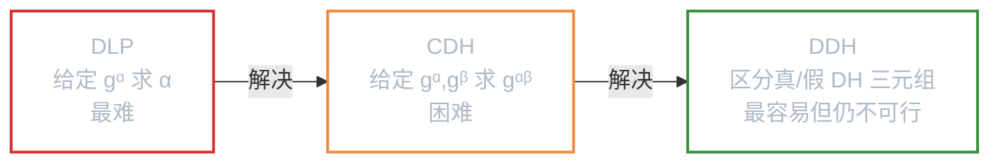
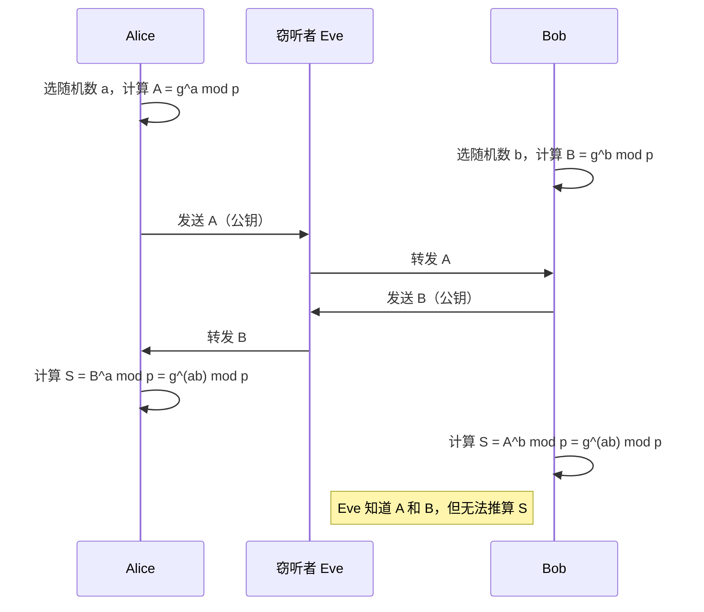
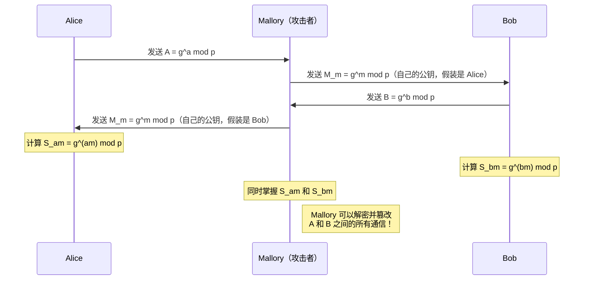
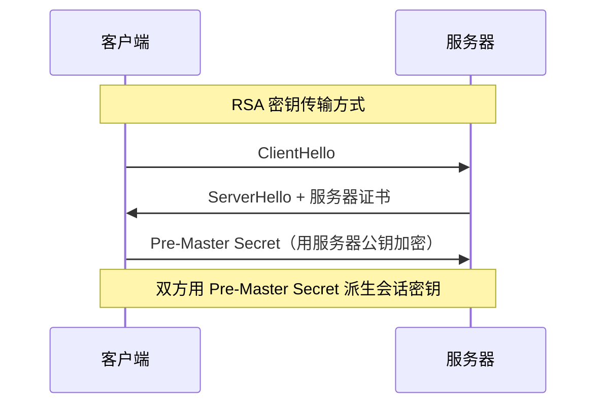
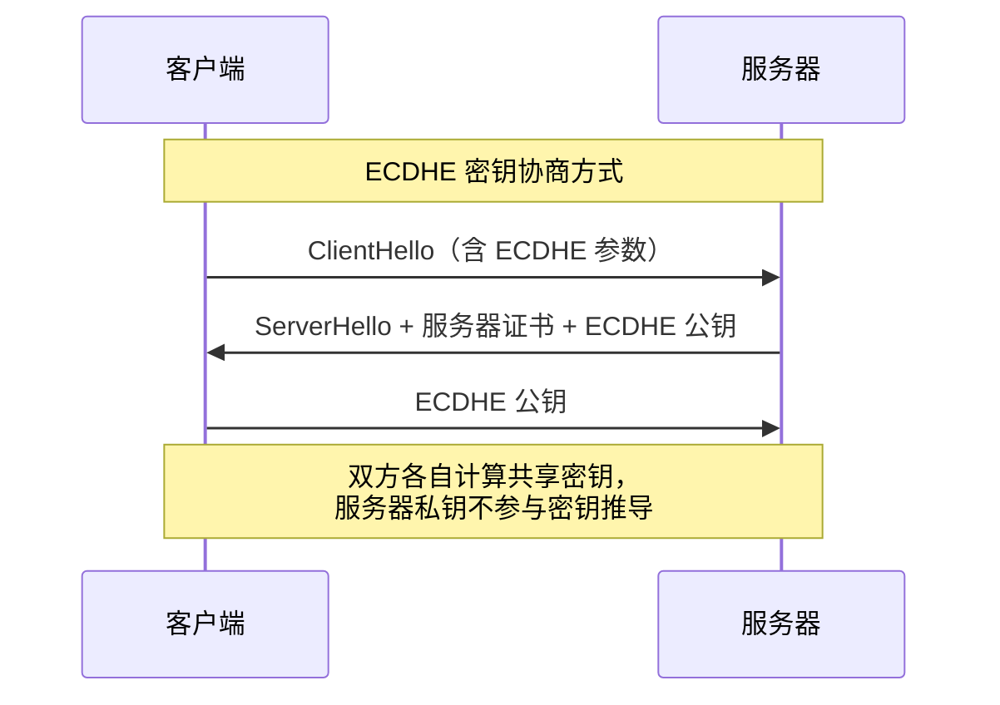

# 密钥交换

**本文你会学到**：

- 对称加密的密钥分发难题，以及为什么不能直接在不安全信道上发送密钥
- 密钥传输（Key Transport）的原理：用接收方公钥加密对称密钥
- 密钥协商（Key Agreement）的核心思想：Diffie-Hellman 与 ECDH 协议
- 密钥确认（Key Confirmation）如何防范中间人攻击
- TLS 握手中的密钥交换机制，以及前向保密（Forward Secrecy）的重要性

## 🤔 为什么需要密钥交换？

假设你和朋友想用 AES 加密通信。你们都需要同一把密钥，但你们之间只有一条互联网连接——任何人都可以监听。你怎么把密钥安全地送给对方？

这就好比你和对方在一个装满窃听者的房间里，需要交换保险箱的密码。你不能直接喊出来，也不能写在明信片上寄过去。你需要一种方法，让**只有你们两个人能推导出真正的密码**，即使窃听者看到了你们交换的所有信息。

这就是密钥交换要解决的核心问题。主流方案分为两大类：

| 方案 | 原理 | 踪迹 |
|------|------|------|
| **密钥传输（Key Transport）** | 一方生成密钥，用接收方公钥加密后发送 | 只有一方掌握初始密钥 |
| **密钥协商（Key Agreement）** | 双方各自贡献随机数，共同推导出共享密钥 | 双方平等参与密钥生成 |

两种方案在实际系统中经常搭配使用。接下来分别看看它们是怎么工作的。

## 📦 密钥传输（Key Transport）

### 密钥传输的思路

密钥传输的场景很简单：Alice 生成一把对称密钥，然后用 Bob 的公钥加密后发给 Bob。只有持有私钥的 Bob 能解密，窃听者即使截获了加密后的密钥也无法还原。

这和「用 RSA 加密消息」本质上是一样的，只不过加密的内容从「消息」换成了「对称密钥」。在 Java 中，对应的 API 是 `Cipher` 的 `WRAP_MODE` / `UNWRAP_MODE`：

``` java title="RSA-OAEP 密钥包装与解包"
// Alice 用 Bob 的公钥包装 AES 密钥
Cipher cipher = Cipher.getInstance(
    "RSA/NONE/OAEPwithSHA256andMGF1Padding", "BC");
cipher.init(Cipher.WRAP_MODE, bobPublicKey);
byte[] wrappedKey = cipher.wrap(aesKey);

// Bob 用自己的私钥解包
cipher.init(Cipher.UNWRAP_MODE, bobPrivateKey);
SecretKey recoveredKey = (SecretKey) cipher.unwrap(
    wrappedKey, "AES", Cipher.SECRET_KEY);
```

⚠️ **不要用 RSA 裸加密（`RSA/ECB/NoPadding`）传输密钥**。如果不用 OAEP 填充，密钥的某些位会暴露统计特征，容易被攻击。OAEP（Optimal Asymmetric Encryption Padding）在加密前先对数据进行随机化填充，使得相同的密钥每次加密后都产生不同的密文。

💡 关于 RSA 签名、OAEP 填充细节的完整讨论，参考「数字签名」章节。

## 🤝 密钥协商（Key Agreement）

### 为什么需要密钥协商？

密钥传输有一个隐含的前提：必须有一方先「主动」生成密钥。但在某些场景下，双方希望**平等地参与密钥的生成过程**——每个人都贡献自己的随机数，最终密钥由双方的输入共同决定。这样即使其中一方的随机数不够随机，攻击者也无法推导出最终密钥。

Diffie-Hellman（DH）协议就是这样一种方案。它的核心思想可以用一个颜料混合的类比来理解：

> 想象 Alice 和 Bob 各自有一种秘密颜料，还有一种公开的公共颜料。他们各自把秘密颜料和公共颜料混合，得到一种「混合色」并交换。然后各自把自己的混合色和对方的混合色再混合一次——结果是一样的：因为混合顺序不影响最终颜色。而窃听者虽然拿到了两种混合色，却无法「反向提取」出秘密颜料。

数学上，这种「不可逆混合」依赖的是**离散对数问题（Discrete Logarithm Problem，DLP）**：知道 `g^a mod p` 和 `g^b mod p`，可以轻松算出 `g^(ab) mod p`，但无法从 `g^a mod p` 推导出 `a`。

### DH 安全假设：DLP、CDH 与 DDH

Diffie-Hellman 协议的安全性依赖于群上三个递进的计算难题：

| 假设 | 问题 | 难度 |
|------|------|------|
| **DLP**（离散对数） | 给定 $g^\alpha$，求 $\alpha$ | 最难 |
| **CDH**（计算 DH） | 给定 $g^\alpha, g^\beta$，求 $g^{\alpha\beta}$ | 困难 |
| **DDH**（判定 DH） | 区分 $(g^\alpha, g^\beta, g^{\alpha\beta})$ 和 $(g^\alpha, g^\beta, g^\gamma)$ | 最容易但仍不可行 |

三个假设构成递进关系：DDH ⇒ CDH ⇒ DLP（反向不一定成立）。



DDH 假设是 ElGamal 加密和 ECDSA 安全性的理论基础。它的 Attack Game 是区分"真正的 DH 三元组"和"随机三元组"：挑战者发送 $(g^\alpha, g^\beta, w_b)$，其中 $w_0 = g^{\alpha\beta}$（真 DH），$w_1 = g^\gamma$（随机），攻击者需要判断 $b$ 的值。

⚠️ DDH 假设在偶数阶群中不成立（可以直接计算 Legendre 符号来区分）。这就是为什么 DH 参数必须基于素数阶的子群（参数 $(P, Q, G)$ 中的 $Q$）。

💡 `KeyAgreement.getInstance("ECDH")` 底层的安全性假设是 CDH。如果量子计算机解决了 DLP，则 CDH 和 DDH 同时崩溃——这正是后量子密码需要新算法（如 ML-KEM）的原因。

### Diffie-Hellman 协议流程

DH 协议的完整流程如下：



DH 协议基于三个公开参数 `(P, Q, G)`：

- `P`：一个大素数
- `Q`：`(P-1)` 的素因子
- `G`：`P` 的乘法群中一个 `Q` 阶子群的生成元

双方的私钥 `a` 和 `b` 各自保密，公钥 `Y_a = G^a mod P` 和 `Y_b = G^b mod P` 在信道上交换。最终共享密钥 `Z = G^(ab) mod P` 由双方独立计算得出。

⚠️ 参数 `Q` 虽然在一些简化实现中被忽略（如 PKCS #3），但它对公钥验证和 MQV 协议是必需的。建议始终使用完整的 `(P, Q, G)` 参数。

### DH 的 Java API

Java 提供了 `KeyAgreement` 类来执行 DH 协议，核心使用模式是三步：`init()` → `doPhase()` → `generateSecret()`。

``` java title="DH 密钥协商"
// 1. 生成 DH 参数（耗时操作，通常只做一次）
AlgorithmParameterGenerator paramGen =
    AlgorithmParameterGenerator.getInstance("DH", "BC");
paramGen.init(2048); // 2048 位 ≈ 112 bits 安全强度
DHParameterSpec dhSpec = paramGen.generateParameters()
    .getParameterSpec(DHParameterSpec.class);

// 2. 双方各自生成密钥对（使用相同参数）
KeyPairGenerator kpg = KeyPairGenerator.getInstance("DH", "BC");
kpg.initialize(dhSpec);

KeyPair aliceKeyPair = kpg.generateKeyPair();
KeyPair bobKeyPair = kpg.generateKeyPair();

// 3. Alice 用自己的私钥 + Bob 的公钥计算共享密钥
KeyAgreement aliceKa = KeyAgreement.getInstance("DH", "BC");
aliceKa.init(aliceKeyPair.getPrivate());
aliceKa.doPhase(bobKeyPair.getPublic(), true); // true = 最后一方
byte[] aliceSecret = aliceKa.generateSecret();

// 4. Bob 用自己的私钥 + Alice 的公钥计算共享密钥
KeyAgreement bobKa = KeyAgreement.getInstance("DH", "BC");
bobKa.init(bobKeyPair.getPrivate());
bobKa.doPhase(aliceKeyPair.getPublic(), true);
byte[] bobSecret = bobKa.generateSecret();

// 双方的共享密钥完全一致
assert Arrays.equals(aliceSecret, bobSecret); // true
```

💡 生成 DH 参数（找大素数）非常耗时。实际系统中，参数通常是预先生成或从标准文档（如 RFC 5114）中选取的，而不是每次通信都重新生成。

`generateSecret()` 也可以直接返回一个 `SecretKey` 对象，而非原始字节数组：

``` java title="直接生成 AES 密钥"
SecretKey aesKey = agreement.generateSecret("AES");
```

⚠️ **不要直接把 `generateSecret()` 的原始字节当作密钥使用**。它返回的是 DH 计算结果的原始编码，暴露了协商计算的中间值。正确做法是通过 KDF 派生，或者使用带 KDF 的算法名称（如 `DHwithSHA256KDF`）。

### ECDH（椭圆曲线 DH）

#### 为什么选择椭圆曲线？

想象你开一家银行，用 DH 需要一个 3072 位的大保险柜才能达到 128 位的安全等级。而换成椭圆曲线，只需一个 256 位的小保险柜就够了——但安全性完全一样。

这就是 ECC（Elliptic Curve Cryptography，椭圆曲线密码学）的核心优势：**在相同安全强度下，密钥更短，计算更快**。其数学基础从有限域上的离散对数问题换成了**椭圆曲线离散对数问题（ECDLP）**——目前不存在亚指数级别的攻击算法，因此密钥可以短得多。

#### DH vs ECDH 对比

| 维度 | DH（有限域） | ECDH（椭圆曲线） |
|------|-------------|-----------------|
| 128 bits 安全强度 | 3072 位密钥 | 256 位密钥 |
| 192 bits 安全强度 | 7680 位密钥 | 384 位密钥 |
| 256 bits 安全强度 | 15360 位密钥 | 521 位密钥 |
| 密钥生成速度 | 慢（需找大素数） | 快 |
| 带宽消耗 | 高（大密钥） | 低 |
| 成熟度 | 1976 年提出 | 1985 年提出，现代广泛使用 |

#### ECDH 的 Java API

ECDH 的使用方式与 DH 几乎一致，只是算法名从 `"DH"` 换成了 `"ECDH"`，密钥生成使用椭圆曲线参数：

``` java title="ECDH 密钥协商"
// 1. 生成椭圆曲线密钥对
KeyPairGenerator kpg = KeyPairGenerator.getInstance("ECDH", "BC");
kpg.initialize(256); // 256 位 ≈ 3072 位 DH 的安全性

KeyPair aliceKeyPair = kpg.generateKeyPair();
KeyPair bobKeyPair = kpg.generateKeyPair();

// 2. Alice 用自己的私钥 + Bob 的公钥计算共享密钥
KeyAgreement aliceKa = KeyAgreement.getInstance("ECDH", "BC");
aliceKa.init(aliceKeyPair.getPrivate());
aliceKa.doPhase(bobKeyPair.getPublic(), true);
byte[] aliceSecret = aliceKa.generateSecret();

// 3. Bob 用自己的私钥 + Alice 的公钥计算共享密钥
KeyAgreement bobKa = KeyAgreement.getInstance("ECDH", "BC");
bobKa.init(bobKeyPair.getPrivate());
bobKa.doPhase(aliceKeyPair.getPublic(), true);
byte[] bobSecret = bobKa.generateSecret();

// 双方独立计算出的共享密钥完全一致
assert Arrays.equals(aliceSecret, bobSecret); // true
```

💡 ECDH 可以使用与 ECDSA 相同的椭圆曲线参数集（如 NIST P-256、secp256k1 等），无需额外的参数生成步骤。

## ✅ 密钥确认（Key Confirmation）

### 中间人攻击的威胁

前面提到，DH 协议本身存在一个致命弱点：它**不验证通信对方的身份**。攻击者 Mallory 可以同时与 Alice 和 Bob 各执行一次 DH 协商，充当「中间人」：



这就是经典的**中间人攻击（Man-in-the-Middle，MITM）**。Alice 以为自己在与 Bob 通信，Bob 也以为自己在与 Alice 通信，但实际上所有消息都经过了 Mallory。

### 密钥确认协议

密钥确认（Key Confirmation）是解决 MITM 的一种方法：双方各自用自己的共享密钥计算一个 MAC（消息认证码），然后互相发送。如果 MAC 验证通过，就证明双方确实持有相同的共享密钥。

基本流程是：通过 KDF 将派生密钥材料分为两部分 `MacKey || SecretKey`，双方各自用 `MacKey` 对协商过程中交换的公钥、参与者 ID 等信息计算 MAC，然后互相交换 MAC 值进行验证。

⚠️ 密钥确认的 MAC 密钥强度必须不低于共享密钥的安全强度。此外，MAC 密钥在使用后应立即销毁，不得用于其他用途。

> 💡 密钥确认可以检测到中间人攻击，但**不能阻止**攻击者拒绝服务。要真正防止 MITM，还需要配合身份认证机制（如数字证书），这在 TLS 协议中得到了完整实现。

## 🌐 实际应用中的密钥交换

### TLS 握手中的密钥交换

TLS（Transport Layer Security，传输层安全）协议是你日常使用 HTTPS 时底层的工作机制。TLS 握手阶段的核心任务之一就是**让客户端和服务器协商出共享的会话密钥**，而握手过程中使用的密钥交换方式直接影响安全性。

TLS 经历了几代密钥交换机制的演进：

| TLS 版本 | 密钥交换方式 | 前向保密 |
|----------|------------|---------|
| TLS 1.0/1.1 | RSA 密钥传输 | ❌ |
| TLS 1.2 | RSA 或 ECDHE（可配置） | 视配置而定 |
| TLS 1.3 | 仅 ECDHE（强制） | ✅ |

以 TLS 1.2 的两种典型握手流程为例：





### 前向保密（Forward Secrecy）

前向保密（也叫完美前向保密，Perfect Forward Secrecy，PFS）是指：**即使长期私钥泄露，过去的会话密钥也不会暴露**。

为什么 RSA 密钥传输不具备前向保密？因为会话密钥是用服务器长期私钥加密的。一旦私钥泄露，攻击者可以解密所有截获的过去通信中用该私钥加密的 Pre-Master Secret，进而还原所有会话密钥。

而 ECDHE 具备前向保密，因为：

- 每次握手双方都生成**临时密钥对（ephemeral key pair）**
- 共享密钥由临时密钥对推导得出
- 临时私钥在一次握手后立即丢弃

PFS 的安全性可以精确归约到"无长期密钥帮助下的 CDH 问题"：即使攻击者获得了长期私钥，只要不知道握手时使用的临时私钥，就无法计算出共享密钥。而临时私钥在一次握手后就被丢弃，攻击者没有机会获取。

- 即使服务器的长期私钥泄露，攻击者没有过去的临时私钥，无法还原过去的会话密钥

> 💡 TLS 1.3 更进一步，**强制要求**使用 ECDHE（或 FFDHE），完全移除了 RSA 密钥传输选项。如果你的服务还在使用 RSA 密钥传输，强烈建议升级到支持 ECDHE 的配置。

## 📋 小结

密钥交换是安全通信的基石。回顾一下核心要点：

| 概念 | 一句话总结 |
|------|----------|
| **密钥传输** | 一方生成密钥，用接收方公钥加密后发送 |
| **密钥协商（DH）** | 双方交换公钥，各自独立计算出相同的共享密钥 |
| **ECDH** | 椭圆曲线上的 DH，密钥更短、效率更高 |
| **密钥确认** | 双方用 MAC 证明持有相同的共享密钥 |
| **中间人攻击** | DH 不验证身份时的致命弱点 |
| **前向保密** | 即使长期私钥泄露，过去的会话密钥也不会暴露 |

如果你对密钥协商中的 Java API 细节感兴趣，可以参考 `code/topic/cryptography/key-exchange/` 模块中的测试代码。
