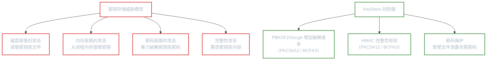
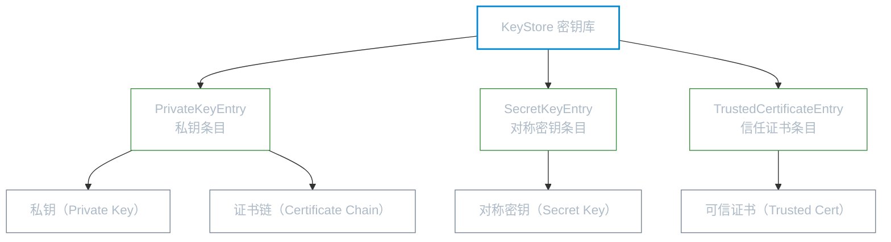
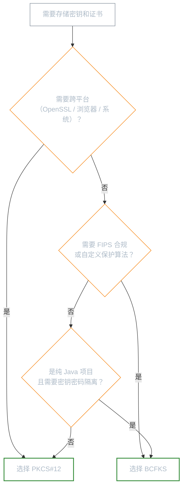

# 密钥存储

**本文你会学到**：

- 密钥生成后为什么不能随意存放在磁盘或数据库中
- `KeyStore` API 如何像"保险柜"一样安全地管理密钥和证书
- JKS、PKCS#12、BCFKS 三种密钥库格式的区别和适用场景
- `keytool` 命令行工具的常用操作
- 如何为不同安全需求选择合适的密钥库格式

## 为什么需要密钥存储？

前面的章节中，你学会了生成密钥对、创建数字签名、加解密数据。但你有没有想过一个问题——**密钥用完之后存哪？**

最直接的想法是：把私钥序列化成文件，存到磁盘上。但这样做有严重的隐患：

- **私钥明文暴露**：任何能访问文件系统的人都能读取私钥，签名和加密形同虚设
- **缺少完整性保护**：文件被篡改后，你可能拿到一个被替换的公钥/私钥
- **没有统一的条目管理**：密钥、证书、信任锚散落在不同文件中，难以维护

你需要一个**既能加密保护密钥、又能验证完整性的安全容器**。

💡 把 `KeyStore` 想象成一个**保险柜**——你把贵重物品（密钥、证书）放进去，用密码锁住柜门。打开柜门需要密码，而柜子本身还有防篡改机制，确保里面的东西没被动过。

Java 提供的 `java.security.KeyStore` 类就是这样的"保险柜"。

### 密钥存储面临的威胁模型

理解 KeyStore 的设计，需要先明确它在防御什么。密钥存储系统面临的主要威胁来自**拥有文件系统访问权限但不应拥有密钥的攻击者**：



- **磁盘泄露**：密钥库文件被复制到外部（备份泄露、恶意软件窃取、员工带走）。KeyStore 用密码加密密钥内容，攻击者即使拿到文件，没有密码也无法提取密钥
- **内存提取**：应用运行时，密钥已加载到内存中。`PrivateCredential` 对象在 Java 中受保护，但特权进程（如 root）或 JVM 级别的攻击（如 Unsafe API）仍可能提取。这不是 KeyStore 能解决的问题，而是操作系统级别的安全边界
- **密码暴力破解**：攻击者尝试各种密码打开密钥库。KeyStore 通过 PBKDF2/Scrypt 增加每次尝试的计算成本，使暴力破解在实际时间内不可行
- **完整性篡改**：攻击者替换密钥库文件中的公钥或证书。PKCS#12 和 BCFKS 的存储格式包含 HMAC 完整性校验——如果文件被篡改，加载时会抛出异常。但 JKS 缺乏显式的完整性校验，更容易受到此类攻击

⚠️ KeyStore 的安全性建立在**密码强度**的基础上。如果密钥库密码是 `123456`，所有加密和完整性保护都形同虚设。密码应该足够长且随机（至少 16 个字符），或者直接使用随机生成的密钥作为密钥库密码。

## KeyStore 概念

### KeyStore 能存什么？

`KeyStore` 是一个密码保护的容器，可以存储三类条目：



每种条目的用途：

| 条目类型 | 存储内容 | 典型场景 |
|---------|---------|---------|
| `PrivateKeyEntry` | 私钥 + 关联的证书链 | TLS 服务端证书、代码签名 |
| `SecretKeyEntry` | 对称密钥（AES 密钥等） | 数据加密密钥的持久化 |
| `TrustedCertificateEntry` | 仅公钥证书（无私钥） | CA 根证书、信任锚 |

### KeyStore API 基本操作

`KeyStore` 的使用围绕四个核心操作展开：

``` java title="KeyStore 核心操作流程"
// 1. 获取 KeyStore 实例（指定类型）
KeyStore ks = KeyStore.getInstance("PKCS12");

// 2. 初始化空密钥库（创建新库）或加载已有库（传入 InputStream）
ks.load(null, null);  // null, null = 创建空密钥库

// 3. 存入条目
//    私钥条目：需要关联证书链
ks.setKeyEntry("alias", privateKey, keyPassword, certChain);
//    信任证书条目：只需证书
ks.setCertificateEntry("ca-root", trustedCert);

// 4. 写入文件（持久化）
try (FileOutputStream fos = new FileOutputStream("keystore.p12")) {
    ks.store(fos, "storePass".toCharArray());
}
```

几个关键点：

- **别名（alias）**：每个条目用字符串别名标识，类似保险柜里的标签
- **两层密码**：库密码（`storePass`）保护整个文件，密钥密码（`keyPass`）保护单个私钥——但并非所有格式都支持两层密码
- **`load(null, null)`**：传入两个 `null` 表示创建空密钥库，而非从文件加载

> 以下所有代码示例来自 Maven 模块 `code/topic/cryptography/key-storage/`，可直接运行。

## JKS：Java 原始格式

JKS（Java KeyStore）是 Java 最早的密钥库格式，由 SUN Provider 实现。

### 创建与加载 JKS

``` java title="创建 JKS 密钥库并存入私钥和信任证书"
// 创建 JKS 实例
KeyStore ks = KeyStore.getInstance("JKS");
ks.load(null, null); // 初始化空密钥库

// 存入私钥（需关联证书链）
X509Certificate[] certChain = new X509Certificate[]{cert};
ks.setKeyEntry("my-key", privateKey, "changeit".toCharArray(), certChain);

// 存入信任证书
ks.setCertificateEntry("trusted-root", cert);

// 写入文件
try (FileOutputStream fos = new FileOutputStream("test.jks")) {
    ks.store(fos, "changeit".toCharArray());
}

// 重新加载并验证
KeyStore loadedKs = KeyStore.getInstance("JKS");
try (FileInputStream fis = new FileInputStream("test.jks")) {
    loadedKs.load(fis, "changeit".toCharArray());
}
Key loadedKey = loadedKs.getKey("my-key", "changeit".toCharArray());
```

### JKS 的局限性

JKS 作为 Java 早期的格式，存在几个明显的不足：

1. **私钥保护薄弱**：使用基于 SHA-1 的专有流密码加密，算法强度不够
2. **不支持 SecretKey**：无法存储对称密钥（AES 等），只能存私钥和证书
3. **仅支持 RSA/DSA**：不支持 EC 等现代密钥算法
4. **完整性验证不足**：在不提供密码的情况下，仍能列出大部分条目信息

⚠️ **JDK 9 起，默认密钥库类型已从 JKS 改为 PKCS12**。JKS 仍可使用但不推荐用于新项目。

## keytool：JDK 自带的密钥管理工具

`keytool` 是 JDK 自带的命令行工具，无需编写代码就能完成密钥库的常见操作。在实际开发中，创建 TLS 证书、管理信任库等场景下 `keytool` 非常常用。

### 生成密钥对

```bash
keytool -genkeypair \
    -alias server-key \
    -keyalg RSA \
    -keysize 2048 \
    -dname "CN=localhost, O=MyOrg, C=CN" \
    -validity 365 \
    -keystore server.p12 \
    -storepass changeit \
    -storetype PKCS12
```

`-dname` 指定证书的 X.500 主题名称（Subject DN）。如果不指定，`keytool` 会交互式地逐项询问。

### 查看密钥库内容

```bash
# 列出所有条目
keytool -list -keystore server.p12 -storepass changeit

# 查看某个条目的详细信息（-v 显示详细证书链）
keytool -list -v -alias server-key -keystore server.p12 -storepass changeit
```

### 生成证书签名请求（CSR）

当你有了密钥对和自签名证书，通常需要向 CA（证书颁发机构）申请正式证书：

```bash
keytool -certreq \
    -alias server-key \
    -file server.csr \
    -keystore server.p12 \
    -storepass changeit
```

生成的 `.csr` 文件是 Base64 编码的 PKCS#10 证书请求，包含你的公钥和身份信息，用私钥签名保护完整性。

### 导入 CA 签发的证书

收到 CA 的签发证书后，需要分两步导入：

```bash
# 第一步：导入 CA 的根证书（信任锚）
keytool -import \
    -alias ca-root \
    -keystore server.p12 \
    -file ca-trustanchor.pem \
    -storepass changeit

# 第二步：导入 CA 签发给你的证书（替换原来的自签名证书）
keytool -import \
    -alias server-key \
    -keystore server.p12 \
    -file ca-response.pem \
    -storepass changeit
```

整个证书签发流程可以用时序图表示：

```mermaid
sequenceDiagram
    participant Dev as 开发者
    participant KS as KeyStore
    participant CA as 证书颁发机构

    Dev->>KS: keytool -genkeypair<br/>生成密钥对 + 自签名证书
    Dev->>KS: keytool -certreq<br/>导出证书签名请求（CSR）
    Dev->>CA: 提交 CSR
    CA-->>Dev: 签发正式证书
    Dev->>KS: keytool -import ca-root<br/>导入 CA 根证书
    Dev->>KS: keytool -import server-key<br/>导入正式证书（替换自签名）

    classDef dev fill:transparent,stroke:#0288d1,color:#adbac7,stroke-width:2px
    classDef ks fill:transparent,stroke:#388e3c,color:#adbac7,stroke-width:1px
    classDef ca fill:transparent,stroke:#f57c00,color:#adbac7,stroke-width:2px
    class Dev dev
    class KS ks
    class CA ca
```

### 导出证书

```bash
# 导出为 PEM 格式（Base64 编码）
keytool -exportcert \
    -alias server-key \
    -keystore server.p12 \
    -file server-cert.pem \
    -storepass changeit \
    -rfc
```

`-rfc` 参数指定输出 RFC 1421 格式（即 PEM 的 `-----BEGIN CERTIFICATE-----` 格式）。

### 在 Java 中调用 keytool

你也可以在代码中通过 `ProcessBuilder` 调用 `keytool`，然后用 `KeyStore` API 验证结果：

``` java title="通过 ProcessBuilder 调用 keytool 并验证结果"
// 调用 keytool 创建密钥库
ProcessBuilder pb = new ProcessBuilder(
    "keytool", "-genkeypair",
    "-alias", "test-key",
    "-keyalg", "RSA", "-keysize", "2048",
    "-dname", "CN=Keytool Test, O=Luguosong, C=CN",
    "-validity", "365",
    "-keystore", ksFile.getAbsolutePath(),
    "-storepass", "changeit",
    "-storetype", "PKCS12"
);
pb.redirectErrorStream(true);
Process process = pb.start();
int exitCode = process.waitFor();
assertEquals(0, exitCode);

// 用 KeyStore API 加载验证
KeyStore ks = KeyStore.getInstance("PKCS12");
try (FileInputStream fis = new FileInputStream(ksFile)) {
    ks.load(fis, "changeit".toCharArray());
}
assertTrue(ks.containsAlias("test-key"));
```

## PKCS#12：行业标准格式

PKCS#12（Public-Key Cryptography Standards #12）是 IETF 标准格式（RFC 7292），文件扩展名通常为 `.p12` 或 `.pfx`。它是目前**最广泛使用的密钥库格式**——浏览器、OpenSSL、Java、Windows 等都支持。

### 创建与加载 PKCS#12

``` java title="创建并加载 PKCS#12 密钥库"
// 创建 PKCS#12 密钥库（JDK 自带支持，无需 BC Provider）
KeyStore ks = KeyStore.getInstance("PKCS12");
ks.load(null, null);

// 存入私钥 + 证书链
X509Certificate[] certChain = new X509Certificate[]{cert};
ks.setKeyEntry("server-key", privateKey, "changeit".toCharArray(), certChain);

// 写入 .p12 文件
try (FileOutputStream fos = new FileOutputStream("server.p12")) {
    ks.store(fos, "changeit".toCharArray());
}

// 加载并验证
KeyStore loadedKs = KeyStore.getInstance("PKCS12");
try (FileInputStream fis = new FileInputStream("server.p12")) {
    loadedKs.load(fis, "changeit".toCharArray());
}
Key privateKey = loadedKs.getKey("server-key", "changeit".toCharArray());
```

### PKCS#12 与 JKS 的关键区别

PKCS#12 相比 JKS 有几个重要改进：

- **跨平台兼容**：OpenSSL、Windows、macOS、浏览器都能直接读取 `.p12` 文件
- **支持多种算法**：不限于 RSA/DSA，EC 等现代算法也可存储
- **更好的密钥保护**：使用标准加密算法保护私钥，而非 JKS 的专有方案
- **信任证书存储**：同样支持 `setCertificateEntry()` 存储信任锚

``` java title="PKCS#12 中存储信任证书"
KeyStore trustStore = KeyStore.getInstance("PKCS12");
trustStore.load(null, null);

// 存储多个 CA 根证书
trustStore.setCertificateEntry("root-ca-1", ca1Cert);
trustStore.setCertificateEntry("root-ca-2", ca2Cert);

// 同时存储一个带私钥的条目
trustStore.setKeyEntry("server-key", privateKey, "changeit".toCharArray(),
    new X509Certificate[]{serverCert});

try (FileOutputStream fos = new FileOutputStream("truststore.p12")) {
    trustStore.store(fos, "changeit".toCharArray());
}
```

### 密码设计差异

PKCS#12 的一个独特设计是：**密钥密码可以为 `null`**。PKCS#12 原本为"个人信息交换"设计，理念是"一个密码保护整个文件"。虽然 API 仍允许传密钥密码，但多数实现只用库密码保护一切：

``` java
// PKCS#12 中密钥密码可以设为 null
ks.setKeyEntry("key", privateKey, null, certChain); // ✅ 合法
```

## BCFKS：Bouncy Castle 专有格式

BCFKS（Bouncy Castle FIPS KeyStore）是 Bouncy Castle 为满足 FIPS（联邦信息处理标准）合规要求而设计的密钥库格式。如果你的项目使用 Bouncy Castle 且对安全合规有较高要求，BCFKS 是最合适的选择。

### 创建与加载 BCFKS

``` java title="创建 BCFKS 密钥库"
// 使用 BC Provider 创建 BCFKS 实例
KeyStore ks = KeyStore.getInstance("BCFKS", "BC");
ks.load(null, null);

// 存入私钥（BCFKS 支持密钥密码，与 JKS 类似）
X509Certificate[] certChain = new X509Certificate[]{cert};
ks.setKeyEntry("my-key", privateKey, "changeit".toCharArray(), certChain);
ks.setCertificateEntry("trusted-cert", cert);

// 使用 BCFKSLoadStoreParameter 写入文件
try (OutputStream out = new FileOutputStream("test.bcfks")) {
    BCFKSLoadStoreParameter storeParam =
        new BCFKSLoadStoreParameter.Builder(out, "changeit".toCharArray())
            .build();
    ks.store(storeParam);
}
```

⚠️ 注意 BCFKS 的加载方式：必须使用 `BCFKSLoadStoreParameter` 而非传统的 `InputStream + char[]` 方式。

``` java title="加载 BCFKS 密钥库"
KeyStore loadedKs = KeyStore.getInstance("BCFKS", "BC");
try (InputStream in = new FileInputStream("test.bcfks")) {
    BCFKSLoadStoreParameter loadParam =
        new BCFKSLoadStoreParameter.Builder(in, "changeit".toCharArray())
            .build();
    loadedKs.load(loadParam);
}
Key key = loadedKs.getKey("my-key", "changeit".toCharArray());
```

### 使用 Scrypt 保护

BCFKS 的一个强大特性是支持自定义密码保护算法。默认使用 PBKDF2 + HMAC-SHA256，你也可以切换为 Scrypt——一种**内存密集型**的密钥派生函数，比 PBKDF2 更抗 GPU/ASIC 暴力破解（详见「基于密码的密钥生成」）。

``` java title="使用 Scrypt 保护 BCFKS 密钥库"
KeyStore ks = KeyStore.getInstance("BCFKS", "BC");
ks.load(null, null);

ks.setKeyEntry("scrypt-key", privateKey, "changeit".toCharArray(),
    new X509Certificate[]{cert});

// 配置 Scrypt 参数
// N（CPU/内存成本）= 65536, r（块大小）= 8, p（并行因子）= 1
PBKDFConfig scryptConfig = new ScryptConfig.Builder(65536, 8, 1).build();

try (OutputStream out = new FileOutputStream("scrypt-protected.bcfks")) {
    BCFKSLoadStoreParameter storeParam =
        new BCFKSLoadStoreParameter.Builder(out, "changeit".toCharArray())
            .withStorePBKDFConfig(scryptConfig) // 使用 Scrypt 替代默认 PBKDF2
            .build();
    ks.store(storeParam);
}

// 加载时也需提供相同的 Scrypt 配置
KeyStore loadedKs = KeyStore.getInstance("BCFKS", "BC");
try (InputStream in = new FileInputStream("scrypt-protected.bcfks")) {
    BCFKSLoadStoreParameter loadParam =
        new BCFKSLoadStoreParameter.Builder(in, "changeit".toCharArray())
            .withStorePBKDFConfig(scryptConfig)
            .build();
    loadedKs.load(loadParam);
}
```

Scrypt 的核心优势在于"内存硬度"——它会占用大量内存来增加暴力破解成本。GPU 擅长并行计算但不擅长大内存操作，所以 Scrypt 对 GPU 攻击的抵抗效果明显优于 PBKDF2。

### BCFKS vs IBCFKS

BCFKS 默认行为是：密钥一旦被密码解锁，就可以在同一个 `KeyStore` 实例中被重复使用。这在单线程应用中没问题，但在多线程环境中存在风险——线程 A 解锁一个密钥后，线程 B 可以无需密码直接使用它。

IBCFKS（Immutable BCFKS）是 BCFKS 的不可变包装器，磁盘格式与 BCFKS 完全相同，但加载后行为不同：**每次访问密钥都必须提供密码**，天然保证线程隔离。适用于需要严格密钥隔离的多线程服务端场景。

## 格式对比与选择

### 三种格式对比

| 特性 | JKS | PKCS#12 | BCFKS |
|------|-----|---------|-------|
| 提供者 | SUN（JDK 内置） | SUN（JDK 内置） | Bouncy Castle |
| 文件扩展名 | `.jks` | `.p12` / `.pfx` | `.bcfks` |
| 跨平台兼容 | 仅 Java | OpenSSL / 浏览器 / 系统等 | 仅 Bouncy Castle |
| 支持密钥类型 | 私钥 + 证书 | 私钥 + 证书 + 对称密钥 | 私钥 + 证书 + 对称密钥 |
| 密钥保护算法 | SHA-1 专有流密码 | 标准加密算法 | PBKDF2 / Scrypt 可选 |
| 密钥密码支持 | 支持 | 支持（通常用 null） | 支持 |
| FIPS 合规 | 不支持 | 部分实现 | 支持（配合 BC-FJA） |
| 默认格式（JDK 9+） | 否 | 是 | 否 |

### 如何选择？



**推荐选择**：

- **大多数场景** → PKCS#12。它是 JDK 9+ 的默认格式，跨平台兼容性好，社区支持广泛
- **需要高安全合规** → BCFKS。支持 Scrypt 等现代保护算法，FIPS 兼容设计
- **JKS** → 仅在维护遗留系统时使用，新项目不应再选择

### 格式安全性的深层对比

表面上看，三种格式都是"用密码保护密钥"——但底层的安全机制差异很大：

| 安全维度 | JKS | PKCS#12 | BCFKS |
|---------|-----|---------|-------|
| **密钥派生** | 专有方案（未公开审计） | PKCS#12 专有 KDF（基于 SHA-1 的迭代哈希方案，RFC 7292 Appendix B；现代实现可切换 PBKDF2-HMAC-SHA256） | PBKDF2-HMAC-SHA256 或 Scrypt（可选） |
| **完整性保护** | 无显式 HMAC（依赖格式隐式校验） | 专有 KDF 派生 MAC key，使用 HMAC-SHA1 完整性校验（RFC 7292 Section 4；现代实现可切换 HMAC-SHA256） | HMAC-SHA256 完整性校验 |
| **密钥加密** | 专有流密码（SHA-1 基础） | 3DES-CBC（RFC 7292）或 AES-CBC（现代实现通过 PBES2 支持） | AES-256-CBC（默认） |
| **抗暴力破解** | 弱（迭代次数不可配置） | 中（专有 KDF 迭代次数可配置；切换至 PBKDF2 后更强） | 强（支持 Scrypt 内存硬度） |

⚠️ **PKCS#12 默认使用 3DES-CBC 加密和基于 SHA-1 哈希链的专有 KDF**——这些是 1990 年代末的设计选择，在当时足够安全，但以现代标准来看并不理想。如果你的密钥库需要长期保护高价值密钥，建议使用 BCFKS（PBKDF2-HMAC-SHA256 + AES-256-CBC 或 Scrypt）。

#### 完整性校验为什么重要？

密钥库的完整性校验防止了一种隐蔽的攻击：**替换公钥攻击**。

假设攻击者拿到了你的密钥库文件，虽然无法解密私钥（没有密码），但如果密钥库格式**缺乏有效的完整性校验**（如 JKS）或校验机制被实现错误绕过，他可以：
1. 保留你原来的私钥（加密状态不动）
2. 替换公钥证书为自己的公钥
3. 把篡改后的密钥库还回去

如果你后来用这个密钥库解密了"正确发送给你的消息"，攻击者替换后的公钥无法解密——你会以为"消息已损坏"。但如果攻击者用他自己的密钥给你发了"伪造消息"，替换后的公钥验证能通过（因为签名是攻击者做的）。

PKCS#12 和 BCFKS 的 HMAC 完整性校验正是为了防止这种篡改——任何对密钥库内容的修改都会在加载时被检测到。而 JKS 缺乏显式的完整性校验，更容易受到此类攻击。

> **重要区分**：密钥库格式的安全性解决的是"存储安全"问题——密钥在磁盘上如何保护。它与密钥本身的安全性（如 RSA-2048 vs RSA-3072）是不同层面的问题。

## 小结

密钥存储看似只是"把密钥写到文件里"，但选择合适的密钥库格式对安全性影响很大。回顾本章的关键要点：

1. **KeyStore 是密码保护的容器**，支持三种条目类型：`PrivateKeyEntry`、`SecretKeyEntry`、`TrustedCertificateEntry`
2. **JKS 是历史遗留格式**，私钥保护薄弱且不支持对称密钥，不应在新项目中使用
3. **PKCS#12 是事实标准**，JDK 9+ 默认格式，跨平台兼容，适合大多数场景
4. **BCFKS 是高安全场景的选择**，支持 Scrypt 保护、FIPS 合规，但需要 Bouncy Castle
5. **keytool 是日常管理的好帮手**，创建密钥对、导出 CSR、导入证书等操作都可以命令行完成
