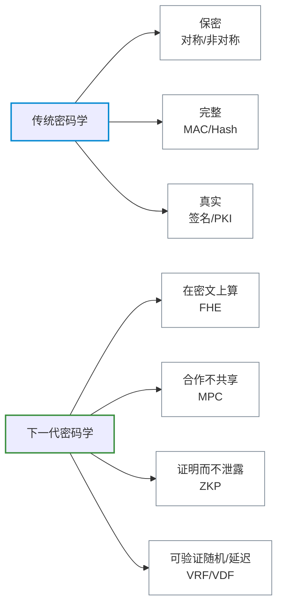
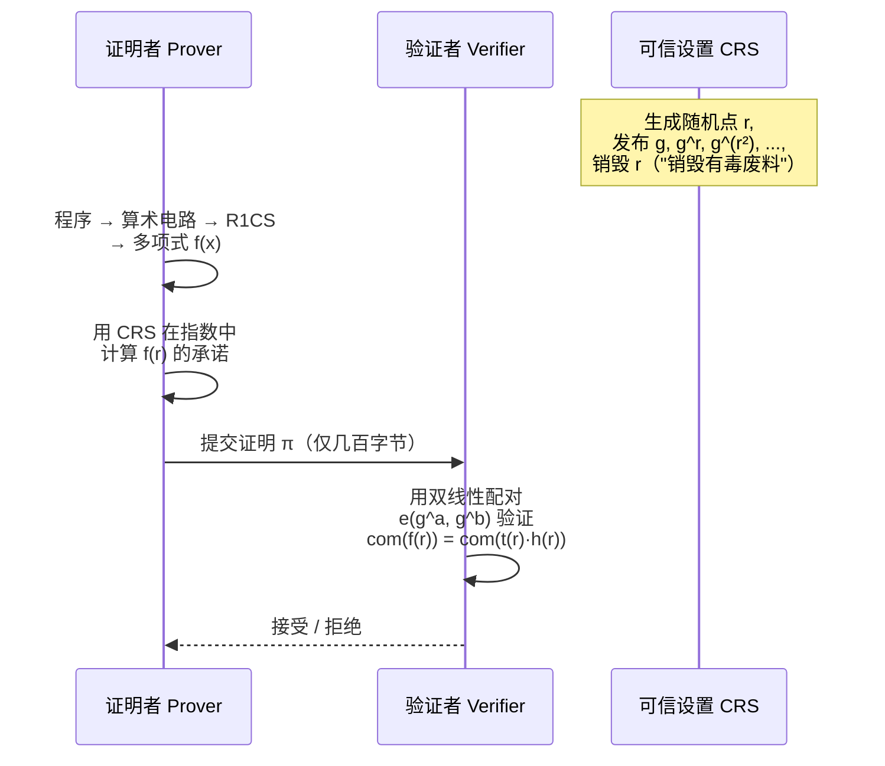

# 下一代密码学

> 本文以 *Real-World Cryptography*（David Wong 著）第 15 章 “Is this it? Next-generation cryptography” 为主线，介绍未来 10–20 年最有可能进入工业界的三大新型原语：`MPC`、`FHE` 与通用 `zk-SNARK`，并补充 `VRF` / `VDF` 等区块链常见构件。

**本文你会学到**：

- 为什么传统的「加密 + 签名 + 哈希」已经不够用
- `zk-SNARK` 究竟在证明什么——为什么本质上是在证明「我知道一个多项式」
- `FHE` 如何在密文上做加法和乘法，以及 `bootstrapping` 是怎么把噪声「擦掉」的
- `MPC` 怎样用 `Shamir` 秘密分享让多个互不信任的参与方合作算出结果
- 这些原语和已经学过的「非对称加密」「数字签名」之间的桥梁

---

## 为什么需要"下一代"密码学？

过去几十年里，密码学的产出主要解决三件事：**保密性**（对称加密 / 非对称加密）、**完整性**（`MAC` / 哈希）、**真实性**（数字签名 / `PKI`）。它们的共同前提是：**计算发生在明文上**。一旦数据被加密，云服务、协作方就什么也做不了，只能解密 → 计算 → 再加密。

但现实业务的压力越来越大：

- 我把基因数据上传到云上做疾病筛查，**不希望云看到我的 DNA**
- 我想证明自己年满 18 岁，**不希望对方拿到我的出生年月**
- 三家公司想算出"全行业薪酬中位数"，**谁都不愿意把自己的工资条交给对方**
- 区块链想做"可验证抽签"，**抽签结果必须随机但又能被所有人复核**

下一代密码学正是为这些问题而生。可以这样划分新旧两代：



下面按 `ZKP → FHE → MPC → VRF/VDF` 的顺序展开。

---

## 零知识证明：证明你知道而不泄露

> 如果想在不暴露原始数据的前提下证明你知道某个秘密，怎么办？

零知识证明（`Zero-Knowledge Proof`，简称 `ZKP`）由 `Goldwasser`、`Micali`、`Rackoff` 在 1980 年代中期提出，最初只能证明「我知道某个离散对数」之类的特定命题。后来人们发现：**任意程序的执行轨迹** 都可以被零知识地证明，只要把程序翻译成算术电路。这便是**通用零知识证明**。

### zk-SNARK 工作原理

**Problem**：通用 `ZKP` 的最大痛点是证明体积大、验证慢。在区块链上，每条交易的零知识证明如果有几十 KB、验证耗时几秒，根本无法上链。

**What**：`zk-SNARK` 全称 `Zero-Knowledge Succinct Non-Interactive Argument of Knowledge`，关键词是 **Succinct（简洁）** 与 **Non-Interactive（非交互）**——证明大小通常只有几百字节，验证时间在毫秒级。

**How**：几乎所有主流 `zk-SNARK` 都建立在同一个套路上：

1. 把要证明的程序改写为**算术电路**（只有加法门和乘法门）
2. 把电路转成 `R1CS`（`Rank-1 Constraint System`），即一组形如 `L × R = O` 的约束
3. 把 `R1CS` 转成「证明者知道一个特殊多项式 `f(x)`」的命题
4. 用**同态承诺** + **双线性配对** 让验证方在密文下检查 `f(x) = t(x)·h(x)` 在某个随机点是否成立

第 4 步背后的数学工具是 `Schwartz-Zippel` 引理：两个不同的 n 次多项式最多在 n 个点上相等，因此**只验证一个随机点 r 就足够**。这就是「Succinct」的来源——本来要比较一整个多项式，现在只比较一个值。



证明者在不知道 `r` 的前提下，仍能借助 `g, g^r, g^(r²), …` 这些"指数中的点"算出 `f(r)` 的承诺；验证者用配对函数检查同态等式。整个过程证明者从未透露 `f(x)` 的系数（即原始秘密输入）。

**Pitfalls**：

- 大多数高效 `zk-SNARK` 需要**可信设置**（`Trusted Setup`），生成 `CRS` 时若有人保留了随机数 `r`，就可以**伪造任意证明**。这些 `r` 因此被戏称为"toxic waste"。社区做法是用 `MPC` 多方仪式生成 `CRS`，**只要有一位参与者诚实地销毁了自己的份额，整个仪式就是安全的**
- 把程序"翻译"成算术电路并不便宜——`SHA-256` 这类常见哈希在电路里非常昂贵，催生了 `Poseidon`、`MiMC` 等"`ZKP` 友好哈希"

### zk-STARK 与 SNARK 对比

`zk-STARK`（`Scalable Transparent ARgument of Knowledge`）是另一类主流方案，核心差异如下：

| 特性 | `zk-SNARK` (Groth16/PLONK) | `zk-STARK` |
|------|---------------------------|------------|
| 可信设置 | 通常需要（PLONK 等支持通用化） | 完全透明，无需任何设置 |
| 证明大小 | 几百字节 | 几十~几百 KB |
| 验证速度 | 毫秒级 | 较慢 |
| 抗量子 | 否（依赖椭圆曲线/配对） | 是（仅依赖哈希函数） |
| 典型场景 | `Zcash`、`zkSync Era`、`Filecoin` | `StarkNet`、`Polygon Miden` |

实务中没有"银弹"——是否要短证明、是否能容忍可信设置、是否担心未来量子攻击，决定了选哪一类。

### 实战场景

- **隐私公链**：`Zcash` 的屏蔽交易隐藏发送方、接收方与金额，只对外暴露一个 `zk-SNARK` 证明「这笔交易合法且没有双花」
- **Layer 2 Rollup**：`zkSync`、`StarkNet` 把成千上万笔交易打包在链下执行，只把一个 `ZKP` 上链，**主网验证 1 个证明 = 信任 N 笔交易**
- **匿名身份**：`Worldcoin`、`Sismo` 之类的方案用 `ZKP` 证明「我是某个名单上的人」而不泄露具体身份
- **可验证云计算**：把重计算外包给云，云返回结果 + 一个 `ZKP`，本地毫秒级验证

> 通用 `ZKP` 与「数字签名」原本同源：数字签名本质上是「我知道私钥」的非交互式 `ZKP`，详见「[数字签名](../digital-signatures/)」。

---

## 同态加密：在密文上算数

> 假如我能加密 a、b、c 后送到云上，云返回 `enc(a × 3b + 2c + 3)`，我再解密——整个过程云从未看到任何明文。这就是 `Fully Homomorphic Encryption`（`FHE`，**全同态加密**）。

把 `FHE` 类比成 **"加密信封中的隐形墨水"**：你把字写在隐形墨水信封里寄给别人，对方虽然看不到内容，却能在信封外面继续用某种工具"加字"或"乘字"，最终把信封寄回给你，你打开后看到的是完整的运算结果。

### 部分同态 vs 全同态（FHE）

按"能算什么、能算多少次"，同态加密分四档：

| 类型 | 能算 | 能算多少次 | 代表方案 |
|------|------|------------|----------|
| `PHE`（部分同态） | 加 **或** 乘其中一种 | 任意次 | `RSA`（乘法）、`Paillier`（加法）、`ElGamal`（乘法） |
| `SwHE`（半同态） | 一种任意次，另一种受限 | 受限 | 早期 `Boneh-Goh-Nissim` |
| `LHE`（分级同态） | 加 + 乘都行 | 都受限于深度 | 早期 `BGV` 不带 bootstrapping |
| `FHE`（全同态） | 加 + 乘 | **无限次** | `Gentry09`、`BGV`、`BFV`、`CKKS`、`TFHE` |

`RSA` 其实**天生**带乘法同态：`(c1 × c2) mod N = (m1 × m2)^e mod N`。这既是历史上 `Bleichenbacher` 攻击的根源，也是部分同态的最简实例——但只有乘法、没有加法，所以不通用。

### Bootstrapping：FHE 的关键钥匙

**Problem**：早期分级同态方案有个"用着用着就坏"的毛病——每次同态运算都会让密文里的**噪声**线性甚至倍数增长，到一定阈值就再也解不开了。

**What**：2009 年，`Craig Gentry` 在博士论文里提出 `bootstrapping`——**周期性地"擦掉"噪声**。

**How**：

```mermaid
graph LR
    A[原始密文 c<br/>噪声小] --> B[做几次同态运算]
    B --> C[噪声接近阈值<br/>再算就解不开]
    C --> D[用 bootstrapping key<br/>把 c 再加密一层]
    D --> E[同态地"运行解密电路"<br/>把内层 c 解掉]
    E --> F[新密文 c'<br/>噪声重置为低水平]
    F --> B

    style C stroke:#d32f2f,stroke-width:2px
    style F stroke:#388e3c,stroke-width:2px
    classDef step fill:transparent,stroke:#768390,stroke-width:1px
    class A,B,D,E step
```

精妙之处在于：**解密所需的私钥从未以明文形式出现**——它本身被 `bootstrapping key` 加密后交给计算方，计算方"在密文里运行解密电路"。只要解密电路引入的新噪声小于阈值，就能一直算下去。Gentry 最初的方案每次基本位运算要 30 分钟，但 10 余年间速度提升了约 10⁹ 倍。

### 主流方案家族（CKKS / BGV / BFV / TFHE）

| 方案 | 适合数据 | 特点 |
|------|----------|------|
| `BGV` / `BFV` | 整数 | 精确运算，常用于精确统计 |
| `CKKS` | 实数 / 复数（**近似**） | 适合机器学习，运算后是近似结果 |
| `TFHE` | 比特 / 布尔电路 | bootstrapping 极快（毫秒级），适合任意电路 |

它们都建立在 `LWE`（`Learning With Errors`）或其环上版本 `RLWE` 上——同样是「[后量子密码](../post-quantum/)」里抗量子格密码的数学基础。

### 应用场景

- **加密云数据库**：用户加密上传记录，云端可在密文上做查询、过滤、聚合（`Microsoft Edge` 的密码泄露检查正是用 `FHE` 做 `PSI`）
- **隐私机器学习**：模型在加密数据上推理，常用 `CKKS` + `Microsoft SEAL`
- **基因隐私分析**：医院把加密 `DNA` 上传至研究机构，研究机构跑统计但无法看到原始序列
- **医疗云风控**：保险公司在加密健康记录上算风险评分

**Pitfalls**：当前 `FHE` 仍比明文运算慢 **10⁵–10⁹ 倍**，且密文膨胀严重（一比特明文常对应 KB 级密文）。`Phillip Rogaway` 在 *The Moral Character of Cryptographic Work* 中提醒：不要把 `FHE` 当成万能银弹——大多数实际应用，**半同态或 `MPC` 已经够用且快得多**。

---

## 多方计算 MPC：合作而不共享

> `MPC`（`Secure Multi-Party Computation`）就像 **"三个互不信任的人合作算工资中位数"**：每个人都把自己的工资拆成几片秘密分给其他人，谁拿到一片都看不出原值，最终大家按规则一起算出中位数。

`MPC` 起源于 1982 年 `Andrew Yao` 的"百万富翁问题"——两个亿万富翁想知道谁更有钱，但谁也不愿意先报数。`MPC` 用密码学协议消除了对"可信第三方"的依赖。

### 秘密分享与 Shamir 方案

**Problem**：多方协作的第一步是把秘密"拆成份"，要求是任何 t-1 份都看不出原值，但 t 份合起来能恢复。

**What**：`Shamir Secret Sharing`（`SSS`）通过随机多项式实现 (t, n) 门限——把秘密 s 设为多项式在 0 处的取值，给每方一个 `(x_i, y_i)` 点。

**How**：

``` python title="Shamir 秘密分享伪代码"
# 把秘密 s 拆成 5 份，任意 3 份可恢复
def split(s, t=3, n=5, p=大素数):
    # 随机生成 t-1 个系数
    coeffs = [s] + [random.randint(1, p-1) for _ in range(t-1)]
    poly = lambda x: sum(c * x**i for i, c in enumerate(coeffs)) % p
    return [(i, poly(i)) for i in range(1, n+1)]

def reconstruct(shares):
    # 拉格朗日插值求 f(0) = s
    return lagrange_interpolate(shares, x=0)
```

任何 ≤ t-1 份都对应无穷多种可能的多项式，因此**信息论安全**——即便量子计算机也破不了。

### 通用 MPC：把任意程序变成可联合计算的电路

主流通用 `MPC` 流程是：

1. 把程序翻译成**算术电路**（只有加法门和乘法门）
2. 每个参与方把自己的私有输入用 `Shamir` 拆分，分发给所有方
3. **加法门可以本地算**（份额相加 = 结果的份额）；**乘法门需要交互**（参与方之间交换若干消息后得到结果份额）
4. 计算完成后，各方公布自己的输出份额，重构出最终结果

代表协议家族：

- **`GMW`**：基于布尔电路的两方 / 多方协议
- **`BGW`**：基于 `Shamir` 的诚实多数（< n/3 恶意方）协议
- **`BMR`**：常数轮的恶意安全多方协议
- **`SPDZ`**：基于"预处理 + 在线"两阶段的高效恶意安全方案

性能上，`MPC` 的瓶颈通常是**网络往返次数**而非计算本身。

### 阈值签名与门限密码学

`MPC` 的一个特别成功的子领域是**门限密码学**（`Threshold Cryptography`）——`NIST` 在 2019 年启动了门限密码标准化工作。代表应用：

- **Threshold ECDSA**：n 个节点共同持有 `ECDSA` 私钥的份额，需要至少 t 个节点合作才能签名。已被 `Coinbase`、`Fireblocks` 等机构托管钱包广泛采用
- **分布式密钥生成（`DKG`）**：私钥从未在任何单点生成或存在，从源头消除"密钥泄露"风险
- **`BLS` 阈值签名**：广泛用于 `Ethereum 2.0`、`Chia`、`Filecoin` 等区块链共识

> 阈值签名与「[加密货币与 BFT 共识](../cryptocurrency-and-bft/)」深度耦合，是现代去中心化系统的基石。

### 私有集合求交（PSI）

`PSI`（`Private Set Intersection`）是 `MPC` 中最早商用的子方向：Alice 和 Bob 各有一个集合，想知道交集，**但不暴露各自集合的其余元素**。

典型构造用 `OPRF`（`Oblivious PRF`）：

1. Bob 生成 `OPRF` 的密钥
2. Alice 把自己的每个元素"盲化"后送给 Bob，Bob 用密钥算 `PRF`，再返回结果（**Alice 不知道密钥，Bob 不知道明文**）
3. Bob 公开自己集合的 `PRF` 值列表
4. Alice 比对两边的 `PRF` 值即可看到交集

落地案例：**`Google Chrome` 的 Password Checkup** 用 `PSI` 检查你的密码是否在已泄露数据库中——服务端从未看到你的密码。

---

## 可验证延迟与随机性

下一代密码学还有两个在区块链领域非常活跃的小工具：`VRF` 与 `VDF`。

### VRF：可验证随机函数

**Problem**：链上需要"无法被预测、又能被全网复核"的随机数（用于抽签、出块、抽奖）。普通 `PRNG` 易被矿工操纵，链上随机数源（如 `block hash`）也可被部分预测。

**What**：`VRF`（`Verifiable Random Function`）由 `Micali`、`Rabin`、`Vadhan` 在 1999 年提出。给定私钥 sk 和输入 x：

```
(y, π) = VRF_sk(x)
```

输出 y 是一个看似随机的值，π 是一个证明。任何持有公钥 pk 的人都能用 `Verify(pk, x, y, π)` 验证 y 是 sk 在 x 上唯一合法的输出。

**How / 应用**：

- `Algorand` 用 `VRF` 做"抽签出块"，每个节点本地用自己的 `VRF` 自检是否当选，无法被他人预测
- `Chainlink VRF` 把可验证随机数作为预言机服务卖给链上应用
- `Filecoin` 用 `VRF` 决定下一个出块矿工

### VDF：可验证延迟函数

**Problem**：有些场景需要"故意拖慢一会儿"——例如需要在公开揭示某随机种子之后**仍然给所有人留出反应时间**，又要防止有人用大算力把"延迟"绕过。

**What**：`VDF`（`Verifiable Delay Function`）要求计算 `y = VDF(x)` 必须**串行执行 T 步**（哪怕你有再多并行机器也快不了），但**验证 y 是否正确只需毫秒**。

**How / 应用**：

- 主流构造是 `Wesolowski` 与 `Pietrzak` 基于"群里反复平方"的方案：算 `y = x^(2^T) mod N`，由于平方必须串行，谁也别想偷懒
- `Ethereum` 计划用 `RANDAO + VDF` 组合产生抗操纵的链上随机数
- `Chia` 共识用 `VDF` 充当"时间证明"，与 `Proof of Space` 配合

`VRF` 与 `VDF` 的设计哲学截然相反：前者**保证不可预测**，后者**保证不可加速**。

---

## 落地与生态

下一代密码学普遍**实现成熟度低 + 多用 Rust/C++ 写**，Java 生态相对滞后。

| 方向 | 主流库 | 语言 |
|------|--------|------|
| `zk-SNARK` 电路开发 | `Circom` + `snarkjs`、`arkworks`、`Halo2`、`Noir` | JS / Rust |
| `zk-SNARK` 高级语言 | `ZoKrates`、`Leo`、`Cairo` | DSL |
| `FHE` | `Microsoft SEAL`（`BFV`/`CKKS`）、`OpenFHE`、`TFHE-rs`、`Concrete` | C++ / Rust |
| `MPC` | `MP-SPDZ`、`EMP-toolkit`、`MPyC` | C++ / Python |
| 阈值签名 | `tss-lib`（Binance）、`multi-party-ecdsa` | Go / Rust |
| `VRF` | `libsodium`（Ed25519-VRF）、`vrf-rs` | C / Rust |
| `VDF` | `chiavdf` | C++ |

Java 生态目前几乎没有生产级 `FHE`、`zk-SNARK` 库；如果在 Java/JVM 项目里要用，常见做法是：

- 通过 `JNI` / `JNA` 调用 C/C++ 实现
- 通过 `gRPC` / `REST` 调用 Rust/Python 微服务
- 使用 `GraalVM Native Image` 把 Rust 库打包

`zk-SNARK` 的工程化路径更成熟一点：可以用 `Circom` 写电路 → 编译产出 `.wasm` + verifier 合约 → 在任意语言里只跑 verifier。

---

## 与已学知识的串联

下一代密码学并不是凭空出现，几乎每一项都建立在前面学过的原语之上：

- 「[非对称加密与混合加密](../asymmetric-encryption/)」是 `FHE` 的近亲——`RSA` 本身就是部分同态加密的最早例子
- 「[哈希与完整性](../hashing-and-integrity/)」中的承诺方案（`commitment scheme`）正是 `zk-SNARK` 的核心积木；`zk-STARK` 干脆**只用哈希函数**
- 「[数字签名](../digital-signatures/)」与 `ZKP` 同源——`Schnorr`、`ECDSA` 本质都是"我知道私钥"的非交互式 `ZKP`
- 「[随机数与密钥派生](../randomness-and-kdf/)」中的 `OPRF` 是 `PSI` 协议的核心组件；`VRF` 可看作公开可验证版本的 `PRF`
- 「[加密货币与 BFT 共识](../cryptocurrency-and-bft/)」是下一代密码学最大的试验田：`zk-Rollup`、阈值签名、`VRF` 抽签、`VDF` 时间证明几乎都源自区块链需求
- 「[后量子密码](../post-quantum/)」中的 `LWE` / `RLWE` 既是抗量子签名的基础，也是现代 `FHE`（`BGV` / `BFV` / `CKKS`）的数学土壤

> 一句话总结：传统密码学让你**安全地传输和存储数据**；下一代密码学让你**安全地计算与证明数据**。

---

## 参考来源

- David Wong, *Real-World Cryptography* (Manning, 2021), Chapter 14/15: Next-generation cryptography
- 其它章节文本：会话工作区 `files/rwc-chapters/ch14.txt`、`ch15.txt`
- Craig Gentry, *Computing Arbitrary Functions of Encrypted Data*, 2009
- Maksym Petkus, *Why and How zk-SNARK Works: Definitive Explanation*
- Shai Halevi, *Homomorphic Encryption*, 2017
- ZKProof Standardization：<https://zkproof.org>
- Homomorphic Encryption Standardization：<https://homomorphicencryption.org>
