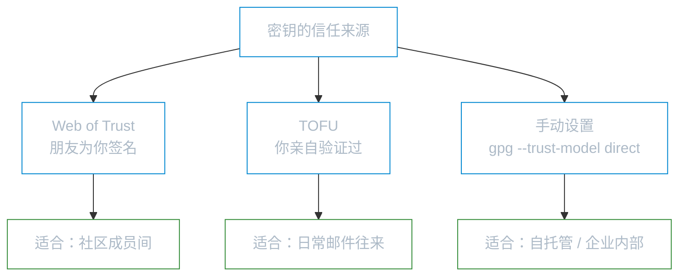
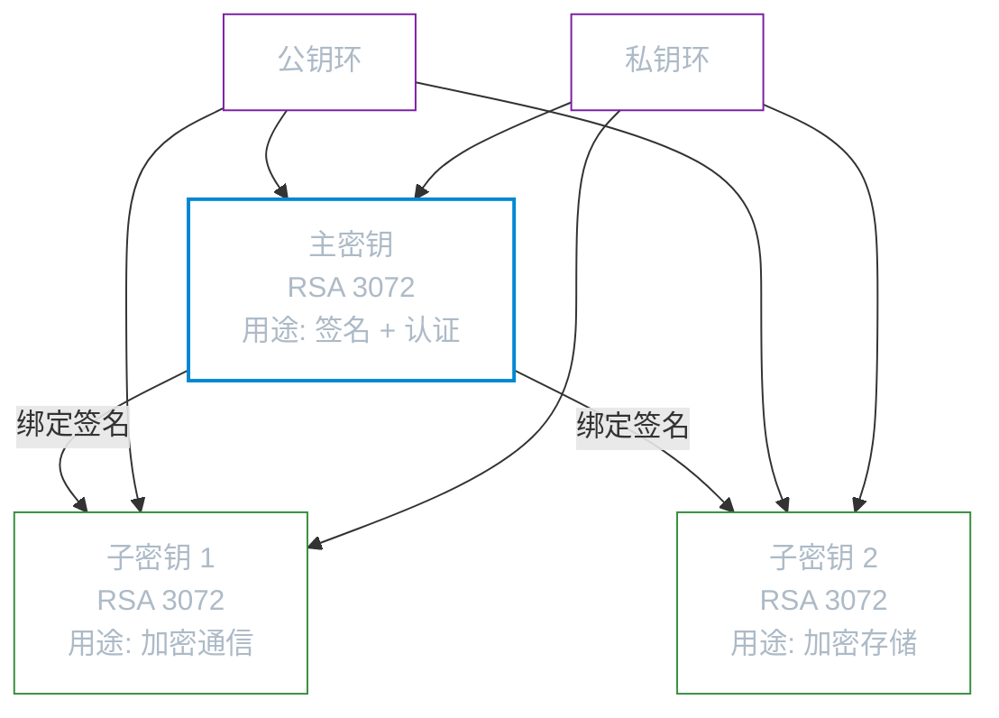
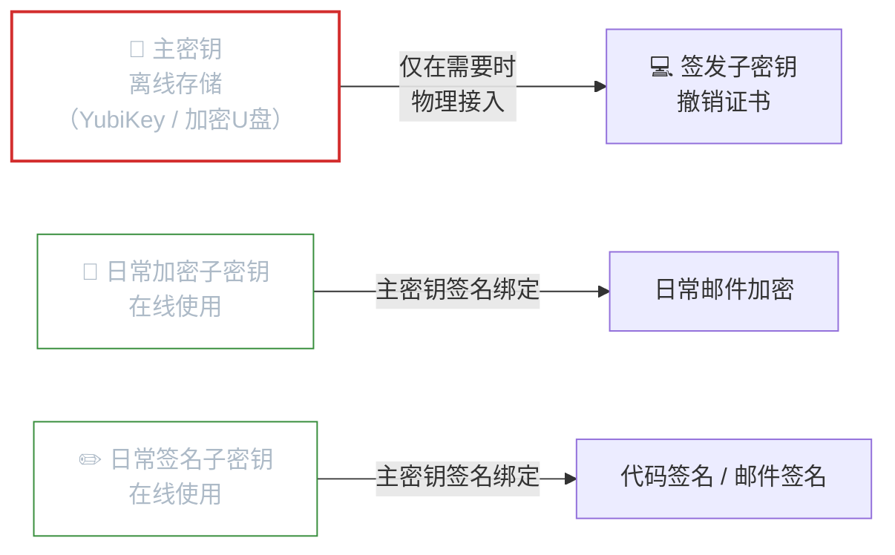
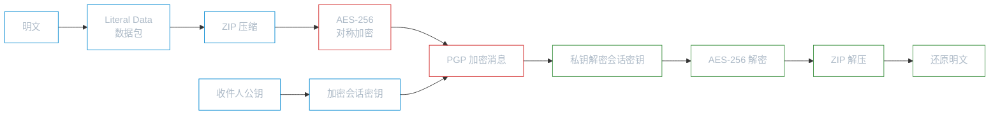

# OpenPGP

**本文你会学到**：

- 电子邮件加密为什么需要一种不同于 X.509 的密钥管理方式
- OpenPGP 的密钥环结构——为什么一个"人"对应多个密钥
- 如何用 Bouncy Castle 生成 RSA 密钥环、导出公钥
- OpenPGP 签名的三种形式：封装签名、分离签名、清文签名
- OpenPGP 公钥加密的完整流程（含压缩和 MDC 完整性保护）
- OpenPGP 与 CMS 各自适用什么场景
- 实现中的常见陷阱：Literal Data 数据包、MDC 完整性保护不可省略、`ArmoredOutputStream` 流关闭

## 为什么需要 OpenPGP？

你已经在「CMS 与 S/MIME」中了解了如何用 S/MIME 保护邮件安全。S/MIME 基于 X.509 证书体系，需要一个可信的 CA（证书颁发机构）来签发证书。但现实中，大多数个人用户并没有 X.509 证书，也不愿意花钱向 CA 申请。

早在 1991 年，Phil Zimmermann 就创建了一个叫 PGP（Pretty Good Privacy）的软件，让普通用户也能方便地加密邮件。PGP 的核心思路是**去中心化的信任模型**——不依赖 CA，而是通过用户之间的"互相签名"来建立信任链。你信任张三，张三信任李四，那你就间接信任李四。

PGP 后来演变为 IETF 标准 **OpenPGP**（RFC 4880），定义了一套独立的消息格式和密钥管理机制。如今常见的实现包括 GnuPG（GPG）和 Bouncy Castle 的 bcpg 库。

💡 如果说 S/MIME/CMS 像是"持护照过关"（需要 CA 签发），那 OpenPGP 更像"朋友介绍朋友"——信任通过社交网络传递，不依赖中心化机构。

### Web of Trust 信任模型

OpenPGP 的信任管理与 CMS/X.509 的根本区别在于信任模型。X.509 使用**中心化的 CA 信任模型**——你信任一组预装的根 CA，CA 签发证书担保身份。OpenPGP 使用 **Web of Trust（信任网）**——用户之间直接为彼此的公钥签名，信任通过签名链传递。

#### 信任级别与信任签名

在 Web of Trust 中，当你为某人的公钥签名时，你需要对该公钥的可信度做出评估。OpenPGP 定义了四个信任级别：

| 信任级别 | 含义 | 类比 |
|---------|------|------|
| **Unknown** | 不认识这个人，不知道他的公钥是否可信 | 陌生人 |
| **None** | 认识但不想担保其身份 | 认识但不熟 |
| **Marginal** | 一定程度上信任，但不愿单独为此担保 | 朋友的朋友 |
| **Full** | 完全信任，愿意为其公钥的真实性做担保 | 亲密朋友 |

当你用 `gpg --sign-key` 为张三的公钥签名时，本质上你是在声明："我验证过，这个公钥确实属于张三"。其他人在收到张三的公钥时，如果他们也信任你，就可以通过你的签名来建立对张三公钥的信任。

#### 信任传播规则

Web of Trust 的信任传播遵循一条核心规则：**一条信任路径要被接受，路径上必须有足够多的 Full 信任签名**。

具体来说（GnuPG 的实现）：

- 如果你的公钥环中存在一条从"信任锚"到目标公钥的路径，且路径上有至少 **1 个 Full 信任**签名，该公钥被认为是有效的
- 如果路径上只有 Marginal 信任签名，则需要**至少 3 个 Marginal 信任**签名才能凑够一个"Full"等价
- GnuPG 还要求这 3 个 Marginal 信任签名来自**充分独立的信任路径**（避免同一信任锚通过可控中间人"刷"签名数量），并设置了信任链的最大深度限制（默认 5 层）

```
你（Full 信任）→ 张三（Full 信任）→ 李四 ✅ 有效
你（Full 信任）→ 张三（Marginal）→ 李四 ❌ 不够
你（Full 信任）→ 张三（Marginal）+ 王五（Marginal）+ 赵六（Marginal）→ 李四 ✅ 三个 Marginal 凑够一个 Full
```

#### Web of Trust vs PKI CA 模型

两种信任模型各有适用场景：

| 维度 | Web of Trust | PKI CA 模型 |
|------|-------------|-------------|
| 信任基础 | 个人之间的直接担保 | 机构（CA）的集中式担保 |
| 信任传递 | 通过社交网络多路径传播 | 通过证书链单路径传播 |
| 扩展性 | 在小社区（开源项目）效果好 | 在大规模部署（互联网）更实用 |
| 单点故障 | 无——没有根 CA 可以被攻破 | 有——根 CA 被攻破影响全局 |
| 用户体验 | 需要用户理解信任决策 | 对用户透明（浏览器自动验证） |
| 现实 adoption | 开源社区、软件发布、个人通信 | Web TLS、企业邮件、代码签名 |

Web of Trust 的理论吸引力在于它的**去中心化**——没有单一信任锚可以被攻破。但它的现实困境也在于此：普通用户不想手动管理信任链，他们更希望浏览器"自动"处理一切。这也是为什么 Web 上 TLS（PKI 模型）占了绝对主导地位，而 Web of Trust 主要活跃在开源社区（如 Linux 发行版的包签名、Git 提交签名）。

OpenPGP 与 CMS 提供的安全服务类似：签名、加密、压缩、认证。但两者的**数据格式完全不同**：CMS 使用 ASN.1/DER 编码，所有信息包装在一个结构中；OpenPGP 使用自定义的**数据包（packet）流格式**，签名头、数据和签名作为独立记录依次排列在流中。

### Web of Trust vs PKI：两种信任哲学

> 本节内容参考 David Wong, *Real-World Cryptography* (Manning, 2021), Chapter 11。

去中心化信任听起来很理想，但现实中 PKI 才是互联网主流。理解两者哲学上的根本差异，才能在正确场景中做出正确选择。也可参考「CMS 与 S/MIME」（`../cms-and-smime/`）了解 PKI 体系的具体实现。

#### CA 的脆弱点：单点失效

PKI 体系的根本弱点是**根 CA 的集中性**——整个信任体系构建在对少数机构的绝对信任上。一旦某个根 CA 被攻破，攻击者可以为任意域名签发合法证书，悄无声息地发动中间人攻击。历史上已经发生过多起这样的真实事故：

| 事件 | 时间 | 影响范围 |
|------|------|---------|
| DigiNotar 被黑客完全入侵 | 2011 | 荷兰政府 CA 被攻破，`*.google.com` 虚假证书被签发，伊朗用户遭到大规模中间人监控 |
| Comodo 内部人员滥权 | 2011 | google.com、yahoo.com 等知名域名的虚假证书被签发 |
| Symantec CA 被逐步吊销 | 2017–2018 | Chrome 撤销对数亿张 Symantec 证书的信任，影响大量网站 |

这些事件推动了 **证书透明度（Certificate Transparency, CT）** 机制的诞生：所有公开信任 CA 签发的证书必须写入公开的、基于 Merkle 树构建的不可篡改日志，任何人都可以监控是否有针对自己域名的异常证书被签发。

💡 CT 是对 PKI 信任模型的重要补丁，但并没有改变根本结构——根 CA 仍然是中心化的信任锚。这就像在银行（CA）的保险库外面加了摄像头（CT），但银行本身仍然是单一信任源。

#### Web of Trust 的优劣权衡

`Web of Trust` 彻底绕开了中心化 CA，但也带来了新的现实挑战：

| 维度 | Web of Trust 的表现 | 实际影响 |
|------|---------------------|---------|
| **韧性** | 无单一失效点，没有根 CA 可以被攻破 | 局部密钥泄露不影响全局信任 |
| **可用性** | 用户必须手动建立信任链和评估信任级别 | 非技术用户几乎无法正确使用 |
| **可扩展性** | 陌生人之间可能找不到信任路径 | 不适合大规模互联网部署 |
| **适用场景** | 小型封闭社区（开源项目、学术圈、安全研究人员） | 在企业或普通用户中几乎无法落地 |

Web of Trust 最大的工程现实是：**信任是社交的，而社交是有边界的**。在 Linux 内核开发者圈子里，每个人认识的人都签过密钥；但对于普通用户，几乎不可能找到通向陌生人的完整信任路径。

#### TOFU：信任首次使用

面对 `Web of Trust` 的高使用门槛，`GPG` 2.2 引入了 **TOFU（Trust On First Use）** 模式——这是一种务实的折中方案，工作原理类似 SSH 的主机密钥验证：

1. 第一次与某人通信时，自动记录其公钥指纹
2. 后续通信时，检查公钥是否与第一次记录的一致
3. 一致则信任，不一致则发出强警告（提示可能的密钥更换或中间人攻击）

TOFU 将信任决策从"你认识谁？"简化为"你和这个人以前通信过吗？"。它无法防御**第一次通信时**的中间人攻击，但对已经建立过联系的通信者提供了较强的持续保证。

结合 Web of Trust 和 TOFU，`GPG` 的实际信任模型是分层的：



## OpenPGP 核心概念

### 密钥环（Key Ring）

当你要给别人发加密邮件时，你需要收件人的公钥。当你收到别人的签名消息时，你需要验证对方的公钥。现实中有几十上百个联系人的公钥，怎么管理？

OpenPGP 用**密钥环（Key Ring）**来解决这个问题。密钥环本质上是一个文件，里面存放一组密钥。每个用户有两个密钥环：

- **公钥环（Public Key Ring）**：存放你收集到的其他人的公钥
- **私钥环（Secret Key Ring）**：存放你自己的私钥（用口令加密保护）

💡 密钥环就像一个"通讯录 + 保险箱"——通讯录存别人的公钥，保险箱存自己的私钥。在 Java 中，Bouncy Castle 用 `PGPPublicKeyRing` 和 `PGPSecretKeyRing` 表示。

### 主密钥与子密钥

在 OpenPGP 中，一个用户通常不止一个密钥。典型的密钥环结构包含：

- **主密钥（Master Key）**：用于签名和认证其他密钥，是整个密钥环的"根"
- **子密钥（Sub-key）**：用于加密通信或加密存储，由主密钥签名绑定

为什么要分开？因为**密钥用途不同，生命周期也不同**。你几乎每天都要用子密钥加密邮件，但主密钥只在创建密钥环和给子密钥签名时才用。如果子密钥泄露了，你只需撤销子密钥并生成新的，主密钥和它的信任链不受影响。



⚠️ 子密钥不能独立存在，必须由主密钥签名才能生效。这就像员工的工作证需要公司盖章一样——子密钥的合法性来自主密钥的认证签名。

### 子密钥绑定签名的安全意义

子密钥与主密钥之间的绑定不是"放在一起就行"——主密钥通过一个 `绑定签名`（Binding Signature）将子密钥的公钥与使用权限绑定在一起。这个绑定签名回答了一个关键问题：**攻击者能不能把自己生成的密钥替换为你的子密钥？**

答案是：不能。因为绑定签名是用主密钥的私钥生成的，攻击者没有主密钥的私钥，就无法伪造合法的绑定签名。验证方会检查：

1. 绑定签名是否由主密钥签发（签名验证通过）
2. 子密钥的用途标志（KeyFlags）是否与声明一致

这就是**密钥分离原则**在 OpenPGP 中的实现：不同用途使用不同密钥，每个密钥的权限由主密钥签名严格控制。

这种设计的实际安全意义在于**限制了密钥泄露的影响范围**：

- 如果**子密钥泄露**：只需撤销该子密钥，生成新的子密钥并用主密钥重新签名绑定。主密钥的信任链完全不受影响——其他用户不需要更新对你的信任
- 如果**主密钥泄露**：这才是灾难性事件。攻击者可以伪造新的子密钥绑定签名，签发虚假的用户 ID 绑定。此时需要通过密钥撤销机制通知所有相关方

这也是为什么 OpenPGP 的最佳实践建议：**主密钥离线保存，日常只使用子密钥**。主密钥可以存放在断网的介质上（如 USB 安全密钥），只有需要创建或撤销子密钥时才取出使用。

### GPG 最佳实践：子密钥、过期时间与吊销

> 本节参考 David Wong, *Real-World Cryptography* (Manning, 2021), Chapter 11，以及 GPG 官方最佳实践文档。

⚙️ 仅理解 OpenPGP 的数据结构还不够——**错误的密钥管理方式会让完美的密码学毫无价值**。这里汇总实际使用 `GPG` 时最重要的三条实践。

#### 主密钥离线，子密钥在线

现实中，大多数用户的 `GPG` 密钥环是这样的：主密钥和所有子密钥都存在同一台联网电脑上。这意味着一旦电脑被黑，所有密钥（包括主密钥）都可能泄露，攻击者可以伪造任意子密钥绑定签名，彻底摧毁你的身份。

正确的做法是**主密钥离线**：



在 `GPG` 中导出"仅子密钥"的密钥环（不含主密钥私钥），可以部署在日常工作机上：

``` text title="导出仅含子密钥的密钥环"
# 导出完整密钥（备份到离线介质）
gpg --export-secret-keys alice@example.com > alice-full.gpg

# 删除主密钥私钥，只保留子密钥私钥（在线机器用）
gpg --export-secret-subkeys alice@example.com > alice-subkeys-only.gpg

# 在日常使用机器上，只导入子密钥私钥
gpg --import alice-subkeys-only.gpg
```

#### 设置子密钥过期时间

为子密钥设置过期时间是一道重要的安全保险：即使子密钥在你不知情的情况下泄露，攻击者最多只能使用到过期日期为止。过期时间**不影响已签名内容的验证**——过去用该密钥签名的文件仍然可以验证（因为签名时密钥是有效的）。

推荐的过期时间策略：

| 密钥类型 | 推荐有效期 | 原因 |
|---------|-----------|------|
| 主密钥 | 不设置（或 5 年以上） | 主密钥吊销是最高级别操作，不希望频繁变更 |
| 加密子密钥 | 1 年 | 定期轮换，减少泄露时窗 |
| 签名子密钥 | 1 年 | 同上 |

``` text title="在 GPG 中为子密钥设置过期时间"
gpg --edit-key alice@example.com
# 选中子密钥 key 1
gpg> key 1
# 设置 1 年过期时间
gpg> expire
# 输入 1y
gpg> save
```

到期前，用主密钥私钥为子密钥续期（更新过期时间），无需重新分发公钥——已有联系人导入更新后的公钥即可。

#### 预生成吊销证书

吊销证书是"紧急关闭阀"。当主密钥泄露时，你需要通过发布吊销证书来告知所有人该密钥不再可信。**问题在于：吊销证书必须在主密钥可用时生成，而主密钥被盗后你可能已经无法使用它了。**

正确做法是**在创建密钥时立即生成吊销证书**，并安全存放（与主密钥分开保存）：

``` text title="生成并存储吊销证书"
# 生成吊销证书（会提示选择吊销原因）
gpg --gen-revoke alice@example.com > alice-revocation.asc

# 将 alice-revocation.asc 打印纸质备份，或存储在独立的加密介质上
# 永远不要和主密钥存在同一个地方！
```

发布吊销证书时，将其导入本地密钥环后上传到密钥服务器（如 `keys.openpgp.org`），所有已从该服务器同步过你公钥的人都会在下次更新时收到吊销通知。

### ASCII Armored 格式

OpenPGP 的原生格式是二进制数据包，但二进制数据无法直接放进邮件正文。于是 OpenPGP 定义了 **ASCII Armored** 格式——将二进制数据做 Base64 编码，并在首尾加上标记行：

``` text title="ASCII Armored 格式示例"
-----BEGIN PGP MESSAGE-----
Version: BCPG v1.65
yxt0CF9DT05TT0xFXX9ONEhlbGxvLCB3b3JsZCE=
=sJgV
-----END PGP MESSAGE-----
```

常见的 Armored 类型包括：

| 标记 | 用途 |
|------|------|
| `PGP PUBLIC KEY BLOCK` | 公钥 |
| `PGP PRIVATE KEY BLOCK` | 私钥 |
| `PGP MESSAGE` | 加密消息 |
| `PGP SIGNATURE` | 分离签名 |
| `PGP SIGNED MESSAGE` | 清文签名（可读文本 + 签名） |

尾部 `=sJgV` 是 24 位 CRC 校验和，用于检测传输错误（注意：它**不是**密码学校验，不能保证数据完整性）。

在 Java 中，`ArmoredOutputStream` 用于生成 ASCII Armored 输出，`ArmoredInputStream` 用于解析。一个容易踩的坑是：`ArmoredOutputStream.close()` **不会**关闭底层流，因为一个流里可能写入多个 PGP 数据块。

## 密钥环管理实战

### 生成 RSA 密钥环

生成密钥环是所有 OpenPGP 操作的第一步。我们来看看如何用 Bouncy Castle 创建一个包含主密钥和加密子密钥的密钥环。

``` java title="生成 RSA 3072 位密钥环（主密钥 + 加密子密钥）"
// 1. 生成 RSA 3072 位密钥对
KeyPairGenerator kpg = KeyPairGenerator.getInstance("RSA", "BC");
kpg.initialize(3072);
Date now = new Date();

// 2. 创建主密钥（用于签名和认证）
KeyPair primaryKP = kpg.generateKeyPair();
PGPKeyPair primaryKey = new JcaPGPKeyPair(PGPPublicKey.RSA_GENERAL, primaryKP, now);

// 3. 创建加密子密钥
KeyPair encryptKP = kpg.generateKeyPair();
PGPKeyPair encryptKey = new JcaPGPKeyPair(PGPPublicKey.RSA_GENERAL, encryptKP, now);

// 4. 配置主密钥的签名子包（设置密钥用途、偏好算法）
PGPSignatureSubpacketGenerator subpackets = new PGPSignatureSubpacketGenerator();
subpackets.setKeyFlags(true, KeyFlags.CERTIFY_OTHER | KeyFlags.SIGN_DATA);
subpackets.setPreferredHashAlgorithms(false, new int[]{
        HashAlgorithmTags.SHA512, HashAlgorithmTags.SHA384, HashAlgorithmTags.SHA256});
subpackets.setPreferredSymmetricAlgorithms(false, new int[]{
        SymmetricKeyAlgorithmTags.AES_256, SymmetricKeyAlgorithmTags.AES_128});

// 5. 创建密钥环生成器
PGPDigestCalculator sha1Calc = new JcaPGPDigestCalculatorProviderBuilder()
        .build().get(HashAlgorithmTags.SHA1);
PGPKeyRingGenerator ringGen = new PGPKeyRingGenerator(
        PGPSignature.POSITIVE_CERTIFICATION, primaryKey,
        "alice@example.com", sha1Calc, subpackets.generate(), null,
        new JcaPGPContentSignerBuilder(
                PGPPublicKey.RSA_GENERAL, HashAlgorithmTags.SHA256).setProvider("BC"),
        new JcePBESecretKeyEncryptorBuilder(
                SymmetricKeyAlgorithmTags.AES_256, sha1Calc).setProvider("BC")
                .build("test-passphrase".toCharArray()));

// 6. 添加加密子密钥
PGPSignatureSubpacketGenerator encSubpackets = new PGPSignatureSubpacketGenerator();
encSubpackets.setKeyFlags(true, KeyFlags.ENCRYPT_COMMS | KeyFlags.ENCRYPT_STORAGE);
ringGen.addSubKey(encryptKey, encSubpackets.generate(), null);

// 7. 生成密钥环
PGPSecretKeyRing secretKeyRing = ringGen.generateSecretKeyRing();
PGPPublicKeyRing publicKeyRing = secretKeyRing.toCertificate();
```

> 完整代码见 `PgpKeyRingTest`。

几个关键点需要理解：

- **`PGPSignature.POSITIVE_CERTIFICATION`**（第 5 步）：表示密钥持有者已对身份做了充分验证。这是 RFC 4880 定义的认证级别，用于将用户 ID（如 `alice@example.com`）绑定到主密钥
- **`KeyFlags`**：精确控制每个密钥的用途——主密钥设置 `CERTIFY_OTHER | SIGN_DATA`，子密钥设置 `ENCRYPT_COMMS | ENCRYPT_STORAGE`
- **`PBESecretKeyEncryptor`**：私钥环中的私钥用口令加密保护，即使私钥环文件泄露，没有口令也无法使用

### 导出与导入公钥

公钥需要分享给他人，而 OpenPGP 的标准分享格式就是 ASCII Armored：

``` java title="导出公钥为 ASCII Armored 格式"
// 导出公钥环为 ASCII Armored 格式
ByteArrayOutputStream pubKeyOut = new ByteArrayOutputStream();
try (OutputStream out = new ArmoredOutputStream(pubKeyOut)) {
    originalPublicKeyRing.encode(out);
}
byte[] pubKeyBytes = pubKeyOut.toByteArray();
Files.write(publicKeyPath, pubKeyBytes);
```

``` java title="重新导入公钥文件并验证"
PGPPublicKeyRingCollection importedKeyRings;
try (InputStream keyIn = new ByteArrayInputStream(pubKeyBytes)) {
    importedKeyRings = new PGPPublicKeyRingCollection(
            PGPUtil.getDecoderStream(keyIn),
            new JcaKeyFingerprintCalculator());
}
// 通过密钥 ID 验证导入前后一致
assertEquals(originalKeyId, importedKeyRing.getPublicKey().getKeyID());
```

> 完整代码见 `PgpKeyRingTest.shouldExportAndImportPublicKey()`。

⚠️ `PGPUtil.getDecoderStream()` 是一个非常重要的工具方法——它会自动检测输入是二进制 PGP 数据还是 ASCII Armored 格式，并返回统一的 `InputStream`。无论对方发来的是哪种格式，你都可以用它来解码。

### OpenPGP 密钥服务器的问题与 WKD

> 本节参考 David Wong, *Real-World Cryptography* (Manning, 2021), Chapter 11。

⚠️ 有了公钥，还需要一个机制把它"发出去"让别人找到。`OpenPGP` 的传统答案是密钥服务器（Keyserver），但这套机制在 2019 年遭受了一次严重的可用性攻击，促使社区转向新的解决方案。

#### SKS 密钥服务器污染攻击（2019）

2019 年 6 月，一批攻击者对传统的 **SKS（Synchronizing Key Server）** 网络发动了所谓的"证书洪泛攻击"（Certificate Flooding Attack）：

**攻击原理**：`OpenPGP` 规范允许任何人为他人的公钥附加签名——这是 `Web of Trust` 的基础。SKS 服务器会接受并同步这些签名，且**不限数量**。攻击者针对两位著名的 `GPG` 开发者（Robert J. Hansen 和 Daniel Kahn Gillmor）的公钥，附加了数以万计的伪造签名：

```
密钥 A（受害者公钥）
├── 合法签名 1（朋友签名）
├── 合法签名 2（同事签名）
├── 伪造签名 1（攻击者账号 1）
├── 伪造签名 2（攻击者账号 2）
├── ...（50,000 条伪造签名）
```

**结果**：当受害者或其他人从 SKS 服务器下载这个公钥时，`GPG` 需要验证每一条签名，CPU 使用率飙升，`GPG` 实际上挂死——某些操作需要几小时才能完成。因为 SKS 网络的同步特性，这个"污染"几乎无法撤销。

**根本原因**：SKS 协议的设计原则是"只增不删"——任何写入的数据（签名）都无法删除，且所有 SKS 节点会互相同步，形成一个最终一致的分布式数据库。

#### WKD：Web Key Directory

`WKD`（Web Key Directory，RFC 9580）是 `GPG` 社区为解决密钥发现问题提出的新标准，思路是**让域名所有者直接托管自己域内用户的公钥**，而不是依赖第三方服务器：


WKD 的优势在于：

- **信任锚是 HTTPS**：公钥由域名所有者发布，其真实性由 TLS 证书（PKI）保证——复用了现有的 Web 信任基础设施
- **无污染攻击面**：域名所有者控制自己的 WKD 端点，无法被他人写入垃圾签名
- **自动发现**：`GPG` 2.2+ 在加密前会自动尝试 WKD 查询，用户无需手动导入公钥

目前已支持 WKD 的邮件服务：`ProtonMail`（直接集成）、`Tutanota`（部分支持）、`mailbox.org`；自托管域名可以通过静态文件托管轻松实现 WKD。

``` text title="GPG 通过 WKD 自动查找公钥"
# GPG 2.2+ 在加密时会自动尝试 WKD 查询
gpg --locate-keys alice@example.com

# 也可以手动指定 WKD 查询
gpg --auto-key-locate wkd --locate-keys alice@example.com
```

⚠️ WKD 要求域名必须通过 HTTPS 提供服务，且 TLS 证书有效。对于没有自己域名的普通用户，推荐使用 `keys.openpgp.org`——这是一个现代化密钥服务器，要求邮件验证后才能上传公钥，且支持删除操作，从根本上避免了 SKS 的污染问题。

## OpenPGP 签名实战

### 二进制签名与验证

OpenPGP 支持两种签名形式：**封装签名（Encapsulated Signature）** 和 **分离签名（Detached Signature）**。封装签名把签名和消息打包在一起，分离签名则将签名作为独立文件。

这里演示分离签名（也叫二进制签名）的完整流程：

``` java title="创建分离签名"
// 1. 创建签名生成器
PGPSignatureGenerator signatureGenerator = new PGPSignatureGenerator(
        new JcaPGPContentSignerBuilder(
                signingPublicKey.getAlgorithm(), HashAlgorithmTags.SHA256)
                .setProvider("BC"));

// 2. 用私钥初始化，签名类型为 BINARY_DOCUMENT
signatureGenerator.init(PGPSignature.BINARY_DOCUMENT, signingPrivateKey);

// 3. 更新待签名数据并生成签名
signatureGenerator.update(messageBytes);
byte[] signatureBytes = signatureGenerator.generate().getEncoded();

// 4. 导出为 ASCII Armored 格式（添加 -----BEGIN PGP SIGNATURE----- 标记）
try (OutputStream out = new ArmoredOutputStream(sigOut)) {
    out.write(signatureBytes);
}
```

``` java title="验证分离签名"
// 1. 解码签名对象
try (InputStream sigIn = PGPUtil.getDecoderStream(new ByteArrayInputStream(sigData))) {
    BCPGInputStream bcpgIn = new BCPGInputStream(sigIn);
    signature = new PGPSignature(bcpgIn);
}

// 2. 用公钥初始化验证器
signature.init(new JcaPGPContentVerifierBuilderProvider().setProvider("BC"),
        signingPublicKey);

// 3. 更新原始数据并验证
signature.update(messageBytes);
assertTrue(signature.verify()); // ✅ 签名验证通过
```

> 完整代码见 `PgpSignEncryptTest.shouldSignAndVerifyMessage()`。

💡 签名验证失败的可能原因只有两个：消息被篡改，或签名不是用这个公钥对应的私钥生成的。如果验证失败，**不要**使用恢复出的数据。

### 清文签名 Clear-sign

你是否收到过这样的邮件——正文完全可读，底部附着一堆以 `-----BEGIN PGP SIGNATURE-----` 开头的乱码？这就是 **清文签名（Clear-sign）**。

清文签名的核心价值是**不需要任何特殊软件就能阅读消息内容**。即使对方没有安装 GPG，也能正常读邮件。当然，没有 GPG 就无法验证签名。

一个清文签名的完整结构如下：

``` text title="清文签名结构"
-----BEGIN PGP SIGNED MESSAGE-----
Hash: SHA256

这是一条清文签名消息。
签名后的文本仍然保持可读性，
PGP 签名数据会以 ASCII 格式附加在底部。
-----BEGIN PGP SIGNATURE-----
Version: BCPG v1.65

iF4EAREIAAYFAl42au4ACgkQqjare2QW6Hij7wEAk0oLQGX11G...
=Vvtg
-----END PGP SIGNATURE-----
```

``` java title="创建清文签名"
// 1. 初始化签名生成器
PGPSignatureGenerator signatureGenerator = new PGPSignatureGenerator(
        new JcaPGPContentSignerBuilder(
                signingPublicKey.getAlgorithm(), HashAlgorithmTags.SHA256)
                .setProvider("BC"));
signatureGenerator.init(PGPSignature.CANONICAL_TEXT_DOCUMENT, signingPrivateKey);

// 2. 写入清文头部（包含 Hash 算法声明）
armoredOut.beginClearText(HashAlgorithmTags.SHA256);

// 3. 逐行写入文本并更新签名
//    清文签名要求行尾使用 CR+LF
byte[] crlf = "\r\n".getBytes(StandardCharsets.UTF_8);
for (String line : msgLines) {
    byte[] lineBytes = line.getBytes(StandardCharsets.UTF_8);
    armoredOut.write(lineBytes);
    armoredOut.write(crlf);
    signatureGenerator.update(lineBytes); // 更新签名
    signatureGenerator.update(crlf);      // CR+LF 也参与签名计算
}

// 4. 结束清文部分，生成签名
armoredOut.endClearText();
signatureGenerator.generate().encode(armoredOut);
```

> 完整代码见 `PgpClearTextTest.shouldSignClearTextMessage()`。

⚠️ 清文签名有一个容易踩的坑：**签名计算必须忽略行尾空格**。RFC 4880 Section 7.1 明确规定，每行末尾的空白字符不参与签名计算。如果发送方和接收方的文本处理不一致（比如编辑器自动去除了行尾空格），签名验证就会失败。Bouncy Castle 的 `ArmoredOutputStream` 会自动处理规范文本格式（canonicalization），但如果你手动拼接文本，就需要自己处理。

## OpenPGP 加密实战

### 公钥加密与解密

OpenPGP 的公钥加密流程和 CMS 类似：生成一个随机的对称会话密钥，用对称密钥加密数据，再用收件人的公钥加密会话密钥。解密时反过来——先用私钥恢复会话密钥，再解密数据。

``` java title="PGP 公钥加密（AES-256 + RSA）"
// 1. 先压缩数据（PGP 通常先压缩再加密）
ByteArrayOutputStream compressedOut = new ByteArrayOutputStream();
PGPCompressedDataGenerator compressor = new PGPCompressedDataGenerator(
        CompressionAlgorithmTags.ZIP);
try (OutputStream compStream = compressor.open(compressedOut)) {
    PGPLiteralDataGenerator literal = new PGPLiteralDataGenerator();
    try (OutputStream litStream = literal.open(compStream,
            PGPLiteralData.BINARY, "message.txt", plaintext.length, new Date())) {
        litStream.write(plaintext);
    }
}

// 2. 使用 AES-256 加密压缩后的数据
ByteArrayOutputStream encryptedOut = new ByteArrayOutputStream();
try (OutputStream armoredOut = new ArmoredOutputStream(encryptedOut)) {
    PGPEncryptedDataGenerator encGen = new PGPEncryptedDataGenerator(
            new JcePGPDataEncryptorBuilder(SymmetricKeyAlgorithmTags.AES_256)
                    .setWithIntegrityPacket(true) // ✅ 启用 MDC 完整性保护
                    .setSecureRandom(new SecureRandom())
                    .setProvider("BC"));
    encGen.addMethod(new JcePublicKeyKeyEncryptionMethodGenerator(encryptionPublicKey)
            .setProvider("BC"));

    try (OutputStream encStream = encGen.open(armoredOut, compressedData.length)) {
        encStream.write(compressedData);
    }
}
```

``` java title="PGP 解密流程"
// 1. 解析 PGP 加密数据
InputStream objFactoryIn = PGPUtil.getDecoderStream(new ByteArrayInputStream(encryptedData));
JcaPGPObjectFactory pgpFactory = new JcaPGPObjectFactory(objFactoryIn);
Object firstObj = pgpFactory.nextObject();
PGPEncryptedDataList encList = (PGPEncryptedDataList) firstObj;
PGPPublicKeyEncryptedData pke = (PGPPublicKeyEncryptedData) encList.get(0);

// 2. 用私钥解密，获取内部数据流
InputStream clearStream = pke.getDataStream(
        new JcePublicKeyDataDecryptorFactoryBuilder().setProvider("BC")
                .build(decryptPrivateKey));

// 3. 解析解密后的数据（先解压缩，再读取明文）
JcaPGPObjectFactory clearFactory = new JcaPGPObjectFactory(clearStream);
Object clearObj = clearFactory.nextObject();
if (clearObj instanceof PGPCompressedData compressedDataObj) {
    clearObj = new JcaPGPObjectFactory(compressedDataObj.getDataStream()).nextObject();
}
PGPLiteralData literalData = (PGPLiteralData) clearObj;
String decryptedMessage = new String(literalData.getInputStream().readAllBytes(),
        StandardCharsets.UTF_8);

// 4. 验证 MDC 完整性
assertTrue(pke.verify()); // ✅ MDC 校验通过
```

> 完整代码见 `PgpSignEncryptTest.shouldEncryptAndDecryptMessage()`。

解密流程中有两个要点需要注意：

- **MDC（Modification Detection Code）**：设置 `setWithIntegrityPacket(true)` 会在加密数据末尾附加一个 SHA-1 哈希。解密后必须调用 `pke.verify()` 来验证这个哈希。这是因为 PGP 的对称加密使用 CFB8 模式，该模式本身不提供完整性保护——攻击者如果知道明文格式，可以在不解密的情况下翻转密文中的特定比特
- **压缩**：PGP 通常先压缩再加密。压缩有两个好处：减少数据体积、压缩后的数据模式更随机（消除明文中的重复模式，使密码分析更困难）。解密后需要先解压再读取明文

整个加密解密过程的数据流如下：



### 实战：Java Bouncy Castle 实现 PGP 签名加密（Sign-then-Encrypt）

前面的代码分别演示了签名和加密。真实场景中，通常需要**先签名再加密（Sign-then-Encrypt）**，让接收方在解密后能同时验证消息来源的真实性。这是 `OpenPGP` 邮件加密的标准模式。

> 关于数字签名的底层原理，参见「数字签名」（`../digital-signatures/`）。

``` java title="先签名再加密（完整流程）"
/**
 * 先签名，再加密：
 * 1. 用发送方私钥对明文签名（BINARY_DOCUMENT 签名类型）
 * 2. 将签名打包成 OnePass 签名流
 * 3. 压缩后用接收方公钥加密
 */
public static byte[] signAndEncrypt(
        byte[] plaintext,
        PGPSecretKey signingSecretKey, char[] passphrase,
        PGPPublicKey encryptionPublicKey) throws Exception {

    // 1. 解锁签名私钥
    PGPPrivateKey signingPrivateKey = signingSecretKey.extractPrivateKey(
            new JcePBESecretKeyDecryptorBuilder().setProvider("BC")
                    .build(passphrase));
    PGPPublicKey signingPublicKey = signingSecretKey.getPublicKey();

    // 2. 准备输出流（Armored 格式）
    ByteArrayOutputStream out = new ByteArrayOutputStream();
    try (OutputStream armoredOut = new ArmoredOutputStream(out)) {

        // 3. 配置加密生成器
        PGPEncryptedDataGenerator encGen = new PGPEncryptedDataGenerator(
                new JcePGPDataEncryptorBuilder(SymmetricKeyAlgorithmTags.AES_256)
                        .setWithIntegrityPacket(true) // ✅ 必须启用 MDC
                        .setSecureRandom(new SecureRandom())
                        .setProvider("BC"));
        encGen.addMethod(new JcePublicKeyKeyEncryptionMethodGenerator(encryptionPublicKey)
                .setProvider("BC"));

        try (OutputStream encOut = encGen.open(armoredOut, new byte[1 << 16])) {

            // 4. 在加密流内部进行压缩
            PGPCompressedDataGenerator compGen =
                    new PGPCompressedDataGenerator(CompressionAlgorithmTags.ZIP);
            try (OutputStream compOut = compGen.open(encOut)) {

                // 5. 创建签名生成器（OnePass 模式：签名头在数据之前）
                PGPSignatureGenerator sigGen = new PGPSignatureGenerator(
                        new JcaPGPContentSignerBuilder(
                                signingPublicKey.getAlgorithm(), HashAlgorithmTags.SHA256)
                                .setProvider("BC"));
                sigGen.init(PGPSignature.BINARY_DOCUMENT, signingPrivateKey);

                // 6. 写入 OnePass 签名头
                sigGen.generateOnePassVersion(false).encode(compOut);

                // 7. 写入 Literal Data 数据包（明文）
                PGPLiteralDataGenerator litGen = new PGPLiteralDataGenerator();
                try (OutputStream litOut = litGen.open(compOut,
                        PGPLiteralData.BINARY, "message.txt",
                        plaintext.length, new Date())) {
                    litOut.write(plaintext);
                    sigGen.update(plaintext); // 同步更新签名计算
                }

                // 8. 写入完整签名（OnePass 尾部）
                sigGen.generate().encode(compOut); // ✅ 签名附在数据之后
            }
        }
    }
    return out.toByteArray();
}
```

``` java title="解密并验证签名（完整流程）"
/**
 * 解密后验证嵌入的签名：
 * 1. 用接收方私钥解密
 * 2. 解压缩
 * 3. 读取 OnePass 签名头，获取签名密钥 ID
 * 4. 读取 Literal Data，同步更新签名验证器
 * 5. 验证尾部签名
 */
public static String decryptAndVerify(
        byte[] encryptedData,
        PGPSecretKeyRing secretKeyRing,  // 接收方密钥环（用于解密）
        PGPPublicKeyRing signerPublicKeyRing,  // 发送方公钥环（用于验签）
        char[] passphrase) throws Exception {

    // 1. 解码加密数据
    InputStream in = PGPUtil.getDecoderStream(new ByteArrayInputStream(encryptedData));
    JcaPGPObjectFactory outerFactory = new JcaPGPObjectFactory(in);
    PGPEncryptedDataList encList = (PGPEncryptedDataList) outerFactory.nextObject();

    // 2. 找到匹配的加密子密钥并解密
    PGPPublicKeyEncryptedData pke = (PGPPublicKeyEncryptedData) encList.get(0);
    long encKeyId = pke.getKeyID();
    PGPPrivateKey decryptKey = null;
    for (PGPSecretKey sk : secretKeyRing) {
        if (sk.getKeyID() == encKeyId) {
            decryptKey = sk.extractPrivateKey(
                    new JcePBESecretKeyDecryptorBuilder().setProvider("BC").build(passphrase));
            break;
        }
    }
    if (decryptKey == null) throw new IllegalArgumentException("找不到匹配的解密私钥");

    InputStream clearStream = pke.getDataStream(
            new JcePublicKeyDataDecryptorFactoryBuilder().setProvider("BC").build(decryptKey));

    // 3. 解析内层数据包（压缩 → OnePass 签名头 → Literal Data → 签名）
    JcaPGPObjectFactory innerFactory = new JcaPGPObjectFactory(clearStream);
    Object obj = innerFactory.nextObject();

    // 解压缩层
    if (obj instanceof PGPCompressedData compressed) {
        innerFactory = new JcaPGPObjectFactory(compressed.getDataStream());
        obj = innerFactory.nextObject();
    }

    // 读取 OnePass 签名头（包含签名密钥 ID 和哈希算法）
    PGPOnePassSignatureList onePassList = (PGPOnePassSignatureList) obj;
    PGPOnePassSignature ops = onePassList.get(0);

    // 用发送方公钥初始化验证器
    PGPPublicKey signerPublicKey = signerPublicKeyRing.getPublicKey(ops.getKeyID());
    ops.init(new JcaPGPContentVerifierBuilderProvider().setProvider("BC"), signerPublicKey);

    // 读取 Literal Data，同步更新签名验证器
    PGPLiteralData literalData = (PGPLiteralData) innerFactory.nextObject();
    byte[] plaintext = literalData.getInputStream().readAllBytes();
    ops.update(plaintext);

    // 验证尾部签名
    PGPSignatureList sigList = (PGPSignatureList) innerFactory.nextObject();
    boolean valid = ops.verify(sigList.get(0)); // ✅ 签名验证
    if (!valid) throw new SecurityException("签名验证失败！消息可能被篡改或来源不可信");

    // 4. 验证 MDC 完整性
    if (!pke.verify()) throw new SecurityException("MDC 完整性校验失败！密文可能被篡改");

    return new String(plaintext, StandardCharsets.UTF_8);
}
```

> 完整测试代码见 `PgpSignEncryptTest.shouldSignAndEncryptThenDecryptAndVerify()`。

⚠️ `OnePass` 签名模式（RFC 4880 Section 5.4）允许签名和数据在**同一个流**中顺序读取，无需将整个消息缓存到内存后再验证。这对于大文件特别重要。签名头（`PGPOnePassSignature`）在数据之前，实际签名（`PGPSignature`）在数据之后——接收方在流式读取数据的同时更新签名摘要，最后一步才验证签名。

## CMS vs OpenPGP 对比

既然 CMS 和 OpenPGP 都能做签名和加密，怎么选择？以下是核心差异：

| 维度 | CMS / S/MIME | OpenPGP |
|------|-------------|---------|
| **编码格式** | ASN.1 / DER | 自定义数据包流（RFC 4880） |
| **信任模型** | 中心化（CA 信任链） | 去中心化（Web of Trust） |
| **证书** | X.509 证书 | PGP 自签名证书 |
| **密钥存储** | PKCS#12 / JKS 等密钥库 | 密钥环（Key Ring） / Keybox（.kbx） |
| **邮件兼容** | Outlook / Apple Mail 原生支持 | 需要 GPG 插件或 Thunderbird |
| **典型场景** | 企业内部邮件、文档签名 | 开源社区、个人通信、软件发布 |
| **Java 库** | Bouncy Castle `cms` / `mail` 包 | Bouncy Castle `bcpg` 包 |

💡 简单选择原则：如果在企业环境中，邮件系统已经支持 S/MIME（Outlook 原生支持），用 CMS；如果在开源社区或个人通信中（GitHub 发布签名、Linux 包签名、个人邮件加密），用 OpenPGP。

两者可以共存——GnuPG 2.1+ 的 Keybox（`.kbx`）格式就同时支持 OpenPGP 密钥环和 X.509 证书，可以在同一个文件中管理两种体系的公钥。

### OpenPGP 现代化：Sequoia-PGP 与 OpenPGP.js

> 本节参考 David Wong, *Real-World Cryptography* (Manning, 2021), Chapter 11。

`Bouncy Castle` 的 `bcpg` 库是 Java 生态中最完整的 `OpenPGP` 实现，但在其他语言或需要现代化 API 的场景下，有两个值得了解的替代选择。

#### Sequoia-PGP（Rust）

**Sequoia-PGP** 是一个用 Rust 编写的 `OpenPGP` 实现（[https://sequoia-pgp.org](https://sequoia-pgp.org)），由 Kai Engert、Neal Walfield 和 Justus Winter 主导开发（其中部分开发者曾是 `GPG` 核心贡献者）。它的目标是提供一个**内存安全、API 设计现代**的 `OpenPGP` 库，同时兼容 RFC 4880 和新草案 RFC 9580。

Sequoia 的设计哲学：

| 特性 | Sequoia-PGP | GPG / Bouncy Castle |
|------|-------------|---------------------|
| **内存安全** | Rust 所有权系统保证无缓冲区溢出 | C（GPG）/ JVM GC（BC） |
| **API 风格** | 类型安全的构建器模式，编译期拒绝无效状态 | 部分 API 需要运行时检查 |
| **RFC 9580 支持** | 新草案的早期支持者 | 逐步跟进 |
| **适用场景** | 系统级工具、嵌入式场景、安全工具链 | Java 后端、Android 应用 |

Sequoia 还提供了 `sq` 命令行工具，作为 `gpg` 的现代替代品，API 更加一致。

#### OpenPGP.js（JavaScript/Node.js）

**OpenPGP.js**（[https://openpgpjs.org](https://openpgpjs.org)）是最广泛使用的 JavaScript `OpenPGP` 实现，ProtonMail 的前端加密就基于此库。它同时支持浏览器和 Node.js 环境，提供 `async/await` 风格的 API：

``` javascript title="OpenPGP.js：加密和解密示例"
import * as openpgp from 'openpgp';

// 加密
const encrypted = await openpgp.encrypt({
    message: await openpgp.createMessage({ text: '你好，OpenPGP！' }),
    encryptionKeys: recipientPublicKey,
    signingKeys: senderPrivateKey,    // 同时签名
});

// 解密并验证签名
const { data, signatures } = await openpgp.decrypt({
    message: await openpgp.readMessage({ armoredMessage: encrypted }),
    decryptionKeys: recipientPrivateKey,
    verificationKeys: senderPublicKey, // 验证签名
});

// 检查签名有效性
await signatures[0].verified; // ✅ 签名有效则 resolve，否则 reject
```

#### 如何选择

| 场景 | 推荐库 |
|------|-------|
| Java / Android 后端 | Bouncy Castle `bcpg` |
| 系统工具 / Rust 项目 | Sequoia-PGP |
| 浏览器端加密 / Node.js | `OpenPGP.js` |
| 命令行日常使用 | `gpg`（GnuPG）或 `sq`（Sequoia） |
| 需要最广泛生态兼容性 | `gpg`（GnuPG，最成熟） |

⚠️ 无论选择哪个库，核心的密码学原语（`RSA`、`ECDH`、`AES-256`、`SHA-256`）都是相同的——`OpenPGP` 的互操作性保证了不同实现生成的密文可以互相解密。选择库的重点在于**语言生态、API 易用性和安全维护状态**，而非密码学能力的差异。

## 常见问题与陷阱

### Literal Data 数据包

OpenPGP 中所有待签名或待加密的数据都必须包装在 **Literal Data** 数据包中（RFC 4880 Section 5.9）。 Literal Data 支持三种类型：`BINARY`（二进制）、`TEXT`（ASCII 文本）、`UTF8`（UTF-8 文本）。

⚠️ **忘记包装 Literal Data 是最常见的错误之一**。所有 OpenPGP 工具都期望数据以 Literal Data 数据包的形式出现。如果直接加密裸数据，接收方可能无法正确解析。

### 数据包解析的灵活性

OpenPGP 的数据流中，数据包的出现顺序并不总是固定的。比如加密数据可能被压缩包包裹，也可能直接出现；流开头可能有一个 Marker Packet 需要跳过。因此，解析 PGP 消息时建议用 `JcaPGPObjectFactory` 配合 `instanceof` 检查来处理不同的数据包类型，而不是假设某个位置一定是某种类型。

### 完整性保护不可省略

PGP 的对称加密使用 CFB8 模式，这种模式**不提供完整性保护**。如果不启用 MDC（`setWithIntegrityPacket(true)`），攻击者可以在不知道密钥的情况下翻转密文中的特定位。始终启用 MDC，除非你需要兼容非常古老的 PGP 实现。

解密后务必调用 `encData.verify()` 来检查完整性。但要注意：`verify()` 内部会读取流中的所有数据，**必须在数据完全处理之后才能调用**。如果你先调用了 `verify()` 再手动读取流，流已经被消耗完了。

#### CFB8 为什么不提供完整性？

CFB（Cipher Feedback）是一种**流密码模式**——它将分组密码转化为流密码，逐字节（CFB8）或逐块加密。CFB 模式的工作原理：

$$C_i = P_i \oplus E_K(C_{i-1})$$

其中 $P_i$ 是明文字节，$C_{i-1}$ 是前一个密文字节（或 IV），$E_K$ 是分组密码加密。

CFB 模式提供**机密性**（在 CPA 安全假设下），但不提供**完整性**。原因是：如果你翻转密文中 $C_j$ 的某个比特，$P_j$ 的对应比特会被翻转（因为 CFB 的 XOR 结构），而 $P_{j+1}$ 则会因为移位寄存器的雪崩效应而**完全随机化**（整个字节不可预测）。

对比 CBC 模式下的翻转：翻转 $C_j$ 会导致 $P_j$ 完全随机化（整个块都不可预测），$P_{j+1}$ 对应翻转——但 CFB8 下 $P_j$ 是精确可控的（单个比特），攻击者对修改结果的掌控力更强。

#### 比特翻转攻击的实际威胁

设想一个 PGP 加密的配置文件，其中包含 `access=deny` 字符串。攻击者虽然无法解密文件，但如果知道这个字符串的大致位置，可以翻转密文中对应比特，将 `deny` 改为 `allow`。

这就是为什么 MDC（Modification Detection Code）是 PGP 加密中**必不可少**的组件。如果未启用 MDC，上述比特翻转不会被检测到；启用 MDC 后，任何对密文的篡改都会导致 SHA-1 校验失败。

$$\text{MDC} = \text{SHA-1}(prefix || plaintext)$$

其中 `prefix` 是一个固定字节串（`0xD3, 0x14`），用于防止 MDC 值被误识别为其他 PGP 数据包。解密后，验证方重新计算 SHA-1 并比对——任何对密文的比特翻转都会导致 MDC 校验失败。

⚠️ MDC 使用 SHA-1 而非更强的哈希函数，这是历史原因。虽然 SHA-1 的碰撞安全性已被攻破（2017年 SHAttered 攻击），但 MDC 使用 SHA-1 的方式是原像抵抗（preimage resistance），而非碰撞抵抗——攻击者需要找到一个消息使 SHA-1 等于特定值，这仍然计算不可行。因此 MDC 中的 SHA-1 目前仍然是安全的。

### `ArmoredOutputStream.close()` 不关闭底层流

`ArmoredOutputStream.close()` 的作用是触发 CRC 校验和的写入，而不是关闭底层流。这意味着你可以在同一个底层流上连续写入多个 PGP 数据块。反过来，如果你忘记调用 `close()`，输出的 Armored 数据将缺少尾部校验和，导致解析失败。

## 参考来源（本笔记增强部分）

- David Wong, *Real-World Cryptography* (Manning, 2021), Chapter 11 — "Securing communications"
- 章节文本：会话工作区 `files/rwc-chapters/ch11.txt`
- RFC 4880 — *OpenPGP Message Format* (2007)
- RFC 9580 — *OpenPGP* (2024 草案，Sequoia-PGP 早期支持)
- SKS 污染攻击分析：Robert J. Hansen, "SKS Keyserver Network Under Attack" (2019)
- Certificate Transparency：[https://certificate.transparency.dev](https://certificate.transparency.dev)
- WKD 规范：[https://wiki.gnupg.org/WKD](https://wiki.gnupg.org/WKD)
- Sequoia-PGP 项目：[https://sequoia-pgp.org](https://sequoia-pgp.org)
- OpenPGP.js 项目：[https://openpgpjs.org](https://openpgpjs.org)
