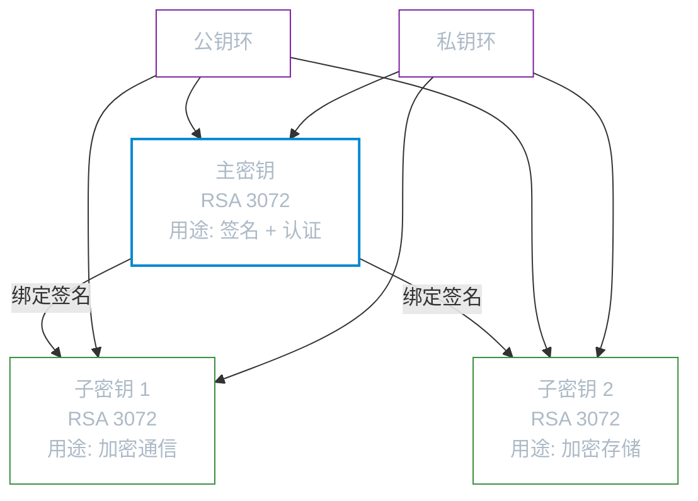
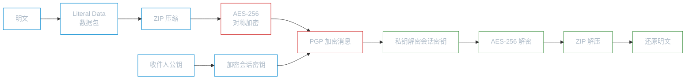

# OpenPGP

**本文你会学到**：

- 电子邮件加密为什么需要一种不同于 X.509 的密钥管理方式
- OpenPGP 的密钥环结构——为什么一个"人"对应多个密钥
- 如何用 Bouncy Castle 生成 RSA 密钥环、导出公钥
- OpenPGP 签名的三种形式：封装签名、分离签名、清文签名
- OpenPGP 公钥加密的完整流程（含压缩和 MDC 完整性保护）
- OpenPGP 与 CMS 各自适用什么场景

## 为什么需要 OpenPGP？

你已经在「CMS 与 S/MIME」中了解了如何用 S/MIME 保护邮件安全。S/MIME 基于 X.509 证书体系，需要一个可信的 CA（证书颁发机构）来签发证书。但现实中，大多数个人用户并没有 X.509 证书，也不愿意花钱向 CA 申请。

早在 1991 年，Phil Zimmermann 就创建了一个叫 PGP（Pretty Good Privacy）的软件，让普通用户也能方便地加密邮件。PGP 的核心思路是**去中心化的信任模型**——不依赖 CA，而是通过用户之间的"互相签名"来建立信任链。你信任张三，张三信任李四，那你就间接信任李四。

PGP 后来演变为 IETF 标准 **OpenPGP**（RFC 4880），定义了一套独立的消息格式和密钥管理机制。如今常见的实现包括 GnuPG（GPG）和 Bouncy Castle 的 bcpg 库。

💡 如果说 S/MIME/CMS 像是"持护照过关"（需要 CA 签发），那 OpenPGP 更像"朋友介绍朋友"——信任通过社交网络传递，不依赖中心化机构。

OpenPGP 与 CMS 提供的安全服务类似：签名、加密、压缩、认证。但两者的**数据格式完全不同**：CMS 使用 ASN.1/DER 编码，所有信息包装在一个结构中；OpenPGP 使用自定义的**数据包（packet）流格式**，签名头、数据和签名作为独立记录依次排列在流中。

## OpenPGP 核心概念

### 密钥环（Key Ring）

当你要给别人发加密邮件时，你需要收件人的公钥。当你收到别人的签名消息时，你需要验证对方的公钥。现实中有几十上百个联系人的公钥，怎么管理？

OpenPGP 用**密钥环（Key Ring）**来解决这个问题。密钥环本质上是一个文件，里面存放一组密钥。每个用户有两个密钥环：

- **公钥环（Public Key Ring）**：存放你收集到的其他人的公钥
- **私钥环（Secret Key Ring）**：存放你自己的私钥（用口令加密保护）

💡 密钥环就像一个"通讯录 + 保险箱"——通讯录存别人的公钥，保险箱存自己的私钥。在 Java 中，Bouncy Castle 用 `PGPPublicKeyRing` 和 `PGPSecretKeyRing` 表示。

### 主密钥与子密钥

在 OpenPGP 中，一个用户通常不止一个密钥。典型的密钥环结构包含：

- **主密钥（Master Key）**：用于签名和认证其他密钥，是整个密钥环的"根"
- **子密钥（Sub-key）**：用于加密通信或加密存储，由主密钥签名绑定

为什么要分开？因为**密钥用途不同，生命周期也不同**。你几乎每天都要用子密钥加密邮件，但主密钥只在创建密钥环和给子密钥签名时才用。如果子密钥泄露了，你只需撤销子密钥并生成新的，主密钥和它的信任链不受影响。



⚠️ 子密钥不能独立存在，必须由主密钥签名才能生效。这就像员工的工作证需要公司盖章一样——子密钥的合法性来自主密钥的认证签名。

### ASCII Armored 格式

OpenPGP 的原生格式是二进制数据包，但二进制数据无法直接放进邮件正文。于是 OpenPGP 定义了 **ASCII Armored** 格式——将二进制数据做 Base64 编码，并在首尾加上标记行：

``` text title="ASCII Armored 格式示例"
-----BEGIN PGP MESSAGE-----
Version: BCPG v1.65
yxt0CF9DT05TT0xFXX9ONEhlbGxvLCB3b3JsZCE=
=sJgV
-----END PGP MESSAGE-----
```

常见的 Armored 类型包括：

| 标记 | 用途 |
|------|------|
| `PGP PUBLIC KEY BLOCK` | 公钥 |
| `PGP PRIVATE KEY BLOCK` | 私钥 |
| `PGP MESSAGE` | 加密消息 |
| `PGP SIGNATURE` | 分离签名 |
| `PGP SIGNED MESSAGE` | 清文签名（可读文本 + 签名） |

尾部 `=sJgV` 是 24 位 CRC 校验和，用于检测传输错误（注意：它**不是**密码学校验，不能保证数据完整性）。

在 Java 中，`ArmoredOutputStream` 用于生成 ASCII Armored 输出，`ArmoredInputStream` 用于解析。一个容易踩的坑是：`ArmoredOutputStream.close()` **不会**关闭底层流，因为一个流里可能写入多个 PGP 数据块。

## 密钥环管理实战

### 生成 RSA 密钥环

生成密钥环是所有 OpenPGP 操作的第一步。我们来看看如何用 Bouncy Castle 创建一个包含主密钥和加密子密钥的密钥环。

``` java title="生成 RSA 3072 位密钥环（主密钥 + 加密子密钥）"
// 1. 生成 RSA 3072 位密钥对
KeyPairGenerator kpg = KeyPairGenerator.getInstance("RSA", "BC");
kpg.initialize(3072);
Date now = new Date();

// 2. 创建主密钥（用于签名和认证）
KeyPair primaryKP = kpg.generateKeyPair();
PGPKeyPair primaryKey = new JcaPGPKeyPair(PGPPublicKey.RSA_GENERAL, primaryKP, now);

// 3. 创建加密子密钥
KeyPair encryptKP = kpg.generateKeyPair();
PGPKeyPair encryptKey = new JcaPGPKeyPair(PGPPublicKey.RSA_GENERAL, encryptKP, now);

// 4. 配置主密钥的签名子包（设置密钥用途、偏好算法）
PGPSignatureSubpacketGenerator subpackets = new PGPSignatureSubpacketGenerator();
subpackets.setKeyFlags(true, KeyFlags.CERTIFY_OTHER | KeyFlags.SIGN_DATA);
subpackets.setPreferredHashAlgorithms(false, new int[]{
        HashAlgorithmTags.SHA512, HashAlgorithmTags.SHA384, HashAlgorithmTags.SHA256});
subpackets.setPreferredSymmetricAlgorithms(false, new int[]{
        SymmetricKeyAlgorithmTags.AES_256, SymmetricKeyAlgorithmTags.AES_128});

// 5. 创建密钥环生成器
PGPDigestCalculator sha1Calc = new JcaPGPDigestCalculatorProviderBuilder()
        .build().get(HashAlgorithmTags.SHA1);
PGPKeyRingGenerator ringGen = new PGPKeyRingGenerator(
        PGPSignature.POSITIVE_CERTIFICATION, primaryKey,
        "alice@example.com", sha1Calc, subpackets.generate(), null,
        new JcaPGPContentSignerBuilder(
                PGPPublicKey.RSA_GENERAL, HashAlgorithmTags.SHA256).setProvider("BC"),
        new JcePBESecretKeyEncryptorBuilder(
                SymmetricKeyAlgorithmTags.AES_256, sha1Calc).setProvider("BC")
                .build("test-passphrase".toCharArray()));

// 6. 添加加密子密钥
PGPSignatureSubpacketGenerator encSubpackets = new PGPSignatureSubpacketGenerator();
encSubpackets.setKeyFlags(true, KeyFlags.ENCRYPT_COMMS | KeyFlags.ENCRYPT_STORAGE);
ringGen.addSubKey(encryptKey, encSubpackets.generate(), null);

// 7. 生成密钥环
PGPSecretKeyRing secretKeyRing = ringGen.generateSecretKeyRing();
PGPPublicKeyRing publicKeyRing = secretKeyRing.toCertificate();
```

> 完整代码见 `PgpKeyRingTest`。

几个关键点需要理解：

- **`PGPSignature.POSITIVE_CERTIFICATION`**（第 5 步）：表示密钥持有者已对身份做了充分验证。这是 RFC 4880 定义的认证级别，用于将用户 ID（如 `alice@example.com`）绑定到主密钥
- **`KeyFlags`**：精确控制每个密钥的用途——主密钥设置 `CERTIFY_OTHER | SIGN_DATA`，子密钥设置 `ENCRYPT_COMMS | ENCRYPT_STORAGE`
- **`PBESecretKeyEncryptor`**：私钥环中的私钥用口令加密保护，即使私钥环文件泄露，没有口令也无法使用

### 导出与导入公钥

公钥需要分享给他人，而 OpenPGP 的标准分享格式就是 ASCII Armored：

``` java title="导出公钥为 ASCII Armored 格式"
// 导出公钥环为 ASCII Armored 格式
ByteArrayOutputStream pubKeyOut = new ByteArrayOutputStream();
try (OutputStream out = new ArmoredOutputStream(pubKeyOut)) {
    originalPublicKeyRing.encode(out);
}
byte[] pubKeyBytes = pubKeyOut.toByteArray();
Files.write(publicKeyPath, pubKeyBytes);
```

``` java title="重新导入公钥文件并验证"
PGPPublicKeyRingCollection importedKeyRings;
try (InputStream keyIn = new ByteArrayInputStream(pubKeyBytes)) {
    importedKeyRings = new PGPPublicKeyRingCollection(
            PGPUtil.getDecoderStream(keyIn),
            new JcaKeyFingerprintCalculator());
}
// 通过密钥 ID 验证导入前后一致
assertEquals(originalKeyId, importedKeyRing.getPublicKey().getKeyID());
```

> 完整代码见 `PgpKeyRingTest.shouldExportAndImportPublicKey()`。

⚠️ `PGPUtil.getDecoderStream()` 是一个非常重要的工具方法——它会自动检测输入是二进制 PGP 数据还是 ASCII Armored 格式，并返回统一的 `InputStream`。无论对方发来的是哪种格式，你都可以用它来解码。

## OpenPGP 签名实战

### 二进制签名与验证

OpenPGP 支持两种签名形式：**封装签名（Encapsulated Signature）** 和 **分离签名（Detached Signature）**。封装签名把签名和消息打包在一起，分离签名则将签名作为独立文件。

这里演示分离签名（也叫二进制签名）的完整流程：

``` java title="创建分离签名"
// 1. 创建签名生成器
PGPSignatureGenerator signatureGenerator = new PGPSignatureGenerator(
        new JcaPGPContentSignerBuilder(
                signingPublicKey.getAlgorithm(), HashAlgorithmTags.SHA256)
                .setProvider("BC"));

// 2. 用私钥初始化，签名类型为 BINARY_DOCUMENT
signatureGenerator.init(PGPSignature.BINARY_DOCUMENT, signingPrivateKey);

// 3. 更新待签名数据并生成签名
signatureGenerator.update(messageBytes);
byte[] signatureBytes = signatureGenerator.generate().getEncoded();

// 4. 导出为 ASCII Armored 格式（添加 -----BEGIN PGP SIGNATURE----- 标记）
try (OutputStream out = new ArmoredOutputStream(sigOut)) {
    out.write(signatureBytes);
}
```

``` java title="验证分离签名"
// 1. 解码签名对象
try (InputStream sigIn = PGPUtil.getDecoderStream(new ByteArrayInputStream(sigData))) {
    BCPGInputStream bcpgIn = new BCPGInputStream(sigIn);
    signature = new PGPSignature(bcpgIn);
}

// 2. 用公钥初始化验证器
signature.init(new JcaPGPContentVerifierBuilderProvider().setProvider("BC"),
        signingPublicKey);

// 3. 更新原始数据并验证
signature.update(messageBytes);
assertTrue(signature.verify()); // ✅ 签名验证通过
```

> 完整代码见 `PgpSignEncryptTest.shouldSignAndVerifyMessage()`。

💡 签名验证失败的可能原因只有两个：消息被篡改，或签名不是用这个公钥对应的私钥生成的。如果验证失败，**不要**使用恢复出的数据。

### 清文签名 Clear-sign

你是否收到过这样的邮件——正文完全可读，底部附着一堆以 `-----BEGIN PGP SIGNATURE-----` 开头的乱码？这就是 **清文签名（Clear-sign）**。

清文签名的核心价值是**不需要任何特殊软件就能阅读消息内容**。即使对方没有安装 GPG，也能正常读邮件。当然，没有 GPG 就无法验证签名。

一个清文签名的完整结构如下：

``` text title="清文签名结构"
-----BEGIN PGP SIGNED MESSAGE-----
Hash: SHA256

这是一条清文签名消息。
签名后的文本仍然保持可读性，
PGP 签名数据会以 ASCII 格式附加在底部。
-----BEGIN PGP SIGNATURE-----
Version: BCPG v1.65

iF4EAREIAAYFAl42au4ACgkQqjare2QW6Hij7wEAk0oLQGX11G...
=Vvtg
-----END PGP SIGNATURE-----
```

``` java title="创建清文签名"
// 1. 初始化签名生成器
PGPSignatureGenerator signatureGenerator = new PGPSignatureGenerator(
        new JcaPGPContentSignerBuilder(
                signingPublicKey.getAlgorithm(), HashAlgorithmTags.SHA256)
                .setProvider("BC"));
signatureGenerator.init(PGPSignature.CANONICAL_TEXT_DOCUMENT, signingPrivateKey);

// 2. 写入清文头部（包含 Hash 算法声明）
armoredOut.beginClearText(HashAlgorithmTags.SHA256);

// 3. 逐行写入文本并更新签名
//    清文签名要求行尾使用 CR+LF
byte[] crlf = "\r\n".getBytes(StandardCharsets.UTF_8);
for (String line : msgLines) {
    byte[] lineBytes = line.getBytes(StandardCharsets.UTF_8);
    armoredOut.write(lineBytes);
    armoredOut.write(crlf);
    signatureGenerator.update(lineBytes); // 更新签名
    signatureGenerator.update(crlf);      // CR+LF 也参与签名计算
}

// 4. 结束清文部分，生成签名
armoredOut.endClearText();
signatureGenerator.generate().encode(armoredOut);
```

> 完整代码见 `PgpClearTextTest.shouldSignClearTextMessage()`。

⚠️ 清文签名有一个容易踩的坑：**签名计算必须忽略行尾空格**。RFC 4880 Section 7.1 明确规定，每行末尾的空白字符不参与签名计算。如果发送方和接收方的文本处理不一致（比如编辑器自动去除了行尾空格），签名验证就会失败。Bouncy Castle 的 `ArmoredOutputStream` 会自动处理规范文本格式（canonicalization），但如果你手动拼接文本，就需要自己处理。

## OpenPGP 加密实战

### 公钥加密与解密

OpenPGP 的公钥加密流程和 CMS 类似：生成一个随机的对称会话密钥，用对称密钥加密数据，再用收件人的公钥加密会话密钥。解密时反过来——先用私钥恢复会话密钥，再解密数据。

``` java title="PGP 公钥加密（AES-256 + RSA）"
// 1. 先压缩数据（PGP 通常先压缩再加密）
ByteArrayOutputStream compressedOut = new ByteArrayOutputStream();
PGPCompressedDataGenerator compressor = new PGPCompressedDataGenerator(
        CompressionAlgorithmTags.ZIP);
try (OutputStream compStream = compressor.open(compressedOut)) {
    PGPLiteralDataGenerator literal = new PGPLiteralDataGenerator();
    try (OutputStream litStream = literal.open(compStream,
            PGPLiteralData.BINARY, "message.txt", plaintext.length, new Date())) {
        litStream.write(plaintext);
    }
}

// 2. 使用 AES-256 加密压缩后的数据
ByteArrayOutputStream encryptedOut = new ByteArrayOutputStream();
try (OutputStream armoredOut = new ArmoredOutputStream(encryptedOut)) {
    PGPEncryptedDataGenerator encGen = new PGPEncryptedDataGenerator(
            new JcePGPDataEncryptorBuilder(SymmetricKeyAlgorithmTags.AES_256)
                    .setWithIntegrityPacket(true) // ✅ 启用 MDC 完整性保护
                    .setSecureRandom(new SecureRandom())
                    .setProvider("BC"));
    encGen.addMethod(new JcePublicKeyKeyEncryptionMethodGenerator(encryptionPublicKey)
            .setProvider("BC"));

    try (OutputStream encStream = encGen.open(armoredOut, compressedData.length)) {
        encStream.write(compressedData);
    }
}
```

``` java title="PGP 解密流程"
// 1. 解析 PGP 加密数据
InputStream objFactoryIn = PGPUtil.getDecoderStream(new ByteArrayInputStream(encryptedData));
JcaPGPObjectFactory pgpFactory = new JcaPGPObjectFactory(objFactoryIn);
Object firstObj = pgpFactory.nextObject();
PGPEncryptedDataList encList = (PGPEncryptedDataList) firstObj;
PGPPublicKeyEncryptedData pke = (PGPPublicKeyEncryptedData) encList.get(0);

// 2. 用私钥解密，获取内部数据流
InputStream clearStream = pke.getDataStream(
        new JcePublicKeyDataDecryptorFactoryBuilder().setProvider("BC")
                .build(decryptPrivateKey));

// 3. 解析解密后的数据（先解压缩，再读取明文）
JcaPGPObjectFactory clearFactory = new JcaPGPObjectFactory(clearStream);
Object clearObj = clearFactory.nextObject();
if (clearObj instanceof PGPCompressedData compressedDataObj) {
    clearObj = new JcaPGPObjectFactory(compressedDataObj.getDataStream()).nextObject();
}
PGPLiteralData literalData = (PGPLiteralData) clearObj;
String decryptedMessage = new String(literalData.getInputStream().readAllBytes(),
        StandardCharsets.UTF_8);

// 4. 验证 MDC 完整性
assertTrue(pke.verify()); // ✅ MDC 校验通过
```

> 完整代码见 `PgpSignEncryptTest.shouldEncryptAndDecryptMessage()`。

解密流程中有两个要点需要注意：

- **MDC（Modification Detection Code）**：设置 `setWithIntegrityPacket(true)` 会在加密数据末尾附加一个 SHA-1 哈希。解密后必须调用 `pke.verify()` 来验证这个哈希。这是因为 PGP 的对称加密使用 CFB8 模式，该模式本身不提供完整性保护——攻击者如果知道明文格式，可以在不解密的情况下翻转密文中的特定比特
- **压缩**：PGP 通常先压缩再加密。压缩有两个好处：减少数据体积、压缩后的数据模式更随机（消除明文中的重复模式，使密码分析更困难）。解密后需要先解压再读取明文

整个加密解密过程的数据流如下：



## CMS vs OpenPGP 对比

既然 CMS 和 OpenPGP 都能做签名和加密，怎么选择？以下是核心差异：

| 维度 | CMS / S/MIME | OpenPGP |
|------|-------------|---------|
| **编码格式** | ASN.1 / DER | 自定义数据包流（RFC 4880） |
| **信任模型** | 中心化（CA 信任链） | 去中心化（Web of Trust） |
| **证书** | X.509 证书 | PGP 自签名证书 |
| **密钥存储** | PKCS#12 / JKS 等密钥库 | 密钥环（Key Ring） / Keybox（.kbx） |
| **邮件兼容** | Outlook / Apple Mail 原生支持 | 需要 GPG 插件或 Thunderbird |
| **典型场景** | 企业内部邮件、文档签名 | 开源社区、个人通信、软件发布 |
| **Java 库** | Bouncy Castle `cms` / `mail` 包 | Bouncy Castle `bcpg` 包 |

💡 简单选择原则：如果在企业环境中，邮件系统已经支持 S/MIME（Outlook 原生支持），用 CMS；如果在开源社区或个人通信中（GitHub 发布签名、Linux 包签名、个人邮件加密），用 OpenPGP。

两者可以共存——GnuPG 2.1+ 的 Keybox（`.kbx`）格式就同时支持 OpenPGP 密钥环和 X.509 证书，可以在同一个文件中管理两种体系的公钥。

## 常见问题与陷阱

### Literal Data 数据包

OpenPGP 中所有待签名或待加密的数据都必须包装在 **Literal Data** 数据包中（RFC 4880 Section 5.9）。 Literal Data 支持三种类型：`BINARY`（二进制）、`TEXT`（ASCII 文本）、`UTF8`（UTF-8 文本）。

⚠️ **忘记包装 Literal Data 是最常见的错误之一**。所有 OpenPGP 工具都期望数据以 Literal Data 数据包的形式出现。如果直接加密裸数据，接收方可能无法正确解析。

### 数据包解析的灵活性

OpenPGP 的数据流中，数据包的出现顺序并不总是固定的。比如加密数据可能被压缩包包裹，也可能直接出现；流开头可能有一个 Marker Packet 需要跳过。因此，解析 PGP 消息时建议用 `JcaPGPObjectFactory` 配合 `instanceof` 检查来处理不同的数据包类型，而不是假设某个位置一定是某种类型。

### 完整性保护不可省略

PGP 的对称加密使用 CFB8 模式，这种模式**不提供完整性保护**。如果不启用 MDC（`setWithIntegrityPacket(true)`），攻击者可以在不知道密钥的情况下翻转密文中的特定位。始终启用 MDC，除非你需要兼容非常古老的 PGP 实现。

解密后务必调用 `encData.verify()` 来检查完整性。但要注意：`verify()` 内部会读取流中的所有数据，**必须在数据完全处理之后才能调用**。如果你先调用了 `verify()` 再手动读取流，流已经被消耗完了。

### `ArmoredOutputStream.close()` 不关闭底层流

`ArmoredOutputStream.close()` 的作用是触发 CRC 校验和的写入，而不是关闭底层流。这意味着你可以在同一个底层流上连续写入多个 PGP 数据块。反过来，如果你忘记调用 `close()`，输出的 Armored 数据将缺少尾部校验和，导致解析失败。
