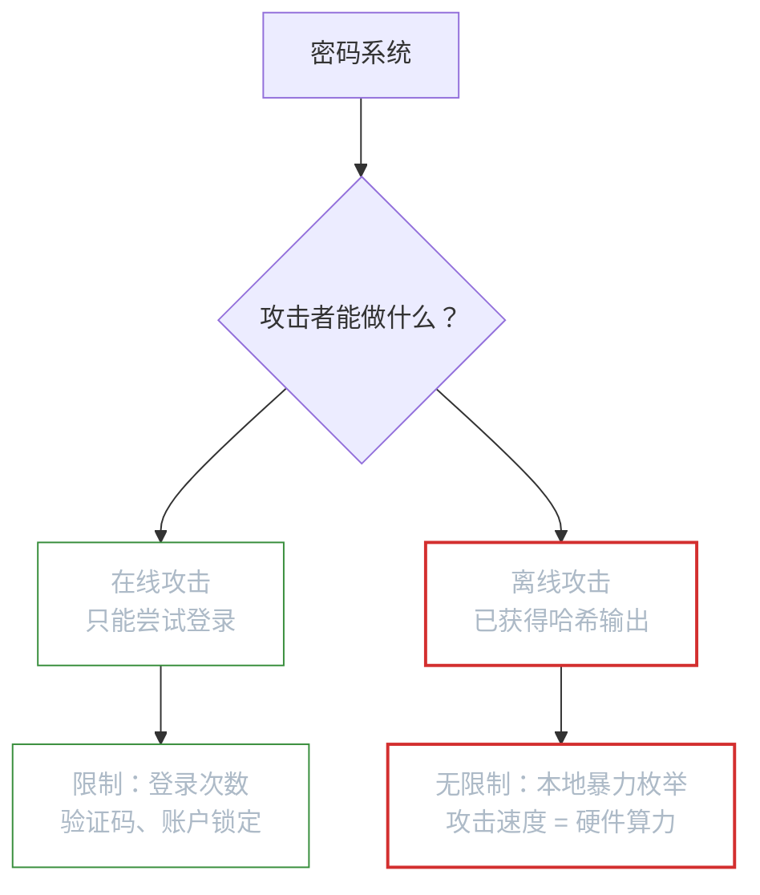
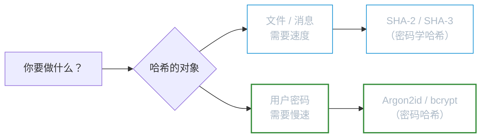
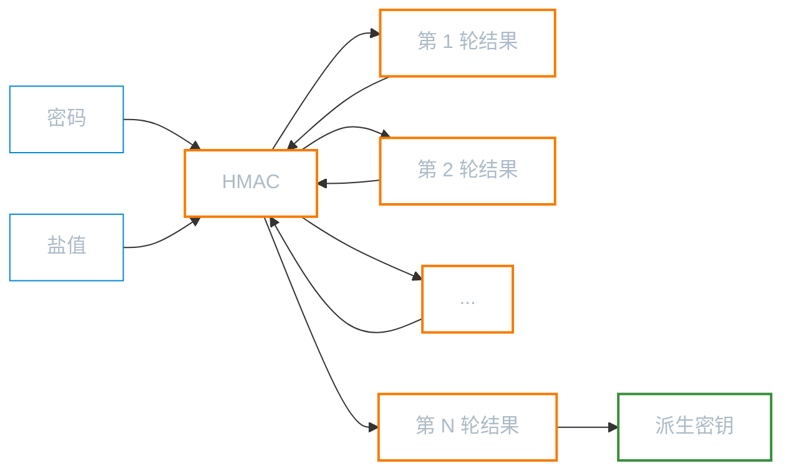
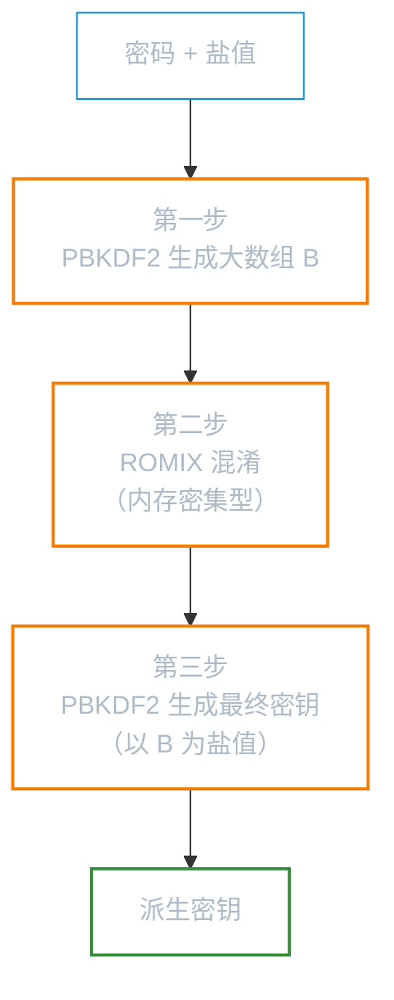
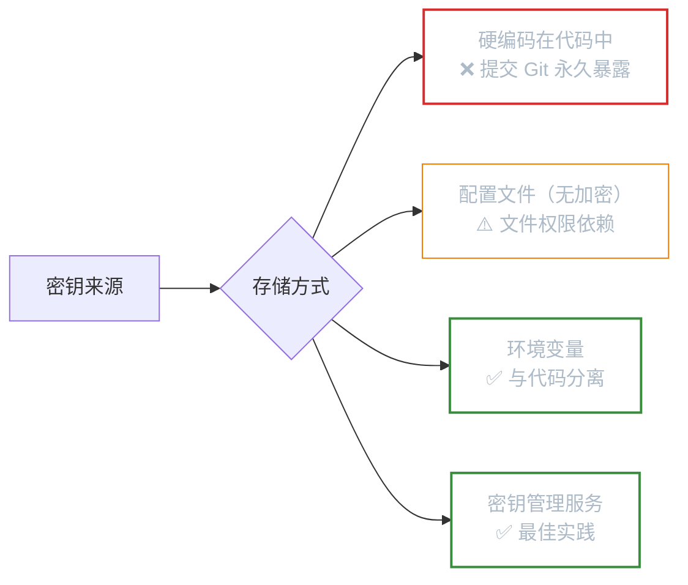

# 基于密码的密钥生成

**本文你会学到**：

- 为什么用户密码不能直接用作加密密钥
- PBKDF2 如何通过迭代哈希把"弱密码"变成"强密钥"
- SCRYPT 为什么比 PBKDF2 更抗 GPU 暴力破解
- Argon2、bcrypt 等其他密码哈希算法的特点
- 密钥分割（Shamir's Secret Sharing）如何将一个密钥安全地分给多人保管
- 密钥管理最佳实践：轮换策略、安全存储与安全销毁

## 🤔 为什么不能直接用密码做密钥？

你已经知道，对称加密需要一个高质量的密钥——比如 AES-256 要求 256 位的随机密钥。但现实中，用户输入的密码往往只有 8-12 个字符，大多来自英文字母 + 数字 + 少量符号的组合。

想象这样一个场景：你想用 AES 加密一个文件，让用户输入密码来保护。如果你直接把用户的密码当作 AES 密钥，会面临两个致命问题：

1. **密码太短**：8 个字符的英文密码最多只有约 52 bit 熵（小写字母 + 数字），远低于 AES-128 所需的 128 bit 安全强度
2. **密码可预测**：大多数人的密码来自常见词表（"password123"、"qwerty"），攻击者可以用字典攻击在几分钟内试遍所有常见密码

把密码直接当密钥，就像用纸糊的锁——看着像锁，一推就开。

密码和密钥是两个不同的概念：`密码（password）` 是给人记的，需要简短好记；`密钥（key）` 是给算法用的，需要足够长且随机。两者之间需要一座桥梁——这就是 `基于密码的密钥派生函数（Password-Based Key Derivation Function, PBKDF）`。

PBKDF 的核心思想很简单：**用一个可配置的计算过程，把任意长度的密码"拉伸"成固定长度的、看起来随机的密钥**。同时，通过增加计算成本，让攻击者每猜一次密码都要付出巨大代价。

### 密码熵与攻击模型

要把"密码太弱"这个问题讲清楚，需要先用一个量化工具来度量密码的不可预测性——`Shannon 熵`。

对于均匀分布的随机变量 X，其 Shannon 熵为：

$$H(X) = -\sum_{x} P(x) \log_2 P(x)$$

当所有取值等概率时，H(X) 就等于 $\log_2 |X|$（位）。比如 8 位随机字母（26 个小写字母），熵为 $8 \times \log_2 26 \approx 37.6$ bit。加上数字后（36 个字符），熵为 $8 \times \log_2 36 \approx 41.4$ bit。

但真实密码不是均匀随机分布的。人们倾向于使用常见单词、姓名、日期和简单变换。这意味着**实际熵远低于理论最大熵**。一个 8 字符的英文密码可能只有 20-30 bit 的实际熵——攻击者利用密码频率分布可以将搜索空间缩小几个数量级。

### 离线攻击 vs 在线攻击

密码系统面临的攻击分为两种本质不同的场景：



- **在线攻击**：攻击者每次猜测都需要和服务端交互——服务端可以限制尝试频率、加验证码、锁定账户。这种场景下，即使密码很弱，攻击者也很难成功
- **离线攻击**：这才是真正致命的场景。当攻击者拿到了哈希输出（比如数据库泄露、截获的密文），他可以在自己的机器上**无限制地**尝试猜测密码。此时攻击速度只取决于硬件算力，与服务端的防护无关

PBKDF 解决的就是离线攻击场景：通过增加每次猜测的计算成本，降低攻击者的尝试速率。

#### 熵放大：密钥派生的理论直觉

密钥派生的本质是一种 `熵放大`（entropy amplification）：用计算成本换取安全强度。

假设密码的实际熵为 λ bit（比如 λ = 30），攻击者需要平均尝试 $2^{\lambda-1}$ 次才能猜中。如果 PBKDF 每次评估需要 T 次哈希运算，那么攻击者的总计算量为 $2^{\lambda-1} \times T$。对于诚实用户来说，T 的代价只承受一次；对于攻击者来说，T 的代价要乘以 $2^{\lambda-1}$ 次。

这就是为什么迭代次数越高越安全——T 每增大 1000 倍，攻击者的总工作量就增大 1000 倍，而诚实用户只多等了几百毫秒。

⚠️ **关键认识**：PBKDF 不能增加密码本身的熵，它只是放大了攻击者的计算代价。如果密码熵太低（比如 λ < 20），即使迭代次数设得很高，GPU 集群仍然可能在可接受的时间内破解。

### 为什么不该直接哈希密码——彩虹表攻击

你可能已经注意到上一节提到"一次哈希计算太快了"，但还有一个更深层的问题：即使你用 `SHA-256` 哈希了密码，攻击者也不需要在线暴力破解——他可以**提前把所有常见密码的哈希值算好，存成一张巨大的表**，然后拿着泄露的数据库来"查表"。这就是 `彩虹表攻击`（Rainbow Table Attack）。

想象一个黑客提前制作了一本字典：左列是密码原文（"password123"、"qwerty"、"123456"……），右列是对应的 `SHA-256` 哈希值。拿到你的数据库后，只需查表，瞬间还原密码——不需要做任何计算。

#### 彩虹表的规模

以 8 位小写字母 + 数字组合为例：

- 字符集大小：36（a-z + 0-9）
- 可能密码数量：$36^8 \approx 28$ 亿
- 每条 `SHA-256` 记录 32 字节，总计约 90 GB

90 GB 对现代攻击者来说微不足道——这些表早已被预先计算并公开发布，使用压缩技术的真正彩虹表可压缩到几 GB。

### 盐值（Salt）如何破解彩虹表

解决方案出人意料地简单：给每个密码加一个**每用户独立的随机字节串**（`盐值`），再哈希：

```
hash = SHA-256(password ‖ salt)
```

因为每个用户的盐值不同，攻击者的彩虹表完全失效——他不可能为每种盐值都预先计算一张表。正如《Real-World Cryptography》第 2 章所述，盐值相当于"为每个用户创建一个不同的哈希函数实例"，使得攻击者无法用同一张预计算表同时攻击所有用户。

> 盐值不需要保密，但**必须唯一**。建议每用户生成 16–32 字节随机盐值，与哈希值一起存储。

⚠️ 即使加了盐值，普通哈希函数（`SHA-256`、`MD5`）对密码存储仍然不够——它们计算太快，GPU 每秒仍能尝试数十亿次。这就引出了下一个问题：我们需要**专门为密码设计的慢速哈希函数**。

### 密码哈希 vs 密码学哈希：两个截然不同的用途

这两个"哈希"在中文里看起来很像，但用途和设计目标完全不同——搞混它们会带来严重的安全漏洞。

| 特性 | 密码学哈希（`SHA-256` 等） | 密码哈希（`Argon2`、`bcrypt` 等） |
|------|--------------------------|----------------------------------|
| 设计目标 | **尽可能快**（文件校验、数字签名） | **尽可能慢**（抵御暴力破解） |
| 内存消耗 | 极小（几 KB） | 有意消耗大量内存（MB 级别） |
| 盐值 | 不内置，需手动处理 | 通常内置自动生成 |
| 输出格式 | 原始字节 | 自包含字符串（含盐值和参数） |
| 适用场景 | 文件完整性、数字签名、MAC | 用户密码存储、密钥派生 |

### 用错了会怎样？

- ❌ **用密码学哈希存储密码**：`SHA-256`("password") 在 GPU 上每秒能计算 100 亿次，几分钟内暴力破解常见密码
- ❌ **用密码哈希做文件校验**：`Argon2` 故意很慢，给 1 GB 文件做哈希可能需要等数分钟，完全不实用
- ✅ **正确用法**：密码存储 → `Argon2id`；文件完整性 → `SHA-256`；数字签名内部 → `SHA-2`/`SHA-3`



更多关于 `SHA-2`、`SHA-3` 的设计原理，见「散列函数与完整性保护」。

## 🔑 PBKDF2（PKCS#5 Scheme 2）

### PBKDF2 的工作原理

当你需要从密码生成密钥时，最直接的想法是对密码做一次哈希就行了。但一次哈希计算太快了——现代 GPU 每秒能做数十亿次 SHA-256 计算，攻击者可以轻松暴力枚举。

PBKDF2 的解决方案是**迭代**：对密码反复哈希 N 次。迭代次数越高，攻击者每猜一次密码的代价就越大。

PBKDF2 的输入有三个：

- **密码**：用户输入的保密信息（密钥熵的唯一来源）
- **盐值（salt）**：公开的随机字节串，用于防止彩虹表攻击
- **迭代次数**：公开的整数，控制计算成本

它的工作流程如下：



每一轮的计算都是 `HMAC(密码, 盐值 ‖ 上轮结果)`，第 N 轮的结果就是最终输出的密钥。即使攻击者预先计算了大量密码的哈希值（彩虹表），盐值的存在也会让这些预计算全部作废——因为每个用户的盐值都不同。

⚠️ **盐值不需要保密**，它只需要是唯一的。通常将盐值与密文一起存储。盐值的长度建议至少与底层哈希函数的输出长度相同（如 SHA-256 用 32 字节盐值）。

### 迭代次数怎么选？

迭代次数是安全性和性能之间的权衡：

| 年代 | 建议迭代次数 | 说明 |
|------|------------|------|
| 2000 年 | 1,000 | 当时觉得够用了 |
| 2020 年 | 10,000 | OWASP 最低推荐 |
| 当前 | 600,000+ | OWASP 2023 推荐 |

NIST SP 800-132 建议至少 10,000 次，但这个标准已经有些过时了。实际应用中应该根据硬件能力选择"用户等 0.5 秒觉得还行，但攻击者很痛苦"的值。

### PBKDF2 的安全性论证

PBKDF2 的安全性可以在 `随机预言模型`（Random Oracle Model, ROM）下进行形式化分析。我们先明确安全目标，再看为什么 PBKDF2 能达到这个目标。

#### 安全目标

PBKDF2 的安全目标可以形式化为：**对任何概率多项式时间（PPT）的攻击者 A，给定 PBKDF2 的输出和盐值，A 区分输出与真正随机串的优势可忽略**。

形式化地说，定义攻击者 A 的优势为：

$$\text{Adv}_{\text{PBKDF2}}^{\text{prf}}(A) = \left| \Pr\left[A^{\text{PBKDF2}(\cdot,\cdot)}(1^\lambda) = 1\right] - \Pr\left[A^{\mathcal{R}(\cdot,\cdot)}(1^\lambda) = 1\right] \right|$$

其中 $A^{F(\cdot,\cdot)}$ 表示攻击者 A 可以向函数 F 提交查询并获取响应，$1^\lambda$ 是安全参数。在实际场景中，攻击者已知盐值（公开），只能对固定盐值查询随机选择的密码输入——这更准确地对应 `弱 PRF`（weak PRF）安全目标。如果对于所有 PPT 攻击者 A，这个优势都是 $\text{negl}(\lambda)$，就说 PBKDF2 是一个 `伪随机函数`（PRF）。

#### 随机预言模型下的论证

PBKDF2 在 ROM 下的安全性论证分两步：

1. **底层 HMAC 是 PRF**：HMAC 在 ROM 下已被证明是 PRF（Bellare et al., 1996），即给定 HMAC 的输入输出，PPT 攻击者无法区分它与真随机函数
2. **迭代 PRF 仍然是 PRF**：PBKDF2 的本质是将 PRF 迭代 c 次——$U_1 = \text{PRF}(pwd, salt), U_i = \text{PRF}(pwd, U_{i-1})$。在 ROM 下，每次迭代的输出在攻击者看来都是均匀随机的，因此迭代 c 次后的输出仍然与真随机不可区分

直觉上，每次迭代都在"随机化"上一次的输出，就像反复洗牌——无论洗多少次，牌序看起来都是随机的。

#### 盐值的作用：形式化视角

从安全性证明的角度看，盐值解决了两个问题：

- **防止多目标攻击**：假设攻击者获得了 n 个用户的 PBKDF2 输出，如果没有盐值，攻击者可以尝试一个密码，同时对所有 n 个输出验证——即**摊薄攻击成本**。盐值使得每个用户的哈希函数实例不同，攻击者必须对每个用户单独尝试
- **保证 ROM 的实例独立性**：在 ROM 中，随机预言是全局的。盐值确保不同用户的密钥派生使用不同的预言"输入域"，防止跨实例的信息泄露

形式化地说，没有盐值时，攻击 n 个用户的总代价约 $2^\lambda$（攻击者猜对一个密码，所有用户同时验证）；有盐值时，总代价约 $n \times 2^\lambda$。

### 局限性：顺序成本 vs 并行成本

PBKDF2 的迭代结构保证了**顺序计算代价**——诚实用户必须串行执行 c 次 HMAC。但这个代价是**单维度的**：只消耗 CPU，不消耗内存。

攻击者可以用高度并行的硬件（GPU 有数千个核心，ASIC 可以定制电路）来同时尝试大量密码。即使每个实例都要串行迭代 c 次，攻击者同时运行 c 个并行实例的总体吞吐量仍然很高。

这种不对称性是 PBKDF2 的根本缺陷，也是 SCRYPT 和 Argon2 被设计出来的动机。

### 使用 JCE API 生成密钥

Java 提供了 `SecretKeyFactory` 来执行 PBKDF2。Bouncy Castle 作为 JCE Provider，支持指定底层哈希算法：

``` java title="使用 PBKDF2 生成 256 位密钥"
// 从 code/topic/cryptography/password-keys 模块提取
char[] password = "mypassword".toCharArray();
byte[] salt = "saltsalt".getBytes();
int iterations = 10000; // 迭代次数，越高越安全但越慢
int keyLength = 256;    // 输出密钥长度（位）

// 创建 PBEKeySpec，封装密码、盐值、迭代次数和密钥长度
PBEKeySpec spec = new PBEKeySpec(password, salt, iterations, keyLength);

// 通过 BC Provider 获取 SecretKeyFactory
SecretKeyFactory factory = SecretKeyFactory.getInstance(
    "PBKDF2WithHmacSHA256", "BC");
byte[] key = factory.generateSecret(spec).getEncoded();
// key.length == 32（256 位 = 32 字节）
```

算法名称 `PBKDF2WithHmacSHA256` 指定了 PBKDF2 使用 SHA-256 作为底层 HMAC 的哈希函数。早期 PBKDF2 默认使用 SHA-1，现在已经不推荐了。

💡 **密码使用 `char[]` 而不是 `String`**——因为 `char[]` 可以在用完后手动清零（`Arrays.fill(password, '\0')`），而 `String` 不可变，可能长期驻留在内存中。

### 使用 Bouncy Castle 低级 API

如果你不想走 JCE 路线，Bouncy Castle 的低级 API 同样支持 PBKDF2：

``` java title="使用 BC 低级 API 执行 PBKDF2"
PKCS5S2ParametersGenerator generator =
    new PKCS5S2ParametersGenerator(new SHA256Digest());

generator.init(
    PBEParametersGenerator.PKCS5PasswordToUTF8Bytes(password),
    salt,
    iterations);

byte[] key = ((KeyParameter) generator
    .generateDerivedParameters(256))
    .getKey();
```

构造函数传入的 `SHA256Digest` 决定了底层 HMAC 使用的哈希算法。`PKCS5PasswordToUTF8Bytes()` 负责将 `char[]` 转为 UTF-8 字节数组——这一点值得注意：不同 KDF 对密码编码的处理方式不同，有些会将字符当作 16 位处理，有些当作 7 位 ASCII，使用非 ASCII 字符时务必确认编码行为。

## 💪 SCRYPT

### 为什么需要 SCRYPT？

PBKDF2 解决了"计算太简单"的问题，但它只消耗 CPU。攻击者可以用 GPU 或定制 ASIC（专用集成电路）来并行计算大量 PBKDF2——单个 GPU 核心可能比 CPU 慢，但 GPU 上有几千个核心同时跑，总体上攻击速度反而比你的服务器快得多。

打个比方：PBKDF2 就像让攻击者做 10000 道数学题。他一个人做很慢，但如果他雇了 10000 个小学生（GPU 核心）同时做，10000 道题瞬间就做完了。

`SCRYPT`（由 Colin Percival 于 2009 年提出，2016 年标准化为 RFC 7914）的解决思路是：**不仅消耗 CPU，还强制消耗大量内存**。GPU 虽然核心多，但每个核心的可用内存有限，无法高效并行运行大量 SCRYPT 实例。

### 内存硬函数（Memory-Hard Function）

SCRYPT 的安全性基础是一个重要的理论概念——`内存硬函数`。要理解为什么 SCRYPT 能抵御 GPU/ASIC，需要先形式化地定义什么是"内存硬"。

#### 形式化定义

一个函数 f 是 `(T, S)-memory-hard` 的，如果**任何使用 ≤ S bit 内存的电路**计算 f 都需要至少 T 步。换句话说，想用更少的内存，就必须付出更多的时间，反之亦然。

内存硬函数分为两种（Alwen & Serbinenko, 2015）：

- **`顺序内存硬`**（sequentially memory-hard）：任何顺序算法（每步只能执行一次基本操作）计算 f 都至少需要 S bit 的内存
- **`计算内存硬`**（computationally memory-hard）：攻击者的 AT 成本（面积 × 时间，见下方）至少为 T × S，意味着无法同时用小面积和短时间完成计算

SCRYPT 的 ROMIX 函数是**顺序内存硬**的——它要求按伪随机顺序反复读取一个大数组，无法提前预知访问模式，也无法用少量内存和更多时间来替代。

#### AT 面积-时间成本模型

评估攻击者的硬件成本时，密码学理论使用 `AT 成本模型`（Area-Time cost）：

$$\text{Cost} = \text{Area} \times \text{Time}$$

- **Area**（面积）：攻击电路所需的硅片面积，大致正比于内存大小
- **Time**（时间）：计算所需的时间步数

这个模型的直觉是：芯片面积越小越便宜，运行时间越短越好。攻击者要最小化总成本 Area × Time。

对于 PBKDF2，攻击者的 AT 成本很低——因为不需要内存，Area 可以很小（单个 HMAC 单元），只需要增加 Time（更多并行核心）。而 SCRYPT 迫使攻击者要么：

- 为每个并行实例分配 S 字节内存 → Area 线性增长
- 或者用少量内存多次读外部存储 → Time 大幅增加

无论哪种方式，AT 成本都远高于 PBKDF2。

#### ROMIX 的顺序内存硬论证

SCRYPT 第二步的 ROMIX 函数通过以下机制实现顺序内存硬：

1. 首先顺序写入 N 个 128r 字节的块到内存中（填充阶段）
2. 然后对每个块，根据前一个块的伪随机值决定读取哪个块，将结果混入当前块（混合阶段）

混合阶段的关键：读取顺序取决于前一步的计算结果，攻击者**无法提前预知**整个访问序列。这意味着：

- 不能预先将数据分片到多个小内存中（访问模式不可预测）
- 不能用时间换空间（每个块被随机访问多次，重复计算代价太大）

⚠️ **理论注意**：SCRYPT 的内存硬度论证依赖于 `随机预言模型`，并且在实践中存在一些理论上的微妙问题（比如 Percival 原始论文中的论证并不完全严谨）。不过，这并不影响其在实际应用中的安全有效性——密码学界广泛认可 SCRYPT 的设计思路是正确的。

### SCRYPT 的三步流程

SCRYPT 的内部结构比 PBKDF2 复杂，分为三个步骤：



1. **第一步**：用 PBKDF2-HMAC-SHA256 反复哈希密码，生成一个大数组 B，每个块的大小为 128 × r 字节
2. **第二步**：对数组 B 的每个块执行 `ROMIX` 函数（基于 Salsa20/ChaCha20 核心函数），这就是"内存硬度"的来源——需要反复随机访问大数组中的数据
3. **第三步**：再次用 PBKDF2，这次以数组 B 作为盐值，生成最终密钥

关键在于第二步：`ROMIX` 需要在内存中保持整个数组 B，并且以伪随机顺序访问它。这使得缓存命中率极低，GPU 的高并行优势被内存带宽瓶颈抵消。

### 参数说明

SCRYPT 有三个关键参数：

| 参数 | 含义 | 内存消耗 | 建议值 |
|------|------|---------|-------|
| **N**（CPU/内存成本） | 决定 ROMIX 数组的迭代轮数 | ≈ 128 × N × r 字节 | 16384（2^14）或更高 |
| **r**（块大小） | 每个内存块的大小因子 | 与 N 成正比 | 8 |
| **p**（并行因子） | 并行执行的 SCRYPT 实例数 | ≈ p × 128 × N × r 字节 | 1 |

内存消耗公式为 `128 × N × r × p` 字节。例如 N=16384, r=8, p=1 时，需要约 16MB 内存。攻击者如果想用 GPU 并行跑 1000 个 SCRYPT，就需要 16GB 显存——这对大多数消费级 GPU 来说已经很勉强了。

### 使用 SCRYPT 生成密钥

在 Bouncy Castle 中，SCRYPT 可以通过 JCE 或低级 API 两种方式使用：

``` java title="使用 SCRYPT 生成密钥"
byte[] password = "mypassword".getBytes();
byte[] salt = "saltsalt".getBytes();

// 参数：N=1024（CPU/内存成本）, r=8（块大小）, p=1（并行因子）
byte[] key = SCrypt.generate(password, salt, 1024, 8, 1, 32);
// key.length == 32（256 位密钥）
```

JCE 方式则需要使用 Bouncy Castle 专有的 `ScryptKeySpec`：

``` java title="通过 JCE API 使用 SCRYPT"
SecretKeyFactory factory = SecretKeyFactory.getInstance("SCRYPT", "BC");

byte[] key = factory.generateSecret(
    new ScryptKeySpec(password, salt,
        1024,  // N
        8,     // r
        1,     // p
        256))  // 密钥长度（位）
    .getEncoded();
```

⚠️ 生产环境中，N 值至少应该设为 16384（2^14）。上面的 N=1024 仅用于演示。N 值必须为 2 的幂次方。

### PBKDF2 vs SCRYPT 对比

| 特性 | PBKDF2 | SCRYPT |
|------|--------|--------|
| 消耗资源 | 仅 CPU | CPU + 内存 |
| 抗 GPU 攻击 | 弱（GPU 可大规模并行） | 强（内存带宽瓶颈） |
| 抗 ASIC 攻击 | 弱 | 较强 |
| 计算速度 | 较快 | 较慢 |
| 标准化 | PKCS#5 / NIST SP 800-132 | RFC 7914 |
| 适用场景 | 兼容性要求高的系统 | 新系统、密码存储 |

## 🔧 其他 PBKDF

### Argon2：密码哈希的现代标准

2013–2015 年，密码学社区举办了一场"密码哈希竞赛"（Password Hashing Competition），目的是选出比 `PBKDF2` 和 `scrypt` 更安全的密码哈希算法。最终冠军是 `Argon2`——如《Real-World Cryptography》第 2 章所述，它是目前密码哈希的最佳选择（state-of-the-art）。

### 三种变体

`Argon2` 有三个变体，核心区别在于内存访问方式：

| 变体 | 内存访问方式 | 抗 GPU | 抗侧信道 | 推荐场景 |
|------|------------|--------|---------|---------|
| `Argon2d` | 数据依赖型访问 | ✅ 最强 | ❌ 易受侧信道 | 加密货币、无侧信道威胁场景 |
| `Argon2i` | 数据无关型访问 | ⚠️ 中等 | ✅ 最强 | 密码管理器、高侧信道风险场景 |
| `Argon2id` | 混合型（前半 2i，后半 2d） | ✅ 强 | ✅ 较强 | **通用密码存储（首选）** |

> 🎯 RFC 9106（2021 年正式发布）明确推荐：在不确定的情况下，**始终选择 `Argon2id`**。

### 内存硬度原理

与 `PBKDF2` 只消耗 CPU 不同，`Argon2` 强制消耗大量内存（`memory-hard`）。原理类似 `scrypt` 的 ROMIX，但设计更简洁：

1. 将整个工作内存分成若干 1 KB 大小的块（block）
2. 按伪随机顺序反复读写这些块（对 `Argon2id`：前半程按顺序，后半程按随机顺序）
3. 每次写入都依赖之前某个块的内容，形成数据依赖链

攻击者若想并行运行 1000 个 `Argon2id` 实例（内存参数 64 MB），需要 64 GB 显存——超过绝大多数高端 GPU 的显存上限。

### 三个参数

`Argon2` 通过三个维度控制计算成本：

| 参数 | 含义 | OWASP 2023 最低建议 |
|------|------|--------------------|
| `m`（内存，KiB） | 工作内存大小 | 19,456 KiB（≈19 MB） |
| `t`（迭代次数） | 算法执行轮数 | 2 |
| `p`（并行度） | 并行线程数 | 1 |

### Java Bouncy Castle 示例

Bouncy Castle 1.80+ 提供内部 API `Argon2BytesGenerator`（位于 `org.bouncycastle.crypto.generators`），尚未注册为标准 JCA Provider 接口：

``` java title="使用 Bouncy Castle 执行 Argon2id 密码哈希"
import org.bouncycastle.crypto.generators.Argon2BytesGenerator;
import org.bouncycastle.crypto.params.Argon2Parameters;
import java.security.SecureRandom;

// 1. 生成随机盐值（每个用户独立）
byte[] salt = new byte[16];
new SecureRandom().nextBytes(salt);

// 2. 构建 Argon2id 参数（RFC 9106 推荐配置）
Argon2Parameters params = new Argon2Parameters.Builder(
        Argon2Parameters.ARGON2_id)  // 变体：Argon2id
    .withSalt(salt)
    .withIterations(2)               // t：迭代次数
    .withMemoryAsKB(19456)           // m：内存（约 19 MB）
    .withParallelism(1)              // p：并行度
    .build();

// 3. 执行哈希，输出 32 字节（256 位）密钥
Argon2BytesGenerator generator = new Argon2BytesGenerator();
generator.init(params);

byte[] hash = new byte[32];
generator.generateBytes("myPassword".toCharArray(), hash);
// hash 即为存储的密码哈希，salt 需与 hash 一起存储
```

💡 生产环境也可使用 `de.mkammerer:argon2-jvm` 库，它封装了原生 Argon2 实现，性能更优且接口更简洁。

### bcrypt

`bcrypt` 是 1999 年由 Niels Provos 和 David Mazières 设计的经典密码哈希算法，广泛用于 Unix 系统和 Web 应用。它的特点：

- 基于 Blowfish 加密算法，内置盐值
- 通过 `cost factor`（成本因子）控制迭代次数，通常为 10-12
- 密码最大长度为 72 字节
- 自动截断超过 72 字节的输入，这一点需要注意

bcrypt 在实践中经过了 25 年的考验，至今仍然是密码存储的主流选择之一。不过相比 Argon2，它不支持显式调节内存消耗，抗 GPU/ASIC 能力不如 SCRYPT 和 Argon2。

### 算法选择建议

| 场景 | 推荐算法 | 原因 |
|------|---------|------|
| 新项目的密码存储 | Argon2id | 密码哈希竞赛冠军，三维度成本控制 |
| 需要兼容旧系统 | bcrypt | 经过长期实践验证，生态成熟 |
| 密钥派生（非密码存储） | PBKDF2-HMAC-SHA256 | 标准化程度高，JCE 原生支持 |
| 高安全要求的密钥派生 | SCRYPT | 内存硬度，抗硬件加速攻击 |
| Java KeyStore 内部使用 | PBKDF2 | JKS/PKCS12 标准内置 |

### 密钥拉伸：从口令到高质量密钥

`密钥拉伸`（Key Stretching）是 PBKDF 最重要的应用场景之一：将一个低熵的用户口令"拉伸"成满足加密算法要求的高质量密钥。

正如《Real-World Cryptography》第 8 章所述，`KDF`（Key Derivation Function）和 `PRNG` 虽然都能从一个秘密派生出更多秘密，但用途不同——KDF 专门处理"输入熵不够均匀"的场景，比如口令。

### PBKDF2 vs Argon2 密钥派生对比

| 特性 | `PBKDF2` | `Argon2id` |
|------|---------|-----------|
| 底层原语 | HMAC（可选 SHA-256/SHA-512） | Blake2b + 自定义混合 |
| 抗 GPU 并行 | ❌ 弱（纯 CPU，可大规模并行） | ✅ 强（内存硬，显存受限） |
| 参数灵活性 | 仅迭代次数 | 内存 + 迭代 + 并行三维调节 |
| 标准化状态 | PKCS#5 / NIST SP 800-132 | RFC 9106（2021） |
| 适合密钥派生 | ✅ 兼容性好，JCE 原生支持 | ✅ 安全性更高，推荐新项目 |

### 用 Argon2id 派生 AES 密钥

``` java title="从用户口令派生 AES-256 密钥（Argon2id）"
import org.bouncycastle.crypto.generators.Argon2BytesGenerator;
import org.bouncycastle.crypto.params.Argon2Parameters;
import javax.crypto.SecretKey;
import javax.crypto.spec.SecretKeySpec;
import java.security.SecureRandom;

// 1. 随机盐值（16 字节，每次派生独立生成，需与密文一起保存）
byte[] salt = new byte[16];
new SecureRandom().nextBytes(salt);

// 2. Argon2id 参数（适合密钥派生场景）
Argon2Parameters params = new Argon2Parameters.Builder(
        Argon2Parameters.ARGON2_id)
    .withSalt(salt)
    .withIterations(3)       // 迭代次数
    .withMemoryAsKB(65536)   // 64 MB 内存
    .withParallelism(4)      // 4 个并行线程
    .build();

// 3. 派生 32 字节密钥
byte[] keyBytes = new byte[32];
Argon2BytesGenerator gen = new Argon2BytesGenerator();
gen.init(params);
gen.generateBytes("userPassword".toCharArray(), keyBytes);

// 4. 封装为 AES 密钥
SecretKey aesKey = new SecretKeySpec(keyBytes, "AES");
// 使用完毕后清零
java.util.Arrays.fill(keyBytes, (byte) 0);
```

💡 与「随机性与密钥派生」中的 `HKDF` 不同——`HKDF` 适合从已有的高熵秘密（如 ECDH 输出）派生子密钥；`Argon2` / `PBKDF2` 适合从低熵口令起步。两者常配合使用：先 `Argon2` 把口令提升到高熵，再 `HKDF` 派生多个子密钥。

## ✂️ 密钥分割（Secret Sharing）

### 为什么需要密钥分割？

假设你的公司有一把加密私钥，用来签发所有客户的证书。如果这把密钥只交给一个人保管：

- 他离职了、生病了或出意外了 → 密钥丢失，业务瘫痪
- 他被收买了或账户被盗了 → 密钥泄露，客户受损

把密钥复制多份分给多人也不行——副本越多，泄露概率越高。

你需要的是一种机制：**把一个密钥拆成 N 份分给 N 个人，任意 K 个人联合就能恢复完整密钥，但少于 K 个人即使凑在一起也得不到任何有用信息**。这就是 `Shamir's Secret Sharing`（沙米尔密钥共享方案），由 Adi Shamir 于 1979 年提出。

银行金库就是现实中的类似场景：5 个高管各持一把不同的钥匙，至少 3 把同时插入才能打开金库。少了任何一把都不行，丢了 1-2 把也没关系。

### 工作原理

Shamir's Secret Sharing 基于多项式插值。核心思想出人意料地简单：

1. 选择一个足够大的素数 p（作为有限域）
2. 构造一个 K-1 次多项式 f(x)，其中 f(0) = 秘密值 S，其他系数随机生成
3. 计算每个持有者的份额：Si = f(i) mod p，其中 i 是持有者的编号
4. 恢复时，任意 K 个持有者用 `拉格朗日插值` 就能还原多项式，从而得到 f(0) = S

为什么 K-1 个份额无法恢复秘密？因为通过 K-1 个点只能确定一个 K-2 次多项式，而原多项式是 K-1 次的——K-2 次多项式的常数项（即 f(0)）和原多项式的常数项几乎肯定不同。

💡 把它想象成拼图：你有 5 块拼图碎片，需要 3 块才能看出完整的图案。2 块碎片只能拼出一小片，给你提供不了有用的信息。

### 信息论安全性：为什么 K-1 个份额"什么都不知道"

Shamir's Secret Sharing 有一个比"计算上安全"更强的性质——它是**信息论安全**（information-theoretically secure）的。

"计算安全"意味着攻击者有足够计算能力就能破解（比如 RSA 的安全性依赖于大数分解的难度）。但信息论安全意味着：**无论攻击者有多少计算能力，K-1 个份额都不会泄露关于秘密的任何信息**。

这可以从两个角度理解：

**直觉论证**：给定 K-1 个点，有无数个 K-1 次多项式可以通过这些点，且每个多项式有不同的常数项 f(0)。也就是说，秘密 S 可以是有限域中的**任何值**，且每个值出现的概率相同。既然所有可能的秘密都是等概率的，K-1 个份额就没有提供任何信息。

**形式化论证**：使用条件熵来表述。设秘密 S 在有限域上**均匀随机选取**，份额为 $(S_1, ..., S_{k-1})$，则：

$$H(S | S_1, S_2, ..., S_{k-1}) = H(S)$$

这意味着知道 K-1 个份额后，关于秘密 S 的不确定性完全没有减少。这个条件熵等式等价于：秘密 S 与任意 k-1 个份额**统计独立**，即 $P(S=s | S_1=s_1, ..., S_{k-1}=s_{k-1}) = P(S=s)$ 对所有可能的值成立。这就是"完美隐瞒"（perfect hiding）的精确定义。

对比其他密码学原语：数字签名的 EUF-CMA 安全是"计算安全"（依赖于离散对数问题的难度），而 Shamir 方案是"信息论安全"（不依赖任何计算假设）。这也是为什么密钥分割经常用于保护最高价值的密钥——比如 CA 根密钥。

### 简化的密钥分割示例

下面是一个基于 XOR 的简化密钥分割演示（2-of-3 方案）。虽然不是完整的 Shamir 方案（不能实现任意的 K-of-N），但能帮助理解核心思想：

``` java title="简化的 XOR 密钥分割（2-of-3）"
byte[] originalKey = new byte[16];
new SecureRandom().nextBytes(originalKey);

byte[] share1 = new byte[16];
byte[] share2 = new byte[16];
byte[] share3 = new byte[16];
new SecureRandom().nextBytes(share1); // 随机生成第一份

// 利用 XOR 特性：a XOR b = c → a XOR c = b
for (int i = 0; i < originalKey.length; i++) {
    share2[i] = (byte) (originalKey[i] ^ share1[i]);
    share3[i] = (byte) (originalKey[i] ^ share2[i]);
}

// 使用 share1 + share2 恢复密钥
byte[] recovered = new byte[16];
for (int i = 0; i < originalKey.length; i++) {
    recovered[i] = (byte) (share1[i] ^ share2[i]);
}
// recovered == originalKey ✅
```

这个简化方案的局限在于它只实现了 2-of-N，无法做到任意的 K-of-N 阈值。完整的 Shamir 方案需要构造 K-1 次多项式，再通过拉格朗日插值恢复——数学上不复杂，但实现代码较长。

### 应用场景

密钥分割在实际系统中有重要用途：

- **CA 根密钥保护**：证书颁发机构的根私钥是整个 PKI 信任链的根基，通常需要多名管理员同时在场才能使用
- **加密货币钱包**：多重签名和社交恢复的底层原理之一
- **数据库加密主密钥**：企业级数据库加密的主密钥通常由多个安全负责人分担

## 💡 密钥管理最佳实践

### 密钥轮换策略

无论密钥多么安全，长期使用同一个密钥都会增加被破解的风险。密钥轮换（Key Rotation）的核心原则：

- **对称加密密钥**：建议每 90 天轮换一次，或者每次加密会话使用新密钥
- **密钥加密密钥（KEK）**：轮换频率可以低一些（如每年），但必须轮换
- **一旦怀疑密钥泄露**：立即轮换所有相关密钥，不要等"确认"泄露后再行动

### 密钥存储安全

密钥生成出来后，怎么存放同样关键。几个基本规则：

1. **不要硬编码密钥**：代码提交到 Git 后，密钥就永远公开了
2. **使用 KeyStore**：Java 的 `KeyStore`（JKS/PKCS12/BCFKS）提供了密码保护的密钥存储，至少比裸文件安全
3. **密钥与数据分离**：密钥和加密数据不要存在同一个地方
4. **最小权限原则**：只有需要使用密钥的组件才能访问密钥

### 密钥存储的最佳实践

理解了"不能做什么"之后，再看"应该用什么"。按安全等级从高到低：

### 硬件安全模块（HSM）

`HSM`（Hardware Security Module）是专门用于密钥管理的硬件设备。密钥在 HSM 内部生成，**永远不会以明文形式离开 HSM**。所有加密操作（签名、加密）都在 HSM 内部执行，外部只能看到输出结果。

适用场景：CA 根密钥、支付系统私钥、代码签名密钥等极高价值密钥。

正如《Real-World Cryptography》第 8 章所述，HSM 提供了防提取保护——即使物理攻击也难以提取密钥。

### 操作系统密钥库（OS Keystore）

现代操作系统内置了密钥存储机制：

| 平台 | 密钥存储 | Java 访问方式 |
|------|---------|--------------|
| Windows | Windows Credential Store / CNG | `KeyStore.getInstance("Windows-MY")` |
| macOS | Keychain | `KeyStore.getInstance("KeychainStore")` |
| Linux | TPM / Secret Service | 第三方库 |
| Android | Android Keystore | `KeyStore.getInstance("AndroidKeyStore")` |
| 通用 | PKCS12 文件 | `KeyStore.getInstance("PKCS12")` |

OS 密钥库的优势是密钥与应用代码分离，且通常受到 OS 权限控制。

### 环境变量 vs 硬编码：明确的分界线



**云环境密钥管理服务**（如 AWS KMS、Azure Key Vault、GCP Cloud KMS）提供了更高级的委托管理——应用不持有密钥本身，只能请求服务执行特定的加密操作。这样即使应用被攻击，攻击者也无法直接提取密钥材料。

⚠️ 正如《Real-World Cryptography》第 8 章所警告的："没有银弹，即使使用了密钥管理服务，如果应用本身被攻击，攻击者仍然可以以应用的名义向服务发出任意请求"——所以还需要配合访问控制和异常检测。

### 密钥销毁

密钥生命周期不止"生成"和"使用"，还包括"销毁"。当密钥不再需要时：

- 清除内存中的密钥：对 `byte[]` 和 `char[]` 手动填充零值
- 删除磁盘上的密钥文件：使用安全擦除工具，而非简单的文件删除
- 撤销相关证书（如果密钥关联了数字证书）

⚠️ Java 的 `String` 是不可变对象，无法安全清除。这也是为什么密码输入应该使用 `char[]` 而非 `String` 的另一个原因。

### PBKDF 小结

| 算法 | 类型 | 安全性 | 速度 | 推荐场景 |
|------|------|--------|------|---------|
| PBKDF2 | CPU 密集型 | 中（抗暴力破解） | 较快 | 密钥派生、兼容性优先 |
| SCRYPT | CPU + 内存密集型 | 高（抗 GPU/ASIC） | 较慢 | 高安全密钥派生 |
| Argon2 | CPU + 内存 + 并行 | 最高（竞赛冠军） | 可调 | 新项目密码存储 |
| bcrypt | CPU 密集型 | 中高（经典验证） | 中 | 传统密码存储 |

选择算法时，最重要的原则是：**永远不要自己设计密码哈希方案**。使用经过密码学社区广泛审查的标准算法，正确设置参数，你就已经走在大多数人前面了。

## 📚 参考来源（本笔记增强部分）

- David Wong, *Real-World Cryptography* (Manning, 2021), Chapter 2 "Hash functions" & Chapter 8 "Randomness and secrets"
- 章节文本：会话工作区 `files/rwc-chapters/ch02.txt`、`ch08.txt`
- OWASP Password Storage Cheat Sheet (2023): https://cheatsheetseries.owasp.org/cheatsheets/Password_Storage_Cheat_Sheet.html
- RFC 9106 — Argon2 Memory-Hard Function for Password Hashing (2021): https://datatracker.ietf.org/doc/rfc9106/
- RFC 7914 — The scrypt Password-Based Key Derivation Function (2016): https://datatracker.ietf.org/doc/rfc7914/
