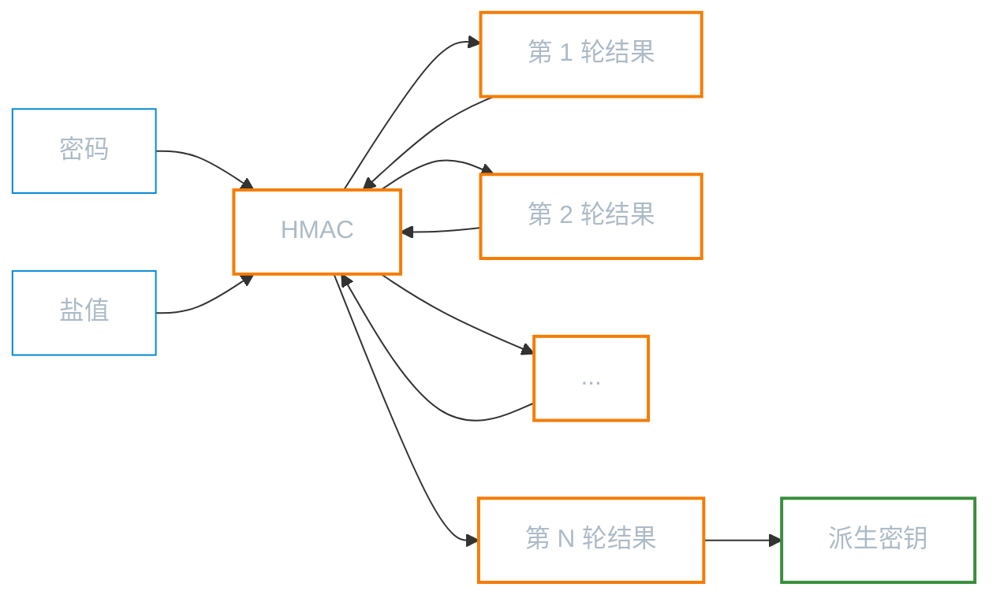
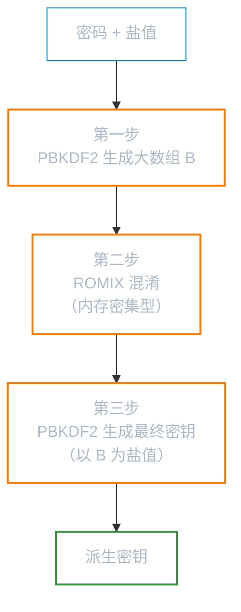

# 基于密码的密钥生成

**本文你会学到**：

- 为什么用户密码不能直接用作加密密钥
- PBKDF2 如何通过迭代哈希把"弱密码"变成"强密钥"
- SCRYPT 为什么比 PBKDF2 更抗 GPU 暴力破解
- Argon2、bcrypt 等其他密码哈希算法的特点
- 密钥分割（Shamir's Secret Sharing）如何将一个密钥安全地分给多人保管

## 为什么不能直接用密码做密钥？

你已经知道，对称加密需要一个高质量的密钥——比如 AES-256 要求 256 位的随机密钥。但现实中，用户输入的密码往往只有 8-12 个字符，大多来自英文字母 + 数字 + 少量符号的组合。

想象这样一个场景：你想用 AES 加密一个文件，让用户输入密码来保护。如果你直接把用户的密码当作 AES 密钥，会面临两个致命问题：

1. **密码太短**：8 个字符的英文密码最多只有约 52 bit 熵（小写字母 + 数字），远低于 AES-128 所需的 128 bit 安全强度
2. **密码可预测**：大多数人的密码来自常见词表（"password123"、"qwerty"），攻击者可以用字典攻击在几分钟内试遍所有常见密码

把密码直接当密钥，就像用纸糊的锁——看着像锁，一推就开。

密码和密钥是两个不同的概念：`密码（password）` 是给人记的，需要简短好记；`密钥（key）` 是给算法用的，需要足够长且随机。两者之间需要一座桥梁——这就是 `基于密码的密钥派生函数（Password-Based Key Derivation Function, PBKDF）`。

PBKDF 的核心思想很简单：**用一个可配置的计算过程，把任意长度的密码"拉伸"成固定长度的、看起来随机的密钥**。同时，通过增加计算成本，让攻击者每猜一次密码都要付出巨大代价。

## PBKDF2（PKCS#5 Scheme 2）

### PBKDF2 的工作原理

当你需要从密码生成密钥时，最直接的想法是对密码做一次哈希就行了。但一次哈希计算太快了——现代 GPU 每秒能做数十亿次 SHA-256 计算，攻击者可以轻松暴力枚举。

PBKDF2 的解决方案是**迭代**：对密码反复哈希 N 次。迭代次数越高，攻击者每猜一次密码的代价就越大。

PBKDF2 的输入有三个：

- **密码**：用户输入的保密信息（密钥熵的唯一来源）
- **盐值（salt）**：公开的随机字节串，用于防止彩虹表攻击
- **迭代次数**：公开的整数，控制计算成本

它的工作流程如下：



每一轮的计算都是 `HMAC(密码, 盐值 ‖ 上轮结果)`，第 N 轮的结果就是最终输出的密钥。即使攻击者预先计算了大量密码的哈希值（彩虹表），盐值的存在也会让这些预计算全部作废——因为每个用户的盐值都不同。

⚠️ **盐值不需要保密**，它只需要是唯一的。通常将盐值与密文一起存储。盐值的长度建议至少与底层哈希函数的输出长度相同（如 SHA-256 用 32 字节盐值）。

### 迭代次数怎么选？

迭代次数是安全性和性能之间的权衡：

| 年代 | 建议迭代次数 | 说明 |
|------|------------|------|
| 2000 年 | 1,000 | 当时觉得够用了 |
| 2020 年 | 10,000 | OWASP 最低推荐 |
| 当前 | 600,000+ | OWASP 2023 推荐 |

NIST SP 800-132 建议至少 10,000 次，但这个标准已经有些过时了。实际应用中应该根据硬件能力选择"用户等 0.5 秒觉得还行，但攻击者很痛苦"的值。

### 使用 JCE API 生成密钥

Java 提供了 `SecretKeyFactory` 来执行 PBKDF2。Bouncy Castle 作为 JCE Provider，支持指定底层哈希算法：

``` java title="使用 PBKDF2 生成 256 位密钥"
// 从 code/topic/cryptography/password-keys 模块提取
char[] password = "mypassword".toCharArray();
byte[] salt = "saltsalt".getBytes();
int iterations = 10000; // 迭代次数，越高越安全但越慢
int keyLength = 256;    // 输出密钥长度（位）

// 创建 PBEKeySpec，封装密码、盐值、迭代次数和密钥长度
PBEKeySpec spec = new PBEKeySpec(password, salt, iterations, keyLength);

// 通过 BC Provider 获取 SecretKeyFactory
SecretKeyFactory factory = SecretKeyFactory.getInstance(
    "PBKDF2WithHmacSHA256", "BC");
byte[] key = factory.generateSecret(spec).getEncoded();
// key.length == 32（256 位 = 32 字节）
```

算法名称 `PBKDF2WithHmacSHA256` 指定了 PBKDF2 使用 SHA-256 作为底层 HMAC 的哈希函数。早期 PBKDF2 默认使用 SHA-1，现在已经不推荐了。

💡 **密码使用 `char[]` 而不是 `String`**——因为 `char[]` 可以在用完后手动清零（`Arrays.fill(password, '\0')`），而 `String` 不可变，可能长期驻留在内存中。

### 使用 Bouncy Castle 低级 API

如果你不想走 JCE 路线，Bouncy Castle 的低级 API 同样支持 PBKDF2：

``` java title="使用 BC 低级 API 执行 PBKDF2"
PKCS5S2ParametersGenerator generator =
    new PKCS5S2ParametersGenerator(new SHA256Digest());

generator.init(
    PBEParametersGenerator.PKCS5PasswordToUTF8Bytes(password),
    salt,
    iterations);

byte[] key = ((KeyParameter) generator
    .generateDerivedParameters(256))
    .getKey();
```

构造函数传入的 `SHA256Digest` 决定了底层 HMAC 使用的哈希算法。`PKCS5PasswordToUTF8Bytes()` 负责将 `char[]` 转为 UTF-8 字节数组——这一点值得注意：不同 KDF 对密码编码的处理方式不同，有些会将字符当作 16 位处理，有些当作 7 位 ASCII，使用非 ASCII 字符时务必确认编码行为。

## SCRYPT

### 为什么需要 SCRYPT？

PBKDF2 解决了"计算太简单"的问题，但它只消耗 CPU。攻击者可以用 GPU 或定制 ASIC（专用集成电路）来并行计算大量 PBKDF2——单个 GPU 核心可能比 CPU 慢，但 GPU 上有几千个核心同时跑，总体上攻击速度反而比你的服务器快得多。

打个比方：PBKDF2 就像让攻击者做 10000 道数学题。他一个人做很慢，但如果他雇了 10000 个小学生（GPU 核心）同时做，10000 道题瞬间就做完了。

`SCRYPT`（由 Colin Percival 于 2009 年提出，2016 年标准化为 RFC 7914）的解决思路是：**不仅消耗 CPU，还强制消耗大量内存**。GPU 虽然核心多，但每个核心的可用内存有限，无法高效并行运行大量 SCRYPT 实例。

### SCRYPT 的三步流程

SCRYPT 的内部结构比 PBKDF2 复杂，分为三个步骤：



1. **第一步**：用 PBKDF2-HMAC-SHA256 反复哈希密码，生成一个大数组 B，每个块的大小为 128 × r 字节
2. **第二步**：对数组 B 的每个块执行 `ROMIX` 函数（基于 Salsa20/ChaCha20 核心函数），这就是"内存硬度"的来源——需要反复随机访问大数组中的数据
3. **第三步**：再次用 PBKDF2，这次以数组 B 作为盐值，生成最终密钥

关键在于第二步：`ROMIX` 需要在内存中保持整个数组 B，并且以伪随机顺序访问它。这使得缓存命中率极低，GPU 的高并行优势被内存带宽瓶颈抵消。

### 参数说明

SCRYPT 有三个关键参数：

| 参数 | 含义 | 内存消耗 | 建议值 |
|------|------|---------|-------|
| **N**（CPU/内存成本） | 决定 ROMIX 数组的迭代轮数 | ≈ 128 × N × r 字节 | 16384（2^14）或更高 |
| **r**（块大小） | 每个内存块的大小因子 | 与 N 成正比 | 8 |
| **p**（并行因子） | 并行执行的 SCRYPT 实例数 | ≈ p × 128 × N × r 字节 | 1 |

内存消耗公式为 `128 × N × r × p` 字节。例如 N=16384, r=8, p=1 时，需要约 16MB 内存。攻击者如果想用 GPU 并行跑 1000 个 SCRYPT，就需要 16GB 显存——这对大多数消费级 GPU 来说已经很勉强了。

### 使用 SCRYPT 生成密钥

在 Bouncy Castle 中，SCRYPT 可以通过 JCE 或低级 API 两种方式使用：

``` java title="使用 SCRYPT 生成密钥"
byte[] password = "mypassword".getBytes();
byte[] salt = "saltsalt".getBytes();

// 参数：N=1024（CPU/内存成本）, r=8（块大小）, p=1（并行因子）
byte[] key = SCrypt.generate(password, salt, 1024, 8, 1, 32);
// key.length == 32（256 位密钥）
```

JCE 方式则需要使用 Bouncy Castle 专有的 `ScryptKeySpec`：

``` java title="通过 JCE API 使用 SCRYPT"
SecretKeyFactory factory = SecretKeyFactory.getInstance("SCRYPT", "BC");

byte[] key = factory.generateSecret(
    new ScryptKeySpec(password, salt,
        1024,  // N
        8,     // r
        1,     // p
        256))  // 密钥长度（位）
    .getEncoded();
```

⚠️ 生产环境中，N 值至少应该设为 16384（2^14）。上面的 N=1024 仅用于演示。N 值必须为 2 的幂次方。

### PBKDF2 vs SCRYPT 对比

| 特性 | PBKDF2 | SCRYPT |
|------|--------|--------|
| 消耗资源 | 仅 CPU | CPU + 内存 |
| 抗 GPU 攻击 | 弱（GPU 可大规模并行） | 强（内存带宽瓶颈） |
| 抗 ASIC 攻击 | 弱 | 较强 |
| 计算速度 | 较快 | 较慢 |
| 标准化 | PKCS#5 / NIST SP 800-132 | RFC 7914 |
| 适用场景 | 兼容性要求高的系统 | 新系统、密码存储 |

## 其他 PBKDF

### Argon2

2013-2015 年，密码学社区举办了一场"密码哈希竞赛"（Password Hashing Competition），目的是选出比 PBKDF2 和 SCRYPT 更安全的密码哈希算法。最终冠军是 `Argon2`，它有三个变体：

- **Argon2d**：纯内存依赖，抗 GPU 最强，但易受侧信道攻击
- **Argon2i**：抗侧信道攻击，适合密码哈希存储
- **Argon2id**：混合模式，兼顾两者，是目前最推荐的选择

Argon2 的优势在于它同时控制三个维度：CPU 时间、内存用量、并行度，攻击者无论用 GPU 还是 ASIC 都很难找到高效的并行方案。

截至 Bouncy Castle 1.80（本文使用的版本），BC 尚未内置 Argon2 API，但可以通过 `bcprov-jdk18on` 的内部类间接使用，或使用专门的 Argon2 JVM 库（如 `de.mkammerer:argon2-jvm`）。

### bcrypt

`bcrypt` 是 1999 年由 Niels Provos 和 David Mazières 设计的经典密码哈希算法，广泛用于 Unix 系统和 Web 应用。它的特点：

- 基于 Blowfish 加密算法，内置盐值
- 通过 `cost factor`（成本因子）控制迭代次数，通常为 10-12
- 密码最大长度为 72 字节
- 自动截断超过 72 字节的输入，这一点需要注意

bcrypt 在实践中经过了 25 年的考验，至今仍然是密码存储的主流选择之一。不过相比 Argon2，它不支持显式调节内存消耗，抗 GPU/ASIC 能力不如 SCRYPT 和 Argon2。

### 算法选择建议

| 场景 | 推荐算法 | 原因 |
|------|---------|------|
| 新项目的密码存储 | Argon2id | 密码哈希竞赛冠军，三维度成本控制 |
| 需要兼容旧系统 | bcrypt | 经过长期实践验证，生态成熟 |
| 密钥派生（非密码存储） | PBKDF2-HMAC-SHA256 | 标准化程度高，JCE 原生支持 |
| 高安全要求的密钥派生 | SCRYPT | 内存硬度，抗硬件加速攻击 |
| Java KeyStore 内部使用 | PBKDF2 | JKS/PKCS12 标准内置 |

## 密钥分割（Secret Sharing）

### 为什么需要密钥分割？

假设你的公司有一把加密私钥，用来签发所有客户的证书。如果这把密钥只交给一个人保管：

- 他离职了、生病了或出意外了 → 密钥丢失，业务瘫痪
- 他被收买了或账户被盗了 → 密钥泄露，客户受损

把密钥复制多份分给多人也不行——副本越多，泄露概率越高。

你需要的是一种机制：**把一个密钥拆成 N 份分给 N 个人，任意 K 个人联合就能恢复完整密钥，但少于 K 个人即使凑在一起也得不到任何有用信息**。这就是 `Shamir's Secret Sharing`（沙米尔密钥共享方案），由 Adi Shamir 于 1979 年提出。

银行金库就是现实中的类似场景：5 个高管各持一把不同的钥匙，至少 3 把同时插入才能打开金库。少了任何一把都不行，丢了 1-2 把也没关系。

### 工作原理

Shamir's Secret Sharing 基于多项式插值。核心思想出人意料地简单：

1. 选择一个足够大的素数 p（作为有限域）
2. 构造一个 K-1 次多项式 f(x)，其中 f(0) = 秘密值 S，其他系数随机生成
3. 计算每个持有者的份额：Si = f(i) mod p，其中 i 是持有者的编号
4. 恢复时，任意 K 个持有者用 `拉格朗日插值` 就能还原多项式，从而得到 f(0) = S

为什么 K-1 个份额无法恢复秘密？因为通过 K-1 个点只能确定一个 K-2 次多项式，而原多项式是 K-1 次的——K-2 次多项式的常数项（即 f(0)）和原多项式的常数项几乎肯定不同。

💡 把它想象成拼图：你有 5 块拼图碎片，需要 3 块才能看出完整的图案。2 块碎片只能拼出一小片，给你提供不了有用的信息。

### 简化的密钥分割示例

下面是一个基于 XOR 的简化密钥分割演示（2-of-3 方案）。虽然不是完整的 Shamir 方案（不能实现任意的 K-of-N），但能帮助理解核心思想：

``` java title="简化的 XOR 密钥分割（2-of-3）"
byte[] originalKey = new byte[16];
new SecureRandom().nextBytes(originalKey);

byte[] share1 = new byte[16];
byte[] share2 = new byte[16];
byte[] share3 = new byte[16];
new SecureRandom().nextBytes(share1); // 随机生成第一份

// 利用 XOR 特性：a XOR b = c → a XOR c = b
for (int i = 0; i < originalKey.length; i++) {
    share2[i] = (byte) (originalKey[i] ^ share1[i]);
    share3[i] = (byte) (originalKey[i] ^ share2[i]);
}

// 使用 share1 + share2 恢复密钥
byte[] recovered = new byte[16];
for (int i = 0; i < originalKey.length; i++) {
    recovered[i] = (byte) (share1[i] ^ share2[i]);
}
// recovered == originalKey ✅
```

这个简化方案的局限在于它只实现了 2-of-N，无法做到任意的 K-of-N 阈值。完整的 Shamir 方案需要构造 K-1 次多项式，再通过拉格朗日插值恢复——数学上不复杂，但实现代码较长。

### 应用场景

密钥分割在实际系统中有重要用途：

- **CA 根密钥保护**：证书颁发机构的根私钥是整个 PKI 信任链的根基，通常需要多名管理员同时在场才能使用
- **加密货币钱包**：多重签名和社交恢复的底层原理之一
- **数据库加密主密钥**：企业级数据库加密的主密钥通常由多个安全负责人分担

## 密钥管理最佳实践

### 密钥轮换策略

无论密钥多么安全，长期使用同一个密钥都会增加被破解的风险。密钥轮换（Key Rotation）的核心原则：

- **对称加密密钥**：建议每 90 天轮换一次，或者每次加密会话使用新密钥
- **密钥加密密钥（KEK）**：轮换频率可以低一些（如每年），但必须轮换
- **一旦怀疑密钥泄露**：立即轮换所有相关密钥，不要等"确认"泄露后再行动

### 密钥存储安全

密钥生成出来后，怎么存放同样关键。几个基本规则：

1. **不要硬编码密钥**：代码提交到 Git 后，密钥就永远公开了
2. **使用 KeyStore**：Java 的 `KeyStore`（JKS/PKCS12/BCFKS）提供了密码保护的密钥存储，至少比裸文件安全
3. **密钥与数据分离**：密钥和加密数据不要存在同一个地方
4. **最小权限原则**：只有需要使用密钥的组件才能访问密钥

### 密钥销毁

密钥生命周期不止"生成"和"使用"，还包括"销毁"。当密钥不再需要时：

- 清除内存中的密钥：对 `byte[]` 和 `char[]` 手动填充零值
- 删除磁盘上的密钥文件：使用安全擦除工具，而非简单的文件删除
- 撤销相关证书（如果密钥关联了数字证书）

⚠️ Java 的 `String` 是不可变对象，无法安全清除。这也是为什么密码输入应该使用 `char[]` 而非 `String` 的另一个原因。

### PBKDF 小结

| 算法 | 类型 | 安全性 | 速度 | 推荐场景 |
|------|------|--------|------|---------|
| PBKDF2 | CPU 密集型 | 中（抗暴力破解） | 较快 | 密钥派生、兼容性优先 |
| SCRYPT | CPU + 内存密集型 | 高（抗 GPU/ASIC） | 较慢 | 高安全密钥派生 |
| Argon2 | CPU + 内存 + 并行 | 最高（竞赛冠军） | 可调 | 新项目密码存储 |
| bcrypt | CPU 密集型 | 中高（经典验证） | 中 | 传统密码存储 |

选择算法时，最重要的原则是：**永远不要自己设计密码哈希方案**。使用经过密码学社区广泛审查的标准算法，正确设置参数，你就已经走在大多数人前面了。
