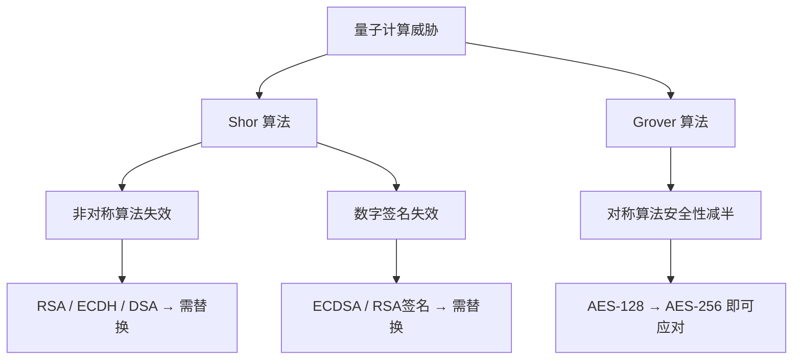
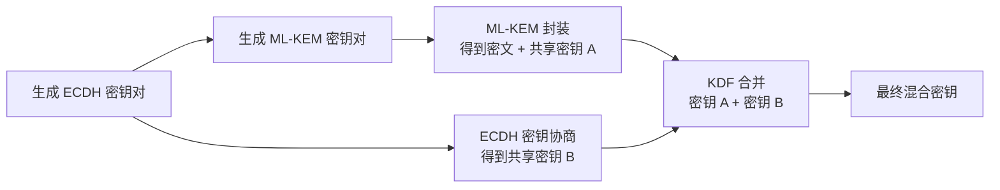

# 后量子密码

**本文你会学到**：

- 量子计算机为什么能威胁现有的加密体系？Shor 算法和 Grover 算法分别影响哪些算法
- NIST 后量子标准化选出了哪些算法？ML-KEM 和 ML-DSA 的核心原理
- 如何使用 BouncyCastle 实现 ML-KEM 密钥封装和 ML-DSA 数字签名
- 混合加密为什么是当前过渡期的最佳实践？如何用 ECDH + ML-KEM 组合
- 如何制定后量子密码迁移路线：优先级排序与 Java 开发者行动清单
- 迁移到后量子密码时有哪些常见陷阱需要避免

## 🤔 为什么需要后量子密码？

### 量子计算机的威胁

你平时用的 HTTPS、TLS、数字证书，底层依赖的大多是 RSA、ECDH、ECDSA 这类非对称算法。它们的安全性建立在一个核心假设上：**大数分解和离散对数问题在经典计算机上几乎不可能解决**。

但量子计算机完全改变了这个假设。

1994 年，Peter Shor 提出了 Shor 算法——一个能在多项式时间内解决大数分解和离散对数问题的量子算法。这意味着，一旦足够大的量子计算机出现，**RSA、ECDH、ECDSA 等非对称加密算法将彻底不安全**。攻击者可以用 Shor 算法从公钥推算出私钥，从而解密所有通信内容。

💡 用一个类比来理解：经典计算机是"逐个尝试锁的齿形"，量子计算机是"同时试所有齿形"——这就是量子叠加态的威力。Shor 算法让量子计算机找到了一种"聪明的同时尝试"方式，把破解难度从"宇宙年龄级"降到了"几小时级"。

### Shor 算法与 Grover 算法

量子计算对密码学的影响主要来自两个算法：

| 算法 | 影响 | 受影响算法 | 对策 |
|------|------|-----------|------|
| **Shor 算法** | 大数分解、离散对数 → 多项式时间 | RSA、ECDH、ECDSA、DSA | 替换为后量子算法 |
| **Grover 算法** | 暴力搜索 → 平方级加速 | AES、SHA-256、ChaCha20 | **密钥/哈希长度翻倍** |

关键区别在于：**Shor 算法是毁灭性的**，它直接破解非对称算法的数学基础；而 **Grover 算法只是加速了暴力搜索**，对策很简单——把 AES-128 升级到 AES-256 就能抵消 Grover 算法的影响。

### Shor 算法：量子计算机为什么能破 RSA/ECC

光说"Shor 算法能破 RSA"还不够——理解它**为什么**能破，才能真正体会后量子密码的紧迫性。

**核心洞察：找周期**

RSA 和 ECC 的安全性可以被规约为一个"寻找周期"的数学问题。以 RSA 的大数分解为例，存在一个函数 `f(x) = g^x mod N`，它是**周期性的**——对所有 `x` 满足 `f(x + period) = f(x)`。找到这个 `period` 就能分解 N、破解 RSA。

经典计算机找这个周期需要**指数级时间**（随密钥位数指数增长）；Shor 在 1994 年发现，量子计算机可以利用**量子傅里叶变换（QFT）**在**多项式时间**内完成——问题难度从"宇宙年龄级"降到"几小时级"。

💡 **类比**：找歌曲节奏的周期。经典计算机逐拍试算，要测试几万亿种可能；量子计算机利用叠加态同时"监听"所有节奏，再用 QFT 精准"提取"出答案——像收音机调频一样，一下子锁定正确频率。

**为什么不能靠增大密钥解决？**

你可能想：把 RSA 从 2048 位升到 8192 位不就行了？2017 年，Bernstein 等人的研究给出了确切答案：**要让 RSA 真正抵抗 Shor 算法，密钥参数需要大到约 1 TB（1 万亿字节）**——密钥文件本身就有 1 TB，完全不可行。ECC 同理。这就是非对称算法只能彻底替换、无法升级的根本原因。

> 引自 *Real-World Cryptography* ch.14：Shor 算法彻底粉碎了当今已部署公钥密码学的基础——RSA 和基于有限域/椭圆曲线的离散对数问题。

**足够大的量子计算机何时到来？**

| 里程碑 | 时间 | 细节 |
|--------|------|------|
| Shor 算法提出 | 1994 | 理论层面破解 RSA/ECC |
| 量子优越性（Supremacy） | 2019 | Google 53 量子比特，53 量子比特，完成特定计算 |
| IBM Condor | 2023 | 1,121 物理量子比特（仍无实用纠错） |
| 破解 RSA-2048 估计所需 | 2030s–2050s | 需要数百万**容错**量子比特 |

专家预测分歧巨大——Michele Mosca（量子计算研究所）估计"2026 年有 1/7 概率、2031 年有 1/2 概率破解 RSA-2048"；另一些物理学家认为可扩展量子计算机"永远不会实现"。不管哪种判断，**"先收集，后破解"攻击**让"现在就开始迁移"成为合理选择（见下节）。

### "先收集，后破解"攻击

你可能觉得量子计算机还很遥远，但有一个威胁已经迫在眉睫。攻击者今天就可以截获并存储加密通信数据，等未来量子计算机成熟后再解密。这种攻击叫做 **"先收集，后破解"（Harvest Now, Decrypt Later）**。

这意味着：即使你的数据只需要保密 5 年，但如果 5 年后量子计算机就能破解当前算法，那你现在用的加密就已经不安全了。政府机构、金融系统、医疗数据——这些需要长期保密的场景，必须**现在就开始迁移**。

⚠️ 特别是 TLS 握手中交换的对称密钥——如果握手使用的是 RSA 或 ECDH，攻击者存下握手报文，将来用 Shor 算法恢复出对称密钥，就能解密整个会话。

### 对密码学体系的影响总结



结论很明确：**对称加密和哈希只需简单升级密钥长度**，但**非对称加密和数字签名需要全新的算法**——这就是后量子密码学（Post-Quantum Cryptography, PQC）要解决的问题。

## 🏛️ NIST 后量子标准化

### 标准化历程

2016 年，NIST（美国国家标准与技术研究院）启动了后量子密码标准化项目，面向全球征集能抵抗量子攻击的加密算法。经过多轮筛选和评估，2024 年正式发布了首批标准：

| 标准编号 | 算法 | 类型 | 原名 | 基于的数学问题 |
|---------|------|------|------|--------------|
| **FIPS 203** | **ML-KEM** | 密钥封装 | CRYSTALS-Kyber | 模格（Module Lattice） |
| **FIPS 204** | **ML-DSA** | 数字签名 | CRYSTALS-Dilithium | 模格（Module Lattice） |
| **FIPS 205** | **SLH-DSA** | 数字签名 | SPHINCS+ | 哈希（Hash-based） |

此外，**FN-DSA**（原 Falcon）已作为 FIPS 206 于 2024 年 8 月正式发布，成为第四个后量子标准。

### NIST 后量子标准化进程（2016-2024）

NIST 的后量子密码标准化是迄今规模最大、历时最长的密码算法公开竞选，历时约 8 年、历经四轮筛选：

| 阶段 | 时间 | 候选数量 | 说明 |
|------|------|---------|------|
| **征集公告** | 2016 | — | 面向全球征集抗量子候选算法 |
| **第一轮** | 2017-2019 | 82 个有效候选 | 涵盖格、哈希、编码、多变量、同源等范式 |
| **第二轮** | 2019-2020 | 26 个候选 | 综合评估安全性、性能、密钥大小 |
| **第三轮** | 2020-2022 | 7 个决赛 + 8 个备选 | 密集密码分析，多个候选被攻破 |
| **初始选定** | 2022 | 4 个入围 | Kyber、Dilithium、Falcon、SPHINCS+ |
| **正式标准** | 2024 | FIPS 203/204/205/206 | 最终发布，结束 8 年标准化历程 |

**各密码学范式的命运**：

- ✅ **基于格（Lattice-based）**：ML-KEM（Kyber）、ML-DSA（Dilithium）、FN-DSA（Falcon）全部入选，成为主力方案
- ✅ **基于哈希（Hash-based）**：SLH-DSA（SPHINCS+）入选，安全性最保守，签名体积最大（~8 KB）
- ⚠️ **基于编码（Code-based）**：Classic McEliece 入选备选，公钥极大（~1 MB）；HQC 进入第四轮补充评估
- ❌ **基于多变量（Multivariate）**：RAINBOW 于 2022 年被 Ward Beullens **在一台普通笔记本电脑上用不到一天**破解，已淘汰
- ❌ **基于同源（Isogeny-based）**：SIKE 于 2022 年被 Castryck 和 Decru **用一台笔记本电脑花约 1 小时**完全破解，已淘汰

⚠️ SIKE 和 RAINBOW 的相继被破是重要警示：**新算法即使经过多轮严格评审，仍可能存在未被发现的破解方法**。这正是 NIST 同时保留多种算法范式（格 + 哈希 + 编码）作为冗余的原因。

NIST 正进行第四轮补充评估（重点为 HQC），目标是确保若格密码出现系统性弱点，仍有可靠备选。

### 为什么选了"格"？

你可能好奇为什么 NIST 最终选择了基于格的算法作为主力。核心原因是**综合平衡**：

- ✅ 密钥和密文大小适中（不像 Classic McEliece 的公钥动辄几百 KB）
- ✅ 计算速度足够快（不像某些哈希签名那样慢）
- ✅ 安全性经过充分研究（格问题已研究了 20 多年）
- ✅ 无状态（不像 XMSS/LMS 那样需要管理签名计数器）

💡 可以把"格问题"理解为：在一个高维网格中找到离原点最近的点。经典计算机和量子计算机都不知道高效方法——这和 RSA 依赖大数分解不同，格问题对量子计算机同样困难。

### 格密码入门：为什么 Kyber/Dilithium 难破解

"格密码"这个名字听起来神秘，但核心思想可以用一个小学生都能理解的类比来解释。

**从线性方程组到 LWE**

你肯定做过这样的联立方程：

```
5·s₀ + 2·s₁ = 27
2·s₀ + 0·s₁ = 6
```

用高斯消元，秒得 `s₀=3, s₁=6`。这是"干净"的线性方程——无噪声，秒解。

现在，如果方程的答案被加上了小随机噪声（David Wong 在 *Real-World Cryptography* ch.14 用的正是这个例子）：

```
5·s₀ + 2·s₁ = 28   ← 正确答案 27，加了 +1 的噪声
2·s₀ + 0·s₁ = 5    ← 正确答案 6，加了 -1 的噪声
```

2 个变量、2 个方程，聪明的人还能猜出来。但如果有**几百个变量**（`s₀, s₁, ..., s₅₁₁`）和**成千上万个加了噪声的方程**，找出真实的 `s` 就会变得极其困难——这就是 **LWE（Learning With Errors，带错误学习问题）**，由 Oded Regev 于 2005 年提出。

💡 **类比**：LWE 是"加了高斯噪声的地图"。经典线性方程是精确地图，你能一步步推导到终点；LWE 是每个路标都有随机偏差的地图——偏差很小，地图整体结构还在，但在高维空间中精确导航几乎不可能。维度越高，噪声越多，问题越难。

**为什么量子计算机也不行？**

Shor 算法之所以能破 RSA，是因为 RSA 底层存在**代数周期结构**（`f(x+period)=f(x)`），量子傅里叶变换可以高效提取这个周期。

但 LWE **没有可利用的周期结构**——它的困难性来自高维格空间中的几何问题（SVP 最短向量问题、CVP 最近向量问题），经过严格数学证明，量子计算机对 LWE 的加速效果微乎其微。

**从 LWE 到 ML-KEM / ML-DSA**

实际的 `Kyber` 和 `Dilithium` 使用的是 **MLWE（Module-LWE，模格带错误学习）**——把 LWE 中的整数换成多项式环中的元素，既保留了 LWE 的安全性，又利用了环的代数结构（配合 NTT 数论变换）实现快速运算、紧凑的密钥尺寸：

| 算法 | 底层难题 | 公钥构造 | 安全归约 |
|------|---------|---------|---------|
| `ML-KEM`（Kyber） | MLWE | `t = As + e`（加噪声的矩阵乘法） | 破解 → 解决 SVP |
| `ML-DSA`（Dilithium） | MLWE | 同上 + 签名用 ZK 证明 + Fiat-Shamir 变换 | 破解 → 解决 SVP |

简而言之：**攻击 Kyber 或 Dilithium，就需要在几百维的格空间中找到"最近的点"——这对经典计算机和量子计算机都是公认难题。**

## 🔮 ML-KEM：后量子密钥封装

### 什么是 KEM？

当你用 ECDH 做密钥交换时，双方各生成一个临时密钥对，交换公钥后各自计算出相同的共享密钥。这个过程需要双方**同时在线**交互。

但很多场景下，你希望像加密一样：**一方生成密文，另一方收到后解密出共享密钥**。这就是 **KEM（Key Encapsulation Mechanism，密钥封装机制）** 的核心思想：

- **封装（encapsulate）**：用接收方的公钥生成密文 + 共享密钥
- **解封装（decapsulate）**：用私钥从密文恢复共享密钥

💡 KEM 像是一个"信封"——你把共享密钥装进信封（密文），只有持有私钥的接收方才能打开信封取出密钥。和 ECDH 的区别在于：ECDH 需要双方同时参与，KEM 只需要一方操作。

### 密钥生成与封装/解封装

来看一个完整的 ML-KEM 流程。BouncyCastle 提供了两种 API：标准 JCA 和底层 API。我们用底层 API 演示，因为它能直接访问共享密钥，更清晰地展示原理。

``` java title="ML-KEM-1024 完整封装/解封装流程"
// 1. 生成密钥对
MLKEMKeyPairGenerator kpg = new MLKEMKeyPairGenerator();
kpg.init(new MLKEMKeyGenerationParameters(RANDOM, MLKEMParameters.ml_kem_1024));
AsymmetricCipherKeyPair keyPair = kpg.generateKeyPair();

MLKEMPublicKeyParameters pubKey = (MLKEMPublicKeyParameters) keyPair.getPublic();
MLKEMPrivateKeyParameters privKey = (MLKEMPrivateKeyParameters) keyPair.getPrivate();

// 2. 封装：用公钥生成密文和共享密钥
MLKEMGenerator generator = new MLKEMGenerator(RANDOM);
SecretWithEncapsulation encResult = generator.generateEncapsulated(pubKey);
byte[] ciphertext = encResult.getEncapsulation();  // 密文（发送给对方）
byte[] sharedSecretAlice = encResult.getSecret();  // Alice 的共享密钥

// 3. 解封装：用私钥从密文恢复共享密钥
MLKEMExtractor extractor = new MLKEMExtractor(privKey);
byte[] sharedSecretBob = extractor.extractSecret(ciphertext);  // Bob 的共享密钥

// 4. 验证双方共享密钥一致
assertArrayEquals(sharedSecretAlice, sharedSecretBob);
```

这个流程和 ECDH 的关键区别在于：**只有一方需要持有私钥**（接收方），发送方只需要接收方的公钥就能完成封装。这让它特别适合非交互场景（比如邮件加密）。

### 三种安全等级对比

ML-KEM 提供三种参数集，对应不同的 NIST 安全等级：

| 算法 | NIST 等级 | 公钥 | 私钥 | 密文 | 共享密钥 |
|------|---------|------|------|------|---------|
| ML-KEM-512 | 1（≈ AES-128） | 800 B | 1,584 B | 768 B | 32 B |
| ML-KEM-768 | 3（≈ AES-192） | 1,184 B | 2,400 B | 1,088 B | 32 B |
| ML-KEM-1024 | 5（≈ AES-256） | 1,568 B | 3,168 B | 1,568 B | 32 B |

对比一下你熟悉的老算法：RSA-2048 的公钥只有 256 字节，但 ML-KEM-512 的公钥就有 800 字节——**后量子算法的公钥和密文普遍更大**。这是为量子安全性付出的代价。

⚠️ **ML-KEM 的一个重要特性**：解封装时如果密文被篡改，它**不会抛出异常**，而是返回一个不同的共享密钥。这是设计上的有意选择——避免通过异常信息泄露密文是否合法。

``` java title="错误密文导致不同的共享密钥"
MLKEMExtractor extractor = new MLKEMExtractor(privKey);
byte[] fakeCiphertext = new byte[extractor.getEncapsulationLength()];
RANDOM.nextBytes(fakeCiphertext);

// 不会抛异常，但返回的共享密钥与正确密文完全不同
byte[] wrongSecret = extractor.extractSecret(fakeCiphertext);
assertNotEquals(HEX.formatHex(correctSecret), HEX.formatHex(wrongSecret));
```

## ✍️ ML-DSA：后量子数字签名

### 签名与验签

ML-DSA（Module-Lattice-Based Digital Signature Algorithm）是后量子数字签名算法，原名为 CRYSTALS-Dilithium。和 RSA/ECDSA 一样，它的使用方式非常简单——生成密钥对、签名、验签。

好消息是：**BouncyCastle 1.80 之后，ML-DSA 注册在标准 BC Provider 中**，可以直接用 JCA 的 `Signature` 接口操作，用法和 ECDSA 完全一样。

``` java title="ML-DSA-65 完整签名/验签流程"
byte[] message = "Hello, Post-Quantum World!".getBytes();

// 1. 生成 ML-DSA-65 密钥对（使用标准 JCA 接口）
KeyPairGenerator kpg = KeyPairGenerator.getInstance("ML-DSA-65", "BC");
KeyPair keyPair = kpg.generateKeyPair();

// 2. 用私钥签名
Signature signer = Signature.getInstance("ML-DSA-65", "BC");
signer.initSign(keyPair.getPrivate());
signer.update(message);
byte[] signature = signer.sign();  // 约 3,309 字节

// 3. 用公钥验证签名
Signature verifier = Signature.getInstance("ML-DSA-65", "BC");
verifier.initVerify(keyPair.getPublic());
verifier.update(message);
boolean verified = verifier.verify(signature);  // true
```

如果消息被篡改，验签会失败：

``` java title="篡改消息后签名验证失败"
verifier.initVerify(keyPair.getPublic());
verifier.update("Tampered message!".getBytes());
boolean verified = verifier.verify(signature);  // false
```

🎯 **迁移友好性**：注意看上面的代码——除了算法名从 `"ECDSA"` 换成了 `"ML-DSA-65"`，其余 API 调用完全一样。这正是 JCA 抽象层的价值：算法替换对业务代码透明。

### 三种安全等级对比

ML-DSA 同样提供三种参数集：

| 算法 | NIST 等级 | 公钥 | 私钥 | 签名 |
|------|---------|------|------|------|
| ML-DSA-44 | 2（≈ SHA-256） | 1,312 B | 2,576 B | 2,420 B |
| ML-DSA-65 | 3（≈ SHA-384） | 1,952 B | 4,000 B | 3,309 B |
| ML-DSA-87 | 5（≈ SHA-512） | 2,592 B | 4,896 B | 4,627 B |

对比 ECDSA P-256：公钥 64 字节、签名 64 字节。ML-DSA-65 的签名大小是 ECDSA 的约 50 倍——**后量子签名的体积显著增大**。这对带宽受限的场景（如 IoT 设备）是需要权衡的因素。

## ☕ Java 中使用后量子算法（Bouncy Castle PQC）

### 环境准备：BC 依赖与 Provider 注册

BouncyCastle 是目前 Java 生态中**唯一生产可用的 PQC 实现**。使用 PQC 算法前需要完成以下准备：

``` xml title="pom.xml — BouncyCastle PQC 依赖（1.80+）"
<!-- Bouncy Castle JCE Provider（包含全部 PQC 算法实现） -->
<dependency>
    <groupId>org.bouncycastle</groupId>
    <artifactId>bcprov-jdk18on</artifactId>
    <version>1.80</version>
</dependency>
```

``` java title="注册 BouncyCastle 安全提供者（应用启动时调用一次）"
import org.bouncycastle.jce.provider.BouncyCastleProvider;
import java.security.Security;

// 方式 1：全局注册（推荐，避免每次调用都指定 "BC"）
Security.addProvider(new BouncyCastleProvider());

// 方式 2：在 getInstance() 中按需指定
// KeyPairGenerator.getInstance("ML-DSA-65", "BC");
```

### BC 1.80 中 PQC 算法速查

| 算法 | 类型 | JCA 名称示例 | API 方式 |
|------|------|------------|---------|
| `ML-KEM-512/768/1024` | 密钥封装（KEM） | — | 底层 API（`MLKEMGenerator`） |
| `ML-DSA-44/65/87` | 数字签名 | `"ML-DSA-65"` | 标准 JCA `Signature` |
| `SLH-DSA` | 数字签名（哈希基） | `"SLH-DSA-SHA2-128f"` | 标准 JCA `Signature` |
| `FALCON-512/1024` | 数字签名（格基） | `"Falcon-512"` | 标准 JCA `Signature` |

> **ML-KEM** 使用底层 `org.bouncycastle.pqc.crypto.mlkem` 包操作；**ML-DSA** 已注册到标准 JCA，调用方式与 ECDSA 完全一致。完整代码示例分别见上方「ML-KEM：后量子密钥封装」和「ML-DSA：后量子数字签名」两节。

### 算法参数集选择指南

| 安全场景 | 推荐组合 | NIST 级别 | 说明 |
|---------|---------|---------|------|
| 通用 Web/API | `ML-KEM-768` + `ML-DSA-65` | 3（≈AES-192） | 平衡安全与性能，推荐默认 |
| IoT / 边缘设备 | `ML-KEM-512` + `ML-DSA-44` | 1（≈AES-128） | 最小密钥/签名体积 |
| 高安全存档 | `ML-KEM-1024` + `ML-DSA-87` | 5（≈AES-256） | 最高安全等级，适合长期密钥 |
| 代码签名/固件 | `SLH-DSA-SHA2-128f` | 1 | 保守安全性（仅依赖哈希函数） |

另可参考「密钥交换」`../key-exchange/` 了解 KEM 与传统 DH 的对比，以及「数字签名」`../digital-signatures/` 了解签名方案的完整背景。

## 🔀 混合加密——过渡期最佳实践

### 为什么需要混合？

你可能会想：既然 ML-KEM 和 ML-DSA 已经标准化了，直接替换不就行了吗？问题在于：**传统算法目前并没有被破解**，而新算法虽然理论上安全，但时间还不够长，可能存在未知漏洞。

混合加密的核心思路是：**同时使用传统算法和后量子算法，只要其中任何一个没被破解，通信就是安全的**。

💡 这就像给门装了两把锁——一把传统机械锁，一把新型电子锁。小偷要同时破解两把锁才能进来。即使将来电子锁被发现有缺陷，机械锁仍然保护着你。

具体来说，混合方案的价值在于：

- **抗量子攻击**：ML-KEM 抵抗未来的量子计算机
- **抗经典攻击**：ECDH 抵抗当前的经典计算机攻击
- **抗新算法漏洞**：即使 ML-KEM 将来被发现有缺陷，ECDH 仍然提供安全保障

### ECDH + ML-KEM 混合 KEM

混合 KEM 的实现思路很直观：



来看具体实现：

``` java title="ECDH + ML-KEM 混合密钥交换"
// ===== 第一步：ECDH（传统密钥交换）=====
KeyPairGenerator ecdhKpg = KeyPairGenerator.getInstance("EC");
ecdhKpg.initialize(256);  // P-256 曲线
KeyPair ecdhKeyPair = ecdhKpg.generateKeyPair();

// ECDH 密钥协商
KeyAgreement ecdhKa = KeyAgreement.getInstance("ECDH");
ecdhKa.init(ecdhKeyPair.getPrivate());
ecdhKa.doPhase(ecdhPeerPair.getPublic(), true);
byte[] ecdhSecret = ecdhKa.generateSecret();

// ===== 第二步：ML-KEM（后量子密钥封装）=====
MLKEMKeyPairGenerator mlKemKpg = new MLKEMKeyPairGenerator();
mlKemKpg.init(new MLKEMKeyGenerationParameters(RANDOM, MLKEMParameters.ml_kem_768));
AsymmetricCipherKeyPair mlKemKeyPair = mlKemKpg.generateKeyPair();

MLKEMGenerator mlKemGen = new MLKEMGenerator(RANDOM);
SecretWithEncapsulation mlKemEncResult = mlKemGen.generateEncapsulated(mlKemKeyPair.getPublic());
byte[] mlKemSecret = mlKemEncResult.getSecret();

// ===== 第三步：KDF 合并两份共享密钥 =====
MessageDigest digest = MessageDigest.getInstance("SHA-256");
digest.update(ecdhSecret);
digest.update(mlKemSecret);
byte[] combinedSecret = digest.digest();  // 最终混合密钥
```

**关键点**：第三步的 KDF（密钥派生函数）不能简单地拼接——要用哈希函数合并，确保攻击者即使知道其中一个密钥也无法推导出另一个。生产环境建议使用 HKDF（HMAC-based KDF）而非简单哈希。

### 混合方案的安全性保证

混合方案的核心安全属性可以总结为：

| 攻击场景 | 攻击者已知 | 能否得到混合密钥 |
|---------|-----------|----------------|
| 经典攻击者破解了 ECDH | ECDH 私钥 | ❌ 仍然不知道 ML-KEM 密钥 |
| 量子攻击者破解了 ML-KEM | ML-KEM 私钥 | ❌ 仍然不知道 ECDH 密钥 |
| 两个算法同时被破解 | 双方私钥 | ⚠️ 此时才不安全 |

这就是"单点突破不影响整体安全"的设计——攻击者必须**同时**破解两个不相关的数学问题，难度远超单独破解任何一个。

### 混合方案的开销

混合不是免费的午餐——它增加了额外的带宽和计算开销：

| 组合方案 | 公钥总大小 | 密文总大小 |
|---------|----------|----------|
| ECDH P-256 + ML-KEM-512 | ~912 B | ~880 B |
| ECDH P-256 + ML-KEM-768 | ~1,296 B | ~1,200 B |
| ECDH P-256 + ML-KEM-1024 | ~1,680 B | ~1,680 B |

其中 ECDH P-256 的公钥约 65 字节。相比纯 ECDH（公钥 65 字节），混合方案的公钥大了约 12-25 倍。对于大多数现代网络应用来说，这点带宽开销完全可以接受。

⚠️ **注意**：上面示例中的 KDF 合并方式是简化版。生产环境应遵循 NIST SP 800-56C Rev. 2 规范，使用 `HybridValueParameterSpec`（Z' = Z \|\| T）或 `PQCOtherInfoGenerator`（通过 OtherInfo 字段混合），这些方法有正式的安全证明。

### 混合模式：TLS 实战先例与 IETF 进展

理论之外，混合密钥交换在工业界已有**真实落地案例**，David Wong 在 *Real-World Cryptography* ch.14 中专门提到了这些先行实验：

**Google + Cloudflare 的先行实验（2018-2019）**

- **2018 年**：Google Chrome 与 Google/Cloudflare 服务器之间，约 1% 的 TLS 连接启用了 `X25519 + CECPQ1（New Hope，Ring-LWE）` 混合密钥交换，两份共享密钥通过 HKDF 混合成单一会话密钥。
- **2019 年**：升级为 `X25519 + CECPQ2（HRSS + SIKE）`，同时测试两种后量子候选。（注：SIKE 已于 2022 年被破解，但该实验当时是合理决策——这正是混合模式的价值所在：即使后量子算法被破解，X25519 仍然兜底。）
- **实验结论**：混合方案的延迟开销可接受（< 5 ms），带宽开销约增加 1-2 KB。

**IETF TLS 1.3 PQC 扩展进展**

| 规范 | 状态 | 内容 |
|------|------|------|
| `draft-ietf-tls-hybrid-design` | 草案 | 定义混合密钥交换的通用框架 |
| `X25519Kyber768Draft00` | 草案中的具体组合 | X25519 + Kyber-768，已被 Chrome 实验性启用 |
| **Chromium / BoringSSL** | 2023 年起 | 默认启用 `X25519Kyber768`（实验阶段） |
| **OpenSSL + OQS-Provider** | 可用 | 通过 Open Quantum Safe 项目提供 PQC 支持 |

**"先收集，后破解"的紧迫性**

NIST 在 FIPS 203 序言中明确指出：即使大规模量子计算机的出现仍需 10-20 年，具有长期保密需求的组织**现在就应迁移**——因为对手今天就可以截获并存储加密流量，等量子计算机成熟后再解密。

> 引自 *Real-World Cryptography* ch.14："如果真的担忧，且你的资产需要长期保密，立即提升所有对称算法的参数并不疯狂……但仅保护对称部分是不够的——密钥交换的非对称部分仍然对量子计算机脆弱。"

另可参考「下一代密码学」`../next-generation/` 了解 ZK 证明、FHE、MPC 等前沿密码学原语。

## 🗺️ 迁移路线与建议

从当前体系迁移到后量子密码不是一蹴而就的事。以下是推荐的迁移路线：

### 优先级排序

1. **最高优先级——长期机密数据**：政府、军事、医疗、金融等需要 10 年以上保密性的数据，应立即开始评估混合方案
2. **高优先级——证书和签名基础设施**：代码签名、TLS 证书、固件签名等，迁移窗口较长（证书有效期通常 1-3 年），应尽早规划
3. **中等优先级——内部通信**：企业内网 TLS、API 通信等，可以等到库和框架原生支持后再迁移
4. **低优先级——短期数据**：会话 token、临时加密等，生命周期短，Grover 算法当前威胁有限

### 实施建议

- **使用混合方案过渡**：不要直接替换，而是同时使用 ECDH + ML-KEM、ECDSA + ML-DSA。这样即使新算法有缺陷，老算法仍然兜底
- **优先迁移 KEM**：密钥交换是 TLS 握手的关键环节，ML-KEM（FIPS 203）是 NIST 首个标准化的 PQC 算法，应优先采用
- **关注 TLS 1.3 的 PQC 扩展**：IETF 正在制定 TLS 后量子扩展（如 hybrid key exchange），等标准成熟后可以直接启用
- **测试先行**：在不影响生产的情况下，在测试环境验证后量子算法的性能和兼容性

### Java 开发者行动清单

- 升级 BouncyCastle 到 1.80+，即可使用 ML-KEM 和 ML-DSA 的标准 JCA 接口
- ML-DSA 通过 `Signature.getInstance("ML-DSA-65", "BC")` 即可使用，与 ECDSA 用法完全一致
- ML-KEM 建议使用底层 API（`MLKEMGenerator` / `MLKEMExtractor`）直接获取共享密钥
- 混合方案需要自行组合（目前 BouncyCastle 提供了 `HybridValueParameterSpec` 和 `PQCOtherInfoGenerator` 辅助类）

## 🚨 常见问题与陷阱

### "我们什么时候需要迁移？"

不是"量子计算机造出来了再迁移"——那时候已经太晚了。因为 **"先收集，后破解"** 攻击意味着今天的加密数据可能在明天被解密。如果你保护的数据需要保密 5 年以上，现在就该开始规划迁移。

### "后量子算法的公钥和签名太大了怎么办？"

这是事实，但目前大多数网络应用可以承受。对于带宽极度受限的场景（如嵌入式设备），可以：

- 使用 ML-KEM-512 而非 ML-KEM-1024（安全等级 1，但体积更小）
- 等待 HQC（基于编码的 KEM，正在第四轮标准化）等公钥更小的算法
- 使用 Classic McEliece（公钥极大但密文极小，适合下行传输场景）

### "ML-KEM 解封装不报错，怎么调试？"

这是一个容易踩的坑。ML-KEM 设计上对非法密文**静默返回不同的共享密钥**，而不是抛异常。这和 RSA 解密失败会抛 `BadPaddingException` 的行为完全不同。

- ✅ 正确做法：解封装后通过后续通信（如 TLS 的 Finished 消息）来验证共享密钥是否正确
- ❌ 错误做法：依赖异常来判断密文合法性

### "混合方案的 KDF 可以用简单拼接吗？"

**不可以**。简单拼接 `ecdhSecret || mlKemSecret` 作为密钥是不安全的。正确的做法是通过 KDF（如 HKDF、SHA-256 哈希）来混合两份密钥，确保：

- 攻击者不知道其中一份密钥时，无法推导出最终密钥
- 两份密钥的贡献是均匀混合的，不存在一方主导的情况

### "为什么不再用有状态签名算法（XMSS/LMS）？"

XMSS 和 LMS 是基于哈希的有状态签名算法，安全性非常好，但有一个致命缺陷：**私钥每次签名后都会改变（状态推进）**。如果签名后状态没有持久化，或者系统从旧备份恢复，就会导致密钥状态重用，从而严重削弱安全性。

NIST 推荐：如果没有 HSM（硬件安全模块），优先使用无状态算法（ML-DSA、SLH-DSA）。有状态算法只有在 HSM 保护下才考虑使用。

## 📚 参考来源（本笔记增强部分）

- David Wong, *Real-World Cryptography* (Manning, 2021), **Chapter 14: Post-quantum cryptography** — 量子计算机原理、Shor/Grover 算法影响、格密码（LWE/Kyber/Dilithium）、哈希签名（XMSS/SPHINCS+）、Google+Cloudflare 混合实验
- NIST FIPS 203 — ML-KEM（Module-Lattice-Based Key-Encapsulation Mechanism Standard），2024
- NIST FIPS 204 — ML-DSA（Module-Lattice-Based Digital Signature Algorithm Standard），2024
- NIST FIPS 205 — SLH-DSA（Stateless Hash-Based Digital Signature Algorithm Standard），2024
- NIST FIPS 206 — FN-DSA（FFT over NTRU-Lattice-Based Digital Signature Algorithm Standard），2024
- 章节文本来源：会话工作区 `files/rwc-chapters/ch14.txt`
