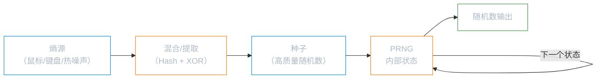
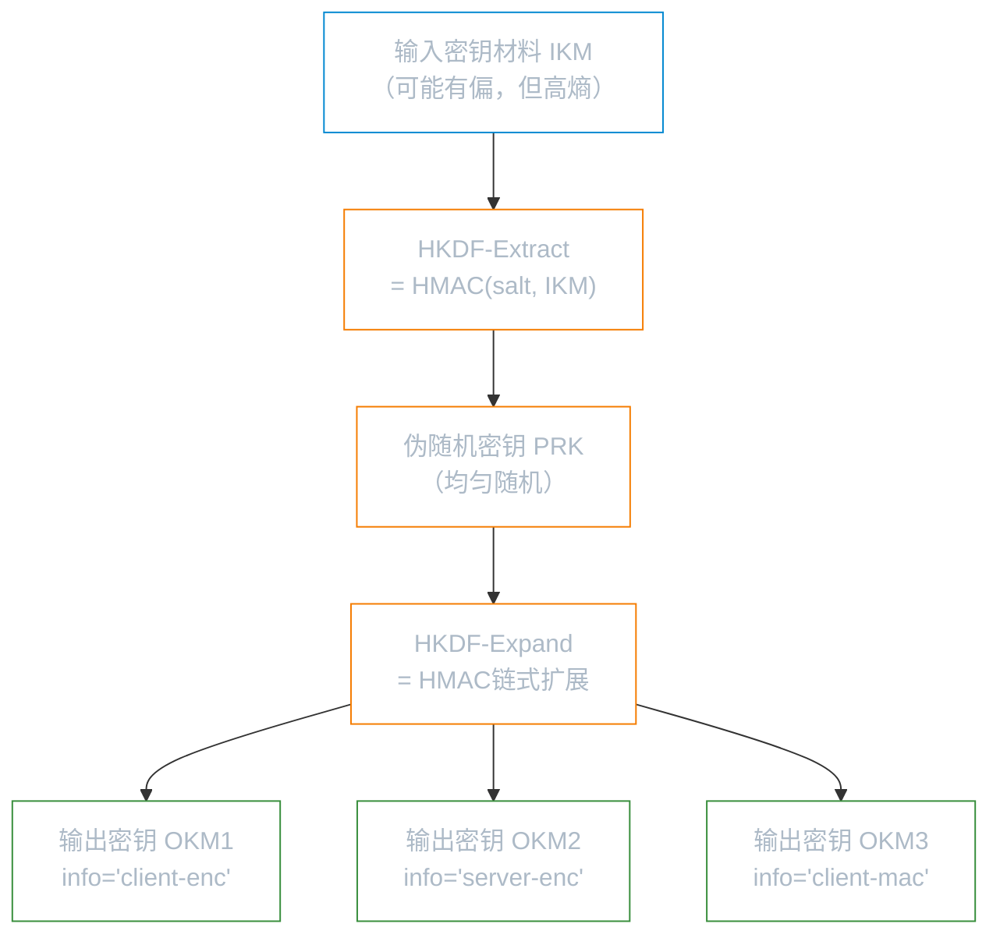
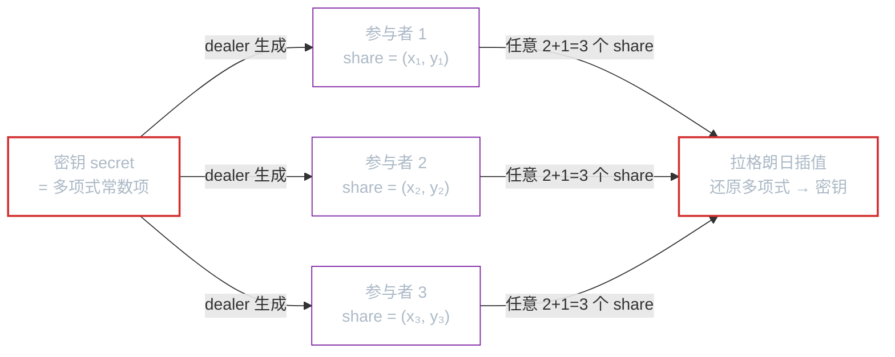

# 随机数与密钥派生

**本文你会学到**：

- 随机性为什么是所有密码学算法的基石，熵（entropy）是什么
- 真随机数生成器（TRNG）与伪随机数生成器（PRNG/CSPRNG）的区别
- 在 Linux、Windows、Java 中安全获取随机数的正确方式
- 虚拟机克隆、嵌入式启动熵不足等真实陷阱
- HKDF（HMAC-based KDF）的 extract-and-expand 范式及 Java 实现
- Shamir 秘密分享：把一个密钥安全地拆分给多人保管
- Debian OpenSSL（CVE-2008-0166）与 Sony PS3 ECDSA 私钥泄露案例的教训

---

## 🎲 为什么随机性是密码学的基石

想象你要设计一个银行保险箱，锁的组合密码决定了安全强度。如果密码是"123456"，再好的锁也形同虚设。密码学里的"组合密码"就是密钥，而密钥的安全性直接取决于生成它时使用的随机性质量。

几乎所有密码学操作都依赖随机性：

- AES 加密需要随机生成 `密钥（key）`
- TLS 握手需要随机 `nonce` 防止重放攻击
- ECDSA 签名每次需要随机 `k`，一旦重复即泄露私钥（Sony PS3 案例的根因）
- 密钥交换协议（Diffie-Hellman）需要随机私钥

> 💡 随机性的质量是密码系统的软肋——再精妙的算法，遇到可预测的随机数就会土崩瓦解。

---

## 真随机 vs 伪随机

### 熵从哪里来

`熵（entropy）` 这个词来自信息论，由 Claude Shannon 提出，用来度量一个字符串的不可预测程度。熵越高，字符串越难猜测；熵为 0 则完全可预测。

在密码学里你经常听到：

- "这个密钥熵太低"——意思是密钥可以被猜出来
- "这个随机数有足够的熵"——意思是无法预测

操作系统从物理世界收集熵，常见熵源有：

- 🖱️ 鼠标移动的时序
- ⌨️ 键盘按键间隔
- 💾 硬盘寻道时间
- 🌡️ CPU 热噪声（现代 Intel CPU 的 `RDRAND` 指令）
- 🌐 网络中断的时序

这些"噪声"各自质量参差不齐，操作系统会将多个熵源混合（通常是哈希后 XOR）来生成高质量的随机种子。

### PRNG 如何工作

直接从熵源读取噪声有个问题：**太慢**。收集一次高质量的 128 位随机数可能要等几毫秒，而 ASLR（地址空间布局随机化）、TCP 序号等场景需要每秒数千次随机数。

解决方案是 `伪随机数生成器（PRNG, Pseudorandom Number Generator）`：用一个高质量的随机 `种子（seed）` 初始化 PRNG，然后用确定性算法快速生成大量随机数。



一个密码学安全的 PRNG（简称 `CSPRNG`，NIST 称之为 `DRBG`）需要满足：

- **不可区分性**：输出看起来与真正均匀随机的数列无法区分
- **不可逆性**：观察到输出，无法反推内部状态（`next` 函数单向）
- **前向保密（forward secrecy）**：即使当前状态被泄露，也无法恢复之前生成的随机数
- **后向保密（backward secrecy）**：泄露后通过注入新熵"愈合"，使攻击者无法预测后续输出

### CSPRNG 安全标准

现代操作系统的 CSPRNG 实现：

| 操作系统 | PRNG 算法 |
|---------|-----------|
| Linux（2021+）| ChaCha20 流密码 |
| macOS | SHA-1 哈希 |
| Windows | AES-CTR 模式 |

> ⚠️ NIST 曾于 2006 年将 NSA 设计的 `Dual EC DRBG` 纳入标准。2013 年 Snowden 文件证实其存在后门——椭圆曲线参数可能由 NSA 精心选择，使其能预测输出。该算法于 2014 年从标准中撤除。这是密码标准化历史上最著名的后门事件之一。

---

## 🔧 实践中获取随机数

### Linux：`/dev/urandom` 与 `getrandom()`

Linux 暴露了两种接口：

**方式一：读取特殊文件**

```bash title="读取 16 字节随机数"
$ dd if=/dev/urandom bs=16 count=1 2>/dev/null | xxd -p
40b1654b12320e2e0105f0b1d61e77b1
```

**方式二：`getrandom()` 系统调用（推荐）**

```c title="C 语言：安全使用 getrandom"
#include <sys/random.h>

uint8_t secret[16];
int len = getrandom(secret, sizeof(secret), 0);  // ✅ 标志 0 = 默认不阻塞，但未初始化时会阻塞
if (len != sizeof(secret)) {
    abort();  // ✅ 失败时立即中止，不要继续
}
```

为什么推荐 `getrandom()` 而不是直接读 `/dev/urandom`？

- `getrandom()` 在 PRNG 尚未被充分初始化时会**阻塞**等待，而不是返回低质量随机数
- `/dev/urandom` 在系统启动初期可能返回低熵输出（早期启动陷阱，见下文）
- `getrandom()` 每次最多返回 256 字节，使用库函数可以自动处理这个限制

**PHP 示例（对比）**：

```php title="PHP 7：正确与错误的随机数获取"
<?php
$bad_random  = rand(0, 10);          // ❌ 非密码学安全，不可用于密钥生成
$secret_key  = random_bytes(16);     // ✅ 密码学安全，内部调用 getrandom
?>
```

### Java：`SecureRandom` 的坑

Java 通过 `java.security.SecureRandom` 提供随机数，内部委托给操作系统。正确用法：

```java title="Java：SecureRandom 正确用法"
import java.security.SecureRandom;

// ✅ 正确：让 JVM 选择最佳提供者
SecureRandom sr = new SecureRandom();
byte[] key = new byte[32];
sr.nextBytes(key);

// ✅ 明确指定 NativePRNGNonBlocking（Linux，对应 /dev/urandom）
SecureRandom srNative = SecureRandom.getInstance("NativePRNGNonBlocking");
srNative.nextBytes(key);
```

常见错误：

```java title="Java：SecureRandom 常见误用"
// ❌ 错误：用固定 seed 初始化，输出完全可预测！
SecureRandom badSr = new SecureRandom("myseed".getBytes());

// ❌ 错误：用 Math.random() 生成密钥
double badKey = Math.random();  // 非密码学安全

// ❌ 错误：用当前时间作为种子（只有 32 位可能性）
Random badRandom = new Random(System.currentTimeMillis());
```

> 💡 参见「Java 密码学架构」中 `SecureRandom` 的提供者机制与算法选择详解。

### 虚拟机与嵌入式陷阱

有两种场景会让"看起来正常"的随机数生成变得极度危险：

**⚠️ 虚拟机克隆**

如果把一台虚拟机的完整状态（快照）保存下来，然后从同一个快照启动多个实例，每个实例的 PRNG 状态完全相同。结果：所有 VM 实例生成完全一样的随机数序列！

解决方案：好的虚拟化平台（Hypervisor）会在恢复快照时注入新熵。使用前请查阅所用平台文档。

**⚠️ 嵌入式启动熵不足**

服务器、IoT 设备在启动时没有用户交互，缺乏鼠标、键盘等熵源。研究者（Heninger 等，2012）发现：

> "在 Linux 的 `urandom` 完全可预测的启动窗口内，禁用无头设备上不可用的熵源后，Linux RNG 在每次启动时产生同样可预测的随机流。"

这导致大量网络设备（路由器、防火墙）生成了相同的 RSA 私钥，研究者从互联网扫描中提取到大量弱密钥。

**推荐做法**：

- 嵌入式设备若支持，优先使用硬件 TRNG（如 Intel `RDRAND`）
- 从已充分初始化的机器生成初始熵文件，注入到嵌入式设备中
- 优先选择不依赖随机 nonce 的算法，如 `EdDSA`（代替 ECDSA）、`AES-GCM-SIV`（代替 AES-GCM）

---

## 🌐 公共随机性

有时候，随机性不需要保密，而是需要可验证——例如彩票开奖、区块链随机抽签。这就需要**公共随机性**。

### 可验证随机函数（VRF）

`VRF（Verifiable Random Function）` 利用签名方案生成可验证的随机数：

1. 发布公钥和公开种子
2. 用私钥对种子签名，哈希签名得到随机数，同时公布签名作为证明
3. 任何人可以用公钥验证：签名正确 → 随机数不可篡改

因为签名唯一（如 BLS 签名），发布者无法为同一种子生成不同随机数——可预测地不可预测。

### 分布式随机信标（Distributed Randomness Beacon）

当多个参与方互相不信任时，可以用 `分布式随机信标` 协同生成随机数，任何单一参与方都无法操控结果。代表项目：

- **drand**（https://leagueofentropy.com）：由多所大学和机构联合运营，使用阈值 BLS 签名，即使部分节点离线仍能产出随机数

---

## 🔑 HKDF：从一个秘密派生多个密钥

### 为什么需要 KDF

PRNG 适合生成大量完全随机的数，但还有另一种常见场景：**从一个秘密派生多个不同用途的密钥**。

典型例子：TLS 握手后，双方共享一个 `主密钥（master secret）`，需要从中派生出：

- 客户端加密密钥
- 服务端加密密钥
- 客户端 MAC 密钥
- 服务端 MAC 密钥

直接切分主密钥太危险（一旦泄露全军覆没），哈希多次也有隐患（输出长度固定、无域分离）。

这就是 `密钥派生函数（KDF, Key Derivation Function）` 的用武之地。KDF 与 PRNG 的主要区别：

| 特性 | PRNG | KDF |
|-----|------|-----|
| 输入要求 | 必须是均匀随机的种子 | 接受有偏但高熵的输入（如 DH 共享值） |
| 典型用途 | 生成大量随机数 | 派生有限数量的密钥 |
| 确定性 | 可含随机重播（backward secrecy）| 通常完全确定性 |

> 💡 参见「基于密码的密钥生成」了解面向低熵密码（password）的特殊 KDF（PBKDF2、Argon2 等）。

### Extract-and-Expand 范式

最流行的 KDF 是 `HKDF（HMAC-based Key Derivation Function）`，定义于 RFC 5869，由两步组成：



**HKDF-Extract**：输入原始密钥材料（IKM）和一个可选的 `salt`（不需要保密，用于域分离），输出均匀随机的 `PRK（Pseudorandom Key）`。

**HKDF-Expand**：输入 PRK 和可选的 `info` 字符串（用于区分不同用途），输出任意长度的密钥材料。

两个重要细节：

- **`salt`**：可选但推荐使用，用于同一协议内不同调用的域分离，不需要保密
- **`info`**：可选，用于区分不同协议或用途，防止不同场景的密钥相互影响

⚠️ **related outputs 陷阱**：用相同参数但不同输出长度调用 HKDF，得到的结果是相互截断关系（更长的输出包含更短的输出为前缀）。协议设计时需注意这一特性。

### Java 实现（Bouncy Castle）

```java title="Java：HKDF 使用 Bouncy Castle"
import org.bouncycastle.crypto.generators.HKDFBytesGenerator;
import org.bouncycastle.crypto.params.HKDFParameters;
import org.bouncycastle.crypto.digests.SHA256Digest;

public class HKDFExample {
    public static byte[] deriveKey(byte[] ikm, byte[] salt, String info, int outputLen) {
        // ✅ 创建 HKDF 生成器（基于 SHA-256）
        HKDFBytesGenerator hkdf = new HKDFBytesGenerator(new SHA256Digest());

        // ✅ 配置参数：IKM + salt + info
        HKDFParameters params = new HKDFParameters(
            ikm,
            salt,
            info.getBytes(java.nio.charset.StandardCharsets.UTF_8)
        );
        hkdf.init(params);

        // ✅ 生成输出密钥材料（OKM）
        byte[] okm = new byte[outputLen];
        hkdf.generateBytes(okm, 0, outputLen);
        return okm;
    }

    public static void main(String[] args) {
        // 假设 sharedSecret 来自 ECDH 密钥交换
        byte[] sharedSecret = /* ECDH 输出 */ new byte[32];
        byte[] salt = /* 可公开的随机值 */ new byte[32];

        byte[] clientEncKey = deriveKey(sharedSecret, salt, "client-encryption-key", 32);
        byte[] serverEncKey = deriveKey(sharedSecret, salt, "server-encryption-key", 32);
        byte[] clientMacKey = deriveKey(sharedSecret, salt, "client-mac-key", 32);

        // 不同 info 字符串 → 完全不同的密钥 ✅
    }
}
```

> HKDF 不适合从低熵密码派生密钥——密码场景请使用「基于密码的密钥生成」中介绍的 PBKDF2 或 Argon2。

---

## 🔐 密钥与机密管理

### 密钥管理的挑战

> "密码学是把一大堆问题转化为密钥管理问题的工具。" — Lea Kissner (2019)

所有密码学操作最终都依赖密钥的安全性。密钥管理需要回答：

- 密钥存放在哪里？
- 密钥什么时候过期/轮换？
- 密钥泄露时怎么办？

**核心策略**：

- **密钥轮换（Key Rotation）**：为密钥设置过期时间，定期自动替换。轮换频率越高，泄露窗口越小
- **密钥吊销（Key Revocation）**：发现泄露时立即撤销，配合 CRL 或 OCSP 通知依赖方
- **最小权限**：不同用途使用不同密钥对（签名密钥 ≠ 加密密钥），泄露一个不影响另一个
- **硬件保护**：HSM（硬件安全模块）或手机 SE（安全元件）可以让密钥永不离开硬件边界

> 💡 详细的密钥存储方案请参见「密钥存储」。云端可使用 AWS KMS、GCP Cloud KMS 等服务委托密钥管理，但需注意：应用被攻陷后仍可向 KMS 发请求。

---

## 🧩 阈值密码学：分散信任

### Shamir 秘密分享

密钥管理有一个根本矛盾：把密钥放在一个地方风险大，放在多个地方又难管理。`Shamir 秘密分享（SSS, Shamir's Secret Sharing）` 提供了一个优雅的数学解法。

**核心思想**（用几何直觉理解）：

- 一个 1 次多项式 `y = ax + b` 由两点唯一确定
- 一个 2 次多项式 `y = ax² + bx + c` 由三点唯一确定
- 一般地，n 次多项式由 n+1 个点唯一确定

把密钥编码为多项式的常数项 `b`，把每个参与者的 `份额（share）` 设为多项式上的一个点。知道足够多的点就能还原多项式，进而还原密钥：



`(t, n)` 阈值方案：将密钥分成 n 份，任意 t 份即可还原，少于 t 份的任何组合无任何信息泄露。

```java title="Java：Shamir 秘密分享（概念伪代码）"
// 概念示意，实际可用 Bouncy Castle 或 secretsharing 库
// 拆分：dealer 生成 n 个 share
byte[] secret = /* 原始密钥 */ new byte[32];
int threshold = 3;  // 至少 3 份才能还原
int totalShares = 5;  // 共 5 个参与者

// ShamirSecretSharing.split(secret, threshold, totalShares) → share[0..4]

// 还原：收集任意 threshold 个 share 即可
// ShamirSecretSharing.combine(share[1], share[3], share[4]) → secret ✅
// ShamirSecretSharing.combine(share[0], share[2]) → 失败，份额不足 ❌
```

### SSS 的局限与进阶方案

SSS 有一个根本缺陷：**还原密钥时需要把所有份额集中到一个地方**——这又回到了单点失败的问题。

现代密码学提供了更进阶的方案：

- **多签名（Multi-signature）**：n 人中需要 m 人签名才有效，签名本身分散在各处，私钥永不集中。广泛用于加密货币
- **签名聚合（Signature Aggregation）**：BLS 签名方案可将多个签名压缩为一个，降低存储开销
- **分布式密钥生成（DKG, Distributed Key Generation）**：n 个参与者协作生成公钥，对应私钥**从不在任何地方以明文存在**，签名和解密也可分布式完成。这是阈值密码学的终极形态

> NIST 目前正在推动阈值密码学原语和协议的标准化。

---

## 💥 真实世界案例与教训

### Debian OpenSSL 漏洞（CVE-2008-0166）

**事件**：2006 年，Debian 的一个开发者在 OpenSSL 代码中删除了一段"看起来没用"的代码——那段代码实际上是 PRNG 的核心熵源注入逻辑。

**后果**：修补版 OpenSSL 的 PRNG 种子变成了**当前进程 ID（PID）**。Linux 默认最大 PID 为 32768，这意味着整个系统生成的所有密钥（SSL 证书私钥、SSH 主机密钥）只有 32768 种可能。

安全研究员 H.D. Moore（Metasploit 作者）在 2008 年生成了全部可能的密钥并制作成 "toys"（可导入的密钥对）。受影响的系统只需要对照这份字典就能被攻破。

**教训**：

- **永远不要依赖用户空间（userland）PRNG**，尽量使用操作系统提供的随机数接口
- 删除任何代码前要充分理解其作用
- 安全敏感的代码修改需要安全专家审核

### Sony PS3 ECDSA 私钥泄露

**事件**：2010 年，黑客团队（fail0verflow）发现 Sony PS3 固件签名使用了 ECDSA，但在所有签名中使用了**同一个固定的随机数 k**（即 `k` 不是每次签名都随机生成的）。

**后果**：ECDSA 签名方程为 `s = k⁻¹(H(m) + r·d) mod n`。如果两次签名用了相同的 k，则 `r` 相同，只需两条签名方程相减，就能直接解出私钥 `d`。私钥一旦暴露，任何人都能给任意软件签名——相当于得到了 Sony 的"官方授权"。

**教训**：

- ECDSA 的安全性对随机 nonce `k` 极度敏感，k 重用 = 私钥泄露
- 优先选择 `EdDSA（Ed25519）`：它用确定性方式生成 nonce（从私钥和消息的哈希派生），**完全消除了 nonce 重用风险**
- 又一次验证：随机性是密码系统的命脉

---

## ✅ 现代推荐实践

| 场景 | 推荐做法 |
|------|---------|
| 生成密钥/nonce | Linux: `getrandom()` / Java: `new SecureRandom()` |
| 从高熵材料派生多密钥 | `HKDF`（RFC 5869）|
| 从低熵密码派生密钥 | `Argon2id` / `PBKDF2`（见「基于密码的密钥生成」）|
| 签名算法 | `EdDSA（Ed25519）` 优于 ECDSA（无随机 nonce 依赖）|
| 加密算法 | `AES-GCM-SIV` 优于 AES-GCM（nonce 重用不会灾难性失败）|
| 多方密钥管理 | Shamir 秘密分享 或 DKG（视需求选择）|
| 密钥存储 | HSM / 云 KMS（见「密钥存储」）|

---

> 本节内容参考自《Real-World Cryptography》(David Wong, Manning 2021) 第 8 章
