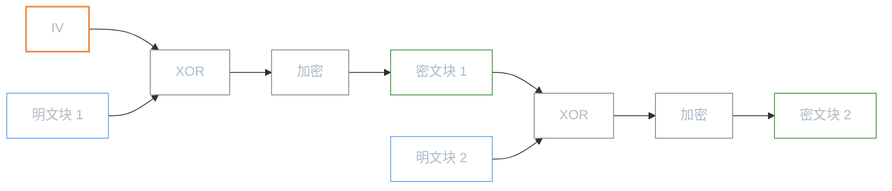

# 对称加密

**本文你会学到**：

- 为什么对称加密是所有加密体系的性能基石
- 分组密码的工作模式（ECB / CBC / CTR 等）如何解决「逐块加密」带来的安全问题
- 为什么 GCM 是目前最推荐的认证加密模式
- 如何用密钥包装（Key Wrapping）和 `SealedObject` 安全传输密钥与对象

## 为什么对称加密是密码学的基础？

假设你需要加密一份 1GB 的文件。如果用非对称加密（如 RSA），每加密一个块都要做一次大数模幂运算——速度可能只有几十 KB/s，加密完这份文件要花好几分钟。而对称加密（如 AES）在硬件加速下可以达到 GB/s 级别的吞吐量，同样 1GB 不到一秒就搞定了。

这就是对称加密的核心价值：**加解密使用同一把密钥，速度比非对称加密快 2-3 个数量级**。在实际系统中，两种加密通常搭配使用——对称加密负责「干活」（大量数据），非对称加密负责「送钥匙」（密钥协商/传输）。

可以把对称加密想象成一把保险柜的钥匙：你用同一把钥匙锁上文件，也用同一把钥匙打开它。只要钥匙不泄露，文件就是安全的。

⚠️ 正因为加解密用同一把密钥，**密钥分发**就成了对称加密最大的难题。这部分内容将在后续笔记中展开。

## 分组密码基础

### 什么是分组密码？

想象你要寄一封很长的信，但邮局要求每个信封只能装固定大小的信纸。你会怎么做？把信纸切成等大的小块，逐个装进信封，逐个密封。

分组密码的工作方式完全一样：它把明文切成固定大小的「块」（block），逐块加密。`AES`（Advanced Encryption Standard）的块大小是 128 bit（16 bytes），这意味着无论你要加密多大的数据，都会被切成 16 字节一组来处理。

在 Java 中，创建分组密码的密钥有两种方式：

``` java title="两种创建 AES 密钥的方式"
// 方式一：直接从字节数组创建（需要自行保证密钥的随机性）
byte[] keyBytes = new byte[16]; // AES-128 需要 16 字节密钥
new SecureRandom().nextBytes(keyBytes);
SecretKey key = new SecretKeySpec(keyBytes, "AES");

// 方式二：使用 KeyGenerator 自动生成（推荐）
KeyGenerator keyGen = KeyGenerator.getInstance("AES");
SecretKey key = keyGen.generateKey(); // 默认生成 AES-256 密钥
```

💡 实际开发中，推荐用 `KeyGenerator`。它内部使用 `SecureRandom` 生成密钥，无需你操心随机性。

### 算法安全强度

不是所有密码算法都一样安全。NIST SP 800-57 给出了主流对称密码的安全强度评估：

| 算法 | 密钥长度 | 安全强度（bits） | 推荐程度 |
|------|---------|-----------------|---------|
| 2-Key 3DES | 112 | <= 80 | 已不推荐 |
| 3-Key 3DES | 168 | 112 | 过渡期可用 |
| AES-128 | 128 | 128 | 推荐 |
| AES-192 | 192 | 192 | 推荐 |
| AES-256 | 256 | 256 | 推荐 |

> 3DES（Triple-DES）虽然密钥长度为 112 或 168 位，但由于「meet-in-the-middle」攻击，实际安全强度远低于密钥长度。这也是为什么 NIST 推荐用 AES 取代 3DES。

🎯 **当前安全基线**：至少 112 bits 安全强度。对于新系统，直接用 AES-256 即可。

### 密钥安全的三个维度

「不告诉别人密钥」只是安全的第一步。一个密钥的有效安全寿命还取决于另外三个关键因素：

**生成质量**：密钥的安全性取决于生成它的随机数据的熵（entropy）。如果伪随机数生成器质量差，看似 128 位的密钥实际可能只有几十位甚至几位有效熵——攻击者可以在几分钟内穷举出来。

**使用次数**：无论算法多强，用得越多，被攻击的可能性越大。经验法则是：一个密钥最多处理 2^(blockSize/2) 个块。以 AES 为例， blockSize = 128，即最多约 2^64 个块。到达上限前必须轮换密钥。

**参数管理**：很多工作模式依赖 IV（Initialization Vector，初始化向量）或 nonce 等参数。如果同一个密钥 + IV 的组合被重用，后果可能非常严重——在 GCM 模式下，IV 重用会直接泄露明文 XOR。

## 分组密码工作模式

分组密码本身只定义了「一个块怎么加密」，但实际数据远超一个块的长度。**工作模式（mode of operation）** 就决定了如何将「单块加密」扩展到「多块数据流加密」。

### ECB 模式（不推荐）

ECB（Electronic Code Book，电子密码本）是最简单的工作模式：每个明文块独立加密，互不影响。

问题在于：**相同的明文块永远产生相同的密文块**。这意味着明文中的模式会直接暴露在密文中。一个经典例子是加密一张企鹅图片——用 ECB 模式加密后，企鹅的轮廓在密文中依然清晰可见，因为相同像素对应的密文块完全一样。

``` java title="ECB 模式——相同明文块产生相同密文块"
byte[] keyBytes = new byte[16];
new SecureRandom().nextBytes(keyBytes);
SecretKey key = new SecretKeySpec(keyBytes, "AES");

Cipher cipher = Cipher.getInstance("AES/ECB/NoPadding");
cipher.init(Cipher.ENCRYPT_MODE, key);

// 两个完全相同的块
byte[] input = "aaaaaaaaaaaaaaaa".repeat(2).getBytes();
byte[] output = cipher.doFinal(input);

// 密文的前 16 字节和后 16 字节完全相同！
```

❌ **永远不要在新系统中使用 ECB 模式。** 它无法隐藏数据模式，是最弱的工作模式。

### CBC 模式

CBC（Cipher Block Chaining，密码分组链接）解决了 ECB 的模式泄露问题。它的做法是：在加密每个块之前，先用前一个密文块（或 IV）与当前明文块做 XOR，然后再加密。这样一来，即使明文块相同，由于前面的密文块不同，最终的密文块也不同。



IV（初始化向量）是 CBC 模式的第一个「前一块密文」。它的作用是确保即使加密相同的明文，只要 IV 不同，密文就不同。

``` java title="AES/CBC/PKCS5Padding 加密示例"
byte[] keyBytes = new byte[16];
new SecureRandom().nextBytes(keyBytes);
SecretKey key = new SecretKeySpec(keyBytes, "AES");

Cipher cipher = Cipher.getInstance("AES/CBC/PKCS5Padding");
cipher.init(Cipher.ENCRYPT_MODE, key);

// Cipher 自动生成随机 IV
byte[] iv = cipher.getIV();
byte[] cipherText = cipher.doFinal("hello, world!".getBytes());

// 解密时需要传入同一个 IV
cipher.init(Cipher.DECRYPT_MODE, key, new IvParameterSpec(iv));
byte[] plainText = cipher.doFinal(cipherText);
```

⚠️ **IV 不需要保密，但必须不可预测且不重复。** 如果 IV 可预测（如递增计数器），攻击者可能构造特定的明文来验证猜测。最安全的做法是用 `SecureRandom` 生成。

### 填充机制

分组密码只能处理完整块的数据（AES 为 16 字节）。当明文长度不是块大小的整数倍时，就需要**填充（padding）**。

最常用的是 **PKCS#5/PKCS#7 Padding**：用缺少的字节数来填充。例如，如果明文差 5 字节才满一个块，就填充 5 个值为 `0x05` 的字节。如果明文恰好是块大小的整数倍，则额外填充一个完整块（16 个 `0x10`）。

另一种方案是 **CTS（Cipher Text Stealing，密文窃取）**：它不需要填充，且密文长度与明文完全一致。但 CTS 要求明文必须大于一个块的大小，且使用场景较少。

```
明文: [hello world!!!!!] (16 bytes, 恰好一个块)
PKCS7 填充后: [hello world!!!!! 10 10 10 10 10 10 10 10 10 10 10 10 10 10 10 10] (32 bytes)
CTS: [密文长度 = 明文长度 = 16 bytes]
```

### CTR 模式

CTR（Counter，计数器）模式是一种**流式**工作模式：它把分组密码变成密钥流生成器，然后与明文 XOR 得到密文。

工作原理很简单：将一个 nonce（随机数）和一个计数器拼接成输入块，用分组密码加密这个输入块得到密钥流，再把密钥流与明文 XOR。计数器逐块递增，产生不同的密钥流。

``` java title="AES/CTR/NoPadding——无需填充，密文与明文等长"
byte[] keyBytes = new byte[16];
new SecureRandom().nextBytes(keyBytes);
SecretKey key = new SecretKeySpec(keyBytes, "AES");

// CTR 模式无需填充
Cipher cipher = Cipher.getInstance("AES/CTR/NoPadding");
byte[] iv = new byte[12]; // 12 字节 nonce + 4 字节计数器 = 16 字节块
new SecureRandom().nextBytes(iv);

cipher.init(Cipher.ENCRYPT_MODE, key, new IvParameterSpec(iv));
byte[] cipherText = cipher.doFinal("任意长度的消息...".getBytes());
// 密文长度 = 明文长度，无需填充！
```

CTR 模式有几个重要优势：

- **无需填充**：密文长度等于明文长度
- **支持并行加密**：每个块的密钥流可以独立计算，多线程友好
- **随机访问**：可以直接解密任意位置的数据块，无需从头开始

⚠️ **IV（nonce）绝不能重复使用！** 如果同一个密钥下重用了 nonce，就会产生相同的密钥流。攻击者拿到两份密文后，把它们 XOR 起来就能得到两份明文的 XOR——这在密码学中是不可接受的信息泄露。

### 工作模式对比

| 模式 | 安全性 | 并行加密 | 并行解密 | IV 要求 | 需要填充 | 适用场景 |
|------|--------|---------|---------|--------|---------|---------|
| ECB | ❌ 极弱 | 是 | 是 | 无 | 是 | 不推荐使用 |
| CBC | 中等 | ❌ 否 | 是 | 必须随机不可预测 | 是 | 兼容旧系统 |
| CTR | 好（需正确管理 nonce） | 是 | 是 | 必须唯一不重复 | 否 | 通用场景 |
| CFB | 中等 | ❌ 否 | 是 | 必须唯一不重复 | 否 | 少量数据 / 自同步 |
| OFB | 中等 | ❌ 否 | 否 | 必须唯一不重复 | 否 | 噪声信道（音视频） |

🎯 **实践建议**：对于新系统，优先选择 CTR 模式或认证加密模式（如 GCM）。CBC 仅在兼容旧系统时考虑。OFB 存在密钥流循环的潜在风险，不推荐新项目使用。

## 认证加密模式

### 为什么需要认证加密？

到目前为止，我们看到的工作模式（ECB / CBC / CTR）只解决了一个问题：**机密性**（confidentiality）——保证攻击者看不懂密文。但它们没有解决另一个同样重要的问题：**完整性**（integrity）——保证密文没有被篡改。

攻击者虽然不知道密文的内容，但可以随意修改密文。以 CBC 模式为例，著名的 **Padding Oracle Attack** 就是利用解密端对填充错误的反馈，逐字节还原出明文。更一般地说，如果没有完整性校验，攻击者可以翻转密文中的某些比特，精确控制解密后明文的变化——这在某些场景下（如加密的金额字段）是致命的。

**认证加密（Authenticated Encryption，AE）** 同时提供三个保证：

- **机密性**：攻击者看不到明文
- **完整性**：密文被篡改后解密会失败
- **可认证性**：只有持有正确密钥的人才能生成合法的密文

当认证加密还支持「关联数据（Associated Data）」时，它就被称为 **AEAD**（Authenticated Encryption with Associated Data）。关联数据不加密，但参与认证标签的计算——适合放协议头、文件名等不需要保密但不能被篡改的元数据。

### GCM 模式（推荐）

GCM（Galois/Counter Mode）是目前最广泛使用的 AEAD 模式，定义在 NIST SP 800-38D 中。它底层基于 CTR 模式加密 + GHASH 函数生成认证标签（tag），采用「先加密再认证（Encrypt-then-MAC）」的方式。

``` java title="AES/GCM 加密与篡改检测"
// === 加密方 ===
KeyGenerator keyGen = KeyGenerator.getInstance("AES");
SecretKey key = keyGen.generateKey();

byte[] iv = new byte[12]; // GCM 推荐 12 字节 nonce
new SecureRandom().nextBytes(iv);

Cipher cipher = Cipher.getInstance("AES/GCM/NoPadding");
// 标签长度 128 位（推荐值）
cipher.init(Cipher.ENCRYPT_MODE, key, new GCMParameterSpec(128, iv));

byte[] cipherText = cipher.doFinal("重要数据".getBytes());
// cipherText 末尾自动附加 16 字节的认证标签

// === 解密方 ===
cipher.init(Cipher.DECRYPT_MODE, key, new GCMParameterSpec(128, iv));

try {
    byte[] plainText = cipher.doFinal(cipherText);
    System.out.println("解密成功: " + new String(plainText));
} catch (AEADBadTagException e) {
    // 认证标签校验失败 → 密文被篡改，或使用了错误的密钥/nonce
    System.err.println("数据完整性校验失败！");
}
```

GCM 模式有几个关键参数需要注意：

- **nonce 长度**：推荐 12 字节。如果超过 12 字节，GCM 的内部处理会降低安全性
- **认证标签长度**：推荐 128 位（16 字节）。标签越短，攻击者伪造成功的概率越高
- **处理上限**：同一个密钥 + nonce 组合最多加密 2^32 个块（约 64GB），之后必须轮换密钥

⚠️ **GCM 中 nonce 重用是致命错误。** 由于 GCM 底层使用 CTR 模式，nonce 重用会导致相同的密钥流，攻击者可以完全恢复两个消息的 XOR。更严重的是，GHASH 的认证机制也会失效，攻击者可以伪造合法密文。

如果你需要在加密的同时保护某些元数据（如协议版本号、消息类型），可以使用**关联数据（AAD）**：

``` java title="GCM 使用关联数据（AAD）保护协议头"
Cipher cipher = Cipher.getInstance("AES/GCM/NoPadding");
cipher.init(Cipher.ENCRYPT_MODE, key, new GCMParameterSpec(128, iv));

// AAD 不加密，但参与认证标签的计算
cipher.updateAAD("protocol:v1|msgType:login".getBytes());
byte[] cipherText = cipher.doFinal("用户密码...".getBytes());
```

### EAX 模式

EAX 是 Bouncy Castle 提供的一种 AEAD 模式，基于 CTR 模式加密 + CMAC（Cipher-based MAC）认证。它比 CCM 更简洁灵活，也采用「先加密再认证」的方式。

``` java title="AES/EAX 加密示例（BC 特有）"
SecretKey key = KeyGenerator.getInstance("AES").generateKey();
byte[] nonce = new byte[16];
new SecureRandom().nextBytes(nonce);

Cipher cipher = Cipher.getInstance("AES/EAX/NoPadding", "BC");
cipher.init(Cipher.ENCRYPT_MODE, key, new AEADParameterSpec(nonce, 128));
byte[] cipherText = cipher.doFinal("hello, world!".getBytes());
```

### 认证模式对比

| 模式 | 加密方式 | MAC 方式 | nonce 要求 | 并行加密 | 标准来源 | Java 内置 |
|------|---------|---------|-----------|---------|---------|----------|
| GCM | CTR | GHASH | 推荐 12 字节 | 是 | NIST SP 800-38D | 是（Java 7+） |
| CCM | CTR | CBC-MAC | 7-13 字节 | ❌ 否（两趟） | NIST SP 800-38C | 是（Java 7+） |
| EAX | CTR | CMAC | 任意长度 | 是 | Bellare 等 | 仅 BC |

🎯 **实践建议**：GCM 是目前的通用首选——硬件 AES-NI 加速让它的性能远超其他模式。EAX 在不支持 GCM 的环境下是不错的替代方案。

## 流密码

### ChaCha20-Poly1305

为什么有了 AES 还需要别的算法？因为 AES 依赖硬件 AES-NI 指令集才能发挥最佳性能。在没有 AES-NI 的设备上（如部分移动端 ARM 处理器、低端 IoT 设备），AES 的性能可能只有 ChaCha20 的几分之一。而 ChaCha20 是纯软件实现友好的流密码，在通用 CPU 上性能出色。

ChaCha20-Poly1305 是一个 AEAD 流密码（定义在 RFC 8439），结合了 ChaCha20 流密码和 Poly1305 MAC。它需要 256 位密钥和 12 字节 nonce。

``` java title="ChaCha20-Poly1305 AEAD 流密码"
KeyGenerator keyGen = KeyGenerator.getInstance("ChaCha20-Poly1305");
SecretKey key = keyGen.generateKey(); // 256 位密钥

byte[] nonce = new byte[12]; // 12 字节 nonce
new SecureRandom().nextBytes(nonce);

Cipher cipher = Cipher.getInstance("ChaCha20-Poly1305");
cipher.init(Cipher.ENCRYPT_MODE, key, new IvParameterSpec(nonce));

byte[] cipherText = cipher.doFinal("hello, world!".getBytes());
// 末尾自动附加 16 字节 Poly1305 认证标签
```

💡 **TLS 1.3** 将 ChaCha20-Poly1305 列为强制实现的密码套件之一，与 AES-128-GCM 并列。这意味着即使设备没有 AES 硬件加速，也能保证安全的通信性能。

⚠️ 与 GCM 一样，nonce 绝不能重复使用。对于 ChaCha20，同一密钥下最多可以安全处理 2^32 条消息（每条消息不超过 256GB）。

## 密钥包装与 SealedObject

### Key Wrapping

在密钥协商或密钥存储场景中，你需要把一个密钥「包」起来传输或保存——这就是**密钥包装（Key Wrapping）**。它的设计目标是：用对称密钥加密另一个密钥，同时保证包装后的密文具备完整性校验。

NIST SP 800-38F 定义了基于 AES 的密钥包装算法：

- **AESKW**：基本密钥包装，输入必须是半块大小的整数倍（AES 为 8 字节的倍数）
- **AESKWP**：带填充的密钥包装，无对齐限制

``` java title="AES 密钥包装示例"
SecretKey aesKey = KeyGenerator.getInstance("AES").generateKey();

// 创建一个要被包装的密钥
SecretKey keyToWrap = new SecretKeySpec(
    new byte[16], "Blowfish");

// 包装
Cipher wrapCipher = Cipher.getInstance("AESKW");
wrapCipher.init(Cipher.WRAP_MODE, aesKey);
byte[] wrappedKey = wrapCipher.wrap(keyToWrap);

// 解包装
Cipher unwrapCipher = Cipher.getInstance("AESKW");
unwrapCipher.init(Cipher.UNWRAP_MODE, aesKey);
SecretKey unwrappedKey = (SecretKey) unwrapCipher.unwrap(
    wrappedKey, "Blowfish", Cipher.SECRET_KEY);
```

💡 使用 `Cipher.WRAP_MODE` / `Cipher.UNWRAP_MODE` 而非 `ENCRYPT_MODE` / `DECRYPT_MODE` 的好处是：在 HSM（Hardware Security Module）场景中，密钥对象可能只是令牌（token），`getEncoded()` 返回 `null`，但 `wrap()` 仍然可以工作。

⚠️ 不要用 RSA 加密 AES 密钥来做长期存储——2048 位 RSA 的安全强度只有约 112 位，远低于 AES-256 的 256 位。密钥包装应该用同级别的对称密钥。

### SealedObject

`javax.crypto.SealedObject` 提供了一种更高级的封装方式：它直接加密一个可序列化的 Java 对象，内部保存了算法参数，解密时只需提供密钥。

``` java title="SealedObject 加密可序列化对象"
SecretKey aesKey = KeyGenerator.getInstance("AES").generateKey();

// 创建要加密的对象（任何 Serializable 都行）
UserCredential credential = new UserCredential("admin", "secret");

// 用 AES-GCM 密封对象
Cipher cipher = Cipher.getInstance("AES/GCM/NoPadding");
cipher.init(Cipher.ENCRYPT_MODE, aesKey);
SealedObject sealed = new SealedObject(credential, cipher);

// ...传输或存储 sealed...

// 解封：只需传入密钥和 Provider 名称
UserCredential recovered = (UserCredential) sealed.getObject(aesKey, "BC");
```

`SealedObject` 内部会自动保存加密时使用的 `Cipher` 的算法参数（如 IV、GCM 标签长度等），所以解封时不需要再手动传入这些参数。

⚠️ `SealedObject` 基于 Java 序列化，存在反序列化攻击的风险。在生产环境中使用时，建议开启 JEP 290（ObjectInputFilter）来限制反序列化的类白名单。
