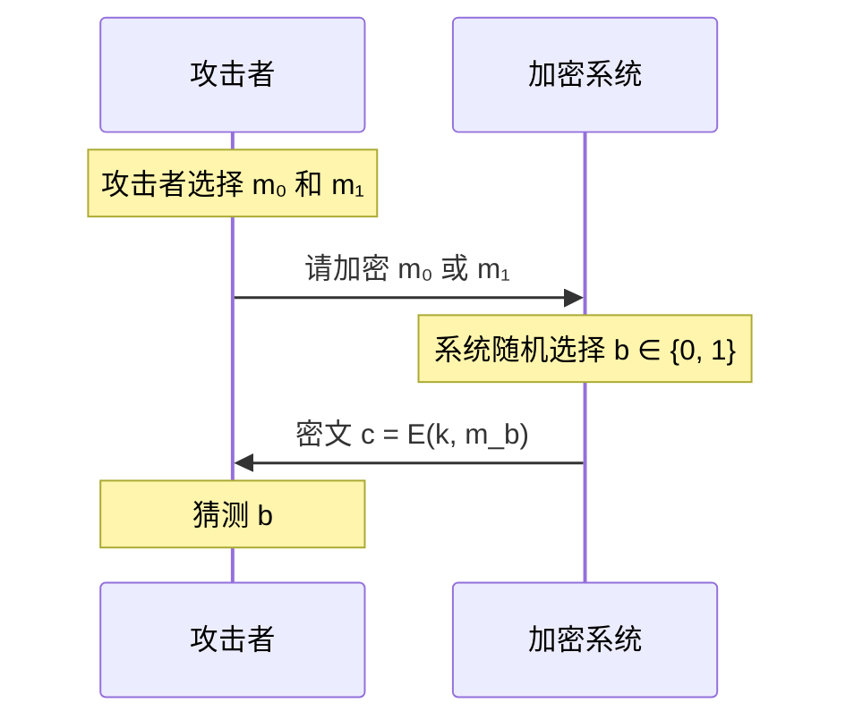
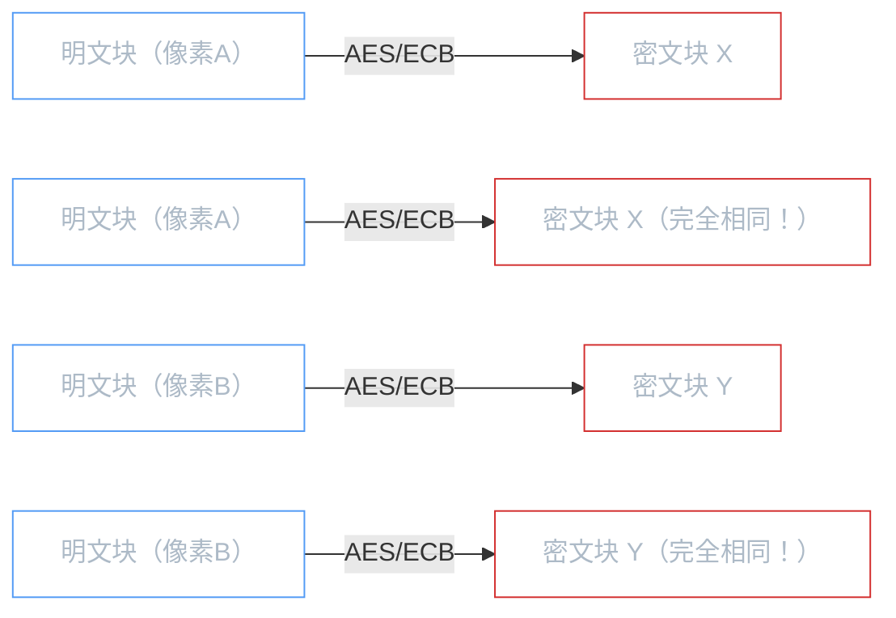
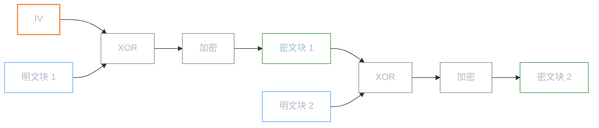
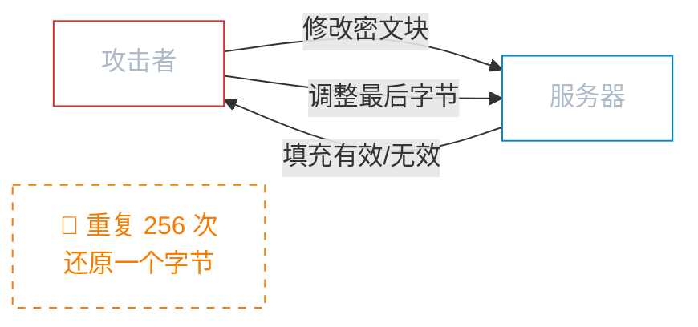
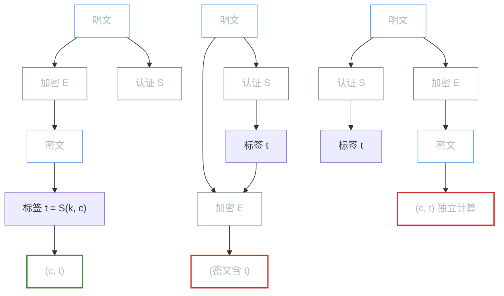
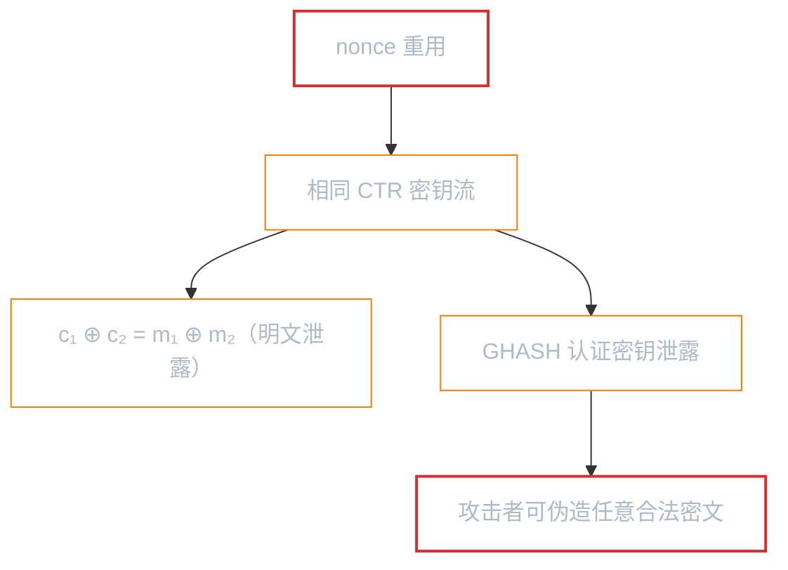

# 对称加密

**本文你会学到**：

- 为什么对称加密是所有加密体系的性能基石，以及完善安全（Shannon 定理）与计算安全的区别
- 分组密码的结构基础：SPN 网络与 Feistel 网络如何实现混淆与扩散
- 分组密码的工作模式（ECB / CBC / CTR 等）如何解决「逐块加密」带来的安全问题
- 为什么 GCM 是目前最推荐的认证加密模式
- 流密码（ChaCha20/Salsa20）的工作原理及适用场景
- 如何用密钥包装（Key Wrapping）和 `SealedObject` 安全传输密钥与对象

## 🤔 为什么对称加密是密码学的基础？

假设你需要加密一份 1GB 的文件。如果用非对称加密（如 RSA），每加密一个块都要做一次大数模幂运算——速度可能只有几十 KB/s，加密完这份文件要花好几分钟。而对称加密（如 AES）在硬件加速下可以达到 GB/s 级别的吞吐量，同样 1GB 不到一秒就搞定了。

这就是对称加密的核心价值：**加解密使用同一把密钥，速度比非对称加密快 2-3 个数量级**。在实际系统中，两种加密通常搭配使用——对称加密负责「干活」（大量数据），非对称加密负责「送钥匙」（密钥协商/传输）。

可以把对称加密想象成一把保险柜的钥匙：你用同一把钥匙锁上文件，也用同一把钥匙打开它。只要钥匙不泄露，文件就是安全的。

⚠️ 正因为加解密用同一把密钥，**密钥分发**就成了对称加密最大的难题。这部分内容将在后续笔记中展开。

## 📐 完善安全与 Shannon 定理

### 从"绝对安全"到"够用就行"

你可能会想：既然对称加密这么快，为什么不用它直接提供"绝对安全"的保证？答案是可以的——但代价很高。

想象你有一把和消息一样长的完全随机密钥。加密时直接将密钥和消息逐位 XOR，解密时再做一次 XOR 就能还原。这种方案叫做**一次性密码（One-Time Pad）**，由 Gilbert Vernam 在 1917 年提出。

一次性密码有一个令人惊叹的性质：**无论攻击者拥有多强的计算能力，都不可能从密文中获得关于明文的任何信息**。这不是"很难"，而是"理论上不可能"。密码学把这种安全叫做**完善安全（Perfect Security）**。

完善安全的精确定义是：对任意两条消息 $m_0$ 和 $m_1$，以及任意密文 $c$，看到密文 $c$ 后猜中"密文对应的是 $m_0$ 还是 $m_1$"的概率完全相等：

$$\Pr\left[\mathcal{E}(k, m_0) = c\right] = \Pr\left[\mathcal{E}(k, m_1) = c\right]$$

其中 $k$ 是均匀随机选择的密钥。

### Shannon 定理：完善安全的天花板

一次性密码虽然完美安全，但它有一个致命限制。1949 年，Claude Shannon 证明了：

> **Shannon 定理：任何完善安全的密码系统，密钥空间必须至少和消息空间一样大。**

用数学表达就是 $|K| \geq |M|$。这意味着如果你想加密一份 1GB 的文件并达到完善安全，你需要 1GB 的密钥——密钥比消息还长，这显然不实用。

💡 把完善安全理解为"绝对安全的房间"——房间没有窗户、没有门缝，任何人都进不来。Shannon 定理说：要建造这样的房间，墙壁的面积必须至少和地板一样大——这栋房子的造价会高到无法接受。

### 从完善安全到计算安全

既然完善安全不可行，密码学家退而求其次，提出了**计算安全**（Computational Security）：允许攻击者在理论上可以破解密码，但在实际计算中（比如需要宇宙年龄级别的时间）不可行。你日常使用的 AES、RSA 等算法都属于计算安全。

⚠️ AES 的 128 位密钥远小于 GB 级消息长度，所以 AES 不是完善安全的——它是计算安全的。后面介绍的分组密码工作模式（CBC、CTR、GCM）就是用短密钥加密长消息的实用方案。

## 🧱 分组密码基础

### 语义安全与 CPA 安全

完善安全要求密钥和消息一样长，这在工程中不切实际。那么退一步：能不能用短密钥也能保证"攻击者看不出密文对应的是哪条消息"？

**语义安全（Semantic Security）** 就是在这个方向上的答案。它的核心思想是：即使攻击者可以自行选择两条消息并让你加密其中一条，他也无法从密文中分辨你加密的是哪条——成功猜测的概率不超过 1/2 加上一个**可忽略（negligible）**的优势。

安全优势定义为：

$$\text{SSadv}\left[A, \mathcal{E}\right] = \left|\Pr\left[W_0\right] - \Pr\left[W_1\right]\right|$$

当所有高效攻击者的优势都可忽略时（比如不超过 $2^{-100}$），密码系统就是语义安全的。可忽略函数的增长速度比任何多项式的倒数都快——在实际中就等于"零"。

### CPA 安全：更现实的安全要求

语义安全只允许加密单条消息。但现实中，你会用同一个密钥加密很多条消息——邮件、文件、数据库记录。如果攻击者能选择提交哪些消息让你加密（这叫做**选择明文攻击，Chosen Plaintext Attack**），语义安全还够用吗？

答案是"不够"——因为**确定性密码不可能 CPA 安全**。假设你用 ECB 模式加密"Hello"两次，产生的密文完全相同，攻击者立刻就知道这两条消息一样。



**CPA 安全**要求：即使攻击者可以自适应地选择明文提交加密（比如先加密 m₀ 看密文，再根据结果选择 m₁），也无法区分加密的是哪条消息。

⚠️ ECB 模式是确定性的（相同明文 → 相同密文），所以**永远不 CPA 安全**。CBC 和 CTR 使用随机 IV，使得每次加密结果不同，才满足 CPA 安全。

### 小结

安全等级从低到高：确定性密码 → 语义安全 → CPA 安全。Java 中 `Cipher` 的 ECB 模式连语义安全都不满足，CBC/CTR 模式满足 CPA 安全，GCM 模式更进一步满足 CCA 安全（后面会介绍）。

### 什么是分组密码？

想象你要寄一封很长的信，但邮局要求每个信封只能装固定大小的信纸。你会怎么做？把信纸切成等大的小块，逐个装进信封，逐个密封。

分组密码的工作方式完全一样：它把明文切成固定大小的「块」（block），逐块加密。`AES`（Advanced Encryption Standard）的块大小是 128 bit（16 bytes），这意味着无论你要加密多大的数据，都会被切成 16 字节一组来处理。

在 Java 中，创建分组密码的密钥有两种方式：

``` java title="两种创建 AES 密钥的方式"
// 方式一：直接从字节数组创建（需要自行保证密钥的随机性）
byte[] keyBytes = new byte[16]; // AES-128 需要 16 字节密钥
new SecureRandom().nextBytes(keyBytes);
SecretKey key = new SecretKeySpec(keyBytes, "AES");

// 方式二：使用 KeyGenerator 自动生成（推荐）
KeyGenerator keyGen = KeyGenerator.getInstance("AES");
SecretKey key = keyGen.generateKey(); // 默认生成 AES-256 密钥
```

💡 实际开发中，推荐用 `KeyGenerator`。它内部使用 `SecureRandom` 生成密钥，无需你操心随机性。

### 算法安全强度

不是所有密码算法都一样安全。NIST SP 800-57 给出了主流对称密码的安全强度评估：

| 算法 | 密钥长度 | 安全强度（bits） | 推荐程度 |
|------|---------|-----------------|---------|
| 2-Key 3DES | 112 | <= 80 | 已不推荐 |
| 3-Key 3DES | 168 | 112 | 过渡期可用 |
| AES-128 | 128 | 128 | 推荐 |
| AES-192 | 192 | 192 | 推荐 |
| AES-256 | 256 | 256 | 推荐 |

> 3DES（Triple-DES）虽然密钥长度为 112 或 168 位，但由于「meet-in-the-middle」攻击，实际安全强度远低于密钥长度。这也是为什么 NIST 推荐用 AES 取代 3DES。

🎯 **当前安全基线**：至少 112 bits 安全强度。对于新系统，直接用 AES-256 即可。

### 密钥安全的三个维度

「不告诉别人密钥」只是安全的第一步。一个密钥的有效安全寿命还取决于另外三个关键因素：

**生成质量**：密钥的安全性取决于生成它的随机数据的熵（entropy）。如果伪随机数生成器质量差，看似 128 位的密钥实际可能只有几十位甚至几位有效熵——攻击者可以在几分钟内穷举出来。

**使用次数**：无论算法多强，用得越多，被攻击的可能性越大。经验法则是：一个密钥最多处理 2^(blockSize/2) 个块。以 AES 为例， blockSize = 128，即最多约 2^64 个块。到达上限前必须轮换密钥。

**参数管理**：很多工作模式依赖 IV（Initialization Vector，初始化向量）或 nonce（Number Used Once，一次性随机数）——两者作用相同，本文统一称为"IV / nonce"。如果同一个密钥 + IV 的组合被重用，后果可能非常严重——在 GCM 模式下，IV 重用会直接泄露明文 XOR。

## ⚙️ 分组密码工作模式

分组密码本身只定义了「一个块怎么加密」，但实际数据远超一个块的长度。**工作模式（mode of operation）** 就决定了如何将「单块加密」扩展到「多块数据流加密」。

### ECB 模式（不推荐）

ECB（Electronic Code Book，电子密码本）是最简单的工作模式：每个明文块独立加密，互不影响。

问题在于：**相同的明文块永远产生相同的密文块**。这意味着明文中的模式会直接暴露在密文中。一个经典例子是加密一张企鹅图片——用 ECB 模式加密后，企鹅的轮廓在密文中依然清晰可见，因为相同像素对应的密文块完全一样。

``` java title="ECB 模式——相同明文块产生相同密文块"
byte[] keyBytes = new byte[16];
new SecureRandom().nextBytes(keyBytes);
SecretKey key = new SecretKeySpec(keyBytes, "AES");

Cipher cipher = Cipher.getInstance("AES/ECB/NoPadding");
cipher.init(Cipher.ENCRYPT_MODE, key);

// 两个完全相同的块
byte[] input = "aaaaaaaaaaaaaaaa".repeat(2).getBytes();
byte[] output = cipher.doFinal(input);

// 密文的前 16 字节和后 16 字节完全相同！
```

❌ **永远不要在新系统中使用 ECB 模式。** 它无法隐藏数据模式，是最弱的工作模式。

### 「加密企鹅」：ECB 模式的经典反面教材

想象你把 Linux 吉祥物 Tux 企鹅的图片用 ECB 模式加密，结果会怎样？密文图像上，企鹅的轮廓依然清晰可见——你能看到它的头、身体和翅膀，只是换了一套颜色。这张图在密码学社区被称为「加密企鹅（ECB Penguin）」，收录于 Wikipedia 的 Block cipher mode of operation 词条，是 ECB 失败的标志性案例（出自《Real-World Cryptography》第 4.3 节）。

ECB 模式的致命缺陷在于它的「码本」本质：每个 16 字节的明文块，经过相同密钥加密后，**永远对应相同的密文块**。图像像素通常有大量重复区域（比如均匀的背景色块）——这些区域在密文中照样重复，于是图像的结构信息被完整地保留了下来。



这个问题不只发生在图像上。对于结构化数据（固定格式协议包、数据库字段、JSON 消息体），攻击者同样可以：

- 识别重复的密文块，推断对应明文内容相同（信息泄露）
- 重放某个密文块替换另一个位置（块替换攻击），在解密端构造恶意消息

📌 **核心教训**：ECB 不是「弱一点」的加密，而是根本上**不应被称为安全的加密模式**。任何需要加密超过一个块的数据的场景，都必须选用带 IV 的模式（CBC / CTR）或 AEAD（GCM）。

### CBC 模式

CBC（Cipher Block Chaining，密码分组链接）解决了 ECB 的模式泄露问题。它的做法是：在加密每个块之前，先用前一个密文块（或 IV）与当前明文块做 XOR，然后再加密。这样一来，即使明文块相同，由于前面的密文块不同，最终的密文块也不同。



IV（初始化向量）是 CBC 模式的第一个「前一块密文」。它的作用是确保即使加密相同的明文，只要 IV 不同，密文就不同。

``` java title="AES/CBC/PKCS5Padding 加密示例"
byte[] keyBytes = new byte[16];
new SecureRandom().nextBytes(keyBytes);
SecretKey key = new SecretKeySpec(keyBytes, "AES");

Cipher cipher = Cipher.getInstance("AES/CBC/PKCS5Padding");
cipher.init(Cipher.ENCRYPT_MODE, key);

// Cipher 自动生成随机 IV
byte[] iv = cipher.getIV();
byte[] cipherText = cipher.doFinal("hello, world!".getBytes());

// 解密时需要传入同一个 IV
cipher.init(Cipher.DECRYPT_MODE, key, new IvParameterSpec(iv));
byte[] plainText = cipher.doFinal(cipherText);
```

### CBC 模式的安全归约与 Padding Oracle 攻击

CBC 模式的 CPA 安全归约思路是：如果底层块密码是安全的 PRF，那么 CBC 的安全性取决于随机 IV 产生的密钥流。只要 IV 真正随机且不可预测，CBC 就是 CPA 安全的。

但 CBC 模式在**密文被篡改**时存在严重风险。著名的 **Padding Oracle Attack** 利用 CBC 填充验证的反馈来逐字节还原明文：



攻击原理：攻击者修改密文的某个块，如果服务器返回"填充错误"（`BadPaddingException`），攻击者就知道最后一块的填充值不正确；如果返回"解密成功"，就知道填充值正确。通过二分法，每字节只需 256 次尝试就能还原。

⚠️ 在 Java 中，`AES/CBC/PKCS5Padding` 的填充错误会抛 `BadPaddingException`。**如果应用层区分了"填充错误"和"解密成功"两种响应**（比如返回不同的 HTTP 状态码），就给攻击者提供了 Oracle。

⚠️ **IV 不需要保密，但必须不可预测且不重复。** 如果 IV 可预测（如递增计数器），攻击者可能构造特定的明文来验证猜测。最安全的做法是用 `SecureRandom` 生成。

### 填充机制

分组密码只能处理完整块的数据（AES 为 16 字节）。当明文长度不是块大小的整数倍时，就需要**填充（padding）**。

最常用的是 **PKCS#5/PKCS#7 Padding**：用缺少的字节数来填充。例如，如果明文差 5 字节才满一个块，就填充 5 个值为 `0x05` 的字节。如果明文恰好是块大小的整数倍，则额外填充一个完整块（16 个 `0x10`）。

另一种方案是 **CTS（Cipher Text Stealing，密文窃取）**：它不需要填充，且密文长度与明文完全一致。但 CTS 要求明文必须大于一个块的大小，且使用场景较少。

``` text title="填充方案对比"
明文: [hello world!!!!!] (16 bytes, 恰好一个块)
PKCS7 填充后: [hello world!!!!! 10 10 10 10 10 10 10 10 10 10 10 10 10 10 10 10] (32 bytes)
CTS: [密文长度 = 明文长度 = 16 bytes]
```

### CTR 模式

CTR（Counter，计数器）模式是一种**流式**工作模式：它把分组密码变成密钥流生成器，然后与明文 XOR 得到密文。

工作原理很简单：将一个 nonce（随机数）和一个计数器拼接成输入块，用分组密码加密这个输入块得到密钥流，再把密钥流与明文 XOR。计数器逐块递增，产生不同的密钥流。

``` java title="AES/CTR/NoPadding——无需填充，密文与明文等长"
byte[] keyBytes = new byte[16];
new SecureRandom().nextBytes(keyBytes);
SecretKey key = new SecretKeySpec(keyBytes, "AES");

// CTR 模式无需填充
Cipher cipher = Cipher.getInstance("AES/CTR/NoPadding");
byte[] iv = new byte[12]; // 12 字节 nonce + 4 字节计数器 = 16 字节块
new SecureRandom().nextBytes(iv);

cipher.init(Cipher.ENCRYPT_MODE, key, new IvParameterSpec(iv));
byte[] cipherText = cipher.doFinal("任意长度的消息...".getBytes());
// 密文长度 = 明文长度，无需填充！
```

CTR 模式有几个重要优势：

- **无需填充**：密文长度等于明文长度
- **支持并行加密**：每个块的密钥流可以独立计算，多线程友好
- **随机访问**：可以直接解密任意位置的数据块，无需从头开始

### CTR 模式为什么安全？

CTR 模式的 CPA 安全性可以精确量化。假设底层块密码是安全的伪随机函数（PRF），$Q$ 是加密查询次数，$N$ 是分组空间大小（AES 为 $2^{128}$），则：

$$\text{CPAadv} \leq \frac{2Q^2}{N} + 2 \cdot \text{PRFadv}$$

这个公式的含义很直观：CTR 模式的唯一安全瓶颈是**随机 nonce 的碰撞**。两个 nonce 相同的概率约为 $Q^2/(2N)$——当 $Q$ 远小于 $\sqrt{N}$ 时，碰撞概率可忽略。这就是为什么 nonce 绝不能重复。

⚠️ **IV（nonce）绝不能重复使用！** 如果同一个密钥下重用了 nonce，就会产生相同的密钥流。攻击者拿到两份密文后，把它们 XOR 起来就能得到两份明文的 XOR——这在密码学中是不可接受的信息泄露。

### 工作模式对比

| 模式 | 安全性 | 并行加密 | 并行解密 | IV 要求 | 需要填充 | 适用场景 |
|------|--------|---------|---------|--------|---------|---------|
| ECB | ❌ 极弱 | 是 | 是 | 无 | 是 | 不推荐使用 |
| CBC | 中等 | ❌ 否 | 是 | 必须随机不可预测 | 是 | 兼容旧系统 |
| CTR | 好（需正确管理 nonce） | 是 | 是 | 必须唯一不重复 | 否 | 通用场景 |
| CFB | 中等 | ❌ 否 | 是 | 必须唯一不重复 | 否 | 少量数据 / 自同步 |
| OFB | 中等 | ❌ 否 | 否 | 必须唯一不重复 | 否 | 噪声信道（音视频） |

🎯 **实践建议**：对于新系统，优先选择 CTR 模式或认证加密模式（如 GCM）。CBC 仅在兼容旧系统时考虑。OFB 存在密钥流循环的潜在风险，不推荐新项目使用。

## 🔐 认证加密模式

### 为什么需要认证加密？

到目前为止，我们看到的工作模式（ECB / CBC / CTR）只解决了一个问题：**机密性**（confidentiality）——保证攻击者看不懂密文。但它们没有解决另一个同样重要的问题：**完整性**（integrity）——保证密文没有被篡改。

攻击者虽然不知道密文的内容，但可以随意修改密文。以 CBC 模式为例，著名的 **Padding Oracle Attack** 就是利用解密端对填充错误的反馈，逐字节还原出明文。更一般地说，如果没有完整性校验，攻击者可以翻转密文中的某些比特，精确控制解密后明文的变化——这在某些场景下（如加密的金额字段）是致命的。

**认证加密（Authenticated Encryption，AE）** 同时提供三个保证：

- **机密性**：攻击者看不到明文
- **完整性**：密文被篡改后解密会失败
- **可认证性**：只有持有正确密钥的人才能生成合法的密文

### 从 CCA 攻击看 AE 的必要性

CPA 安全防止攻击者**被动获取**信息，但无法防御**主动修改**密文的攻击。**CCA 安全（Chosen Ciphertext Attack Security）** 要求：即使攻击者可以提交任意密文并获取解密结果，也无法获得信息。

CCA 攻击的破坏力惊人：假设一封加密邮件的内容是"转账 100 元给 Bob"，攻击者 Mel 截获密文后修改前缀，使解密时收件人从 Bob 变成 Mel——现在 Mel 能解密邮件内容了。

AE 安全恰好能防止 CCA 攻击。它的定义是两个安全性的组合：

- **CPA 安全**（机密性）+ **密文完整性 CI**（Ciphertext Integrity）

密文完整性的 Attack Game 与 MAC 类似：攻击者可以请求加密任意消息，但不能为自己构造的新密文获得"解密成功"的响应。如果所有高效攻击者的成功概率都可忽略，则系统满足 CI。

一个关键定理将 AE 和 CCA 联系起来：

$$\text{CCAadv} \leq \text{CPAadv} + 2 \cdot Q_d \cdot \text{CIadv}$$

其中 $Q_d$ 是解密查询次数。只要 CI 安全，CCA 攻击就无法成功。

### Encrypt-then-MAC：为什么它总是安全的

如何从 CPA 安全的密码和安全的 MAC 组合出 AE 安全的系统？有三种组合方式：

| 组合方式 | 做法 | 安全性 |
|---------|------|--------|
| `Encrypt-then-MAC` | 先加密，再对密文计算 MAC | ✅ 总是安全 |
| MAC-then-Encrypt | 先计算 MAC，再一起加密 | ⚠️ 不一定安全 |
| Encrypt-and-MAC | 同时独立加密和计算 MAC | ⚠️ 不一定安全 |



**Encrypt-then-MAC（EtM）** 的构造：$c \leftarrow E(k_e, m)$，$t \leftarrow S(k_m, c)$，发送 $(c, t)$。验证时先检查 MAC，再解密。它的安全性归约为：

$$\text{CIadv}\left[A, E_\text{EtM}\right] = \text{MACadv}\left[B, I\right]$$

密文完整性直接等价于底层 MAC 的安全性——非常干净的安全归约。

**MAC-then-Encrypt（MtE）** 不安全的典型案例是 SSL 3.0 的 **POODLE 攻击**。SSL 3.0 使用 MtE + CBC，其中 MAC 保护消息但不保护填充（padding）。攻击者修改密文使填充"碰巧"有效，从服务器的响应中逐字节提取明文。

EtM 的三个常见实现错误：(1) 加密和 MAC 使用相同密钥；(2) MAC 未覆盖 IV；(3) 在验证 MAC 之前就输出了部分明文。第三个错误最危险——一旦明文泄露，即使后来发现 MAC 不匹配，信息已经丢失了。

当认证加密还支持「关联数据（Associated Data）」时，它就被称为 `AEAD`（Authenticated Encryption with Associated Data）。关联数据不加密，但参与认证标签的计算——适合放协议头、文件名等不需要保密但不能被篡改的元数据。

### 为什么 GCM 成为现代标准

在 AEAD 出现之前，开发者不得不手工拼装「加密 + 认证」两个组件——即 `AES-CBC-HMAC`。这个方案听起来合理，但在实践中暗藏大量陷阱（《Real-World Cryptography》第 4.4 节将其命名为「A lack of authenticity」）：

- `CBC` 的 IV 必须**随机且不可预测**，一旦使用可预测的计数器作为 IV，就面临 BEAST 攻击
- `HMAC` 必须覆盖 IV 和密文（`Encrypt-then-MAC` 顺序），漏掉 IV 就给攻击者留了篡改窗口
- 加密密钥和 MAC 密钥必须独立，共用一把密钥会削弱安全性
- 解密时必须先验证 MAC 再解密，顺序颠倒就可能触发 Padding Oracle 攻击

正是这种现实的工程痛点，推动了 AEAD 的标准化——用一个「一体化」原语取代手工拼装。AEAD 的接口极为简洁：

```
加密：(密钥, nonce, 明文, [关联数据]) → (密文 + 认证标签)
解密：(密钥, nonce, 密文+标签, [关联数据]) → 明文 或 错误
```

只要解密不报错，密文的完整性和关联数据的真实性就都得到了保证，不需要开发者再手动实现任何 MAC 逻辑。

**`AES-GCM` 之所以成为现代事实标准，有两个核心原因**：

1. **硬件加速**：自 2010 年起，主流 x86 CPU（Intel Westmere、AMD Bulldozer 起）内置了 `AES-NI` 硬件指令。`AES-GCM` 底层结合了 `AES-CTR`（加密）和 `GMAC`（认证），两者都能借助 `AES-NI` 达到 Gbps 级别的吞吐量，是纯软件实现的 10 倍以上。

2. **并行化友好**：`CTR` 模式的每个块可以独立计算密钥流，天然支持多核并行；`GHASH` 的计算也可以流水线化。相比之下，`CBC` 加密必须串行——前一块密文是后一块的输入，性能瓶颈明显。

正因如此，`AES-GCM` 被 TLS 1.2 / 1.3、IPSec、SSH 等几乎所有主流协议选为首选密码套件，也是 「`「TLS」`」 1.3 强制支持的算法之一。可以说 `AES-GCM` 加密了整个互联网。

### GCM 模式（推荐）

GCM（Galois/Counter Mode）是目前最广泛使用的 AEAD 模式，定义在 NIST SP 800-38D 中。它底层基于 CTR 模式加密 + GHASH 函数生成认证标签（tag），采用「先加密再认证（Encrypt-then-MAC）」的方式。

``` java title="AES/GCM 加密与篡改检测"
// === 加密方 ===
KeyGenerator keyGen = KeyGenerator.getInstance("AES");
SecretKey key = keyGen.generateKey();

byte[] iv = new byte[12]; // GCM 推荐 12 字节 nonce
new SecureRandom().nextBytes(iv);

Cipher cipher = Cipher.getInstance("AES/GCM/NoPadding");
// 标签长度 128 位（推荐值）
cipher.init(Cipher.ENCRYPT_MODE, key, new GCMParameterSpec(128, iv));

byte[] cipherText = cipher.doFinal("重要数据".getBytes());
// cipherText 末尾自动附加 16 字节的认证标签

// === 解密方 ===
cipher.init(Cipher.DECRYPT_MODE, key, new GCMParameterSpec(128, iv));

try {
    byte[] plainText = cipher.doFinal(cipherText);
    System.out.println("解密成功: " + new String(plainText));
} catch (AEADBadTagException e) {
    // 认证标签校验失败 → 密文被篡改，或使用了错误的密钥/nonce
    System.err.println("数据完整性校验失败！");
}
```

GCM 模式有几个关键参数需要注意：

- **nonce 长度**：推荐 12 字节。如果超过 12 字节，GCM 的内部处理会降低安全性
- **认证标签长度**：推荐 128 位（16 字节）。标签越短，攻击者伪造成功的概率越高
- **处理上限**：同一个密钥 + nonce 组合最多加密 2^32 个块（约 64GB），之后必须轮换密钥

⚠️ **GCM 中 nonce 重用是致命错误。** 由于 GCM 底层使用 CTR 模式，nonce 重用会导致相同的密钥流，攻击者可以完全恢复两个消息的 XOR。更严重的是，GHASH 的认证机制也会失效，攻击者可以伪造合法密文。

### nonce 重复为什么这么危险？

CTR 模式和 GCM 模式本质上是**流密码**——它们先生成一个与密文等长的密钥流，再与明文 XOR 得到密文。如果 nonce 重复，就会产生完全相同的密钥流。

**两时间密码攻击（Two-Time Pad）**是流密码最经典的攻击：假设两条消息 $m_1$ 和 $m_2$ 用同一个密钥流加密，攻击者截获密文 $c_1$ 和 $c_2$ 后计算：

$$c_1 \oplus c_2 = (m_1 \oplus \text{keyStream}) \oplus (m_2 \oplus \text{keyStream}) = m_1 \oplus m_2$$

两条明文的 XOR 泄露了大量信息——自然语言有足够的冗余，攻击者可以从 XOR 结果中恢复出两条明文。

这个攻击不是理论假设，而是真实发生过的安全事件：
- **苏联 Venona 项目**（1946-1971）：苏联重复使用一次性密码本，美国据此破解了约 2900 条间谍消息
- **Microsoft PPTP**：Windows NT 的 PPTP 协议在双向通信中复用 RC4 密钥，攻击者可还原双方通信内容

如果你需要在加密的同时保护某些元数据（如协议版本号、消息类型），可以使用**关联数据（AAD）**：

``` java title="GCM 使用关联数据（AAD）保护协议头"
Cipher cipher = Cipher.getInstance("AES/GCM/NoPadding");
cipher.init(Cipher.ENCRYPT_MODE, key, new GCMParameterSpec(128, iv));

// AAD 不加密，但参与认证标签的计算
cipher.updateAAD("protocol:v1|msgType:login".getBytes());
byte[] cipherText = cipher.doFinal("用户密码...".getBytes());
```

### nonce 误用与抗误用 AEAD

`AES-GCM` 和 `ChaCha20-Poly1305` 有一个共同的致命弱点：**nonce 重用会造成灾难性后果**。

当同一个（密钥, nonce）对被用于加密两条不同的消息时：

- 两个密文产生了完全相同的 CTR 密钥流
- 攻击者 XOR 两段密文，直接得到两条明文的 XOR——自然语言的冗余足以让攻击者还原出两条明文
- 更严重的是，`GMAC` / `Poly1305` 的认证密钥同时泄露，攻击者从此可以**伪造任意合法密文**，完全绕过完整性保护



**哪些场景容易出现 nonce 重用？**

- 分布式系统中多台机器各自独立生成随机 nonce，短时间内随机碰撞（生日悖论，$2^{48}$ 次加密后碰撞概率超过 1%）
- 机器崩溃重启后，计数器 nonce 从头开始，与宕机前的值发生重叠
- 开发者将固定字符串或硬编码值作为 nonce（最常见的错误）

**抗误用 AEAD（Nonce Misuse-Resistant AEAD）**

为应对上述场景，2006 年 Phillip Rogaway 提出了 `SIV`（Synthetic Initialization Vector，合成初始化向量）模式。`SIV` 的核心思想是：**nonce 不由调用者直接控制，而是从明文和关联数据中合成**——即使调用者传入了重复的 nonce，`SIV` 也能保证最坏情况只是「两条相同明文的加密结果相同」，而不是像 `GCM` 那样泄露明文内容并丧失认证。

2019 年，`AES-GCM-SIV` 被标准化为 RFC 8452，结合了 `GCM` 的高效性和 `SIV` 的抗误用特性：

```
nonce_synthetic = POLYVAL(key, associated_data ‖ plaintext)
ciphertext      = AES-CTR-encrypt(key, nonce_synthetic, plaintext) + tag
```

💡 **何时需要考虑 `AES-GCM-SIV`？**

- 加密密钥派生自口令（PBKDF2 / Argon2 输出），但 nonce 管理较粗放
- 分布式多写系统，nonce 唯一性难以全局保证
- 长期存储场景（数据库字段加密、文件加密）：加密一次后可能跨机器多次读写，nonce 重用概率随时间上升

更多真实 nonce 误用事故，可参考「`「密码学失败案例集」`」。

### EAX 模式

EAX 是 Bouncy Castle 提供的一种 AEAD 模式，基于 CTR 模式加密 + CMAC（Cipher-based MAC）认证。它比 CCM 更简洁灵活，也采用「先加密再认证」的方式。

``` java title="AES/EAX 加密示例（BC 特有）"
SecretKey key = KeyGenerator.getInstance("AES").generateKey();
byte[] nonce = new byte[16];
new SecureRandom().nextBytes(nonce);

Cipher cipher = Cipher.getInstance("AES/EAX/NoPadding", "BC");
cipher.init(Cipher.ENCRYPT_MODE, key, new AEADParameterSpec(nonce, 128));
byte[] cipherText = cipher.doFinal("hello, world!".getBytes());
```

### 认证模式对比

| 模式 | 加密方式 | MAC 方式 | nonce 要求 | 并行加密 | 标准来源 | Java 内置 |
|------|---------|---------|-----------|---------|---------|----------|
| GCM | CTR | GHASH | 推荐 12 字节 | 是 | NIST SP 800-38D | 是（Java 7+） |
| CCM | CTR | CBC-MAC | 7-13 字节 | ❌ 否（两趟） | NIST SP 800-38C | 是（Java 7+） |
| EAX | CTR | CMAC | 任意长度 | 是 | Bellare 等 | 仅 BC |

🎯 **实践建议**：GCM 是目前的通用首选——硬件 AES-NI 加速让它的性能远超其他模式。EAX 在不支持 GCM 的环境下是不错的替代方案。

## 🌊 流密码

### ChaCha20-Poly1305

为什么有了 AES 还需要别的算法？因为 AES 依赖硬件 AES-NI 指令集才能发挥最佳性能。在没有 AES-NI 的设备上（如部分移动端 ARM 处理器、低端 IoT 设备），AES 的性能可能只有 ChaCha20 的几分之一。而 ChaCha20 是纯软件实现友好的流密码，在通用 CPU 上性能出色。

ChaCha20-Poly1305 是一个 AEAD 流密码（定义在 RFC 8439），结合了 ChaCha20 流密码和 Poly1305 MAC。它需要 256 位密钥和 12 字节 nonce。

``` java title="ChaCha20-Poly1305 AEAD 流密码"
KeyGenerator keyGen = KeyGenerator.getInstance("ChaCha20-Poly1305");
SecretKey key = keyGen.generateKey(); // 256 位密钥

byte[] nonce = new byte[12]; // 12 字节 nonce
new SecureRandom().nextBytes(nonce);

Cipher cipher = Cipher.getInstance("ChaCha20-Poly1305");
cipher.init(Cipher.ENCRYPT_MODE, key, new IvParameterSpec(nonce));

byte[] cipherText = cipher.doFinal("hello, world!".getBytes());
// 末尾自动附加 16 字节 Poly1305 认证标签
```

💡 **TLS 1.3** 将 ChaCha20-Poly1305 列为强制实现的密码套件之一，与 AES-128-GCM 并列。这意味着即使设备没有 AES 硬件加速，也能保证安全的通信性能。

⚠️ 与 GCM 一样，nonce 绝不能重复使用。对于 ChaCha20，同一密钥下最多可以安全处理 2^32 条消息（每条消息不超过 256GB）。

### ChaCha20-Poly1305：移动端的更好选择

`AES-GCM` 的高性能强依赖 `AES-NI` 硬件指令。当这一指令不可用时——比如 2013 年前的 ARM 移动处理器、低功耗 IoT 芯片——纯软件的 AES 实现速度大幅下降，有时甚至只有 `ChaCha20` 的几分之一。

**为什么 ChaCha20 软件实现更快？** `ChaCha20` 的核心运算只有加法（Add）、循环移位（Rotate）、异或（XOR），即 ARX 结构——这类操作在任何 CPU 上都有高效的指令支持，不需要专用硬件。相比之下，AES 的 `SubBytes` 步骤涉及有限域查表，在没有硬件加速时是显著瓶颈。

**Google 的推动**：2013 年，Google 为 Android 设备标准化了 `ChaCha20-Poly1305`（《Real-World Cryptography》第 4.5.3 节），将其用于低端 ARM 处理器上的加密通信。此后它被写入：

- **TLS 1.3**（RFC 8446）：与 `AES-128-GCM` 并列为强制实现的密码套件
- **OpenSSH**：作为对称加密的优选算法
- **Noise 协议框架**：被 WireGuard VPN 协议采用
- **QUIC / HTTP/3**：通过 TLS 1.3 间接成为标准套件

💡 `ChaCha20-Poly1305` 与 `AES-GCM` 具有完全相同的 AEAD 接口，安全性同等（256 位密钥，96 位 nonce，128 位认证标签）。两者的差异只在于性能特征：有 `AES-NI` 的服务器更适合 `AES-GCM`；移动端 / 嵌入式优先选 `ChaCha20-Poly1305`。更多 AEAD 在传输层的应用，可参考「`「TLS」`」中的密码套件协商。

## 📦 密钥包装与 SealedObject

### Key Wrapping

在密钥协商或密钥存储场景中，你需要把一个密钥「包」起来传输或保存——这就是**密钥包装（Key Wrapping）**。它的设计目标是：用对称密钥加密另一个密钥，同时保证包装后的密文具备完整性校验。

NIST SP 800-38F 定义了基于 AES 的密钥包装算法：

- `AESKW`：基本密钥包装，输入必须是半块大小的整数倍（AES 为 8 字节的倍数）
- `AESKWP`：带填充的密钥包装，无对齐限制

``` java title="AES 密钥包装示例"
SecretKey aesKey = KeyGenerator.getInstance("AES").generateKey();

// 创建一个要被包装的密钥
SecretKey keyToWrap = new SecretKeySpec(
    new byte[16], "Blowfish");

// 包装
Cipher wrapCipher = Cipher.getInstance("AESKW");
wrapCipher.init(Cipher.WRAP_MODE, aesKey);
byte[] wrappedKey = wrapCipher.wrap(keyToWrap);

// 解包装
Cipher unwrapCipher = Cipher.getInstance("AESKW");
unwrapCipher.init(Cipher.UNWRAP_MODE, aesKey);
SecretKey unwrappedKey = (SecretKey) unwrapCipher.unwrap(
    wrappedKey, "Blowfish", Cipher.SECRET_KEY);
```

💡 使用 `Cipher.WRAP_MODE` / `Cipher.UNWRAP_MODE` 而非 `ENCRYPT_MODE` / `DECRYPT_MODE` 的好处是：在 HSM（Hardware Security Module）场景中，密钥对象可能只是令牌（token），`getEncoded()` 返回 `null`，但 `wrap()` 仍然可以工作。

⚠️ 不要用 RSA 加密 AES 密钥来做长期存储——2048 位 RSA 的安全强度只有约 112 位，远低于 AES-256 的 256 位。密钥包装应该用同级别的对称密钥。

### SealedObject

`javax.crypto.SealedObject` 提供了一种更高级的封装方式：它直接加密一个可序列化的 Java 对象，内部保存了算法参数，解密时只需提供密钥。

``` java title="SealedObject 加密可序列化对象"
SecretKey aesKey = KeyGenerator.getInstance("AES").generateKey();

// 创建要加密的对象（任何 Serializable 都行）
UserCredential credential = new UserCredential("admin", "secret");

// 用 AES-GCM 密封对象
Cipher cipher = Cipher.getInstance("AES/GCM/NoPadding");
cipher.init(Cipher.ENCRYPT_MODE, aesKey);
SealedObject sealed = new SealedObject(credential, cipher);

// ...传输或存储 sealed...

// 解封：只需传入密钥和 Provider 名称
UserCredential recovered = (UserCredential) sealed.getObject(aesKey, "BC");
```

`SealedObject` 内部会自动保存加密时使用的 `Cipher` 的算法参数（如 IV、GCM 标签长度等），所以解封时不需要再手动传入这些参数。

⚠️ `SealedObject` 基于 Java 序列化，存在反序列化攻击的风险。在生产环境中使用时，建议开启 JEP 290（ObjectInputFilter）来限制反序列化的类白名单。

## 🗂️ 其他对称加密形态

标准 AEAD（`AES-GCM` / `ChaCha20-Poly1305`）并非万能。现实中还有一些场景对加密有特殊要求——磁盘加密和数据库加密是两个典型。

### 磁盘加密简介

磁盘扇区加密有非常苛刻的约束（《Real-World Cryptography》第 4.6.3 节）：

- **原地加密（In-place encryption）**：加密后密文长度不能超过明文，否则磁盘空间不够存放额外的 nonce 和认证标签
- **速度要求极高**：每次磁盘读写都要加解密，任何性能损耗用户都能感知
- **随机访问**：需要能够直接加解密任意扇区，而不必从头到尾扫描

这些约束使 AEAD 不适用——额外的 nonce 和 tag 字段没有地方存放，认证的开销也太大。磁盘加密通常退而使用**未认证加密**，依靠「篡改一个扇区会导致整块数据损坏（而不是悄悄解密）」来提供有限的防篡改能力：

| 方案 | 使用场景 | 特点 |
|------|---------|------|
| `AES-XTS` | Windows BitLocker、macOS FileVault | 每个扇区独立加密，sector-tweak 保证不同扇区密文不同，但无认证 |
| `Adiantum` | Android（低端 ARM）| Google 2019 年标准化，基于 ChaCha 的宽块加密（wide-block cipher），单比特翻转会扰乱整个扇区 |

`AES-XTS` 是目前最广泛部署的方案（微软 BitLocker、Apple FileVault 均采用），但它是**未认证的**——攻击者可以翻转比特，尽管解密结果会乱码。如果攻击者有物理访问权限，`AES-XTS` 并不能阻止数据被静默篡改。`Adiantum` 通过宽块加密（wide-block cipher）让单比特翻转扰乱整个扇区，提供「穷人版认证」的效果，适合无 AES-NI 的低端 Android 设备。

### 数据库字段加密简介

加密数据库中的特定列（字段级加密）有其独特挑战（《Real-World Cryptography》第 4.6.4 节）：

- 密钥必须存放在数据库服务器**以外**的地方，否则拖库就等于拿到了密钥
- 加密后的字段通常**无法被 SQL 直接查询**（`WHERE email = ?` 对密文无效）
- 同一行记录的不同字段加密时，需要把行 ID 和列名作为关联数据参与认证，**防止字段内容在行之间被交换**

💡 最简单的方案是**透明数据加密（TDE，Transparent Data Encryption）**：选定需要保护的列，每列使用一个随机 nonce + `AES-GCM` 加密，将行 ID + 列名作为 AAD（关联数据）传入。这样即使攻击者把 A 行的密文复制到 B 行，认证标签校验也会失败。

更复杂的需求（如"查询加密手机号段的用户"）属于**可搜索加密（Searchable Encryption）**研究领域。常见方案及其取舍：

| 方案 | 支持的查询 | 安全代价 |
|------|-----------|---------|
| 盲索引（Blind Indexing） | 精确匹配（`=`） | 泄露相等模式（equality pattern） |
| 保序加密（OPE） | 范围查询（`<`, `>`, `BETWEEN`） | 泄露顺序关系，安全性大幅降低 |
| 同态加密（FHE） | 任意计算 | 性能极低（目前仅实验级） |

⚠️ 数据库字段加密没有银弹——每一种「可搜索」方案都以不同程度的安全降级为代价。选型时需仔细评估威胁模型，优先使用「混合加密 + 应用层解密后过滤」等保守方案，而非在密文上直接进行复杂查询。

与对称加密的密钥保护方面，可结合「`「非对称加密与混合加密」`」中的密钥封装（Key Encapsulation）机制，将字段加密密钥用非对称密钥保护后存储。

---

> 本笔记的「为什么 GCM 成为现代标准」「ChaCha20-Poly1305：移动端的更好选择」「nonce 误用与抗误用 AEAD」「加密企鹅 ECB 案例」「磁盘与数据库加密简介」等小节内容参考自《Real-World Cryptography》(David Wong, Manning 2021) 第 4 章。
