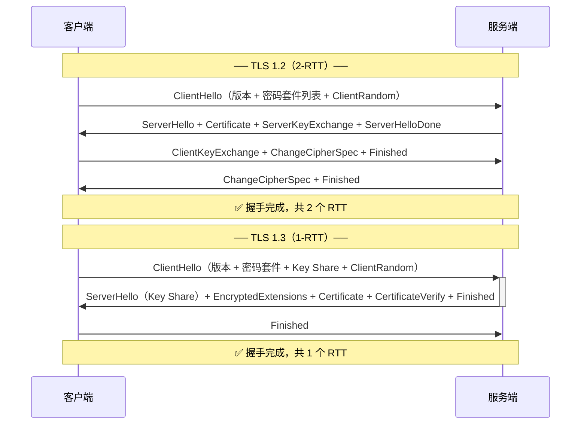
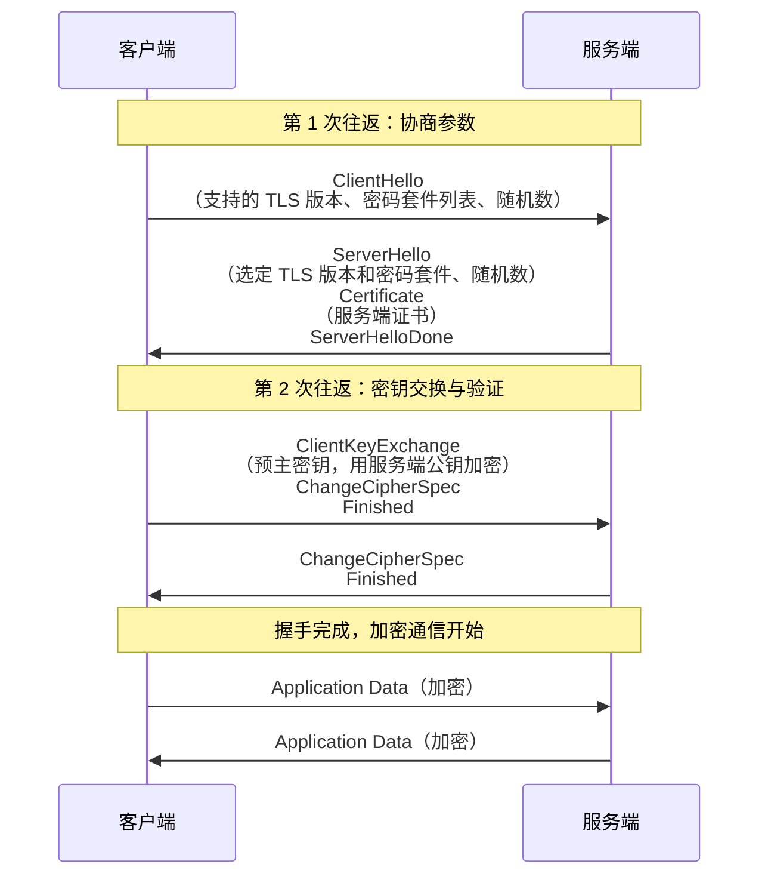
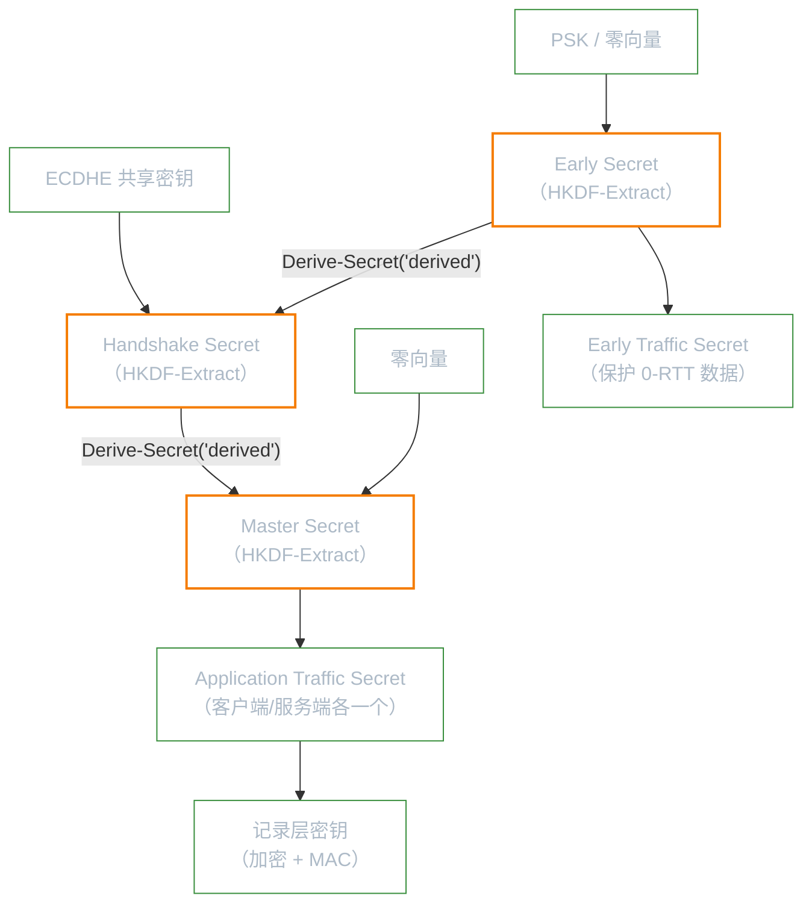
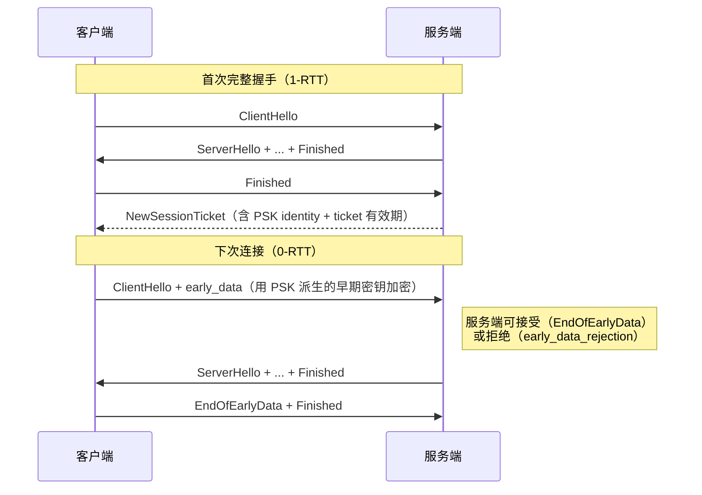
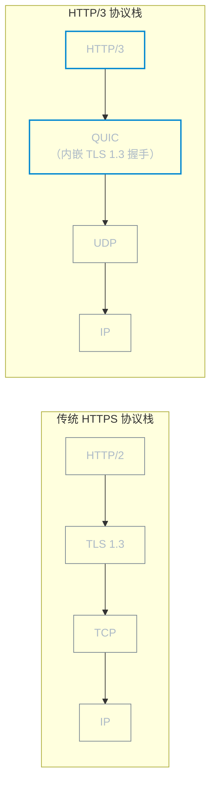
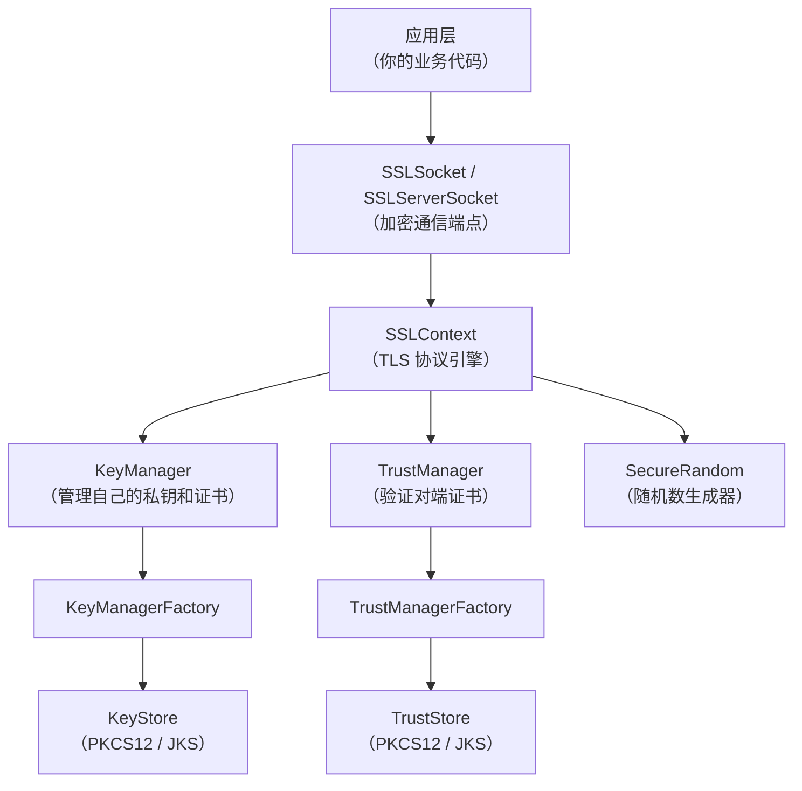
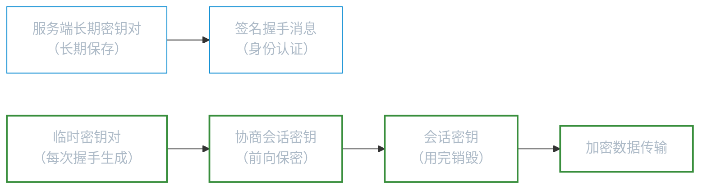

# TLS

**本文你会学到**：

- 为什么 `HTTP` 上的通信是不安全的，TLS 如何同时解决窃听、篡改和冒充三大威胁
- TLS 握手（handshake）的完整流程——客户端和服务端到底交换了哪些信息
- 密码套件（Cipher Suite）是什么，为什么 TLS 1.2 和 TLS 1.3 的套件设计截然不同
- Java 的 JSSE 框架如何让开发者用 `SSLContext` 几行代码就启用 TLS
- 如何在代码中加载自签名证书、自定义密码套件、实现 `TrustManager` 精细控制证书验证
- 自签名证书在开发和测试中的正确用法，以及生产环境中的证书管理策略
- JSSE 架构总览：Provider → `SSLContext` → `SSLSocket` 的数据流向
- 常见 TLS 配置问题与调优，以及使用中的典型陷阱（证书验证绕过、协议降级等）

## 为什么需要 TLS？

你打开浏览器访问 `https://www.example.com` 时，地址栏会出现一个锁头图标。这个锁头意味着你的通信被 TLS（Transport Layer Security，传输层安全协议）保护了。但如果不加这个锁头会怎样？

想象你在一间咖啡馆里用公共 Wi-Fi 给银行发了条消息："转账 10000 元到账户 A"。`HTTP` 是明文传输，咖啡馆的任何人只要抓个包就能看到这条消息。更可怕的是，攻击者可以篡改消息——把"账户 A"改成"账户 B"，你完全无法察觉。这就是中间人攻击（MITM，Man-in-the-Middle）。

TLS 解决的是网络通信中的三大威胁：

| 威胁 | 说明 | TLS 的对策 |
|------|------|-----------|
| **窃听**（eavesdropping） | 攻击者截获通信内容 | 对称加密（AES-256 等）保证机密性 |
| **篡改**（tampering） | 攻击者修改传输中的数据 | MAC / AEAD 保证完整性 |
| **冒充**（spoofing） | 攻击者伪装成合法服务端 | 数字证书 + 签名验证保证身份认证 |

💡 把 TLS 想象成寄一封挂号信——信件被放进密封袋（加密），封口有防拆贴纸（完整性），收件人必须出示身份证才能签收（认证），邮政系统会追踪每一步（握手协议）。

TLS 的前身是 SSL（Secure Sockets Layer），由 Netscape 在 1994 年设计。SSL 2.0 和 3.0 已被证明不安全，IETF 接手后将其更名为 TLS，目前主流版本是 TLS 1.2（RFC 5246）和 TLS 1.3（RFC 8446）。

### TLS 的威胁模型

要理解 TLS 为什么这样设计，需要先明确"TLS 要防谁"。

密码学协议分析中广泛使用 `Dolev-Yao 威胁模型`（Dolev & Yao, 1983）。在这个模型中，攻击者被赋予极大的能力：

- **完全控制网络**：可以窃听、拦截、修改、删除、注入任何网络消息
- **任意发起连接**：可以作为客户端连接任何服务端，也可以伪装成服务端等待客户端连接
- **拥有无限计算资源的参与者**：可以同时与多个诚实的客户端和服务端建立连接（用于发起并行会话攻击）

但攻击者**不能做的事**：
- 不能猜测到正确的随机数（计算不可行）
- 不能在没有私钥的情况下伪造签名
- 不能在没有密钥的情况下解密密文（在 Dolev-Yao 模型中，这是模型公理：密码学操作是符号化的黑盒）
- 不能破坏端点的本地安全（比如直接读取服务器内存）

这个模型的直觉是：**假设互联网是一个完全敌对的环境，除了你自己的电脑和你连接的服务器，其余一切都是不可信的**。咖啡馆的 Wi-Fi 路由器、ISP、国家级防火墙——都可能是攻击者。

⚠️ **符号模型 vs 计算模型**：原始 Dolev-Yao 模型假设攻击者有无限计算力，但密码学是"完美"的（黑盒操作）。TLS 的实际安全分析使用的是**计算模型**——攻击者是概率多项式时间（PPT）的，安全基于 CDH/DDH 等计算困难假设。Dolev-Yao 主要定义了攻击者的**网络能力**（完全控制信道），而 TLS 的安全分析在此基础上用计算假设来建模密码学原语。

TLS 的安全目标正是在这个强大的威胁模型下定义的：

| 安全目标 | 形式化定义 | 实现机制 |
|---------|-----------|---------|
| **机密性**（Confidentiality） | 攻击者无法区分真实密文与随机串 | 对称加密（AES-GCM / ChaCha20-Poly1305） |
| **完整性**（Integrity） | 攻击者无法构造一个能通过验证的伪造密文 | AEAD 认证标签 |
| **认证**（Authentication） | 攻击者无法让诚实客户端相信自己连接的是真实服务端 | 数字证书 + 签名验证 |

这三个目标缺一不可：只加密不认证，中间人可以替换密文（已知明文攻击）；只认证不加密，攻击者虽然不能冒充服务端，但能看到所有内容。

### TLS 1.3 的可证明安全

TLS 1.2 的安全性分析历史上一直存在问题——它的设计在多个地方违反了"加密与认证分离"的原则（比如 MAC-then-Encrypt 在 CBC 模式下容易受到 Padding Oracle 攻击），导致对 TLS 1.2 的形式化安全证明反复出现问题。

TLS 1.3 从设计之初就以**可证明安全**为目标（Krawczyk, Wee, 2017）。其核心设计决策：

- **只使用 AEAD**：强制使用认证加密模式（AES-GCM 或 ChaCha20-Poly1305），从根源上消除了加密与完整性分离的脆弱性
- **认证密钥交换基于 SIGMA**：TLS 1.3 的握手协议基于 SIGMA（SIGnature-and-MAC）协议框架，Krawczyk 在 2003 年就证明了 SIGMA 在随机预言模型下、基于 CDH 假设满足认证密钥交换的安全定义
- **密钥派生使用 HKDF**：基于 HMAC 的密钥派生，在随机预言模型下可证明安全性
- **统一密钥派生链**：所有密钥材料都通过一条 HKDF 链从主密钥（Master Secret）派生，确保不同阶段的密钥在计算上独立

这意味着 TLS 1.3 的安全性在随机预言模型下可以归约到标准的计算假设（CDH / DDH），而不需要额外的启发式假设。这是相比 TLS 1.2 最根本的安全改进。

## TLS 握手流程

TLS 连接建立前，客户端和服务端必须先进行一次"握手"——双方交换信息、协商参数、验证身份，最终生成共享的会话密钥。握手完成后的数据传输才能被加密保护。

### TLS 1.2 vs TLS 1.3：为什么要升级

`TLS 1.2`（RFC 5246，2008 年）在很长一段时间内是主流版本。但随着密码分析研究的深入，它暴露出越来越多的设计缺陷：`MAC-then-Encrypt` 在 CBC 模式下易受 Padding Oracle 攻击、支持数百个密码套件（其中大量是弱套件）、握手需要 2-RTT……这些问题催生了 `TLS 1.3`（RFC 8446，2018 年）。David Wong（RWC ch.9）指出："`TLS 1.3, unlike its predecessor, stems from a solid collaboration between the industry and academia.`"——它不是小改版，而是一次彻底重新设计。

#### 握手轮次对比

`TLS 1.2` 需要两次完整往返才能开始传输数据；`TLS 1.3` 通过在 `ClientHello` 中预先发送 `Key Share`，把握手压缩到 1-RTT：



#### 主要改进对比

| 维度 | TLS 1.2 | TLS 1.3 |
|------|---------|---------|
| **握手轮次** | 2-RTT（会话恢复可降至 1-RTT） | 1-RTT（0-RTT 可选早期数据） |
| **密钥交换** | RSA、DHE、ECDHE 均可选 | 仅 ECDHE / DHE（前向保密强制） |
| **加密模式** | CBC + MAC（易受 Padding Oracle） | 仅 AEAD（AES-GCM / ChaCha20-Poly1305） |
| **密码套件数量** | 数百个（含大量弱套件） | 仅 5 个（精选，无历史包袱） |
| **握手消息加密** | 握手消息明文传输 | `ServerHello` 之后全部加密 |
| **废弃算法** | 支持 RC4、3DES、MD5、SHA-1 | 全部移除 |
| **前向保密** | 可选（取决于密码套件选择） | 强制（所有会话均保证） |

🎯 **迁移建议**：新项目直接配置 `TLSv1.3`；历史系统若必须支持旧客户端，**至少启用 TLS 1.2** 并禁用 TLS 1.0/1.1——RFC 8996（2021 年）已正式废弃后两者。

### 完整握手过程

TLS 1.2 的完整握手涉及两次往返（2-RTT），TLS 1.3 压缩到了一次往返（1-RTT）。以下以 TLS 1.2 为例展示完整流程：



关键步骤解析：

1. **ClientHello**：客户端发送自己支持的 TLS 版本、密码套件列表和一个随机数 `ClientRandom`。密码套件列表就像菜单，客户端把自己"能吃"的都列出来，让服务端选一个双方都能接受的。
2. **ServerHello + Certificate**：服务端从列表中选一个密码套件，返回自己的随机数 `ServerRandom`，并把数字证书发给客户端。
3. **客户端验证证书**：客户端检查证书是否可信（是否由受信任的 CA 签发、是否过期、域名是否匹配等）。
4. **ClientKeyExchange**：客户端生成一个预主密钥（Pre-Master Secret），用服务端证书中的公钥加密后发给服务端。这样只有持有对应私钥的真正服务端才能解密。
5. **双方生成会话密钥**：客户端和服务端各自用 `ClientRandom + ServerRandom + Pre-Master Secret` 通过 KDF（密钥派生函数）计算出相同的对称密钥。从此双方用这个密钥进行加密通信。

⚠️ **TLS 1.3 的重大改进**：把 ServerHello 之后的步骤合并为一次往返，ServerHello 就直接带上密钥交换参数（Key Share），客户端收到后可以直接计算会话密钥并开始发送加密数据，将握手从 2-RTT 缩短到 1-RTT。同时移除了 RSA 密钥交换（只保留 ECDHE），从根本上杜绝了私钥泄露导致的历史流量被解密的风险。

### 密码套件（Cipher Suite）

密码套件是 TLS 握手时协商的核心参数，它定义了连接使用的所有加密算法。一个密码套件通常包含四个部分：

```
TLS_ECDHE_RSA_WITH_AES_128_GCM_SHA256
│    │     │       │    │     │
│    │     │       │    │     └── 哈希算法（SHA-256）
│    │     │       │    └── 认证加密模式（GCM）
│    │     │       └── 对称加密算法（AES-128）
│    │     └── 认证算法（RSA 签名）
│    └── 密钥交换算法（ECDHE）
└── 协议前缀
```

各部分的职责：

| 组件 | 职责 | 常见选项 |
|------|------|---------|
| **密钥交换** | 双方如何安全地协商出共享密钥 | `ECDHE`（临时椭圆曲线）、`RSA`（已不推荐） |
| **认证** | 验证服务端/客户端身份 | `RSA`、`ECDSA` |
| **对称加密** | 加密实际传输的数据 | `AES-128-GCM`、`AES-256-GCM`、`ChaCha20-Poly1305` |
| **哈希/PRF** | 用于密钥派生和完整性校验 | `SHA-256`、`SHA-384` |

TLS 1.2 与 TLS 1.3 的密码套件命名差异很大：

``` java title="查看 TLS 1.2 和 TLS 1.3 的默认密码套件"
// TLS 1.2 密码套件（命名包含所有算法组件）
// TLS_ECDHE_RSA_WITH_AES_128_GCM_SHA256
// TLS_ECDHE_RSA_WITH_AES_256_GCM_SHA384
// ...

// TLS 1.3 密码套件（只列出对称加密 + 哈希）
// 密钥交换固定为 ECDHE，认证由签名算法独立协商
// TLS_AES_128_GCM_SHA256
// TLS_AES_256_GCM_SHA384
// TLS_CHACHA20_POLY1305_SHA256
```

🎯 **实践建议**：生产环境应禁用所有包含 `RSA` 密钥交换的密码套件（如 `TLS_RSA_WITH_AES_128_CBC_SHA`），只保留 `ECDHE` 或 `DHE` 前缀的套件（提供前向保密）。TLS 1.3 默认只支持前向保密，无需额外配置。

### TLS 1.3 的密钥派生链

TLS 1.3 的另一个重要安全改进是**统一的密钥派生链**。握手过程中产生的所有密钥材料都通过一条 HKDF（HMAC-based Key Derivation Function）链从主密钥（Master Secret）派生，形成一个清晰的层级结构：



这条链路分为三个阶段（RFC 8446 Section 7.1）：

1. **Early Secret**：由 PSK（Pre-Shared Key）或零向量派生，用于保护 0-RTT 数据
2. **Handshake Secret**：由 Early Secret 派生的中间值与 ECDHE 共享密钥组合而成，用于保护握手消息
3. **Master Secret**：由 Handshake Secret 派生的中间值与零向量组合而成，用于派生应用数据加密密钥

此外，每个阶段的 Traffic Secret 都通过 `Derive-Secret` 函数绑定了**握手消息的哈希**（transcript hash）。这意味着如果握手消息被篡改，派生出的密钥会完全不同——攻击者无法在不被发现的情况下修改握手参数。

这种设计的理论意义在于：

- **密钥分离**（Key Separation）：不同用途的密钥（握手加密、应用数据加密、0-RTT）在计算上独立，一个密钥泄露不会影响其他密钥
- **前向保密的密钥层面保证**：Handshake Secret 依赖于 ECDHE 临时密钥，一旦握手完成，临时密钥销毁后，攻击者即使拿到 Master Secret 也无法回推 Handshake Secret（HKDF 的单向性）

### TLS 握手深度解析：密钥派生全流程

上一节描述了 HKDF 派生链的整体结构，这里深入每一步的参数细节，解释 `traffic key` 是如何从抽象的 Secret 变成 AES 实际可用的加密密钥的。

#### Derive-Secret 函数

TLS 1.3（RFC 8446 §7.1）定义了 `Derive-Secret(Secret, Label, Messages)` 函数：

```
Derive-Secret(Secret, Label, Messages) =
    HKDF-Expand-Label(Secret,
                      Label,
                      Transcript-Hash(Messages),
                      Hash.length)
```

其中 `Transcript-Hash` 是对**所有已发送握手消息**的哈希（SHA-256 或 SHA-384，取决于协商的密码套件）。这意味着每个阶段的密钥都绑定了当前为止的完整握手上下文——握手消息一旦被篡改，密钥就会完全不同。参见「随机性与密钥派生」中对 `HKDF` 的详细介绍。

#### 具体 Label 与对应密钥

| 派生的 Secret | Label 字符串 | 用途 |
|--------------|-------------|------|
| `c hs traffic` | client handshake traffic | 客户端加密握手消息 |
| `s hs traffic` | server handshake traffic | 服务端加密握手消息 |
| `c ap traffic` | client application traffic | 客户端加密应用数据（初始） |
| `s ap traffic` | server application traffic | 服务端加密应用数据（初始） |
| `exp master` | exporter master | 导出密钥材料（mTLS 等场景） |
| `res master` | resumption master | 生成 PSK（会话恢复所用） |

#### 从 Secret 到实际加密密钥

从 Traffic Secret 到真正的 `write_key`（加密密钥）和 `write_iv`（初始化向量）还需要再经过一次 `HKDF-Expand-Label` 推导：

```
write_key = HKDF-Expand-Label(TrafficSecret, "key", "", key_length)
write_iv  = HKDF-Expand-Label(TrafficSecret, "iv",  "", iv_length)
```

对于 `TLS_AES_128_GCM_SHA256`：`key_length = 16 字节`，`iv_length = 12 字节`。对于 `TLS_AES_256_GCM_SHA384`：`key_length = 32 字节`，`iv_length = 12 字节`。

每发送一条记录，`write_iv` 与单调递增的序列号（nonce）进行 XOR，防止 nonce 重复——这是 AEAD 的硬性安全要求，详见「随机性与密钥派生」中的 nonce 管理部分。

#### 密钥更新（KeyUpdate）

TLS 1.3 支持在不中断连接的情况下更新应用层 Traffic Secret，对长连接（如 gRPC 双向流）非常重要：

```
new_TrafficSecret = HKDF-Expand-Label(current_TrafficSecret, "traffic upd", "", Hash.length)
```

这是单向的 HKDF 扩展——新密钥无法反推旧密钥。即使新密钥被攻击者得到，历史流量仍然安全，这是前向保密在密钥层面的体现。

### 0-RTT 数据与重放攻击

TLS 1.3 引入了 `0-RTT`（Zero Round Trip Time）机制：当客户端之前与服务器建立过连接时，可以在握手的同时就发送应用数据，省掉一个往返延迟。这在短连接频繁的场景（如 HTTP/2、QUIC）中非常有用。

但 0-RTT 有一个根本性的安全限制：**它无法防止重放攻击**。

原因是：0-RTT 数据的加密密钥由客户端存储的 `PSK`（Pre-Shared Key）派生，服务端无法区分一条 0-RTT 消息是客户端新发送的还是攻击者截获后重放的——因为攻击者可以原样重放密文，服务端解密后得到的明文仍然有效。

```
客户端                    攻击者                    服务端
  │                        │                        │
  │── 0-RTT: "转账100元" ─→│                        │
  │                        │── (重放) 0-RTT ──────→│
  │                        │                        │── 执行"转账100元"
  │                        │── (再次重放) 0-RTT ──→│
  │                        │                        │── 再次"转账100元"
```

⚠️ 因此，**0-RTT 只能用于幂等操作**（如 HTTP GET 请求），绝不能用于非幂等操作（如支付、表单提交）。TLS 1.3 的 RFC 8446 明确要求实现者对 0-RTT 数据进行重放检测，但具体机制留给应用层实现。

### 0-RTT 恢复：性能与安全的权衡

理解 `0-RTT` 需要先清楚 `PSK`（Pre-Shared Key）是如何建立的。握手完成后，服务端可以随时发送 `NewSessionTicket` 消息，把 PSK 分发给客户端，供下次连接使用：



`NewSessionTicket` 本身是加密的，PSK 不会直接暴露，服务端持有解密 ticket 的密钥，整个机制无需在数据库存储每个会话——这是无状态的会话恢复设计。

#### 重放攻击的根本原因

`PSK` 的加密上下文只依赖 `ClientRandom` 和 PSK 本身，缺少能区分"本次发送"与"重放"的新鲜度证明（freshness proof）。服务端解密后看到的明文与首次发送时完全相同，无法判断是否已处理过。

**服务端防御策略**（RFC 8446 Appendix E.5）：

| 策略 | 原理 | 局限 |
|------|------|------|
| **Anti-replay DB** | 用单次性令牌数据库记录已用 PSK | 需要分布式存储，引入延迟 |
| **Freshness Check** | 限制 ticket 有效时间窗口（通常 < 10 秒） | 只能缩小窗口，无法完全消除 |
| **不接受 0-RTT** | 服务端直接拒绝 `early_data` | 零风险，但放弃性能收益 |

#### 何时安全使用 0-RTT

RWC ch.9 明确指出："0-RTT must be used only with application data that can be replayed safely."

- ✅ **可以使用**：`HTTP GET` 请求（语义上幂等，重放不产生副作用）、只读 API 查询、静态资源请求
- ❌ **绝不使用**：支付、转账等财务操作，`HTTP POST` 表单提交，任何会修改服务端状态的操作

Java 中，PSK / 0-RTT 相关能力在 JSSE 层面尚在演进，Netty 和 BouncyCastle 提供了更完整的实现支持；使用前应确认底层库的版本能力和 0-RTT 接受策略。

## TLS 现代协议演进

### QUIC 与 HTTP/3：TLS 嵌入传输层

`HTTP/3` 和底层的 `QUIC` 协议是下一代 Web 传输栈，它打破了"TLS 在 TCP 之上"的传统分层，将 `TLS 1.3` 作为不可分割的一部分内嵌进传输层本身。

#### 为什么需要 QUIC？

`HTTP/2` 在 `TCP` 上解决了 HTTP/1.1 的请求队头阻塞，但 TCP 本身带来了新的问题：**一个数据包的丢失会阻塞整个 TCP 连接上的所有 HTTP/2 流**（TCP 层队头阻塞）。`QUIC` 以 UDP 为基础，将可靠传输从内核移到用户态，不同 HTTP 流可以独立处理丢包，互不阻塞：



#### TLS 1.3 与 QUIC 的融合

QUIC 没有"先建立 TCP 连接，再做 TLS 握手"的两阶段流程。QUIC 握手**就是** TLS 1.3 握手，两者共用同一套密码学机制：

- **0-RTT 连接恢复**：已有 PSK 时，QUIC 握手 + 首条应用数据可在零额外 RTT 内完成
- **1-RTT 全新连接**：QUIC 的 `Initial` 包携带 TLS `ClientHello`，`Handshake` 包携带服务端响应，等价于 TLS 1.3 的 1-RTT 握手
- **连接迁移**（Connection Migration）：QUIC 连接绑定逻辑连接 ID 而非 IP + 端口，手机从 Wi-Fi 切换到 4G 不中断连接

#### `SNI` 与加密 ClientHello

`SNI`（Server Name Indication）是 TLS `ClientHello` 中携带目标域名的扩展字段，让同一 IP 上的多个 HTTPS 站点各自使用独立证书。但传统 TLS 中 `SNI` 是**明文**的——网络观察者即使无法解密内容，也能知道你在访问哪个域名。

`ECH`（Encrypted Client Hello，RFC 草案）通过 DNS 预先发布服务端公钥，将整个 `ClientHello` 加密传输，是当前 TLS 隐私保护的前沿进展。Cloudflare 和主流浏览器已开始实验性支持。

#### Java 中的 QUIC 支持现状

Java 21 标准库（`java.net`）暂不包含原生 QUIC 支持。主要方案：

| 方案 | 适用场景 |
|------|---------|
| **Netty QUIC codec**（`netty-incubator-codec-quic`） | 高性能服务端/客户端，基于 Netty 生态 |
| **Jetty 12+** | 内置 HTTP/3 支持，适合 Web 服务器场景 |
| **quiche4j**（基于 Cloudflare quiche） | 原生绑定，性能最佳，JNI 调用 |

证书配置与密钥管理见「证书与 PKI」；密钥交换底层原理见「密钥交换」。

## Java 中的 TLS——JSSE

Java 通过 JSSE（Java Secure Socket Extension，Java 安全套接字扩展）提供 TLS 支持。JSSE 将复杂的 TLS 协议封装成简洁的 API，开发者不需要手动处理握手细节，只需要配置好证书和密钥即可。

### SSLContext 与 TrustManager

`SSLContext` 是 JSSE 的核心入口，它封装了 TLS 协议的所有状态。创建一个可用的 `SSLContext` 需要三个组件：

| 组件 | 作用 | 服务端 | 客户端 |
|------|------|--------|--------|
| `KeyManager` | 管理自己的私钥和证书（证明"我是谁"） | 必需 | 可选（双向认证时需要） |
| `TrustManager` | 管理信任的 CA 证书（验证"对方是谁"） | 可选（双向认证时需要） | 必需 |
| `SecureRandom` | 提供随机数 | 必需 | 必需 |

💡 用办护照来类比：`KeyManager` 就像你口袋里的护照（证明你的身份），`TrustManager` 就像海关的检查员（验证对方的护照是否可信）。服务端需要护照让客户端验证，客户端需要检查员来验证服务端的护照。

``` java title="创建 SSLContext 并加载自签名证书"
--8<-- "code/topic/cryptography/tls/src/test/java/com/luguosong/crypto/TlsContextTest.java"
```

上面的代码展示了 JSSE 编程的标准流程：

1. **生成密钥材料**——通过 `CertificateUtil` 生成 RSA 密钥对和自签名证书
2. **构建 KeyStore**——存放服务端的私钥和证书（`setKeyEntry`）
3. **构建 TrustStore**——存放信任的证书（`setCertificateEntry`）
4. **初始化工厂**——用 KeyStore 初始化 `KeyManagerFactory`，用 TrustStore 初始化 `TrustManagerFactory`
5. **创建 SSLContext**——将 KeyManager 和 TrustManager 注入 `SSLContext`

### SSLServerSocket 与 SSLSocket

`SSLServerSocket` 和 `SSLSocket` 是 JSSE 对普通 `ServerSocket` 和 `Socket` 的 TLS 升级版。它们的用法几乎一样，只是所有数据传输都自动经过 TLS 加密。

``` java title="TLS 服务端监听与通信"
// 从 SSLContext 获取服务端套接字工厂
SSLServerSocketFactory fact = sslContext.getServerSocketFactory();
// 创建 SSLServerSocket（端口 0 表示自动分配）
SSLServerSocket serverSocket = (SSLServerSocket) fact.createServerSocket(0);

// 等待客户端连接（内部自动完成 TLS 握手）
SSLSocket clientSocket = (SSLSocket) serverSocket.accept();

// 握手完成后，获取协商结果
SSLSession session = clientSocket.getSession();
System.out.println("协商协议: " + session.getProtocol());
System.out.println("密码套件: " + session.getCipherSuite());

// 之后的读写操作与普通 Socket 完全相同，但数据已加密
BufferedReader reader = new BufferedReader(
        new InputStreamReader(clientSocket.getInputStream()));
String msg = reader.readLine();
```

``` java title="TLS 客户端连接与通信"
// 从 SSLContext 获取客户端套接字工厂
SSLSocketFactory fact = sslContext.getSocketFactory();
// 连接服务端（构造 SSLSocket 时自动触发 TLS 握手）
SSLSocket socket = (SSLSocket) fact.createSocket("localhost", port);

// 读写操作与普通 Socket 完全相同
PrintWriter writer = new PrintWriter(socket.getOutputStream(), true);
writer.println("Hello from TLS Client");
```

⚠️ `SSLSocket` 构造并连接后会自动完成 TLS 握手，开发者通常不需要手动调用 `startHandshake()`。但在需要精确控制握手时机（如先配置 SNI）的场景下，可以创建未连接的 Socket、配置参数后再连接。

## TLS 编程实战

理论了解得差不多了，现在看看如何在 Java 中实际编写 TLS 程序。我们从最基础的自签名证书场景开始，逐步深入到自定义密码套件和握手验证。

### 配置 SSLContext 加载自签名证书

在开发和测试环境中，使用自签名证书是最常见的方式。下面的代码演示了如何生成证书、构建 KeyStore/TrustStore、初始化 SSLContext，以及完成一次完整的 TLS 双向通信。

``` java title="完整 TLS 服务端 + 客户端通信"
--8<-- "code/topic/cryptography/tls/src/test/java/com/luguosong/crypto/TlsProtocolTest.java"
```

这段代码的核心思路是：服务端和客户端各自创建 `SSLContext`，服务端持有私钥（通过 `KeyManager`），客户端持有信任证书（通过 `TrustManager`）。双方通过 `CountDownLatch` 协调启动时序——服务端绑定端口后发出信号，客户端才开始连接。

### 自定义密码套件

某些安全合规场景要求只使用特定的密码套件。JSSE 允许你精确控制启用的套件列表：

``` java title="创建指定 TLS 版本的 SSLContext"
--8<-- "code/topic/cryptography/tls/src/test/java/com/luguosong/crypto/TlsContextTest.java"
```

如果需要限制服务端只接受特定密码套件，可以在 `SSLServerSocket` 上设置：

``` java title="限制服务端密码套件"
SSLServerSocket serverSocket = (SSLServerSocket) context
        .getServerSocketFactory().createServerSocket(0);

// 只启用 AES-256-GCM 相关的套件
String[] allowedSuites = {"TLS_ECDHE_RSA_WITH_AES_256_GCM_SHA384"};
serverSocket.setEnabledCipherSuites(allowedSuites);

// 限制 TLS 版本（禁用 SSLv3 和 TLS 1.0/1.1）
String[] allowedProtocols = {"TLSv1.2", "TLSv1.3"};
serverSocket.setEnabledProtocols(allowedProtocols);
```

⚠️ 设置 `setEnabledCipherSuites()` 时传入的数组必须来自 `getSupportedCipherSuites()` 返回的集合，否则会抛出 `IllegalArgumentException`。不要硬编码拼写，先查询再筛选。

### TLS 握手验证

握手是 TLS 安全的基石。在代码中，你可以通过 `SSLSession` 获取握手协商的详细信息：

``` java title="获取握手协商信息"
SSLSocket socket = (SSLSocket) factory.createSocket("localhost", port);
SSLSession session = socket.getSession();

System.out.println("协议版本: " + session.getProtocol());      // TLSv1.3
System.out.println("密码套件: " + session.getCipherSuite());   // TLS_AES_256_GCM_SHA384
System.out.println("对端证书: " + Arrays.toString(
        session.getPeerCertificates()));                        // 服务端证书链
```

通过 `SSLSocket.setEnabledProtocols()` 和 `SSLSocket.setEnabledCipherSuites()` 可以在客户端强制指定可接受的协议和密码套件，如果服务端不支持其中任何一个，握手将失败并抛出 `SSLHandshakeException`。

## 证书与信任管理

TLS 的安全性最终取决于证书验证的正确性。如果客户端盲目信任任何证书，那么中间人攻击者可以用自签名的假证书冒充真实服务端，TLS 的保护形同虚设。

### TrustManager 工作原理

`TrustManager` 是 JSSE 中负责验证对端证书的组件。Java 提供了一个 `X509TrustManager` 接口，包含三个方法：

| 方法 | 作用 |
|------|------|
| `checkServerTrusted(X509Certificate[] chain, String authType)` | 验证服务端证书链 |
| `checkClientTrusted(X509Certificate[] chain, String authType)` | 验证客户端证书链 |
| `getAcceptedIssuers()` | 返回受信任的 CA 证书列表 |

默认的 `TrustManagerFactory` 会初始化一个基于 PKIX（RFC 5280）的验证器，它会：

1. 检查证书链是否从受信任的根 CA 开始
2. 检查每个证书的有效期（是否过期）
3. 检查签名是否有效
4. 检查证书是否被吊销（CRL/OCSP，如果配置了的话）

如果你需要自定义验证逻辑（比如只信任某个特定证书），可以实现自己的 `X509TrustManager`：

``` java title="自定义 TrustManager 验证特定证书"
--8<-- "code/topic/cryptography/tls/src/test/java/com/luguosong/crypto/TlsProtocolTest.java"
```

### 自签名证书场景

自签名证书没有 CA 签名，默认的 `TrustManager` 会拒绝它。在开发和测试环境中，有三种常见的处理方式：

**方式一：将自签名证书导入 TrustStore**（推荐，最安全）

``` java title="将证书添加到 TrustStore"
KeyStore trustStore = KeyStore.getInstance("PKCS12");
trustStore.load(null, null);
trustStore.setCertificateEntry("server-cert", selfSignedCert);

TrustManagerFactory tmf = TrustManagerFactory.getInstance(
        TrustManagerFactory.getDefaultAlgorithm());
tmf.init(trustStore);
```

**方式二：使用自定义 TrustManager**

如上方代码所示，直接实现 `X509TrustManager`，在 `checkServerTrusted` 中做自定义验证。

**方式三：信任所有证书（仅限测试，禁止用于生产）**

``` java title="信任所有证书——仅用于测试环境"
TrustManager[] trustAllCerts = new TrustManager[]{
    new X509TrustManager() {
        public X509Certificate[] getAcceptedIssuers() { return new X509Certificate[0]; }
        public void checkClientTrusted(X509Certificate[] c, String a) {}
        public void checkServerTrusted(X509Certificate[] c, String a) {}
    }
};

SSLContext context = SSLContext.getInstance("TLS");
context.init(null, trustAllCerts, new SecureRandom());
```

⚠️ **方式三完全绕过了证书验证，等于关闭了 TLS 的身份认证功能**。中间人可以轻松用假证书冒充任何服务端。唯一可接受的场景是隔离的测试环境。

## JSSE 架构总览

理解 JSSE 各组件之间的关系，有助于在遇到 TLS 问题时快速定位原因：



数据流向：应用代码通过 `SSLSocket` 发送数据 → `SSLContext` 用协商好的对称密钥加密 → 底层 TCP Socket 传输密文 → 对端的 `SSLContext` 解密 → 对端应用代码收到明文。整个过程对应用层完全透明。

## 常见 TLS 问题与调优

### 证书验证失败

这是最常见的 TLS 异常，通常表现为 `SSLHandshakeException: PKIX path building failed` 或 `certificate_unknown`。排查步骤：

1. **确认证书是否在有效期内**——检查 `notBefore` 和 `notAfter`
2. **确认证书链是否完整**——中间证书是否都包含在内
3. **确认 TrustStore 中是否包含了根 CA 或中间 CA**
4. **确认主机名是否匹配**——证书的 CN 或 SAN（Subject Alternative Name）是否包含你连接的主机名

### 协议版本协商失败

如果客户端和服务端没有共同支持的 TLS 版本，握手会失败：

```text
javax.net.ssl.SSLHandshakeException: No appropriate protocol
```

解决方案：在 Socket 上显式启用双方都支持的协议版本。

``` java title="显式启用 TLS 1.2 和 TLS 1.3"
socket.setEnabledProtocols(new String[]{"TLSv1.2", "TLSv1.3"});
```

⚠️ 在 Java 8u292+ 和 Java 11+ 中，TLS 1.0 和 TLS 1.1 已被默认禁用。如果你的服务需要兼容老旧客户端，需要确认是否真的需要开启这些不安全的协议。

### 系统属性配置

JSSE 支持通过 JVM 系统属性全局配置 TLS 行为，这在运维场景中很实用：

| 属性 | 作用 | 示例 |
|------|------|------|
| `javax.net.ssl.keyStore` | 指定服务端私钥的 KeyStore 文件路径 | `file:/app/keystore.p12` |
| `javax.net.ssl.keyStorePassword` | KeyStore 密码 | `changeit` |
| `javax.net.ssl.trustStore` | 指定信任证书的 TrustStore 文件路径 | `file:/app/truststore.p12` |
| `javax.net.ssl.trustStorePassword` | TrustStore 密码 | `changeit` |
| `jdk.tls.client.protocols` | 客户端启用的 TLS 协议 | `TLSv1.2,TLSv1.3` |
| `jdk.tls.server.cipherSuites` | 服务端启用的密码套件 | `TLS_ECDHE_RSA_WITH_AES_256_GCM_SHA384` |

这些属性适合在启动脚本中设置，避免在代码中硬编码敏感信息：

```bash
java -Djavax.net.ssl.keyStore=/app/keystore.p12 \
     -Djavax.net.ssl.keyStorePassword=changeit \
     -Djavax.net.ssl.trustStore=/app/truststore.p12 \
     -jar myapp.jar
```

## 常见问题与陷阱

### 常见 TLS 配置错误与攻击

多年来，TLS 的协议降级机制（允许客户端和服务端协商更低版本）是大量攻击的根源。这些攻击的共同特征是：**利用服务端对旧版本的兼容性，强迫双方使用存在缺陷的密码算法**。

| 攻击 | 针对版本 | 攻击原理 | 根本防御 |
|------|---------|---------|---------|
| **POODLE** | SSL 3.0 | CBC 模式填充 Oracle，解密任意字节 | 禁用 SSL 3.0 |
| **BEAST** | TLS 1.0 | CBC 模式 IV 可预测，选择明文攻击 | 升级到 TLS 1.1+，或使用 RC4（已废弃）|
| **DROWN** | SSLv2 | 利用 SSLv2 导出密钥破解 TLS 1.x 会话 | 完全禁用 SSLv2，即使不主动使用 |
| **FREAK** | RSA 出口密钥 | 强迫使用 512 位 RSA，可在数小时内分解 | 禁用出口级密码套件 |
| **LOGJAM** | DHE 512 位 | 预计算 512 位 DH 离散对数 | 要求 DH 参数 ≥ 2048 位 |
| **Lucky13** | TLS 1.2 CBC | 利用 MAC 计算时间差异的 Padding Oracle | 升级到 TLS 1.3 / 使用 AEAD |
| **Raccoon Attack** | TLS 1.2 DHE | 利用 DH 共享密钥的时间侧信道 | 升级到 TLS 1.3 |

> RWC ch.9 对这类问题的评价是："These mitigations are often too complex to implement correctly."——历史证明，在老旧协议上打补丁极易出错，Lucky13 和 Bleichenbacher98 的修复方案被反复绕过。**正确答案是升级到 TLS 1.3**，而非为旧版本持续打补丁。

#### Java SSLContext 安全配置示例

``` java title="生产环境推荐的 SSLContext 安全配置"
SSLContext context = SSLContext.getInstance("TLS");
context.init(keyManagers, trustManagers, new SecureRandom());

// 从 SSLContext 获取服务端 Socket 工厂
SSLServerSocket serverSocket = (SSLServerSocket)
        context.getServerSocketFactory().createServerSocket(port);

// ✅ 只允许 TLS 1.2 和 TLS 1.3（禁用 SSL 3.0、TLS 1.0、TLS 1.1）
serverSocket.setEnabledProtocols(new String[]{"TLSv1.2", "TLSv1.3"});

// ✅ 只允许具有前向保密的 AEAD 密码套件
String[] secureSuites = Arrays.stream(serverSocket.getSupportedCipherSuites())
        .filter(s -> s.contains("ECDHE") || s.contains("DHE"))
        .filter(s -> s.contains("GCM") || s.contains("CHACHA20"))
        .toArray(String[]::new);
serverSocket.setEnabledCipherSuites(secureSuites);

// ❌ 不要做的事：
// serverSocket.setEnabledProtocols(new String[]{"SSLv3", "TLSv1"});   // 开启已废弃协议
// serverSocket.setEnabledCipherSuites(new String[]{"TLS_RSA_WITH_AES_128_CBC_SHA"}); // 无前向保密 + CBC 模式
```

⚠️ 最危险的配置错误是实现一个"信任所有证书"的 `TrustManager`（参见「自签名证书场景」一节），它会**完全关闭 TLS 身份认证**，让中间人攻击者得以用假证书冒充任何服务端。这种代码即使只在"测试环境"使用，一旦流入生产代码库也会造成严重漏洞。

### 开发环境 vs 生产环境的证书策略

| 场景 | 证书来源 | 信任策略 | 适用方案 |
|------|---------|---------|---------|
| 本地开发 | 自签名证书 | TrustStore 导入或自定义 TrustManager | `CertificateUtil.generateKeyMaterial()` |
| 测试环境 | 内部 CA 签发 | TrustStore 导入内部 CA 根证书 | 方式一（推荐） |
| 生产环境 | 公共 CA 签发（Let's Encrypt、DigiCert 等） | 使用 JDK 默认 cacerts | 无需额外配置 |

### 前向保密（Forward Secrecy）

前向保密（也叫完美前向保密，Perfect Forward Secrecy, PFS）解决的是一个很现实的问题：**如果服务端的长期私钥今天被泄露，攻击者能否解密昨天、上个月甚至去年截获的加密流量？**

#### 形式化定义

前向保密可以形式化为 `会话密钥独立性`（Session Key Independence）。设 sk₁, sk₂, ..., skₙ 是不同 TLS 会话的密钥，long_term_key 是服务端的长期私钥，则前向保密要求：

$$\text{sk}_i \perp \text{long\_term\_key} \quad \forall i$$

即每个会话密钥 skᵢ 在计算上独立于长期私钥——给定长期私钥，攻击者区分 skᵢ 与随机串的优势可忽略。

等价地说，即使攻击者在会话期间截获了所有握手消息（transcript），之后服务端长期私钥被泄露，攻击者仍然无法从 `(transcript, long\_term\_key)` 计算出会话密钥：

$$\text{Adv}^{\text{pfs}}(A) = \left| \Pr[A(\text{transcript}, \text{long\_term\_key}, \text{sk}_{\text{old}}) = 1] - \Pr[A(\text{transcript}, \text{long\_term\_key}, \$) = 1] \right| \leq \text{negl}(\lambda)$$

其中 \$ 表示与 sk_old 等长的真随机串，`transcript` 是攻击者在会话期间截获的所有握手消息。直觉上，PFS 的威胁场景正是"攻击者录下了所有流量，后来拿到了服务器私钥，但仍然无法解密录音"。

#### 临时密钥交换如何实现前向保密

实现前向保密的关键是**临时密钥交换**（Ephemeral Key Exchange）：每次 TLS 握手时，双方都生成全新的临时密钥对，用完即销毁。会话密钥由这些临时密钥协商得出，而不是由长期私钥直接派生。



长期私钥只用于**签名**（认证身份），不参与**密钥协商**（生成会话密钥）。即使长期私钥泄露，攻击者能做的只是伪造新连接的身份，但无法回溯解密历史会话——因为历史会话的临时密钥已经销毁，而恢复临时私钥需要解决 Diffie-Hellman 问题。

#### 为什么 RSA 密钥交换不满足前向保密

TLS 1.2 中 `TLS_RSA_WITH_...` 密码套件的工作方式是：客户端直接用服务端的**长期 RSA 公钥**加密预主密钥（Pre-Master Secret）。这意味着会话密钥完全由长期私钥保护——一旦长期私钥泄露，所有历史会话的预主密钥都可以被解密，进而恢复会话密钥。

这就是为什么 TLS 1.3 **完全移除了 RSA 密钥交换**，只保留 ECDHE/DHE：RSA 密钥交换在本质上无法实现前向保密，这是协议设计层面的限制，不是实现问题。

### 不要在生产代码中信任所有证书

在 Stack Overflow 上搜索 Java TLS 问题，排名第一的建议往往是"创建一个信任所有证书的 TrustManager"。这种方式虽然在开发时很方便，但放入生产环境会彻底破坏 TLS 安全性。

如果你的场景确实需要验证自签名证书（比如物联网设备通信），正确做法是实现自定义 `TrustManager`，在其中**精确匹配**预期证书的公钥或指纹：

``` java title="安全地验证特定自签名证书"
// 只信任公钥完全匹配的证书（比直接 trustAll 安全得多）
X509Certificate expected = loadExpectedCertificate();
X509Certificate server = chain[0];

if (!expected.getPublicKey().equals(server.getPublicKey())) {
    throw new CertificateException("证书公钥不匹配，可能遭受中间人攻击");
}
```

## 总结

TLS 是保护网络通信的基石协议，JSSE 让 Java 开发者能以声明式的方式使用它。核心知识点回顾：

- TLS 通过握手协议协商参数、验证身份、生成共享密钥
- `SSLContext` 是 JSSE 的入口，通过 `KeyManager` 和 `TrustManager` 分别管理自己的凭证和对端的信任
- 密码套件决定了连接使用的所有加密算法，生产环境应只启用 ECDHE + AES-GCM / ChaCha20-Poly1305
- 自定义 `TrustManager` 可以实现精细的证书验证逻辑，但绝不能简单地信任所有证书
- TLS 1.3 相比 1.2 在安全性和性能上都有大幅提升，新项目应优先使用

## 参考来源（本笔记增强部分）

- David Wong, *Real-World Cryptography* (Manning, 2021), Chapter 9: Secure transport
- 章节文本：会话工作区 `files/rwc-chapters/ch09.txt`
