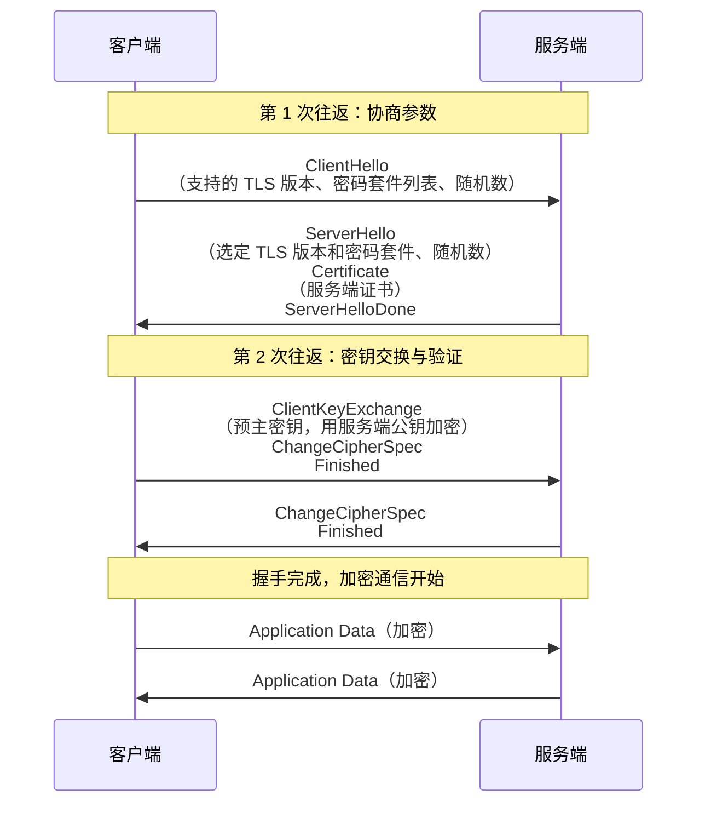
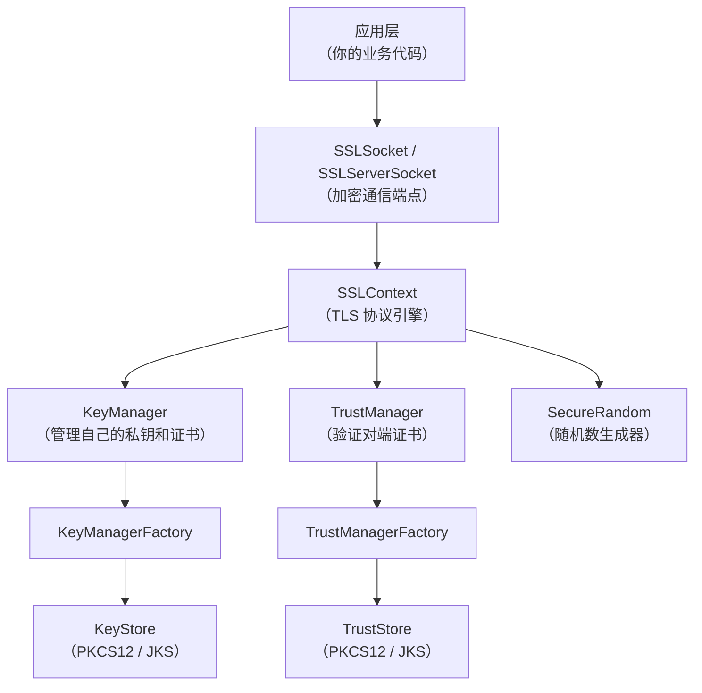

# TLS

**本文你会学到**：

- 为什么 `HTTP` 上的通信是不安全的，TLS 如何同时解决窃听、篡改和冒充三大威胁
- TLS 握手（handshake）的完整流程——客户端和服务端到底交换了哪些信息
- 密码套件（Cipher Suite）是什么，为什么 TLS 1.2 和 TLS 1.3 的套件设计截然不同
- Java 的 JSSE 框架如何让开发者用 `SSLContext` 几行代码就启用 TLS
- 如何在代码中加载自签名证书、自定义密码套件、实现 `TrustManager` 精细控制证书验证
- 自签名证书在开发和测试中的正确用法，以及生产环境中的证书管理策略

## 为什么需要 TLS？

你打开浏览器访问 `https://www.example.com` 时，地址栏会出现一个锁头图标。这个锁头意味着你的通信被 TLS（Transport Layer Security，传输层安全协议）保护了。但如果不加这个锁头会怎样？

想象你在一间咖啡馆里用公共 Wi-Fi 给银行发了条消息："转账 10000 元到账户 A"。`HTTP` 是明文传输，咖啡馆的任何人只要抓个包就能看到这条消息。更可怕的是，攻击者可以篡改消息——把"账户 A"改成"账户 B"，你完全无法察觉。这就是中间人攻击（MITM，Man-in-the-Middle）。

TLS 解决的是网络通信中的三大威胁：

| 威胁 | 说明 | TLS 的对策 |
|------|------|-----------|
| **窃听**（eavesdropping） | 攻击者截获通信内容 | 对称加密（AES-256 等）保证机密性 |
| **篡改**（tampering） | 攻击者修改传输中的数据 | MAC / AEAD 保证完整性 |
| **冒充**（spoofing） | 攻击者伪装成合法服务端 | 数字证书 + 签名验证保证身份认证 |

💡 把 TLS 想象成寄一封挂号信——信件被放进密封袋（加密），封口有防拆贴纸（完整性），收件人必须出示身份证才能签收（认证），邮政系统会追踪每一步（握手协议）。

TLS 的前身是 SSL（Secure Sockets Layer），由 Netscape 在 1994 年设计。SSL 2.0 和 3.0 已被证明不安全，IETF 接手后将其更名为 TLS，目前主流版本是 TLS 1.2（RFC 5246）和 TLS 1.3（RFC 8446）。

## TLS 握手流程

TLS 连接建立前，客户端和服务端必须先进行一次"握手"——双方交换信息、协商参数、验证身份，最终生成共享的会话密钥。握手完成后的数据传输才能被加密保护。

### 完整握手过程

TLS 1.2 的完整握手涉及两次往返（2-RTT），TLS 1.3 压缩到了一次往返（1-RTT）。以下以 TLS 1.2 为例展示完整流程：



关键步骤解析：

1. **ClientHello**：客户端发送自己支持的 TLS 版本、密码套件列表和一个随机数 `ClientRandom`。密码套件列表就像菜单，客户端把自己"能吃"的都列出来，让服务端选一个双方都能接受的。
2. **ServerHello + Certificate**：服务端从列表中选一个密码套件，返回自己的随机数 `ServerRandom`，并把数字证书发给客户端。
3. **客户端验证证书**：客户端检查证书是否可信（是否由受信任的 CA 签发、是否过期、域名是否匹配等）。
4. **ClientKeyExchange**：客户端生成一个预主密钥（Pre-Master Secret），用服务端证书中的公钥加密后发给服务端。这样只有持有对应私钥的真正服务端才能解密。
5. **双方生成会话密钥**：客户端和服务端各自用 `ClientRandom + ServerRandom + Pre-Master Secret` 通过 KDF（密钥派生函数）计算出相同的对称密钥。从此双方用这个密钥进行加密通信。

⚠️ **TLS 1.3 的重大改进**：把 ServerHello 之后的步骤合并为一次往返，ServerHello 就直接带上密钥交换参数（Key Share），客户端收到后可以直接计算会话密钥并开始发送加密数据，将握手从 2-RTT 缩短到 1-RTT。同时移除了 RSA 密钥交换（只保留 ECDHE），从根本上杜绝了私钥泄露导致的历史流量被解密的风险。

### 密码套件（Cipher Suite）

密码套件是 TLS 握手时协商的核心参数，它定义了连接使用的所有加密算法。一个密码套件通常包含四个部分：

```
TLS_ECDHE_RSA_WITH_AES_128_GCM_SHA256
│    │     │       │    │     │
│    │     │       │    │     └── 哈希算法（SHA-256）
│    │     │       │    └── 认证加密模式（GCM）
│    │     │       └── 对称加密算法（AES-128）
│    │     └── 认证算法（RSA 签名）
│    └── 密钥交换算法（ECDHE）
└── 协议前缀
```

各部分的职责：

| 组件 | 职责 | 常见选项 |
|------|------|---------|
| **密钥交换** | 双方如何安全地协商出共享密钥 | `ECDHE`（临时椭圆曲线）、`RSA`（已不推荐） |
| **认证** | 验证服务端/客户端身份 | `RSA`、`ECDSA` |
| **对称加密** | 加密实际传输的数据 | `AES-128-GCM`、`AES-256-GCM`、`ChaCha20-Poly1305` |
| **哈希/PRF** | 用于密钥派生和完整性校验 | `SHA-256`、`SHA-384` |

TLS 1.2 与 TLS 1.3 的密码套件命名差异很大：

``` java title="查看 TLS 1.2 和 TLS 1.3 的默认密码套件"
// TLS 1.2 密码套件（命名包含所有算法组件）
// TLS_ECDHE_RSA_WITH_AES_128_GCM_SHA256
// TLS_ECDHE_RSA_WITH_AES_256_GCM_SHA384
// ...

// TLS 1.3 密码套件（只列出对称加密 + 哈希）
// 密钥交换固定为 ECDHE，认证由签名算法独立协商
// TLS_AES_128_GCM_SHA256
// TLS_AES_256_GCM_SHA384
// TLS_CHACHA20_POLY1305_SHA256
```

🎯 **实践建议**：生产环境应禁用所有包含 `RSA` 密钥交换的密码套件（如 `TLS_RSA_WITH_AES_128_CBC_SHA`），只保留 `ECDHE` 或 `DHE` 前缀的套件（提供前向保密）。TLS 1.3 默认只支持前向保密，无需额外配置。

## Java 中的 TLS——JSSE

Java 通过 JSSE（Java Secure Socket Extension，Java 安全套接字扩展）提供 TLS 支持。JSSE 将复杂的 TLS 协议封装成简洁的 API，开发者不需要手动处理握手细节，只需要配置好证书和密钥即可。

### SSLContext 与 TrustManager

`SSLContext` 是 JSSE 的核心入口，它封装了 TLS 协议的所有状态。创建一个可用的 `SSLContext` 需要三个组件：

| 组件 | 作用 | 服务端 | 客户端 |
|------|------|--------|--------|
| `KeyManager` | 管理自己的私钥和证书（证明"我是谁"） | 必需 | 可选（双向认证时需要） |
| `TrustManager` | 管理信任的 CA 证书（验证"对方是谁"） | 可选（双向认证时需要） | 必需 |
| `SecureRandom` | 提供随机数 | 必需 | 必需 |

💡 用办护照来类比：`KeyManager` 就像你口袋里的护照（证明你的身份），`TrustManager` 就像海关的检查员（验证对方的护照是否可信）。服务端需要护照让客户端验证，客户端需要检查员来验证服务端的护照。

``` java title="创建 SSLContext 并加载自签名证书"
--8<-- "code/topic/cryptography/tls/src/test/java/com/luguosong/crypto/TlsContextTest.java"
```

上面的代码展示了 JSSE 编程的标准流程：

1. **生成密钥材料**——通过 `CertificateUtil` 生成 RSA 密钥对和自签名证书
2. **构建 KeyStore**——存放服务端的私钥和证书（`setKeyEntry`）
3. **构建 TrustStore**——存放信任的证书（`setCertificateEntry`）
4. **初始化工厂**——用 KeyStore 初始化 `KeyManagerFactory`，用 TrustStore 初始化 `TrustManagerFactory`
5. **创建 SSLContext**——将 KeyManager 和 TrustManager 注入 `SSLContext`

### SSLServerSocket 与 SSLSocket

`SSLServerSocket` 和 `SSLSocket` 是 JSSE 对普通 `ServerSocket` 和 `Socket` 的 TLS 升级版。它们的用法几乎一样，只是所有数据传输都自动经过 TLS 加密。

``` java title="TLS 服务端监听与通信"
// 从 SSLContext 获取服务端套接字工厂
SSLServerSocketFactory fact = sslContext.getServerSocketFactory();
// 创建 SSLServerSocket（端口 0 表示自动分配）
SSLServerSocket serverSocket = (SSLServerSocket) fact.createServerSocket(0);

// 等待客户端连接（内部自动完成 TLS 握手）
SSLSocket clientSocket = (SSLSocket) serverSocket.accept();

// 握手完成后，获取协商结果
SSLSession session = clientSocket.getSession();
System.out.println("协商协议: " + session.getProtocol());
System.out.println("密码套件: " + session.getCipherSuite());

// 之后的读写操作与普通 Socket 完全相同，但数据已加密
BufferedReader reader = new BufferedReader(
        new InputStreamReader(clientSocket.getInputStream()));
String msg = reader.readLine();
```

``` java title="TLS 客户端连接与通信"
// 从 SSLContext 获取客户端套接字工厂
SSLSocketFactory fact = sslContext.getSocketFactory();
// 连接服务端（构造 SSLSocket 时自动触发 TLS 握手）
SSLSocket socket = (SSLSocket) fact.createSocket("localhost", port);

// 读写操作与普通 Socket 完全相同
PrintWriter writer = new PrintWriter(socket.getOutputStream(), true);
writer.println("Hello from TLS Client");
```

⚠️ `SSLSocket` 构造并连接后会自动完成 TLS 握手，开发者通常不需要手动调用 `startHandshake()`。但在需要精确控制握手时机（如先配置 SNI）的场景下，可以创建未连接的 Socket、配置参数后再连接。

## TLS 编程实战

理论了解得差不多了，现在看看如何在 Java 中实际编写 TLS 程序。我们从最基础的自签名证书场景开始，逐步深入到自定义密码套件和握手验证。

### 配置 SSLContext 加载自签名证书

在开发和测试环境中，使用自签名证书是最常见的方式。下面的代码演示了如何生成证书、构建 KeyStore/TrustStore、初始化 SSLContext，以及完成一次完整的 TLS 双向通信。

``` java title="完整 TLS 服务端 + 客户端通信"
--8<-- "code/topic/cryptography/tls/src/test/java/com/luguosong/crypto/TlsProtocolTest.java"
```

这段代码的核心思路是：服务端和客户端各自创建 `SSLContext`，服务端持有私钥（通过 `KeyManager`），客户端持有信任证书（通过 `TrustManager`）。双方通过 `CountDownLatch` 协调启动时序——服务端绑定端口后发出信号，客户端才开始连接。

### 自定义密码套件

某些安全合规场景要求只使用特定的密码套件。JSSE 允许你精确控制启用的套件列表：

``` java title="创建指定 TLS 版本的 SSLContext"
--8<-- "code/topic/cryptography/tls/src/test/java/com/luguosong/crypto/TlsContextTest.java"
```

如果需要限制服务端只接受特定密码套件，可以在 `SSLServerSocket` 上设置：

``` java title="限制服务端密码套件"
SSLServerSocket serverSocket = (SSLServerSocket) context
        .getServerSocketFactory().createServerSocket(0);

// 只启用 AES-256-GCM 相关的套件
String[] allowedSuites = {"TLS_ECDHE_RSA_WITH_AES_256_GCM_SHA384"};
serverSocket.setEnabledCipherSuites(allowedSuites);

// 限制 TLS 版本（禁用 SSLv3 和 TLS 1.0/1.1）
String[] allowedProtocols = {"TLSv1.2", "TLSv1.3"};
serverSocket.setEnabledProtocols(allowedProtocols);
```

⚠️ 设置 `setEnabledCipherSuites()` 时传入的数组必须来自 `getSupportedCipherSuites()` 返回的集合，否则会抛出 `IllegalArgumentException`。不要硬编码拼写，先查询再筛选。

### TLS 握手验证

握手是 TLS 安全的基石。在代码中，你可以通过 `SSLSession` 获取握手协商的详细信息：

``` java title="获取握手协商信息"
SSLSocket socket = (SSLSocket) factory.createSocket("localhost", port);
SSLSession session = socket.getSession();

System.out.println("协议版本: " + session.getProtocol());      // TLSv1.3
System.out.println("密码套件: " + session.getCipherSuite());   // TLS_AES_256_GCM_SHA384
System.out.println("对端证书: " + Arrays.toString(
        session.getPeerCertificates()));                        // 服务端证书链
```

通过 `SSLSocket.setEnabledProtocols()` 和 `SSLSocket.setEnabledCipherSuites()` 可以在客户端强制指定可接受的协议和密码套件，如果服务端不支持其中任何一个，握手将失败并抛出 `SSLHandshakeException`。

## 证书与信任管理

TLS 的安全性最终取决于证书验证的正确性。如果客户端盲目信任任何证书，那么中间人攻击者可以用自签名的假证书冒充真实服务端，TLS 的保护形同虚设。

### TrustManager 工作原理

`TrustManager` 是 JSSE 中负责验证对端证书的组件。Java 提供了一个 `X509TrustManager` 接口，包含三个方法：

| 方法 | 作用 |
|------|------|
| `checkServerTrusted(X509Certificate[] chain, String authType)` | 验证服务端证书链 |
| `checkClientTrusted(X509Certificate[] chain, String authType)` | 验证客户端证书链 |
| `getAcceptedIssuers()` | 返回受信任的 CA 证书列表 |

默认的 `TrustManagerFactory` 会初始化一个基于 PKIX（RFC 5280）的验证器，它会：

1. 检查证书链是否从受信任的根 CA 开始
2. 检查每个证书的有效期（是否过期）
3. 检查签名是否有效
4. 检查证书是否被吊销（CRL/OCSP，如果配置了的话）

如果你需要自定义验证逻辑（比如只信任某个特定证书），可以实现自己的 `X509TrustManager`：

``` java title="自定义 TrustManager 验证特定证书"
--8<-- "code/topic/cryptography/tls/src/test/java/com/luguosong/crypto/TlsProtocolTest.java"
```

### 自签名证书场景

自签名证书没有 CA 签名，默认的 `TrustManager` 会拒绝它。在开发和测试环境中，有三种常见的处理方式：

**方式一：将自签名证书导入 TrustStore**（推荐，最安全）

``` java title="将证书添加到 TrustStore"
KeyStore trustStore = KeyStore.getInstance("PKCS12");
trustStore.load(null, null);
trustStore.setCertificateEntry("server-cert", selfSignedCert);

TrustManagerFactory tmf = TrustManagerFactory.getInstance(
        TrustManagerFactory.getDefaultAlgorithm());
tmf.init(trustStore);
```

**方式二：使用自定义 TrustManager**

如上方代码所示，直接实现 `X509TrustManager`，在 `checkServerTrusted` 中做自定义验证。

**方式三：信任所有证书（仅限测试，禁止用于生产）**

``` java title="信任所有证书——仅用于测试环境"
TrustManager[] trustAllCerts = new TrustManager[]{
    new X509TrustManager() {
        public X509Certificate[] getAcceptedIssuers() { return new X509Certificate[0]; }
        public void checkClientTrusted(X509Certificate[] c, String a) {}
        public void checkServerTrusted(X509Certificate[] c, String a) {}
    }
};

SSLContext context = SSLContext.getInstance("TLS");
context.init(null, trustAllCerts, new SecureRandom());
```

⚠️ **方式三完全绕过了证书验证，等于关闭了 TLS 的身份认证功能**。中间人可以轻松用假证书冒充任何服务端。唯一可接受的场景是隔离的测试环境。

## JSSE 架构总览

理解 JSSE 各组件之间的关系，有助于在遇到 TLS 问题时快速定位原因：



数据流向：应用代码通过 `SSLSocket` 发送数据 → `SSLContext` 用协商好的对称密钥加密 → 底层 TCP Socket 传输密文 → 对端的 `SSLContext` 解密 → 对端应用代码收到明文。整个过程对应用层完全透明。

## 常见 TLS 问题与调优

### 证书验证失败

这是最常见的 TLS 异常，通常表现为 `SSLHandshakeException: PKIX path building failed` 或 `certificate_unknown`。排查步骤：

1. **确认证书是否在有效期内**——检查 `notBefore` 和 `notAfter`
2. **确认证书链是否完整**——中间证书是否都包含在内
3. **确认 TrustStore 中是否包含了根 CA 或中间 CA**
4. **确认主机名是否匹配**——证书的 CN 或 SAN（Subject Alternative Name）是否包含你连接的主机名

### 协议版本协商失败

如果客户端和服务端没有共同支持的 TLS 版本，握手会失败：

```text
javax.net.ssl.SSLHandshakeException: No appropriate protocol
```

解决方案：在 Socket 上显式启用双方都支持的协议版本。

``` java title="显式启用 TLS 1.2 和 TLS 1.3"
socket.setEnabledProtocols(new String[]{"TLSv1.2", "TLSv1.3"});
```

⚠️ 在 Java 8u292+ 和 Java 11+ 中，TLS 1.0 和 TLS 1.1 已被默认禁用。如果你的服务需要兼容老旧客户端，需要确认是否真的需要开启这些不安全的协议。

### 系统属性配置

JSSE 支持通过 JVM 系统属性全局配置 TLS 行为，这在运维场景中很实用：

| 属性 | 作用 | 示例 |
|------|------|------|
| `javax.net.ssl.keyStore` | 指定服务端私钥的 KeyStore 文件路径 | `file:/app/keystore.p12` |
| `javax.net.ssl.keyStorePassword` | KeyStore 密码 | `changeit` |
| `javax.net.ssl.trustStore` | 指定信任证书的 TrustStore 文件路径 | `file:/app/truststore.p12` |
| `javax.net.ssl.trustStorePassword` | TrustStore 密码 | `changeit` |
| `jdk.tls.client.protocols` | 客户端启用的 TLS 协议 | `TLSv1.2,TLSv1.3` |
| `jdk.tls.server.cipherSuites` | 服务端启用的密码套件 | `TLS_ECDHE_RSA_WITH_AES_256_GCM_SHA384` |

这些属性适合在启动脚本中设置，避免在代码中硬编码敏感信息：

```bash
java -Djavax.net.ssl.keyStore=/app/keystore.p12 \
     -Djavax.net.ssl.keyStorePassword=changeit \
     -Djavax.net.ssl.trustStore=/app/truststore.p12 \
     -jar myapp.jar
```

## 常见问题与陷阱

### 开发环境 vs 生产环境的证书策略

| 场景 | 证书来源 | 信任策略 | 适用方案 |
|------|---------|---------|---------|
| 本地开发 | 自签名证书 | TrustStore 导入或自定义 TrustManager | `CertificateUtil.generateKeyMaterial()` |
| 测试环境 | 内部 CA 签发 | TrustStore 导入内部 CA 根证书 | 方式一（推荐） |
| 生产环境 | 公共 CA 签发（Let's Encrypt、DigiCert 等） | 使用 JDK 默认 cacerts | 无需额外配置 |

### 前向保密（Forward Secrecy）

前向保密意味着即使服务端的长期私钥在未来被泄露，攻击者也无法解密之前截获的加密流量。实现前向保密的关键是使用**临时密钥交换**（ECDHE 或 DHE），每次握手都生成全新的临时密钥对。

- TLS 1.2 中需要主动选择 `ECDHE` 前缀的密码套件
- TLS 1.3 已经强制所有密码套件使用 ECDHE，天然支持前向保密

🎯 **检查你的连接是否支持前向保密**：查看协商的密码套件，只要包含 `DHE` 或 `ECDHE` 就说明支持。如果套件是 `TLS_RSA_WITH_...` 则不支持。

### 不要在生产代码中信任所有证书

在 Stack Overflow 上搜索 Java TLS 问题，排名第一的建议往往是"创建一个信任所有证书的 TrustManager"。这种方式虽然在开发时很方便，但放入生产环境会彻底破坏 TLS 安全性。

如果你的场景确实需要验证自签名证书（比如物联网设备通信），正确做法是实现自定义 `TrustManager`，在其中**精确匹配**预期证书的公钥或指纹：

``` java title="安全地验证特定自签名证书"
// 只信任公钥完全匹配的证书（比直接 trustAll 安全得多）
X509Certificate expected = loadExpectedCertificate();
X509Certificate server = chain[0];

if (!expected.getPublicKey().equals(server.getPublicKey())) {
    throw new CertificateException("证书公钥不匹配，可能遭受中间人攻击");
}
```

## 总结

TLS 是保护网络通信的基石协议，JSSE 让 Java 开发者能以声明式的方式使用它。核心知识点回顾：

- TLS 通过握手协议协商参数、验证身份、生成共享密钥
- `SSLContext` 是 JSSE 的入口，通过 `KeyManager` 和 `TrustManager` 分别管理自己的凭证和对端的信任
- 密码套件决定了连接使用的所有加密算法，生产环境应只启用 ECDHE + AES-GCM / ChaCha20-Poly1305
- 自定义 `TrustManager` 可以实现精细的证书验证逻辑，但绝不能简单地信任所有证书
- TLS 1.3 相比 1.2 在安全性和性能上都有大幅提升，新项目应优先使用
