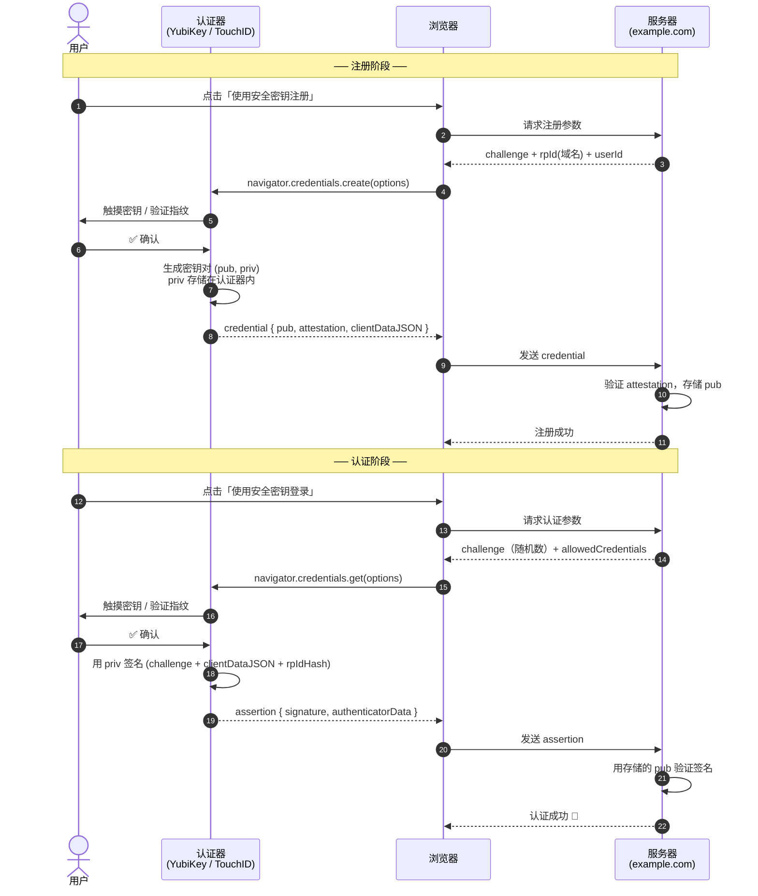
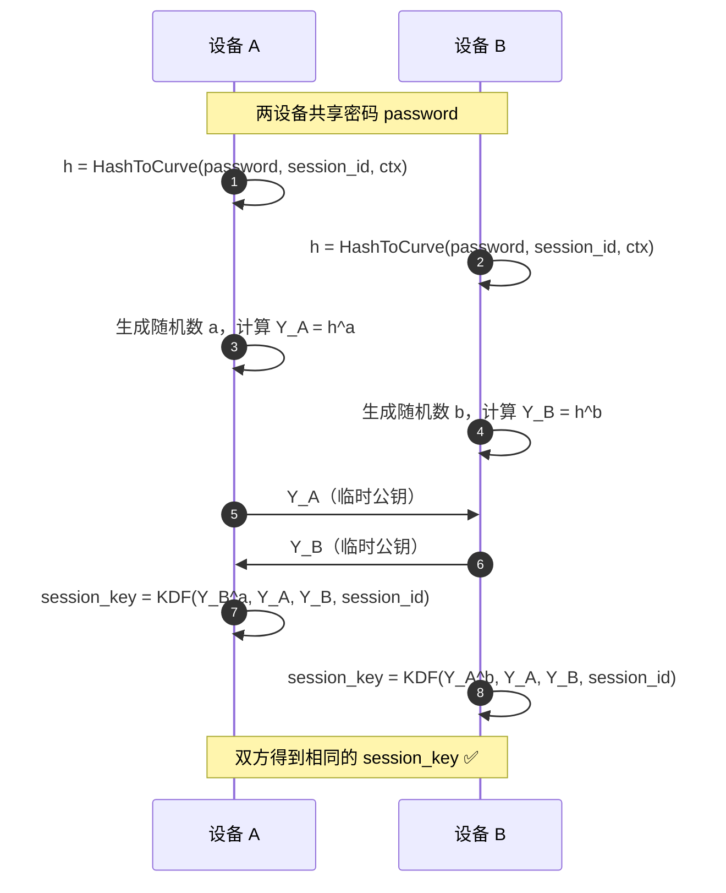
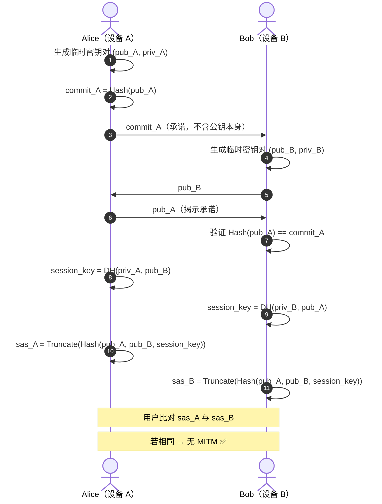

# 用户认证

密码已经存在 50 多年了——它们糟糕透顶，每年都有专家宣告"密码已死"，但它至今仍是最广泛使用的认证手段。为什么？因为没有任何单一方案能在安全性、易用性和兼容性之间做到完美平衡。本文带你系统梳理现代认证技术的全貌。

**本文你会学到**：

- 认证的三种基本维度（你知道什么 / 你拥有什么 / 你是什么）
- 密码为什么烂透了，以及服务器应该如何正确存储密码
- `SSO` 与密码管理器如何减少密码数量
- `OPAQUE`（aPAKE）如何做到服务器永远看不到用户密码
- `HOTP` / `TOTP` 基于对称密钥的一次性密码原理
- `WebAuthn` / `FIDO2` 如何用非对称密钥彻底取代密码
- 设备配对场景中的 `CPace` 与 `SAS` 短认证字符串

---

## 🔑 认证的三种维度

在密码学中，认证（Authentication）回答一个问题：**你是谁，我怎么相信你？** 与加密（保护数据不被窃听）和完整性校验（保护数据不被篡改）不同，认证的核心是身份绑定。

认证因子通常归为三类：

- **你知道什么（Knowledge）**：密码、PIN、安全问题答案
- **你拥有什么（Possession）**：手机、硬件安全密钥（YubiKey）、智能卡
- **你是什么（Inherence）**：指纹、面部识别、声纹等生物特征

单独使用任意一种都存在风险，现代系统越来越多地组合两种或以上——即多因素认证（MFA，Multi-Factor Authentication）。

> 📌 本章中涉及的认证场景分三类：**用户认证**（机器认证人类）、**机器认证**（机器互相认证）、**用户辅助认证**（人辅助机器互相认证）。本文重点覆盖第一和第三类。

---

## 😫 密码：永远的痛

### 密码为什么烂透了

你大概经历过这样的流程：

1. 用用户名 + 密码注册一个网站
2. 用凭据登录
3. 密码泄露或被迫修改密码
4. 如果不走运——你的密码（或其哈希值）在某次数据库泄露中流出

> 81% 的黑客相关数据泄露利用了弱密码或被盗密码。 ——Verizon 数据泄露报告（2017）

问题有两层：

**服务器端**：很多网站仍以明文存储密码。一旦数据库泄露，攻击者能直接拿到所有密码，并用它们尝试登录其他网站（撞库攻击）。

**用户端**：人类天生不善于创建强密码。我们倾向于选择短的、好记的密码，并且在不同网站复用同一个密码。网站强制要求"使用特殊字符"或"每 6 个月修改密码"不过是治标不治本。

### 服务器存储密码的正确姿势

正确答案不是明文存储，而是使用**密码哈希算法**（Password Hashing）。

服务器在注册时应：

1. 为每个用户生成唯一的随机盐值（`salt`）
2. 计算 `hash = PasswordHash(password, salt)`（推荐 `Argon2`）
3. 仅存储 `(salt, hash)`，而非明文密码

登录时，服务器用同样的盐和算法对用户输入的密码计算哈希值，再与存储的哈希值做**常数时间比较**（防止时序攻击）。

即使如此，这仍然有缺陷：每次用户登录，密码都会以明文形式在网络上传输（TLS 保护信道，但服务器仍能看到）。下文介绍的 `OPAQUE` 正是为了解决这个问题。

> 🔗 密码哈希存储详见「基于密码的密钥生成」。

---

## 🗝️ 一个密码统治所有

### SSO：把信任委托给身份提供者

密码复用的根源在于用户不愿意（也记不住）为每个网站创建不同的密码。`SSO`（Single Sign-On，单点登录）的思路是：**只需要记住一个账号的密码，就能登录多个服务**。

你一定见过"使用 Google 账号登录"或"使用微信登录"——这就是 SSO。

SSO 就像一张通行证：你在签证处（身份提供者）验明正身后，拿到通行证，之后进入各个展馆（服务商）只需出示通行证，无需再次排队验证。

目前主流的 SSO 协议有两个：

- `SAML 2.0`（Security Assertion Markup Language）：使用 XML 编码，多见于企业环境，属于遗留协议
- `OIDC`（OpenID Connect）：基于 `OAuth 2.0`（RFC 6749），使用 JSON 编码，是现代 Web 和移动应用的主流选择

> ⚠️ `OAuth 2.0` 因设计复杂而臭名昭著，容易被误用。2020 年，苹果的 Sign-in with Apple（偏离了 OIDC 规范）被发现漏洞，任何人仅需查询苹果服务器即可获取任意账号的有效 ID token。**请严格遵循标准，参考最佳实践。**

SSO 的局限性在于：用户仍然需要一个密码来登录身份提供者（如 Google）。它减少了密码的数量，而不是消灭了密码。

### 密码管理器：客户端解决方案

当所有服务都支持统一的 SSO 提供者并不现实时，密码管理器是另一条路：**用户只需记住一个主密码，其余所有密码由管理器生成和存储**。

现代浏览器已内置密码管理器，能够：

- 在注册时建议生成强随机密码
- 记住并自动填充每个网站的密码
- 跨设备同步（需额外的安全机制保护主密码）

密码管理器是纯客户端方案，不需要服务器配合。但它本质上是把所有鸡蛋放在一个篮子里——如果主密码泄露，所有账号都危险了。

---

## 🔒 服务器永远看不到密码：aPAKE

### OPAQUE 协议简介

`OPAQUE` 是 IETF 密码论坛研究组（CFRG）在 2020 年选定的标准化**非对称 PAKE**（aPAKE，Augmented Password-Authenticated Key Exchange）。它的核心目标是：**用户用密码认证，但服务器永远看不到密码明文**，即使数据库泄露也不行。

理解 OPAQUE 需要先理解一个关键原语：**OPRF（遗忘式伪随机函数，Oblivious Pseudorandom Function）**。

**OPRF 的作用**：让 Alice 计算一个 PRF，但 Bob 在参与计算的同时，永远不知道 Alice 的输入是什么。

```
Alice (input: password)          Bob (secret key: k)
  │                                │
  │  1. 生成随机盲化因子 r          │
  │  2. 计算 blinded = password^r  │
  │ ─── blinded ──────────────────▶│
  │                                │  3. 计算 blinded_out = blinded^k
  │ ◀── blinded_out ──────────────│
  │                                │
  │  4. 去盲：output = blinded_out^(1/r) = password^k
  │  （Bob 看不到 password，也看不到最终 output）
```

OPRF 的关键性质：

- Bob 无法从 `blinded` 推出 `password`（盲化保护了输入）
- Alice 无论使用什么盲化因子 `r`，只要 `password` 相同，最终得到的 `output` 总是相同的

**OPAQUE 如何利用 OPRF**：

```
注册阶段：
  1. Alice 生成长期密钥对 (pub_A, priv_A)
  2. Alice 通过 OPRF 从密码派生对称密钥 sym_key
  3. Alice 用 sym_key 加密 (priv_A, pub_server) → encrypted_envelope
  4. Alice 将 (pub_A, encrypted_envelope) 发送给服务器存储

登录阶段：
  1. 服务器将 encrypted_envelope 返回给 Alice
  2. Alice 通过 OPRF（用同样密码）重新派生 sym_key
  3. Alice 解密得到 priv_A，进行互认证密钥交换
```

关键安全属性：

- 服务器从未见过密码明文
- 数据库泄露后，攻击者必须在线查询（OPRF 需要服务器参与）才能暴力破解——可以做速率限制
- 防止预计算攻击（服务器对每个用户使用不同的 OPRF 密钥，相当于盐值）

### 与传统 SRP 对比

`SRP`（Secure Remote Password）是 2000 年标准化的老牌非对称 PAKE（RFC 2944），有几个严重缺陷：

| 特性 | SRP | OPAQUE |
|------|-----|--------|
| 标准化时间 | 2000 年 | 2020 年（CFRG 选定） |
| 椭圆曲线支持 | ❌ 不支持 | ✅ 支持 |
| TLS 1.3 兼容 | ❌ 不兼容 | ✅ 兼容 |
| 注册阶段 MITM | ❌ 存在漏洞 | ✅ 防护 |
| 抗预计算攻击 | ⚠️ 较弱 | ✅ 强 |

> 🔗 OPAQUE 内部的密钥派生与 DH 密钥交换机制，详见「密钥交换」。

---

## ⏱️ 一次性密码

密码容易被暴力破解、重放攻击、钓鱼……如果我们用**对称密钥**生成只能用一次的密码，会怎样？

核心思路：注册时服务器与用户共享一个 16-32 字节的随机对称密钥（通常通过 QR 码传递），之后每次登录都用这个密钥派生一个**一次性密码（OTP，One-Time Password）**，用完即废。

### HOTP：基于计数器

`HOTP`（HMAC-based One-Time Password，RFC 4226）的核心公式：

``` text title="HOTP 计算"
OTP = Truncate( HMAC-SHA1(key, counter) )
```

客户端和服务器各自维护一个计数器，每次认证后递增。Truncate 将 HMAC 输出截断为 6 位十进制数字。

问题：双方计数器必须严格同步。如果客户端多计算了几次 OTP 但没用，计数器就会不一致，导致后续认证失败。

### TOTP：基于时间

`TOTP`（Time-based One-Time Password，RFC 6238）用当前时间替代计数器，解决了同步问题：

``` text title="TOTP 计算"
T = floor(当前 Unix 时间戳 / 30)   # 每 30 秒更新一次时间步长
OTP = Truncate( HMAC-SHA1(key, T) )
```

完整流程：

1. **注册**：服务器生成对称密钥，通过 QR 码传递给用户，用户添加到 TOTP 应用（如 Google Authenticator）
2. **登录**：
   - TOTP 应用计算 `HMAC-SHA1(key, T)`，截断后显示 6 位数字
   - 用户将数字输入登录框
   - 服务器用同样的算法独立计算，与用户输入做**常数时间比较**

``` java title="TOTP 核心计算（Java 示例）"
import javax.crypto.Mac;
import javax.crypto.spec.SecretKeySpec;
import java.nio.ByteBuffer;
import java.time.Instant;

public class TotpDemo {
    // 计算 TOTP（RFC 6238 简化版）
    public static int computeTotp(byte[] key) throws Exception {
        // 时间步长：当前时间 / 30 秒
        long T = Instant.now().getEpochSecond() / 30;

        // 将 T 编码为 8 字节大端序
        byte[] msg = ByteBuffer.allocate(8).putLong(T).array();

        // HMAC-SHA1
        Mac mac = Mac.getInstance("HmacSHA1");
        mac.init(new SecretKeySpec(key, "HmacSHA1"));
        byte[] hmac = mac.doFinal(msg);

        // 动态截断（RFC 4226 §5.4）
        int offset = hmac[hmac.length - 1] & 0x0F;
        int binary = ((hmac[offset] & 0x7F) << 24)
                   | ((hmac[offset + 1] & 0xFF) << 16)
                   | ((hmac[offset + 2] & 0xFF) << 8)
                   | (hmac[offset + 3] & 0xFF);

        // 取后 6 位十进制
        return binary % 1_000_000;
    }
}
```

> ⚠️ TOTP 的局限性：服务器也持有对称密钥，因此服务器能伪造 OTP；用户也可能被钓鱼骗走 OTP（攻击者实时转发）。

### 短信 OTP 为什么不安全

很多平台用短信发送 OTP，但短信 OTP 面临以下威胁：

- **SIM 卡劫持**：攻击者欺骗运营商将受害者的号码转移到自己的 SIM 卡
- **SS7 协议漏洞**：电话网络核心协议存在已知缺陷，允许拦截短信
- **钓鱼攻击**：攻击者架设假站点，实时将用户的 OTP 转发到真实服务器

因此，短信 OTP 的安全级别显著低于 TOTP 应用或硬件密钥。

---

## 🔐 用非对称密钥替代密码

### WebAuthn / FIDO2 流程

`FIDO2` 是 Fast IDentity Online 联盟制定的开放标准，专门用**非对称密钥**替代密码。它由两个规范组成：

- `CTAP`（Client to Authenticator Protocol）：定义浏览器/操作系统与硬件认证器（如 YubiKey）之间的通信协议
- `WebAuthn`（Web Authentication）：定义 Web 应用调用认证器的 API，由 W3C 标准化

认证器分两类：

- **漫游认证器（Roaming Authenticator）**：外部硬件设备，如 YubiKey，通过 USB / NFC 接入
- **平台认证器（Platform Authenticator）**：设备内置，如 TouchID（指纹）、FaceID（人脸）、Windows Hello

WebAuthn 专门针对**钓鱼攻击**——密钥对与特定域名绑定，即使用户被骗到假网站，私钥也不会被用于错误的域名。

### 注册与认证流程



关键安全性质：

- **私钥永不离开认证器**：签名在硬件内部完成，私钥无法被导出
- **域名绑定**：`rpId` 是服务器域名的哈希，认证器会拒绝为不匹配的域名签名
- **防重放**：每次认证使用服务器生成的新随机 `challenge`
- **防钓鱼**：即使用户访问了仿冒站点，认证器也会因为 `rpId` 不匹配而拒绝签名

> 🔗 WebAuthn 依赖的数字签名原理，详见「数字签名」。

### 与 Passkey 的关系

`Passkey` 是 Apple、Google、Microsoft 联合推动的基于 `WebAuthn` 的用户友好品牌名称。Passkey 的本质就是 WebAuthn 凭证，区别在于：

- **可跨设备同步**：Passkey 可以通过 iCloud Keychain / Google Password Manager 在设备间同步（传统 WebAuthn 硬件密钥不支持）
- **更易用**：用生物识别（指纹 / 面部）作为平台认证器，对普通用户更友好
- **完全替代密码**：设计目标是无密码登录（Passwordless）

Passkey 降低了 WebAuthn 的使用门槛，但跨设备同步也意味着私钥会离开原始设备（由云服务加密保管）。

---

## 📱 设备配对：人辅助的认证

用户认证假设服务器已经通过 TLS 被认证，客户端需要证明身份。但设备配对场景不同——**两台设备互相不认识，没有可信的第三方，但有一个人在旁边**。

场景举例：蓝牙耳机与手机配对、手机与汽车配对、智能家居设备联网。

这类场景有两个独特资源：

- **近距离（Proximity）**：设备必须物理上靠近（尤其是 NFC）
- **人类观察者**：人可以同时看到两台设备的屏幕

协议建模时，假设存在两类信道：

- **不安全信道**：蓝牙 / WiFi / NFC，攻击者可以监听和篡改
- **认证信道**：设备屏幕，提供完整性（攻击者无法篡改显示内容）但保密性差（旁观者能看到）

### 预共享密钥

最安全的方案：**用认证信道交换公钥，然后进行互认证密钥交换**。

例如，设备 A 在屏幕上显示 QR 码（包含其公钥），设备 B 扫描后，双方用对方的公钥进行类似 TLS/Noise 框架的互认证密钥交换。

优点：安全性最高，基于强非对称密钥。

缺点：**用户体验差**。大多数简单的蓝牙设备没有摄像头无法扫码，也没有完整键盘来手动输入长公钥字符串。

### CPace：对称密码认证密钥交换

当设备不支持导入长公钥时，退而求其次的方案是让用户在两台设备上**输入同一个短密码**，然后用这个密码引导一个互认证密钥交换。

`CPace`（Composable Password-Authenticated Connection Establishment）是 CFRG 在 2020 年选定的标准化对称 PAKE（symmetric PAKE），由 Björn Haase 和 Benoît Labrique 提出。

CPace 的核心思路（简化版）：

```
两台设备都知道同一个密码 password：

1. 双方基于 password（+ session ID + 上下文元数据）派生一个椭圆曲线群的生成元 h
   （必须让双方都无法知道 h 对应的离散对数 x，使得 g^x = h）
2. 双方用 h 作为基点，进行临时 DH 密钥交换
3. 会话密钥 = KDF(DH输出, 双方临时公钥, session_id)
```



直觉上的安全性：如果攻击者不知道 `password`，他们发送的 `Y_E` 对应的私钥是未知的，无法完成 DH 交换。

CPace 就是你连接家庭 WiFi 时背后的原理（WPA3 使用的 `SAE` 协议与此类似）。

> 🔗 CPace 依赖的 DH 密钥交换原理，详见「密钥交换」。

### SAS 短认证字符串

有些设备连输入密码都不支持，但**可以在屏幕上显示几位数字**。这时可以用 `SAS`（Short Authenticated String，短认证字符串）。

思路来自「端到端加密」中的会话指纹验证：双方做完密钥交换后，对**交换记录（transcript）**取哈希，显示给用户比对。如果两台设备显示的数字相同，说明密钥交换没有被 MITM 攻击。

> 🔗 SAS 的思想与「端到端加密」中的会话指纹验证同源。

**问题：为什么不直接截断哈希？**

SAS 通常只有 6 位十进制数字（约 20 比特），攻击者可以：

1. 替换 Alice 的公钥为自己的 `key_E1`
2. 知道 Bob 的公钥后，穷举找到一个 `key_E2` 使得 `hash(key_E1, key_E2)` 与 `hash(key_E1, key_B)` 截断后相同

2²⁰ ≈ 100 万次计算，现代手机几毫秒即可完成。

**解决方案：承诺方案（Commitment）**



关键：Alice 先发送 `commit_A = Hash(pub_A)`，只有在收到 Bob 的公钥后才揭示 `pub_A`。

攻击者的困境：

- 替换 Alice 的公钥（`key_E1`）时，他不知道 Bob 的公钥，无法预计算出能匹配的 `key_E2`
- 1/2²⁰ ≈ 百万分之一的随机匹配概率，且每次尝试都需要用户手动比对，自然限制了攻击次数

---

## 🧭 选型建议

没有万能方案，根据场景选择：

| 场景 | 推荐方案 | 理由 |
|------|---------|------|
| 普通 Web 应用（面向消费者） | `Passkey`（WebAuthn） | 最安全、防钓鱼、用户体验好 |
| 企业内网 / 高安全需求 | 硬件安全密钥（YubiKey + WebAuthn） | 密钥不可导出，最难攻破 |
| 需要密码兜底 + 第二因素 | 密码 + `TOTP` | 平衡安全与兼容性 |
| 服务器不想碰密码明文 | `OPAQUE` | 服务器永远看不到密码 |
| 企业 SSO | `OIDC`（OpenID Connect） | 减少密码数量，用户体验好 |
| 设备配对（有键盘） | `CPace`（对称 PAKE） | 用密码引导密钥交换 |
| 设备配对（只有屏幕） | `SAS` + 承诺方案 | 用户比对短字符串 |
| 任何场景 | 避免短信 OTP | SS7 漏洞 + SIM 劫持风险 |

**组合使用（MFA）永远优于单因素**。即使最强的单因素认证也可能因实现漏洞或用户失误而失效。

---

> 本节内容参考自《Real-World Cryptography》(David Wong, Manning 2021) 第 11 章
