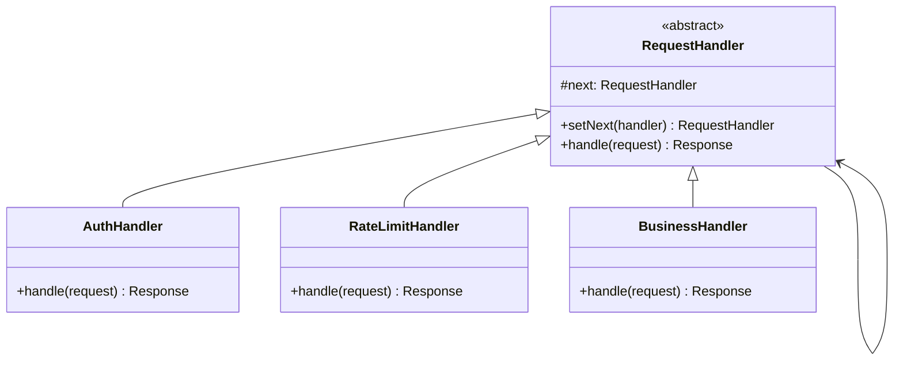

# 责任链模式

## 🔍 定义

责任链模式（Chain of Responsibility）将请求的发送者和接收者解耦：沿着处理者链传递请求，链上的每个处理者决定是否处理该请求，以及是否将请求传递给下一个处理者。

## ⚠️ 不使用责任链存在的问题

HTTP 请求处理需要依次进行认证、限流、日志记录，写在一个方法里导致逻辑混杂：

``` java title="ChainOfResponsibilityBadExample.java"
--8<-- "code/topic/design-patterns/src/main/java/com/example/behavioral/chain_of_responsibility/ChainOfResponsibilityBadExample.java"
```

## 🏗️ 设计模式结构说明



## 💻 设计模式举例说明

``` java title="ChainOfResponsibilityExample.java"
--8<-- "code/topic/design-patterns/src/main/java/com/example/behavioral/chain_of_responsibility/ChainOfResponsibilityExample.java"
```

## ⚖️ 优缺点

**优点：**

- 解耦请求发送者和处理者，客户端不需要知道链的结构
- 符合**开闭原则**：新增处理步骤只需新增处理者类并插入链中
- 可以灵活地动态组合处理链

**缺点：**

- 请求可能到达链尾仍未被处理（需要有默认处理者或明确的终止逻辑）
- 链过长时调试困难，难以追踪请求流转

## 🔗 与其它模式的关系

**相似模式防混淆：**

| 模式 | 处理者数量 | 是否继续传递 |
|------|----------|------------|
| 责任链（Chain） | 多个，按顺序 | 每个处理者决定是否传递 |
| 命令（Command） | 1个接收者 | 不传递，直接执行 |
| 装饰器（Decorator） | 多个，全部执行 | 总是调用下一层 |

## 🗂️ 应用场景

- 多个对象都可能处理同一请求，在运行时决定由谁处理
- 需要按顺序对请求执行多项检查（认证 → 限流 → 日志 → 业务）
- Servlet `Filter` 链（`FilterChain.doFilter()`）
- Spring Security 的 `SecurityFilterChain`
- Netty 的 `ChannelPipeline`
