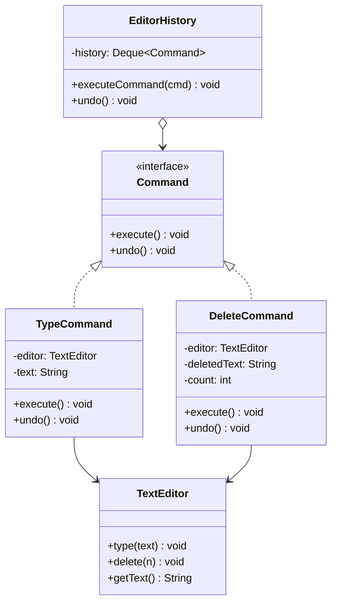

# 命令模式

## 🔍 定义

命令模式（Command）将一个请求封装为一个对象，从而让你可以用不同的请求对客户进行参数化、对请求排队、记录日志，以及支持可撤销操作。

## ⚠️ 不使用命令存在的问题

文本编辑器有多种操作（写入、删除、格式化），需要支持撤销/重做：

``` java title="CommandBadExample.java"
--8<-- "code/topic/design-patterns/src/main/java/com/example/behavioral/command/CommandBadExample.java"
```

## 🏗️ 设计模式结构说明



## 💻 设计模式举例说明

``` java title="CommandExample.java"
--8<-- "code/topic/design-patterns/src/main/java/com/example/behavioral/command/CommandExample.java"
```

## ⚖️ 优缺点

**优点：**

- 解耦请求发起者和请求接收者
- 命令可以排队、延迟执行（任务队列）
- 支持撤销/重做
- 可将多个命令组合成宏命令

**缺点：**

- 每个操作都需要一个命令类，类数量增多
- 简单调用场景下有些过度设计

## 🔗 与其它模式的关系

**相似模式防混淆：**

| 模式 | 封装内容 | 核心价值 |
|------|---------|---------|
| 命令（Command） | 一次请求/操作 + 接收者 | 可撤销、可排队、可日志 |
| 策略（Strategy） | 一种算法 | 运行时替换算法 |
| 职责链（Chain of Responsibility） | 处理请求的一系列处理者 | 请求沿链传递 |

**组合使用：**

命令可与备忘录模式结合实现更强大的撤销——命令的 `undo()` 利用备忘录恢复执行前的完整状态。

## 🗂️ 应用场景

- 需要支持撤销/重做的操作（文本编辑器、图形编辑器、IDE）
- 需要将操作排入队列或延迟执行（任务队列、批处理）
- 需要记录操作日志并支持重放
- Spring：`TransactionCallback`、`Runnable`/`Callable` 都是命令模式的体现
