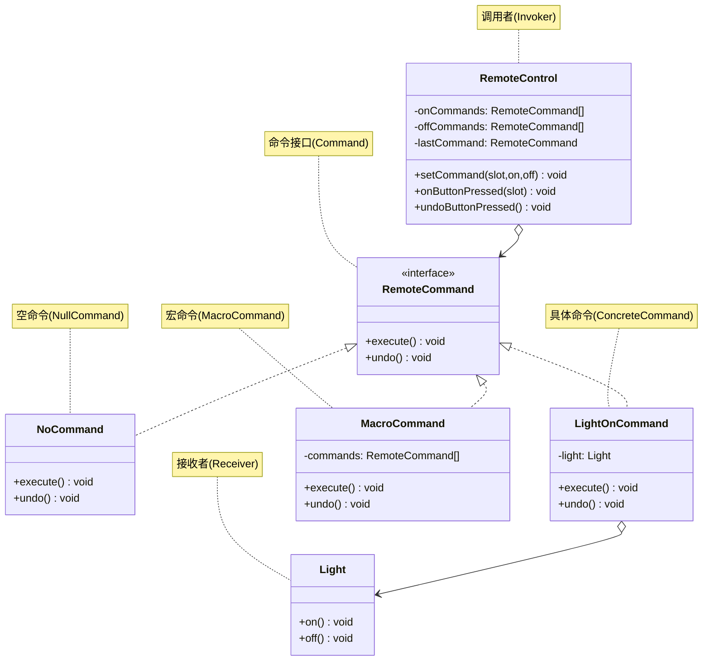

# 命令模式

## 从家电遥控器说起

你有一个 7 插槽的遥控器，每个插槽有 On/Off 两个按钮，还有一个全局 Undo 按钮。这台遥控器要控制灯光、风扇、音响、热水器……而且以后还可能接入更多设备。

最简单的做法是在遥控器里写 `if slot==0 then light.on(); if slot==1 then fan.high()...`——但这意味着每新增一种设备就要改遥控器，而且 Undo 根本没地方下手。

解决思路：**把"请求"封装成对象**。遥控器的每个插槽存放一个 `Command` 对象，只负责调用 `execute()`，不关心是什么设备。设备本身（`Light`、`CeilingFan`）作为接收者，封装在命令对象内部。这样遥控器代码永远不变，只要插入新的 `Command` 对象就能控制任何设备。

## 🔍 定义

命令模式（Command）将请求封装为对象，从而可以用不同请求参数化客户端、对请求排队、记录日志，以及支持可撤销操作。

## ⚠️ 不使用命令存在的问题

``` java title="CommandBadExample.java"
--8<-- "code/topic/design-patterns/src/main/java/com/example/behavioral/command/CommandBadExample.java"
```

## 🏗️ 设计模式结构（家电遥控器）



核心角色：

| 角色 | 说明 |
|------|------|
| `RemoteCommand`（命令接口） | 声明 `execute()` / `undo()` |
| `LightOnCommand`（具体命令） | 封装接收者 `Light`，调用 `light.on()` |
| `RemoteControl`（调用者/Invoker） | 持有命令对象，按下按钮时调用 `execute()` |
| `Light`（接收者/Receiver） | 真正执行操作的对象 |
| `NoCommand`（空对象） | 避免对未设置插槽做 null 检查 |

## 💻 设计模式举例说明

``` java title="CommandExample.java"
--8<-- "code/topic/design-patterns/src/main/java/com/example/behavioral/command/CommandExample.java"
```

!!! tip "NoCommand 空对象模式"

    遥控器 7 个插槽初始化时全部填入 `NoCommand`（`execute()` 和 `undo()` 什么都不做）。
    这样按下任何未设置的按钮也不会 NPE，也不需要 `if (command != null)` 检查。
    这就是**空对象模式（Null Object Pattern）**——用合法对象替代 null，消除防御性判断。

## ⚖️ 优缺点

**优点：**

- 解耦请求发起者（遥控器）和请求接收者（灯/风扇）
- 支持撤销/重做（`undo()` 方法）
- 可将多个命令组合为宏命令（`MacroCommand`）
- 命令可排队、延迟执行（任务队列）

**缺点：**

- 每个操作都需要一个命令类，类数量增多
- 简单调用场景下有些过度设计

## 🔗 与其它模式的关系

| 模式 | 封装内容 | 核心价值 |
|------|---------|---------|
| 命令（Command） | 一次请求 + 接收者 | 可撤销、可排队、可宏命令 |
| 策略（Strategy） | 一种算法 | 运行时替换算法 |
| 职责链（CoR） | 一系列处理者 | 请求沿链传递 |

命令可与**备忘录**结合实现更强的撤销——`undo()` 利用备忘录恢复执行前的完整状态。

## 🗂️ 应用场景

- 需要 Undo/Redo 的编辑器、图形工具、IDE
- 任务队列、批量作业（将操作序列化后异步执行）
- 事务性操作（所有命令成功才提交，失败则逐一 undo）
- Java `Runnable`/`Callable`、Spring `TransactionCallback` 都是命令模式的体现

## 🏭 工业视角

### 将函数封装为对象：命令模式的本质

命令模式最核心的实现手段，是**将函数封装成对象**。Java 中函数不能像变量一样传递，命令模式通过定义包含执行逻辑的类、实例化后传递对象来解决——与回调思想异曲同工。

封装成对象后，命令可以被**存储、排队、延迟执行、序列化**，这是裸函数调用做不到的：

``` java title="命令队列：手游后端单线程轮询架构"
public class GameApplication {
    private static final int MAX_PER_LOOP = 100;
    private Queue<Command> queue = new LinkedList<>();

    public void mainloop() {
        while (true) {
            // 1. 收到请求，封装为 Command 放入队列
            for (Request request : pollRequests()) {
                queue.add(buildCommand(request));   // 请求 → 命令对象
            }
            // 2. 批量取出执行，避免多线程切换开销
            int count = 0;
            while (count++ < MAX_PER_LOOP && !queue.isEmpty()) {
                queue.poll().execute();
            }
        }
    }
}
```

这种**单线程轮询 + 命令队列**的架构在手游后端很常见：规避了多线程的锁竞争和上下文切换损耗，特别适合 IO 密集型的游戏逻辑服务器。

### 命令 vs 策略：设计意图才是关键差异

两者代码结构相似（都是接口 + 多个实现类），但设计意图截然不同：

| 维度 | 命令模式 | 策略模式 |
|------|---------|---------|
| 封装的是什么 | 一次可执行的操作（请求） | 一种可替换的算法 |
| 各实现类关系 | 目的不同，互相**不可替换** | 目的相同，互相**可替换** |
| 核心价值 | 排队、撤销、日志、异步执行 | 运行时选择算法策略 |

!!! tip "Java 内建的命令模式"

    `java.lang.Runnable` 就是命令模式的最简形式：`run()` 对应 `execute()`，线程池就是 Invoker。
    `ExecutorService.submit(Runnable task)` 实现了命令的异步排队执行——命令模式已内化为语言惯用法。
