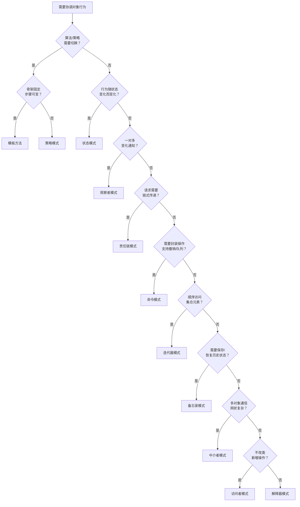

# 行为模式

行为模式关注**对象之间的职责分配与通信**——如何让多个对象协作完成任务，同时降低它们之间的耦合。

GoF 定义了 11 种行为模式，每种模式都有独立的详细笔记：

| 模式 | 一句话总结 | 核心手段 |
|------|-----------|---------|
| [模板方法（Template Method）](template-method/index.md) | 父类定义骨架，子类填充细节 | 继承 + 钩子方法 |
| [策略（Strategy）](strategy/index.md) | 定义一族算法，可互相替换 | 接口抽象算法，运行时注入 |
| [状态（State）](state/index.md) | 对象行为随状态变化而改变 | 将状态抽象为独立类 |
| [命令（Command）](command/index.md) | 把请求封装成对象 | 命令接口 + execute() |
| [责任链（Chain of Responsibility）](chain-of-responsibility/index.md) | 请求沿处理者链传递 | 处理者持有 next 引用 |
| [观察者（Observer）](observer/index.md) | 一变多通知 | 发布-订阅，维护监听者列表 |
| [中介者（Mediator）](mediator/index.md) | 集中管理对象间的通信 | 组件只与中介者通信 |
| [迭代器（Iterator）](iterator/index.md) | 顺序访问集合，不暴露内部结构 | hasNext()/next() 接口 |
| [备忘录（Memento）](memento/index.md) | 保存并恢复对象状态 | 快照对象 + 历史栈 |
| [访问者（Visitor）](visitor/index.md) | 在不修改类的前提下添加新操作 | 双分派，accept() + visit() |
| [解释器（Interpreter）](interpreter/index.md) | 定义语言的文法，并实现解释 | 语法规则→类，组合构成 AST |

## 模式选型参考

