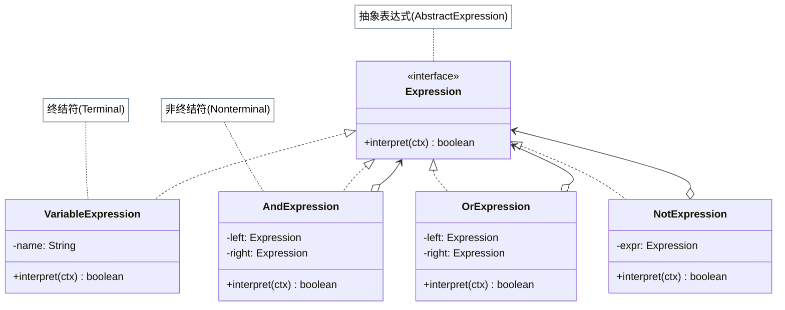

# 解释器模式

## 从权限规则配置说起

HR 系统需要支持灵活的权限规则，例如：`"isLoggedIn AND (hasRole('ADMIN') OR hasPermission('EDIT'))"`。这类规则随业务频繁变化，每次修改都要找开发者改 `if-else`、走测试、走发布流程——效率极低。

解释器模式的解法是把规则定义成一种"小语言"：为每种表达式（AND、OR、常量）定义一个类，通过组合这些类构建可执行的语法树，规则字符串变成可配置的数据而非硬编码逻辑，业务人员自己就能维护规则。

## 🔍 定义

解释器模式（Interpreter）为一个语言定义文法，并建立一个解释器来解释该语言中的句子。每条文法规则对应一个类，通过组合这些类构建语法树（AST），最后递归解释执行。

## ⚠️ 不使用解释器存在的问题

权限系统需要支持灵活的规则表达式，如 `"isLoggedIn AND (hasRole('ADMIN') OR hasPermission('EDIT'))"` ——如果用字符串拼接硬编码处理，逻辑复杂且不可扩展：

``` java title="InterpreterBadExample.java"
--8<-- "code/topic/design-patterns/src/main/java/com/example/behavioral/interpreter/InterpreterBadExample.java"
```

## 🏗️ 设计模式结构说明



每种文法规则对应一个类，组合后形成语法树，`interpret()` 递归求值。

## 💻 设计模式举例说明

``` java title="InterpreterExample.java"
--8<-- "code/topic/design-patterns/src/main/java/com/example/behavioral/interpreter/InterpreterExample.java"
```

## ⚖️ 优缺点

**优点：**

- 文法规则可扩展，每条规则对应一个类，符合**开闭原则**
- 组合构建 AST 的方式灵活且直观
- 易于实现简单语言的解释器

**缺点：**

- 文法规则复杂时，类数量快速增长
- 对于复杂语言（如完整编程语言），手写解释器维护成本极高
- 递归解释大型 AST 时可能有性能问题

!!! warning "使用场景限制"

    解释器模式适合**语法简单**的场景（SQL WHERE 片段、规则表达式、数学公式）。语法复杂时应使用专业的解析器生成工具（如 ANTLR、JavaCC），而非手写解释器。

## 🔗 与其它模式的关系

- **组合模式**：解释器模式常用**组合模式**构建抽象语法树（AST）——终结符表达式是叶节点，非终结符表达式是复合节点，二者共同实现 `Expression` 接口
- **访问者模式**：遍历并操作 AST 各节点时可引入**访问者模式**，将操作逻辑（如求值、打印、类型检查）从表达式类中解耦
- **策略模式**：当只有单条规则需要动态切换时，**策略模式**是更轻量的替代方案；解释器适合规则组合与语法文法场景
- **模板方法模式**：解释器的 `interpret()` 方法常作为模板方法的一个具体步骤，父类定义解释流程骨架

## 🗂️ 应用场景

- 简单 DSL（领域专用语言）的解析与执行
- 规则引擎（布尔表达式、权限规则）
- 数学表达式求值
- Spring Expression Language（SpEL）背后使用了解释器模式
- SQL WHERE 条件的简化解析

## 🏭 工业视角

### 告警规则引擎：解释器模式的典型工程场景

解释器模式的核心思想是**为文法中的每条规则定义一个类**，通过组合构建语法树，递归调用 `interpret()` 求值。监控系统的自定义告警规则是最贴近真实工程的例子：

``` java title="告警规则解释器（每个运算符对应一个 Expression 类）"
// 规则表达式：api_error_per_minute > 100 && api_count_per_minute > 10000

public class GreaterExpression implements Expression {
    private String key;
    private long value;

    public GreaterExpression(String strExpr) {
        // 解析 "api_error_per_minute > 100"
        String[] parts = strExpr.trim().split("\\s+");
        this.key = parts[0];
        this.value = Long.parseLong(parts[2]);
    }

    @Override
    public boolean interpret(Map<String, Long> stats) {
        return stats.getOrDefault(key, 0L) > value;
    }
}

// AndExpression 组合多个子 Expression，全部为真才返回 true
// OrExpression  组合多个子 Expression，任意为真就返回 true
// 将规则字符串解析为组合对象树后，一次 interpret(apiStats) 完成整个规则求值
```

把复杂的解析逻辑分散到多个职责单一的小类，避免了一个巨大的 `if-else` 解析函数——这正是解释器模式相比朴素实现的优势所在。

### 工程中复杂语法不要手写解释器

解释器模式只适合**语法规则简单**的场景（运算符种类 ≤ 10、优先级固定）。语法一旦变复杂，手写解释器的维护成本会急剧上升。

!!! warning "复杂语法用专业工具，不要手写"

    面对完整的 SQL 解析、编程语言编译器、复杂 DSL 时，应使用成熟的解析器生成工具
    （如 **ANTLR**、**JavaCC**），而非手写解释器。手写解释器只适合规则运算符极少的
    简单场景（告警规则引擎、权限表达式、数学公式计算器）。

!!! tip "解释器模式的工业落地形态"

    Spring Expression Language（**SpEL**）、MyBatis 动态 SQL（`<if>`、`<choose>`）都体现了
    解释器模式的思想——把"用户输入的表达式字符串"翻译成可执行的对象树，
    在运行时根据上下文数据动态求值。
