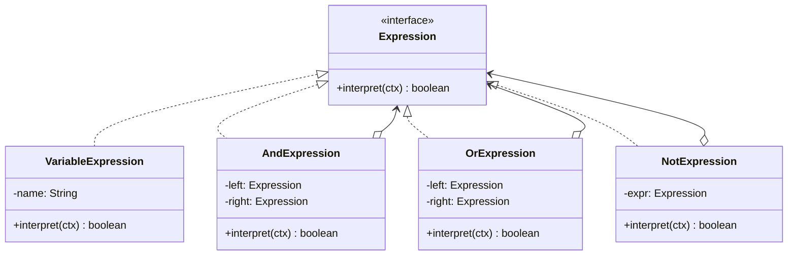

# 解释器模式

## 定义

解释器模式（Interpreter）为一个语言定义文法，并建立一个解释器来解释该语言中的句子。每条文法规则对应一个类，通过组合这些类构建语法树（AST），最后递归解释执行。

## 不使用解释器存在的问题

权限系统需要支持灵活的规则表达式，如 `"isLoggedIn AND (hasRole('ADMIN') OR hasPermission('EDIT'))"` ——如果用字符串拼接硬编码处理，逻辑复杂且不可扩展：

``` java title="InterpreterBadExample.java"
--8<-- "code/topic/design-patterns/src/main/java/com/example/behavioral/interpreter/InterpreterBadExample.java"
```

## 设计模式结构说明



每种文法规则对应一个类，组合后形成语法树，`interpret()` 递归求值。

## 设计模式举例说明

``` java title="InterpreterExample.java"
--8<-- "code/topic/design-patterns/src/main/java/com/example/behavioral/interpreter/InterpreterExample.java"
```

## 优缺点

**优点：**

- 文法规则可扩展，每条规则对应一个类，符合**开闭原则**
- 组合构建 AST 的方式灵活且直观
- 易于实现简单语言的解释器

**缺点：**

- 文法规则复杂时，类数量快速增长
- 对于复杂语言（如完整编程语言），手写解释器维护成本极高
- 递归解释大型 AST 时可能有性能问题

!!! warning "使用场景限制"

    解释器模式适合**语法简单**的场景（SQL WHERE 片段、规则表达式、数学公式）。语法复杂时应使用专业的解析器生成工具（如 ANTLR、JavaCC），而非手写解释器。

## 应用场景

- 简单 DSL（领域专用语言）的解析与执行
- 规则引擎（布尔表达式、权限规则）
- 数学表达式求值
- Spring Expression Language（SpEL）背后使用了解释器模式
- SQL WHERE 条件的简化解析
