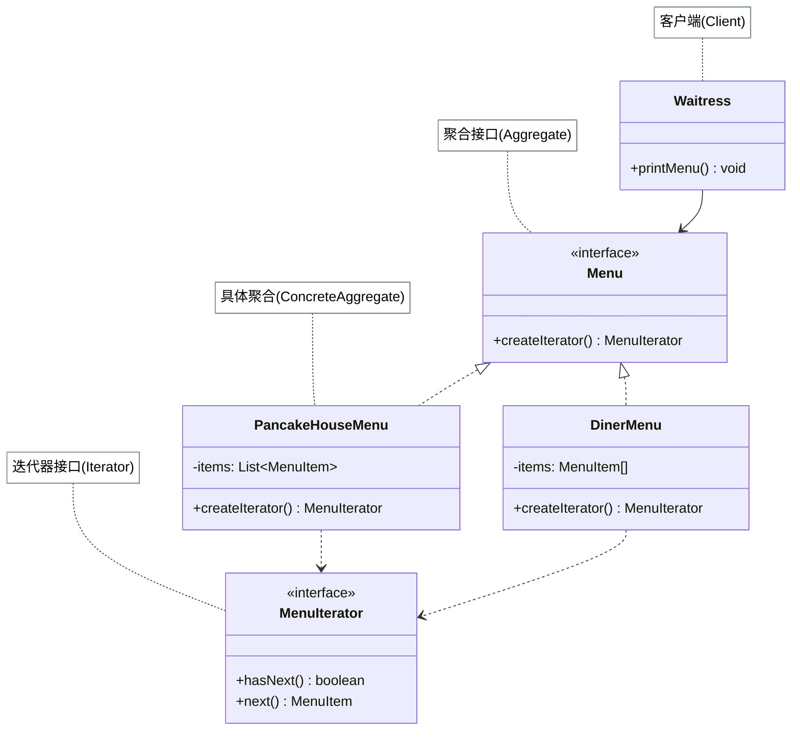

# 迭代器模式

## 从煎饼屋和午餐餐厅合并说起

煎饼屋用 `ArrayList` 存早餐菜单，午餐餐厅用数组存午餐菜单。两家合并之后，雇了一名女服务员负责打印完整菜单。但问题来了：

- 打印早餐菜单：`for (int i=0; i<pancakeItems.size(); i++) ...` — 知道 ArrayList
- 打印午餐菜单：`for (int i=0; i<dinerItems.length; i++) ...` — 知道数组

女服务员必须知道每家内部数据结构，才能遍历。将来任何一家改变存储方式，她的代码就要改。

解决方案：让两家各自提供一个迭代器（`MenuIterator`）。女服务员只和迭代器打交道，`hasNext()`/`next()` 统一接口，不管后面是 `ArrayList` 还是数组。

## 🔍 定义

迭代器模式（Iterator）提供一种方法顺序访问一个聚合对象中的各个元素，而无需暴露该对象的内部结构。

## ⚠️ 不使用迭代器存在的问题

``` java title="IteratorBadExample.java"
--8<-- "code/topic/design-patterns/src/main/java/com/example/behavioral/iterator/IteratorBadExample.java"
```

## 🏗️ 设计模式结构（菜单迭代器）



| 角色 | 说明 |
|------|------|
| `MenuIterator`（迭代器接口） | 定义 `hasNext()` / `next()` 遍历操作 |
| `PancakeHouseMenu` / `DinerMenu`（聚合） | 各自实现 `createIterator()`，返回内部迭代器 |
| `Waitress`（客户端） | 只依赖 `MenuIterator`，不知道内部结构 |

## 💻 设计模式举例说明

``` java title="IteratorExample.java"
--8<-- "code/topic/design-patterns/src/main/java/com/example/behavioral/iterator/IteratorExample.java"
```

!!! tip "单一职责原则"

    迭代器模式体现了**单一职责原则**：集合只负责存储数据，迭代器只负责遍历逻辑，两者职责分离。Java 标准库的 `java.util.Iterator` 和 `Iterable` 就是这一模式的内置实现——实现 `Iterable` 的类可直接使用 for-each 语法糖。

## ⚖️ 优缺点

**优点：**

- 解耦集合与遍历逻辑，内部结构改变不影响客户端
- 统一不同集合类型的遍历接口
- 符合**单一职责原则**

**缺点：**

- 对简单集合引入迭代器略显过度设计
- 并发修改集合和迭代时可能抛 `ConcurrentModificationException`

## 🔗 与其它模式的关系

- **工厂方法**：`createIterator()` 正是工厂方法——聚合类定义创建迭代器的工厂方法，子类决定返回哪种迭代器
- **组合模式**：迭代器常用于遍历组合模式的树形结构（深度优先/广度优先）
- **访问者模式**：迭代器负责遍历，访问者负责对每个元素执行操作，两者组合使用

## 🗂️ 应用场景

- 统一遍历不同内部结构的集合（ArrayList、数组、LinkedList……）
- 为同一集合提供多种遍历顺序（正向、逆向、按条件过滤）
- JDK：`java.util.Iterator`、`ListIterator`、所有 `Collection` 实现类的 `iterator()`

## 🏭 工业视角

### 迭代器相比 for 循环的三大优势

`foreach` 语法糖的底层就是 `Iterator`——编译器将其展开为 `iterator.hasNext()` + `iterator.next()` 的循环，因此讨论"是否使用迭代器"时，foreach 和 iterator 是同一回事。迭代器相对于 `for (int i=0; i<list.size(); i++)` 有三点优势：

1. **封装复杂遍历逻辑**：树的前中后序、图的 DFS/BFS，不需要客户端了解遍历算法，直接拿迭代器用即可。
2. **多游标独立遍历**：同一集合可同时持有多个迭代器，各自维护游标，互不干扰。
3. **面向接口编程**：替换遍历算法（如 `LinkedIterator` → `ReversedLinkedIterator`）只需换迭代器实现，客户端代码无需改动，符合开闭原则。

### fail-fast：为什么遍历时不能增删元素

`ArrayList` 内部维护一个 `modCount` 计数器，每次 `add()` / `remove()` 都令其自增。创建迭代器时，迭代器将当前 `modCount` 快照到 `expectedModCount`；此后每次调用 `hasNext()` / `next()` 都检查两者是否一致：

``` java title="fail-fast 机制核心实现（ArrayList 内部类 Itr）"
private class Itr implements Iterator<E> {
    int cursor;
    int expectedModCount = modCount;  // 创建时快照

    public E next() {
        checkForComodification();     // 每次 next() 都校验
        // ... 返回元素 ...
    }

    final void checkForComodification() {
        if (modCount != expectedModCount)
            throw new ConcurrentModificationException();
    }
}
```

一旦检测到外部代码在迭代期间修改了集合，立即抛出 `ConcurrentModificationException`——**宁可快速失败，也不产生"有时对有时错"的不可预期结果**（某些删除位置不会出错，某些会，这种 bug 极难复现）。

!!! warning "遍历时安全删除的正确姿势"

    不要在 for-each 中调用 `list.remove()`，应使用迭代器自身的 `iterator.remove()`——它在删除元素后会同步更新 `expectedModCount`，从而绕过 fail-fast 检查。每次 `next()` 后最多调用一次 `remove()`，且不能与外部 `add()` 混用。

### 快照迭代器：遍历时允许修改集合

`CopyOnWriteArrayList` 采用"写时复制"策略：每次写操作都复制一份新数组，迭代器持有**旧数组的引用**，遍历期间的任何增删都不影响当前遍历，因此不会抛 `ConcurrentModificationException`。代价是内存翻倍、写操作开销大，适合**读多写少**的并发场景。

!!! tip "遍历时修改集合的选型建议"

    - 单线程遍历需要删除：使用 `iterator.remove()`
    - 多线程读多写少：使用 `CopyOnWriteArrayList`，其迭代器天然支持并发修改
    - 多线程写多：使用 `Collections.synchronizedList()` 并在整个遍历块上手动加锁，或换用 `ConcurrentLinkedQueue` 等并发容器
