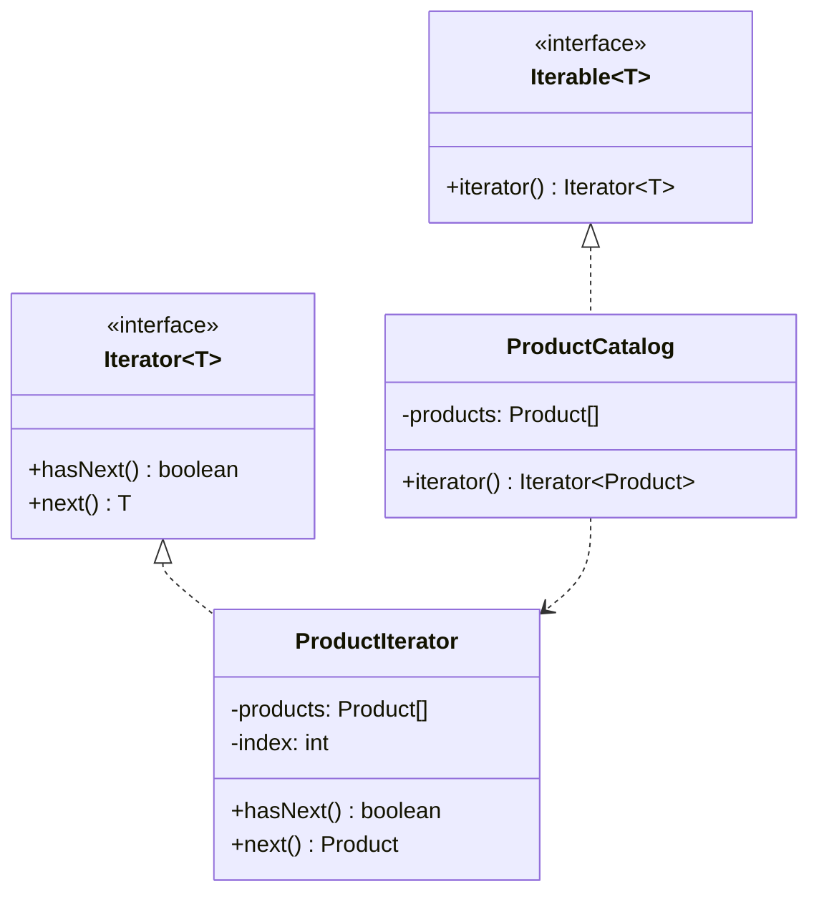

# 迭代器模式

## 🔍 定义

迭代器模式（Iterator）提供一种方法顺序访问一个聚合对象中的各个元素，而无需暴露该对象的内部结构。

## ⚠️ 不使用迭代器存在的问题

系统中有两种数据集合：用数组存储的商品列表和用链表存储的用户列表，遍历时调用方需要知道内部存储结构：

``` java title="IteratorBadExample.java"
--8<-- "code/topic/design-patterns/src/main/java/com/example/behavioral/iterator/IteratorBadExample.java"
```

## 🏗️ 设计模式结构说明



## 💻 设计模式举例说明

``` java title="IteratorExample.java"
--8<-- "code/topic/design-patterns/src/main/java/com/example/behavioral/iterator/IteratorExample.java"
```

!!! tip "Java 中的迭代器"

    Java 的 `java.util.Iterator` 和 `Iterable` 接口就是迭代器模式的标准实现，实现 `Iterable` 的类支持 for-each 语法糖。

## ⚖️ 优缺点

**优点：**

- 解耦集合与遍历逻辑，可以为同一集合提供多种遍历方式
- 符合**单一职责原则**：遍历逻辑封装在迭代器中
- 统一不同集合类型的遍历接口

**缺点：**

- 对简单集合来说，引入迭代器略显过度设计
- 部分实现中，同时修改集合和迭代器可能导致并发问题（`ConcurrentModificationException`）

## 🔗 与其它模式的关系

- **工厂方法模式**：`iterator()` 是工厂方法的经典应用——容器类定义创建迭代器的工厂方法，具体子类决定返回哪种迭代器实现
- **组合模式**：迭代器常用于遍历**组合模式**的树形结构，可通过外部迭代器实现深度优先或广度优先遍历
- **访问者模式**：迭代器负责遍历元素，**访问者模式**负责对每个元素执行操作，两者组合实现复杂遍历逻辑
- **备忘录模式**：迭代器可存储当前迭代位置，结合**备忘录模式**实现可恢复的迭代状态（保存和恢复迭代进度）

## 🗂️ 应用场景

- 需要统一遍历不同内部结构的集合
- 需要为同一集合提供多种遍历顺序（正向、逆向、按条件过滤）
- JDK：`java.util.Iterator`、`ListIterator`、所有 `Collection` 实现类的 `iterator()`
