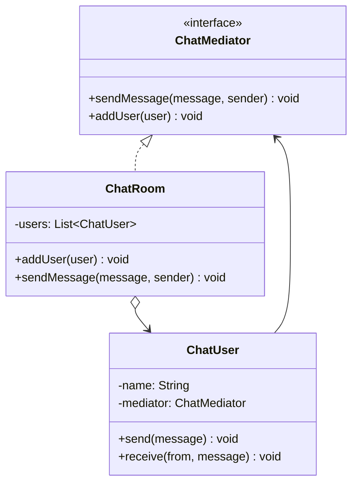

# 中介者模式

## 🔍 定义

中介者模式（Mediator）用一个中介对象来封装一系列对象之间的交互，使各对象之间不需要显式地相互引用，从而降低耦合度，并可以独立地改变它们之间的交互。

## ⚠️ 不使用中介者存在的问题

聊天室中，每个用户直接持有其他用户的引用来发送消息——用户间两两耦合：

``` java title="MediatorBadExample.java"
--8<-- "code/topic/design-patterns/src/main/java/com/example/behavioral/mediator/MediatorBadExample.java"
```

## 🏗️ 设计模式结构说明



各 `ChatUser` 只持有 `ChatMediator` 引用，不再直接持有其他用户——N 个用户共享 1 个中介者。

## 💻 设计模式举例说明

``` java title="MediatorExample.java"
--8<-- "code/topic/design-patterns/src/main/java/com/example/behavioral/mediator/MediatorExample.java"
```

## ⚖️ 优缺点

**优点：**

- 将网状引用（N*N）简化为星状引用（N+1），显著降低耦合
- 组件彼此独立，可以复用
- 集中管理对象间的交互逻辑，方便修改

**缺点：**

- 中介者本身可能变成"上帝类"，承担过多职责
- 随着组件增多，中介者内部逻辑越来越复杂

## 🔗 与其它模式的关系

**相似模式防混淆：**

| 模式 | 通信方向 | 职责 |
|------|---------|-----|
| 中介者（Mediator） | 双向：组件 ↔ 中介者 ↔ 组件 | 协调组件间双向通信 |
| 外观（Facade） | 单向：客户端 → 外观 → 子系统 | 简化子系统的访问接口 |
| 观察者（Observer） | 主题 → 观察者（单向广播） | 通知依赖者状态变化 |

## 🗂️ 应用场景

- 多个对象之间存在复杂的双向依赖关系（如聊天室、空中交通管制、GUI 表单联动）
- 希望将组件间的交互逻辑集中管理，方便维护
- Spring：`ApplicationEventPublisher` 和 `@EventListener` 承担了中介者职责
- 航空管制系统（飞机通过塔台协调，不直接通信）
