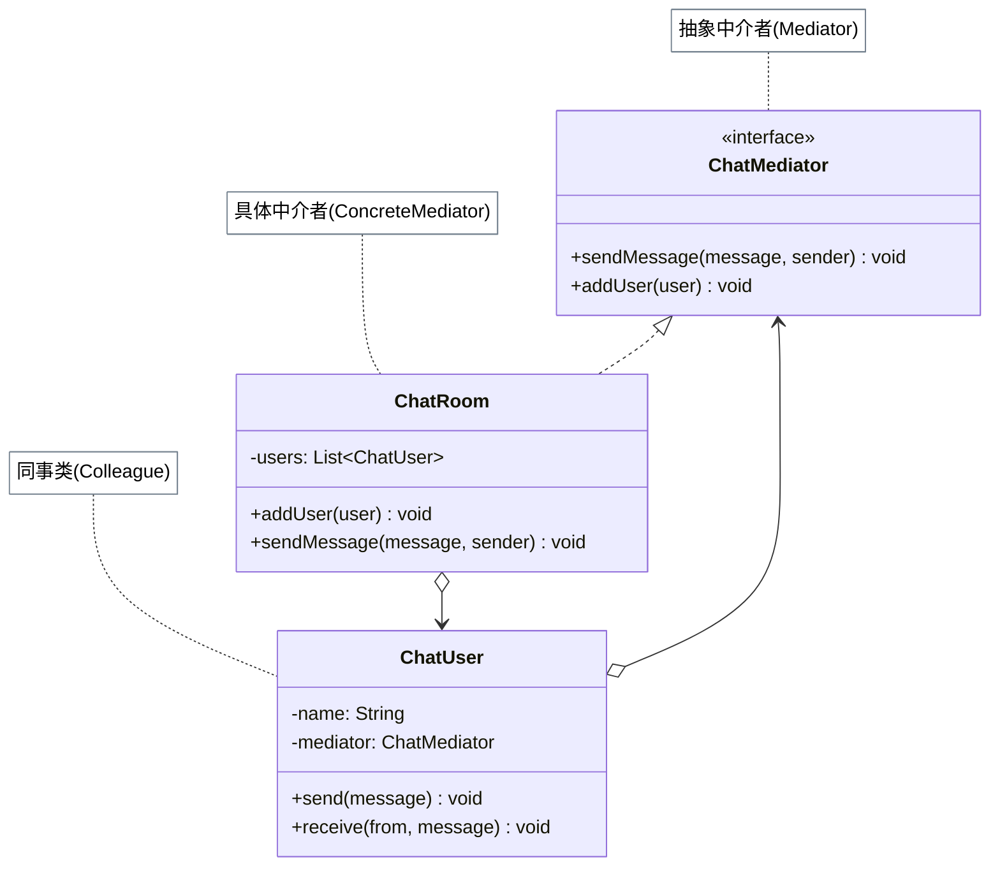

# 中介者模式

## 从聊天室网状依赖说起

最初的聊天室让每个 `User` 直接持有其他所有用户的引用——5 个用户就有 20 条引用关系。新加入 1 个用户时，要通知所有已有用户更新引用；某个用户下线时，所有人都要删除对它的引用。这是典型的"网状依赖"，N 个对象两两耦合，复杂度是 O(N²)。

中介者模式引入一个调停人（`ChatRoom`）：所有用户只和 ChatRoom 交互，互不直接认识。N 个用户都只需要 1 条到 ChatRoom 的引用，复杂度降到 O(N)。航空塔台就是现实中的中介者——飞机不直接互相通话，统一通过塔台调度。

## 🔍 定义

中介者模式（Mediator）用一个中介对象来封装一系列对象之间的交互，使各对象之间不需要显式地相互引用，从而降低耦合度，并可以独立地改变它们之间的交互。

## ⚠️ 不使用中介者存在的问题

聊天室中，每个用户直接持有其他用户的引用来发送消息——用户间两两耦合：

``` java title="MediatorBadExample.java"
--8<-- "code/topic/design-patterns/src/main/java/com/example/behavioral/mediator/MediatorBadExample.java"
```

## 🏗️ 设计模式结构说明



各 `ChatUser` 只持有 `ChatMediator` 引用，不再直接持有其他用户——N 个用户共享 1 个中介者。

## 💻 设计模式举例说明

``` java title="MediatorExample.java"
--8<-- "code/topic/design-patterns/src/main/java/com/example/behavioral/mediator/MediatorExample.java"
```

## ⚖️ 优缺点

**优点：**

- 将网状引用（N*N）简化为星状引用（N+1），显著降低耦合
- 组件彼此独立，可以复用
- 集中管理对象间的交互逻辑，方便修改

**缺点：**

- 中介者本身可能变成"上帝类"，承担过多职责
- 随着组件增多，中介者内部逻辑越来越复杂

## 🔗 与其它模式的关系

**相似模式防混淆：**

| 模式 | 通信方向 | 职责 |
|------|---------|-----|
| 中介者（Mediator） | 双向：组件 ↔ 中介者 ↔ 组件 | 协调组件间双向通信 |
| 外观（Facade） | 单向：客户端 → 外观 → 子系统 | 简化子系统的访问接口 |
| 观察者（Observer） | 主题 → 观察者（单向广播） | 通知依赖者状态变化 |

## 🗂️ 应用场景

- 多个对象之间存在复杂的双向依赖关系（如聊天室、空中交通管制、GUI 表单联动）
- 希望将组件间的交互逻辑集中管理，方便维护
- Spring：`ApplicationEventPublisher` 和 `@EventListener` 承担了中介者职责
- 航空管制系统（飞机通过塔台协调，不直接通信）

## 🏭 工业视角

### 与观察者模式的本质区别

中介者和观察者都能解耦对象，但应用场景截然不同：

| 维度 | 观察者模式 | 中介者模式 |
|------|-----------|-----------|
| 交互形态 | 有条理的单向广播（主题 → 多个订阅者） | 错综复杂的双向多对多交互 |
| 参与者身份 | 要么是观察者，要么是被观察者 | 每个组件既发消息也收消息 |
| 中心职责 | 只做消息路由，不含业务逻辑 | 封装组件间具体的协调逻辑 |
| 适用时机 | 交互关系比较清晰、有规律 | 交互关系错综复杂、维护成本高 |

!!! tip "EventBus 是观察者还是中介者？"

    Guava EventBus 虽然也有中心节点，但它只做消息路由，不包含任何业务协调逻辑，
    参与者之间仍是单向的发布-订阅关系——本质上是**观察者模式**的实现框架，而非中介者模式。

### 顺序控制是中介者的独特优势

观察者的通知是"广播"，无法保证执行顺序；而中介者可以在内部精确编排调用次序，这在 GUI 表单联动等场景中至关重要：

``` java title="中介者控制 UI 联动顺序"
@Override
public void handleEvent(Component component, String event) {
    if (component.equals(selection)) {
        String selected = selection.select();
        if ("register".equals(selected)) {
            // 中介者按需编排：先隐藏、再显示、最后更新提示文案
            passwordInput.hide();
            repeatedPswdInput.show();
            hintText.setText("请设置密码并确认");   // 顺序由中介者掌控
        }
    }
}
```

!!! warning "中介者易成为「上帝类」"

    将所有组件的交互逻辑集中到中介者，随着组件数量增多，中介类本身会变得庞大难维护。
    使用前应评估：交互关系是否真的足够复杂，值得引入中介者？
    若组件交互关系比较清晰，直接引用或观察者往往是更轻量的选择。
