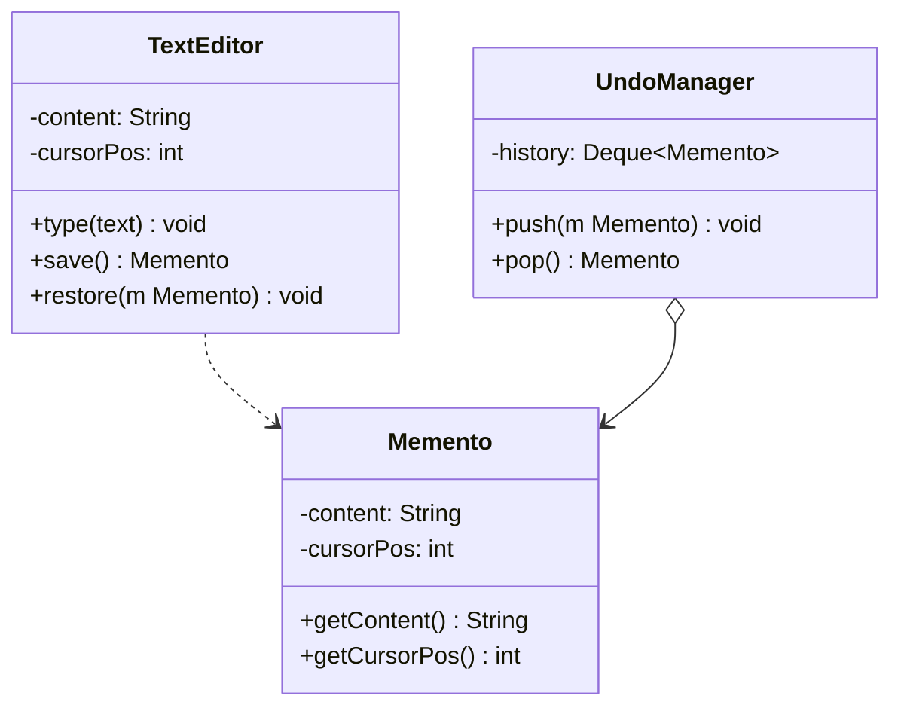

# 备忘录模式

## 定义

备忘录模式（Memento）在不破坏封装性的前提下，捕获一个对象的内部状态并保存到外部，以便在需要时恢复到之前的状态。

## 不使用备忘录存在的问题

文本编辑器需要支持撤销，但直接让外部保存状态会破坏封装：

``` java title="MementoBadExample.java"
--8<-- "code/topic/design-patterns/src/main/java/com/example/behavioral/memento/MementoBadExample.java"
```

## 设计模式结构说明



`TextEditor` 自己创建和恢复 `Memento`，外部（`UndoManager`）只存储不读取——封装性得到保护。

## 设计模式举例说明

``` java title="MementoExample.java"
--8<-- "code/topic/design-patterns/src/main/java/com/example/behavioral/memento/MementoExample.java"
```

## 优缺点

**优点：**

- 在不破坏封装的前提下保存和恢复对象状态
- 简化原发器：不需要自己管理历史版本
- 支持撤销/重做、事务回滚

**缺点：**

- 频繁保存快照会消耗大量内存（尤其对象状态较大时）
- 管理者需要跟踪原发器的生命周期

## 与其它模式的关系

**组合使用：**

备忘录常与命令模式配合——命令的 `undo()` 通过备忘录恢复执行前的完整状态，比在命令中单独记录每个字段的"前值"更简洁。

## 应用场景

- 文本编辑器、图形编辑器的撤销/重做
- 游戏存档
- 数据库事务回滚
- Spring：事务传播机制中的 `Savepoint` 类似备忘录的思想
