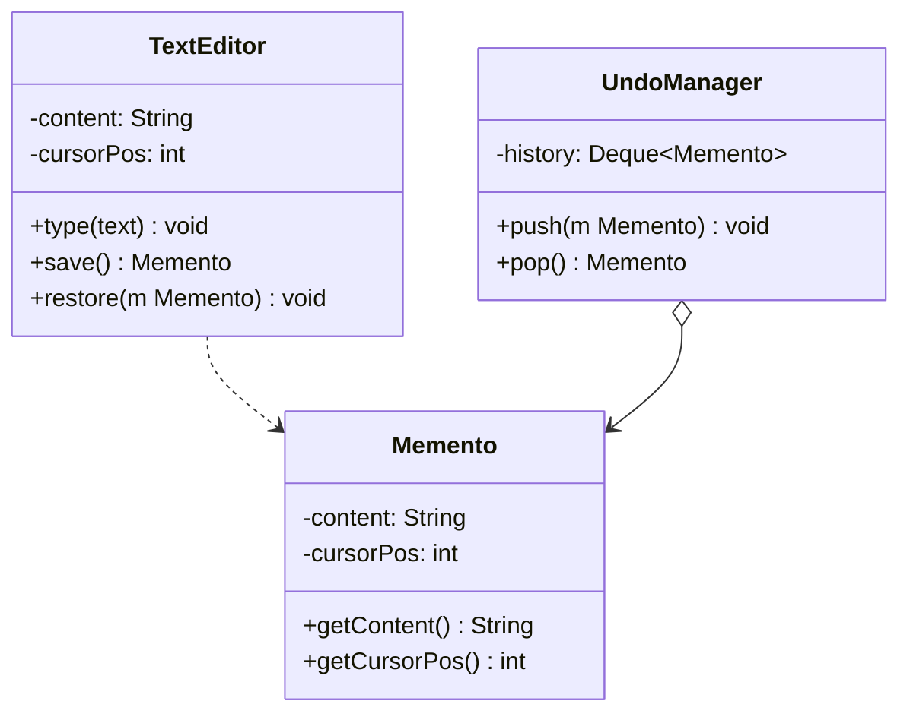

# 备忘录模式

## 🔍 定义

备忘录模式（Memento）在不破坏封装性的前提下，捕获一个对象的内部状态并保存到外部，以便在需要时恢复到之前的状态。

## ⚠️ 不使用备忘录存在的问题

文本编辑器需要支持撤销，但直接让外部保存状态会破坏封装：

``` java title="MementoBadExample.java"
--8<-- "code/topic/design-patterns/src/main/java/com/example/behavioral/memento/MementoBadExample.java"
```

## 🏗️ 设计模式结构说明



`TextEditor` 自己创建和恢复 `Memento`，外部（`UndoManager`）只存储不读取——封装性得到保护。

## 💻 设计模式举例说明

``` java title="MementoExample.java"
--8<-- "code/topic/design-patterns/src/main/java/com/example/behavioral/memento/MementoExample.java"
```

## ⚖️ 优缺点

**优点：**

- 在不破坏封装的前提下保存和恢复对象状态
- 简化原发器：不需要自己管理历史版本
- 支持撤销/重做、事务回滚

**缺点：**

- 频繁保存快照会消耗大量内存（尤其对象状态较大时）
- 管理者需要跟踪原发器的生命周期

## 🔗 与其它模式的关系

**组合使用：**

备忘录常与命令模式配合——命令的 `undo()` 通过备忘录恢复执行前的完整状态，比在命令中单独记录每个字段的"前值"更简洁。

## 🗂️ 应用场景

- 文本编辑器、图形编辑器的撤销/重做
- 游戏存档
- 数据库事务回滚
- Spring：事务传播机制中的 `Savepoint` 类似备忘录的思想

## 工业视角

### 封装原则是备忘录的核心约束

备忘录的核心要求是：**只有原发器（Originator）能读写快照内容，外部持有者只能存储和传递**。违反这一约束会导致外部代码意外修改"历史状态"，使撤销功能产生难以复现的 Bug。

正确做法：`Snapshot` 类只暴露 getter，不暴露任何修改方法；原发器用语义明确的 `restoreSnapshot()` 替代暴露给外部的 `setText()`：

``` java title="标准备忘录结构（封装保护）"
public class Snapshot {
    private final String text;           // 不可变，不暴露 setter

    public Snapshot(String text) { this.text = text; }

    public String getText() { return text; }
    // 没有 setText()，外部无法篡改历史状态
}

public class InputText {
    private StringBuilder text = new StringBuilder();

    public Snapshot createSnapshot() {              // 原发器自己创建快照
        return new Snapshot(text.toString());
    }

    public void restoreSnapshot(Snapshot snapshot) { // 恢复专用，语义明确
        this.text.replace(0, this.text.length(), snapshot.getText());
    }
}
```

### 大对象备份的内存优化：全量 + 增量结合

当被备份对象数据量大、备份频率高时，全量快照会带来严重的内存和时间开销。工业实践通常采用两种策略：

**策略一：只保存最小恢复信息**（适用于顺序单步撤销）：记录文本长度等轻量标记，结合当前对象状态反推历史，以牺牲灵活性换取内存。

**策略二：低频全量备份 + 高频增量备份**（适用于持久化场景）：每次改动只记录变化部分（增量），定期做一次全量快照，恢复时找最近全量备份再顺序重放增量。

!!! tip "工业级参考：MySQL 备份策略"

    MySQL 的典型备份方案是这一策略的教科书实现：定期全量备份（mysqldump 或 xtrabackup），
    配合 binlog 增量记录每次写操作。恢复到任意时间点时，先应用最近的全量备份，再重放 binlog。
    这正是备忘录模式在系统架构层面的体现——Redis 的 RDB + AOF 机制与此异曲同工。
