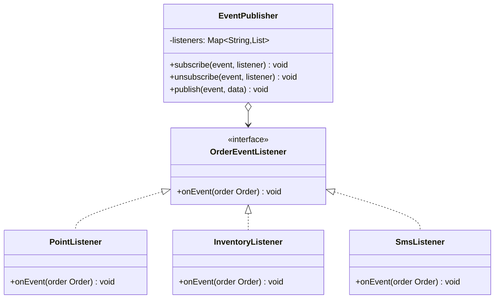

# 观察者模式

## 🔍 定义

观察者模式（Observer）定义对象间的一对多依赖关系：当一个对象（主题）的状态发生变化时，所有依赖它的对象（观察者）都会自动收到通知并更新。

## ⚠️ 不使用观察者存在的问题

订单支付成功后，需要通知积分、库存、短信等多个系统：

``` java title="ObserverBadExample.java"
--8<-- "code/topic/design-patterns/src/main/java/com/example/behavioral/observer/ObserverBadExample.java"
```

## 🏗️ 设计模式结构说明



## 💻 设计模式举例说明

``` java title="ObserverExample.java"
--8<-- "code/topic/design-patterns/src/main/java/com/example/behavioral/observer/ObserverExample.java"
```

!!! tip "Spring 中的观察者"

    Spring 的 `ApplicationEvent` + `@EventListener` 就是观察者模式的实现：`publishEvent()` 发布，`@EventListener` 注册监听器，完全解耦发布方和监听方。

## ⚖️ 优缺点

**优点：**

- 符合**开闭原则**：新增观察者不修改主题代码
- 解耦发布方与订阅方，可以独立扩展
- 支持广播通信

**缺点：**

- 观察者过多时，通知顺序不可预测
- 如果观察者和主题存在循环依赖，可能导致问题
- 同步通知时，某个观察者抛出异常会中断后续通知（需要 try-catch）

## 🔗 与其它模式的关系

**相似模式防混淆：**

| 模式 | 通知方向 | 耦合程度 |
|------|---------|---------|
| 观察者（Observer） | 主题 → 多个观察者 | 主题持有观察者引用（较低耦合） |
| 中介者（Mediator） | 组件 ↔ 中介者 ↔ 组件 | 完全解耦，组件间不直接通信 |

**组合使用：**

事件驱动架构中，观察者常与命令模式结合——将事件封装为命令对象，支持撤销和重放。

## 🗂️ 应用场景

- 对象状态变化需要通知多个其他对象（且不知道具体有多少个）
- 发布-订阅系统、事件总线
- Spring：`ApplicationEvent`/`@EventListener`、`@TransactionalEventListener`
- JDK：`java.util.Observer`（已过时）、`PropertyChangeListener`
