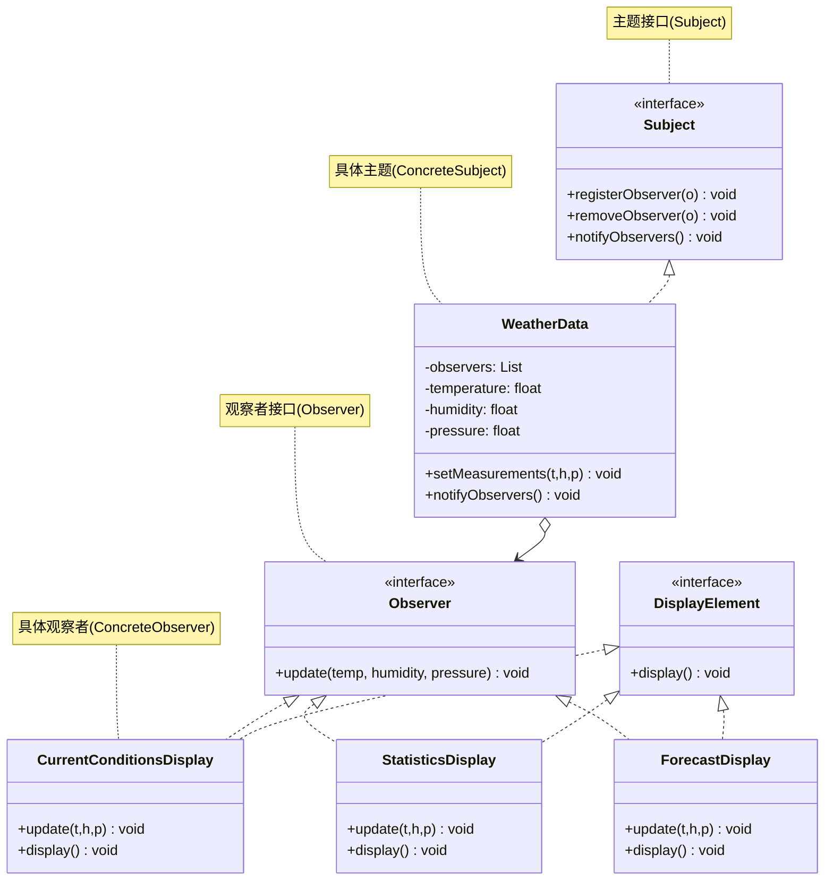

# 观察者模式

## 从气象站说起

互联网气象站项目：`WeatherData` 对象能从气象感应设备获取实时数据（温度、湿度、气压）。你需要建立三个显示面板——**当前状况面板**、**统计信息面板**、**天气预报面板**——当气象数据更新时，这三个面板都要自动刷新。

最直接的写法：在 `WeatherData.measurementsChanged()` 里直接调用三个面板的 `update()` 方法。

但这带来几个问题：

- 未来想加"热度指数面板"，必须修改 `WeatherData`
- 面板无法在运行时动态添加或取消订阅
- 必须知道所有面板的具体类型，无法针对接口编程

## 🔍 定义

观察者模式（Observer）定义对象间的一对多依赖关系：当一个对象（主题/Subject）的状态发生变化时，所有依赖它的对象（观察者/Observer）都会自动收到通知并更新。

> **设计原则：为松耦合设计而努力——相互依赖的对象之间应该尽量减少了解。**

## ⚠️ 不使用观察者存在的问题

WeatherData 直接调用每个具体面板，新增面板就要改源码：

``` java title="ObserverBadExample.java"
--8<-- "code/topic/design-patterns/src/main/java/com/example/behavioral/observer/ObserverBadExample.java"
```

## 🏗️ 设计模式结构（气象站）



## 💻 设计模式举例说明

``` java title="ObserverExample.java"
--8<-- "code/topic/design-patterns/src/main/java/com/example/behavioral/observer/ObserverExample.java"
```

!!! tip "推模式 vs 拉模式"

    代码中用的是**推模式**：主题主动把数据推给观察者（`update(temp, humidity, pressure)`）。**拉模式**则是观察者调用主题的 getter 自行拉取数据——Java 内置的 `java.util.Observable` 用的就是拉模式。两者各有取舍：推模式简单但接口难扩展；拉模式观察者可以按需取数据。

## ⚖️ 优缺点

**优点：**

- 符合**开闭原则**：新增观察者不修改主题代码
- 松耦合：主题只知道观察者实现了 `Observer` 接口
- 支持运行时动态添加/取消订阅

**缺点：**

- 观察者过多时，通知顺序不可预测
- 同步通知时，某个观察者抛出异常会中断后续（需要 try-catch 保护）
- 观察者保持主题引用时要注意防止内存泄漏（弱引用）

## 🔗 与其它模式的关系

| 模式 | 通知方向 | 耦合程度 |
|------|---------|---------|
| 观察者（Observer） | 主题 → 多个观察者 | 主题持有观察者接口引用 |
| 中介者（Mediator） | 组件 ↔ 中介者 ↔ 组件 | 组件间完全不直接通信 |

## 🗂️ 应用场景

- 对象状态变化需要通知多个其他对象
- 发布-订阅系统、事件总线、消息队列
- Spring：`ApplicationEvent` + `@EventListener`、`@TransactionalEventListener`
- JDK：`PropertyChangeListener`、`Flow.Publisher`/`Flow.Subscriber`（Reactive Streams）

## 🏭 工业视角

### 同步阻塞 vs 异步非阻塞：性能与耦合的权衡

经典观察者模式是**同步阻塞**的：主题在同一线程内依次调用每个观察者，直到全部执行完才返回。这在观察者逻辑轻量时没问题，但若某个观察者耗时（如发邮件、写数据库），会直接拖慢主流程响应时间。

**异步非阻塞**实现有两种朴素方式：在每个观察者内新开线程，或在主题中用线程池分发。前者线程无上限，后者把线程池逻辑耦合进业务代码。更优雅的做法是引入 **EventBus**，把异步调度逻辑下沉到框架层：

``` java title="使用 Guava EventBus 实现异步非阻塞观察者"
// 主题：只管 post，不关心谁在监听、怎么执行
public class UserController {
    private EventBus eventBus =
        new AsyncEventBus(Executors.newFixedThreadPool(20)); // 异步模式

    public Long register(String telephone, String password) {
        long userId = userService.register(telephone, password);
        eventBus.post(userId);   // 非阻塞，立即返回
        return userId;
    }
}

// 观察者：用 @Subscribe 声明监听，无需实现特定接口
public class RegPromotionObserver {
    @Subscribe
    public void handleRegSuccess(long userId) {
        promotionService.issueNewUserExperienceCash(userId);
    }
}
```

!!! tip "EventBus 核心机制"

    `register()` 时 EventBus 扫描 `@Subscribe` 注解建立「消息类型 → 处理方法」注册表；`post(event)` 时按类型匹配，通过反射调用对应方法。切换同步/异步只需将 `AsyncEventBus` 换回 `EventBus`，业务代码零改动。

### 进程内 vs 跨进程：消息队列是分布式版观察者

进程内的观察者（含 EventBus）仍需要观察者注册到被观察者，两者存在直接依赖。当系统演进为微服务，观察者运行在独立进程时，这种耦合会成为障碍。

**跨进程观察者**的标准解法是消息队列（Kafka、RabbitMQ、RocketMQ）：被观察者向 Topic 发布消息，观察者订阅 Topic 消费消息——两者完全不感知对方的存在。

| 维度 | 进程内观察者 | 跨进程（消息队列） |
|------|------------|----------------|
| 耦合度 | 需注册，持有接口引用 | 完全解耦，只共享消息格式 |
| 可靠性 | 进程崩溃消息丢失 | 消息持久化，支持重试 |
| 复杂度 | 简单，无额外组件 | 需要维护消息中间件 |
| 适用场景 | 单体应用内部解耦 | 跨服务事件驱动架构 |

!!! warning "不要滥用消息队列"

    引入消息队列会增加部署和运维成本，消息的幂等处理、顺序保证、死信队列都需要额外设计。仅当真正跨进程、或需要削峰填谷时，才值得引入；进程内解耦优先用 EventBus。

### 观察者模式 vs 发布订阅模式

两者经常被混用，本质区别在于**是否存在消息中间件（Broker）**：

- **观察者模式**：Subject 直接持有 Observer 列表，通知时遍历调用。Observer 知道 Subject 的存在（注册到它），Subject 也知道 Observer（至少知道其接口）。
- **发布订阅模式**：Publisher 和 Subscriber 都只和 Broker（消息总线/消息队列）交互，彼此完全不感知对方。

Spring 的 `ApplicationEvent` + `ApplicationListener` / `@EventListener` 是进程内的观察者模式（`ApplicationContext` 充当 Subject）；而 Kafka/RabbitMQ 是真正的发布订阅模式。
