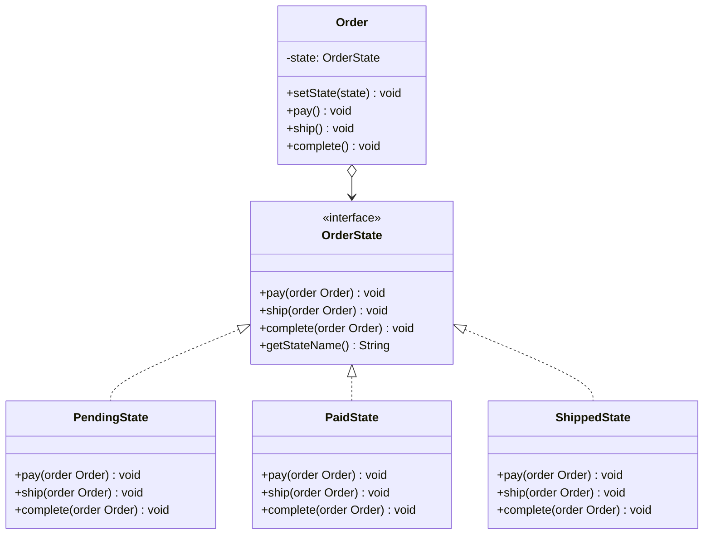

# 状态模式

## 定义

状态模式（State）允许对象在内部状态发生改变时改变其行为，看起来像是改变了对象的类。将每种状态封装为独立的类，消除大量的条件分支。

## 不使用状态模式存在的问题

订单有"待付款 → 已付款 → 已发货 → 已完成"状态，每种操作都要判断当前状态：

``` java title="StateBadExample.java"
--8<-- "code/topic/design-patterns/src/main/java/com/example/behavioral/state/StateBadExample.java"
```

## 设计模式结构说明



## 设计模式举例说明

``` java title="StateExample.java"
--8<-- "code/topic/design-patterns/src/main/java/com/example/behavioral/state/StateExample.java"
```

## 优缺点

**优点：**

- 消除大量条件分支（if-else/switch），每种状态的行为集中在一个类
- 符合**开闭原则**：新增状态只需新增类，无需修改已有状态类
- 状态转换逻辑显式且集中

**缺点：**

- 状态类数量增多（每种状态一个类）
- 如果状态和转换很简单，可能过度设计

## 与其它模式的关系

**相似模式防混淆：**

| 模式 | 切换时机 | 切换依据 |
|------|---------|---------|
| 状态（State） | 内部状态变化时自动切换 | 对象自身状态 |
| 策略（Strategy） | 客户端主动注入替换 | 外部运行时选择 |

> 两者结构相似（都持有一个"行为对象"），区别在于**谁**决定切换：状态模式由对象自己根据状态转换；策略由客户端主动选择。

## 应用场景

- 对象行为随内部状态变化（订单、审批流、游戏角色、TCP 连接状态机）
- 需要消除大量与状态相关的条件分支
- Spring Statemachine 框架就是状态模式的企业级实现
