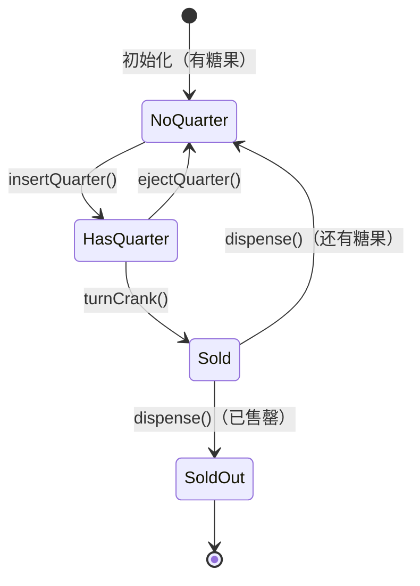
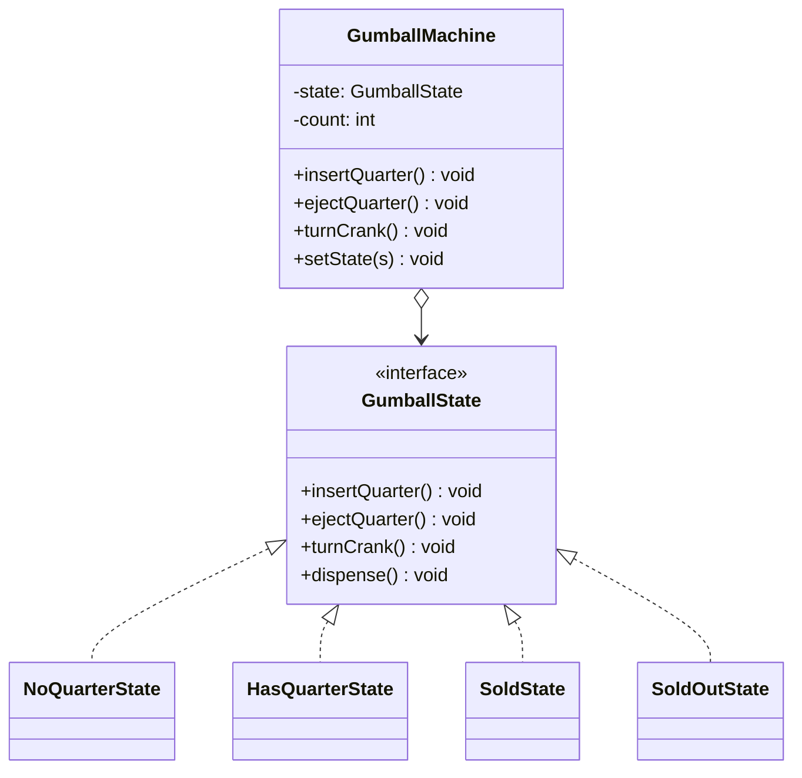

# 状态模式

## 从糖果机说起

你有一台糖果机，它有 4 种状态：

- 售罄（`SoldOut`）
- 没有投币（`NoQuarter`）
- 已投币（`HasQuarter`）
- 正在出售（`Sold`）

每种操作（投币/退币/转把手/发糖果）在不同状态下行为完全不同。最直觉的实现是用一个整型常量代表状态，每个操作都写一堆 `if-else`——这在书里被叫做"条件状态机"。

问题来了：产品经理说要加一个**赢奖状态**（10% 几率发两颗糖果）。你必须在每一个方法里都加 `if (state == WINNER)` 分支——改动散落各处，极易出错。

解决方案：**把每种状态封装成独立的类**，让状态自己处理所有动作，并决定下一个状态是什么。`GumballMachine` 本身变成了一个纯粹的委托者，没有任何条件分支。

## 🔍 定义

状态模式（State）允许对象在内部状态发生改变时改变其行为，看起来像是改变了对象的类。将每种状态封装为独立的类，消除大量的条件分支。

## ⚠️ 不使用状态模式存在的问题

``` java title="StateBadExample.java"
--8<-- "code/topic/design-patterns/src/main/java/com/example/behavioral/state/StateBadExample.java"
```

## 🏗️ 设计模式结构（糖果机）





| 角色 | 说明 |
|------|------|
| `GumballState`（状态接口） | 定义所有可能的动作 |
| `NoQuarterState` 等（具体状态） | 实现该状态下的行为，并负责转换到下一状态 |
| `GumballMachine`（上下文） | 持有当前状态，委托所有动作；无任何条件分支 |

## 💻 设计模式举例说明

``` java title="StateExample.java"
--8<-- "code/topic/design-patterns/src/main/java/com/example/behavioral/state/StateExample.java"
```

!!! tip "新增赢奖状态（WinnerState）有多简单"

    只需新建 `WinnerState implements GumballState`，在 `HasQuarterState.turnCrank()` 中用随机数决定切换到 `SoldState` 还是 `WinnerState`。`GumballMachine` 和其他所有状态类**一行都不用改**——这正是状态模式的威力。

## ⚖️ 优缺点

**优点：**

- 消除大量条件分支，每种状态的行为集中在一个类中
- 符合**开闭原则**：新增状态只需新增类，不修改已有状态类
- 状态转换逻辑显式且集中（在状态类内部）

**缺点：**

- 每种状态一个类，类数量增多
- 状态和转换关系很简单时，可能过度设计

## 🔗 与其它模式的关系

| 模式 | 切换时机 | 切换依据 | 谁决定切换 |
|------|---------|---------|----------|
| 状态（State） | 内部状态变化时 | 对象自身状态 | 状态类自己 |
| 策略（Strategy） | 客户端主动注入 | 外部运行时选择 | 客户端 |

> 两者结构相似（都持有一个"行为对象"），核心区别：状态模式的切换由**状态类自己触发**；策略模式的切换由**客户端主动选择**。

## 🗂️ 应用场景

- 对象行为随内部状态大幅变化（TCP 连接状态机、工作流审批、游戏角色、电商订单）
- 需要消除大量与状态相关的条件分支
- Spring Statemachine 就是状态模式的企业级实现

## 🏭 工业视角

### 状态机的三种实现方式

状态机（Finite State Machine, FSM）有三种经典实现方式，选哪种取决于**状态/事件数量**与**每种状态下动作的复杂程度**：

| 实现方式 | 适用场景 | 主要缺点 |
|---------|---------|---------|
| 分支逻辑（if-else/switch） | 状态少，逻辑简单 | 状态一多，分支爆炸，极难维护 |
| 查表法（二维状态转移矩阵） | 状态多，动作逻辑简单（如加减分） | 动作复杂时（写 DB、发消息）无法用数组表示 |
| 状态模式（State Pattern） | 状态少，但每种状态的动作复杂 | 类数量增多 |

查表法的精髓是把"状态转移图"直接编码为二维矩阵，修改规则只改数组，甚至可以从配置文件加载，实现**零代码变更**的规则调整：

``` java title="查表法：状态转移矩阵（马里奥示例）"
// 行 = 当前状态，列 = 触发事件
private static final State[][] transitionTable = {
//  GOT_MUSHROOM  GOT_CAPE  GOT_FIRE  MET_MONSTER
    {SUPER,       CAPE,     FIRE,     SMALL},  // SMALL
    {SUPER,       CAPE,     FIRE,     SMALL},  // SUPER
    {CAPE,        CAPE,     CAPE,     SMALL},  // CAPE
    {FIRE,        FIRE,     FIRE,     SMALL},  // FIRE
};

private void executeEvent(Event event) {
    int s = currentState.getValue(), e = event.getValue();
    this.currentState = transitionTable[s][e];
    this.score       += actionTable[s][e];
}
```

### 状态模式 vs 策略模式：结构相似，意图不同

两者都将行为委托给一个独立的"策略/状态"对象，容易混淆，但有本质区别：

- **状态模式**：状态类之间会互相迁移（`SmallMario.obtainMushRoom()` 内部将 Context 切换到 `SuperMario`），切换是**内部自驱**的，Context 感知不到。
- **策略模式**：策略之间没有关联，也不知道彼此存在；切换由**外部客户端主动注入**，Context 被动接收。

!!! tip "实战选型建议"

    订单状态机（待支付 → 已支付 → 待发货 → 已完成 → 已取消）：如果每个状态转移只是简单的字段更新，用查表法；如果每次转移需要发短信、写 MQ、扣库存等复杂动作，用状态模式。Spring Statemachine 是状态模式的企业级落地，内置持久化、异步动作、Guard 条件守卫等能力。

!!! warning "状态模式中的双向依赖"

    状态类（如 `SmallMario`）需要回调 Context（`MarioStateMachine`）来更新积分和当前状态，会产生双向依赖。可将状态类设计为**单例**，通过方法参数传入 Context，而非构造函数注入，以减轻循环依赖的耦合程度。
