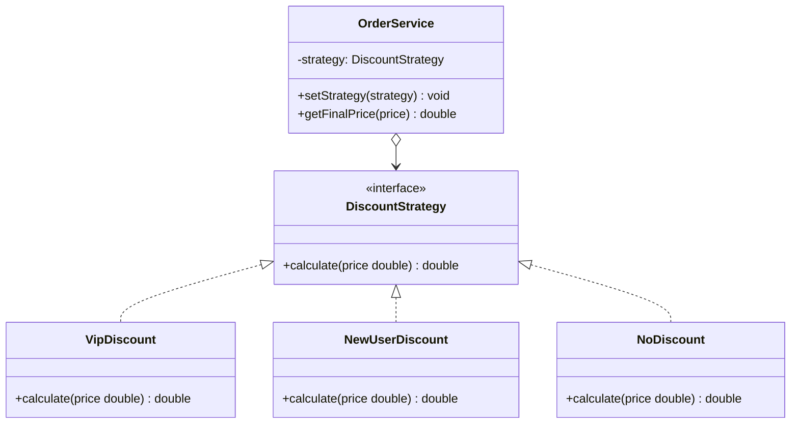

# 策略模式

## 定义

策略模式（Strategy）定义一族算法，将每种算法封装为独立的类，并使它们可以相互替换。让算法的变化独立于使用算法的客户端。

## 不使用策略存在的问题

电商促销系统需要根据用户类型使用不同的折扣策略：

``` java title="StrategyBadExample.java"
--8<-- "code/topic/design-patterns/src/main/java/com/example/behavioral/strategy/StrategyBadExample.java"
```

## 设计模式结构说明



## 设计模式举例说明

``` java title="StrategyExample.java"
--8<-- "code/topic/design-patterns/src/main/java/com/example/behavioral/strategy/StrategyExample.java"
```

!!! tip "Java 8 简化"

    策略接口只有一个方法时，可以用 Lambda 直接替换：`service.setStrategy(price -> price * 0.9);`

## 优缺点

**优点：**

- 符合**开闭原则**：新增策略不修改已有代码
- 消除条件语句（if-else/switch），代码更清晰
- 策略可以独立测试和复用

**缺点：**

- 策略数量多时，类的数量也会增多
- 调用方需要知道有哪些策略，并自行选择（可结合工厂模式解决）

## 与其它模式的关系

**相似模式防混淆：**

| 模式 | 封装什么 | 侧重点 |
|------|---------|-------|
| 策略（Strategy） | 算法/行为 | 运行时替换 |
| 模板方法（Template Method） | 算法骨架 | 子类填充部分步骤 |
| 命令（Command） | 请求/操作 | 支持撤销、队列、日志 |

## 应用场景

- 需要在运行时切换算法（排序算法、支付方式、路由策略）
- 多个相似的类只在行为上有所不同
- Spring：`ResourceLoader` 策略、`PasswordEncoder` 策略
- `Comparator` 就是一个典型的策略接口
