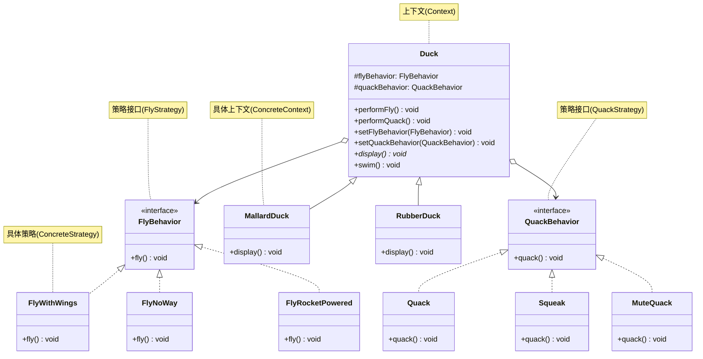

# 策略模式

## 从鸭子危机说起

Joe 的公司做了一套鸭子模拟游戏——Duck Simulator。游戏里有各种鸭子：绿头鸭（MallardDuck）、红头鸭（RedheadDuck）……它们都继承自 `Duck` 基类，会游泳（swim）、会叫（quack）、外观各不同（display）。

有一天，产品经理说："给鸭子加上飞行功能！"Joe 很快在 `Duck` 基类里加了 `fly()` 方法，所有子类就都会飞了——**包括橡皮鸭**。

```
我是橡皮鸭
我在飞！  ← 橡皮鸭在飞？！
```

这就是**继承的陷阱**：修改父类会引起所有子类意想不到的改变。如果用接口也不行——每种鸭子的飞法都不同，接口没法复用代码，有 48 种鸭子就要写 48 次飞行实现。

## 🔍 定义

策略模式（Strategy）定义一族算法，将每种算法封装为独立的类，并使它们可以相互替换。让算法的变化独立于使用算法的客户端。

> **设计原则：找出可能需要变化之处，把它们独立出来，不要和不需要变化的代码混在一起。**

## ⚠️ 不使用策略存在的问题

把行为直接继承自父类，不会飞的鸭子也继承了飞行方法：

``` java title="StrategyBadExample.java"
--8<-- "code/topic/design-patterns/src/main/java/com/example/behavioral/strategy/StrategyBadExample.java"
```

## 🏗️ 设计模式结构（鸭子模拟器）

把"变化的部分"——飞行行为和叫声行为——从 Duck 类中分离出来，封装成独立的策略接口：



## 💻 设计模式举例说明

``` java title="StrategyExample.java"
--8<-- "code/topic/design-patterns/src/main/java/com/example/behavioral/strategy/StrategyExample.java"
```

!!! tip "关键技巧：运行时切换行为"

    `duck.setFlyBehavior(new FlyRocketPowered())` 让鸭子在运行时"换上"火箭推进器——这是继承无法做到的！组合让行为可以动态替换。

## ⚖️ 优缺点

**优点：**

- 符合**开闭原则**：新增飞行方式只需新建类，不修改 Duck 及现有策略
- 消除条件语句（if-else/switch），代码更清晰
- 策略可以独立测试和复用（FlyWithWings 可以给任何会飞的对象用）
- 运行时动态切换行为

**缺点：**

- 策略数量多时，类的数量也会增多
- 调用方需要知道有哪些策略（可结合工厂模式解决）

## 🔗 与其它模式的关系

| 模式 | 封装什么 | 侧重点 |
|------|---------|-------|
| 策略（Strategy） | 算法/行为 | 运行时替换，Context 持有策略引用 |
| 模板方法（Template Method） | 算法骨架 | 子类填充部分步骤，用继承 |
| 命令（Command） | 请求/操作 | 支持撤销、队列、日志 |

## 🗂️ 应用场景

- 需要在运行时切换算法（排序算法、支付方式、飞行行为）
- 多个相似的类只在行为上有所不同
- Spring：`PasswordEncoder` 策略、`ResourceLoader` 策略
- Java 标准库：`Comparator` 就是一个典型的策略接口，传入不同 lambda 就是不同排序策略

## 🏭 工业视角

### 策略模式三部分：定义、创建、使用各司其职

一个完整的策略模式由三部分组成，关键是把它们**分离**，不要耦合在同一个类里：

- **定义**：Strategy 接口 + 一组实现类，每个实现类封装一种算法，互相独立可替换。
- **创建**：工厂类（`StrategyFactory`）封装创建细节，客户端不感知具体实现类。
- **使用**：Context 通过工厂拿到策略对象并执行，不包含任何 if-else 分支。

若策略类**无状态**（只有算法、无成员变量），可以预先创建好缓存在 `Map` 中复用：

``` java title="策略工厂：Map 注册表消除 if-else"
public class DiscountStrategyFactory {
    // 策略对象无状态，预创建后缓存复用
    private static final Map<OrderType, DiscountStrategy> strategies = new HashMap<>();

    static {
        strategies.put(OrderType.NORMAL,    new NormalDiscountStrategy());
        strategies.put(OrderType.GROUPON,   new GrouponDiscountStrategy());
        strategies.put(OrderType.PROMOTION, new PromotionDiscountStrategy());
    }

    public static DiscountStrategy getDiscountStrategy(OrderType type) {
        return strategies.get(type);  // 查表，O(1)，无 if-else
    }
}

// 使用方：完全没有分支判断
public class OrderService {
    public double discount(Order order) {
        DiscountStrategy strategy =
            DiscountStrategyFactory.getDiscountStrategy(order.getType());
        return strategy.calDiscount(order);
    }
}
```

!!! tip "查表法是消除 if-else 的本质"

    无论是策略模式、状态模式还是责任链，能消除 if-else 的根本手段都是「查表」——把「条件 → 行为」的映射预先存在 Map 或列表中，用 `get(key)` 替代 `if key == X`。策略模式只是在这个查表结构上叠加了面向对象封装。

### 实战场景：按文件大小动态选择排序算法

策略模式在算法选择场景下极为自然。以文件排序为例：小文件可以全量加载内存快排；大文件需要外部排序；超大文件要借助 MapReduce 多机排序。不同策略对应完全不同的实现复杂度，直接堆在一个方法里会导致代码臃肿、难以复用。

``` java title="文件排序策略：AlgRange 消除文件大小 if-else"
public class Sorter {
    private static final long GB = 1000 * 1000 * 1000;

    // 将「范围 → 算法」的映射表化，新增策略只改这里
    private static final List<AlgRange> algs = new ArrayList<>();
    static {
        algs.add(new AlgRange(0,       6 * GB,           new QuickSort()));
        algs.add(new AlgRange(6 * GB,  10 * GB,          new ExternalSort()));
        algs.add(new AlgRange(10 * GB, 100 * GB,         new ConcurrentExternalSort()));
        algs.add(new AlgRange(100 * GB, Long.MAX_VALUE,  new MapReduceSort()));
    }

    public void sortFile(String filePath) {
        long fileSize = new File(filePath).length();
        algs.stream()
            .filter(r -> r.inRange(fileSize))
            .findFirst()
            .map(AlgRange::getAlg)
            .ifPresent(alg -> alg.sort(filePath));
    }
}
```

### 别把策略模式当成 if-else 克星

!!! warning "过度设计的警示"

    一提到 if-else，有人就想用策略模式消灭它。实际上，**if-else 本身没有问题**——如果分支不多、逻辑简单、未来不需要扩展，直接写 if-else 是最符合 KISS 原则的做法。非得引入策略接口、工厂类、注册表，反而制造了不必要的复杂度。
    
    策略模式的真正价值是**控制复杂度、解耦定义/创建/使用**——当每个分支的实现逻辑复杂（数十行代码）、策略数量多且需要独立复用、或者未来会频繁新增/修改策略时，才值得引入。

