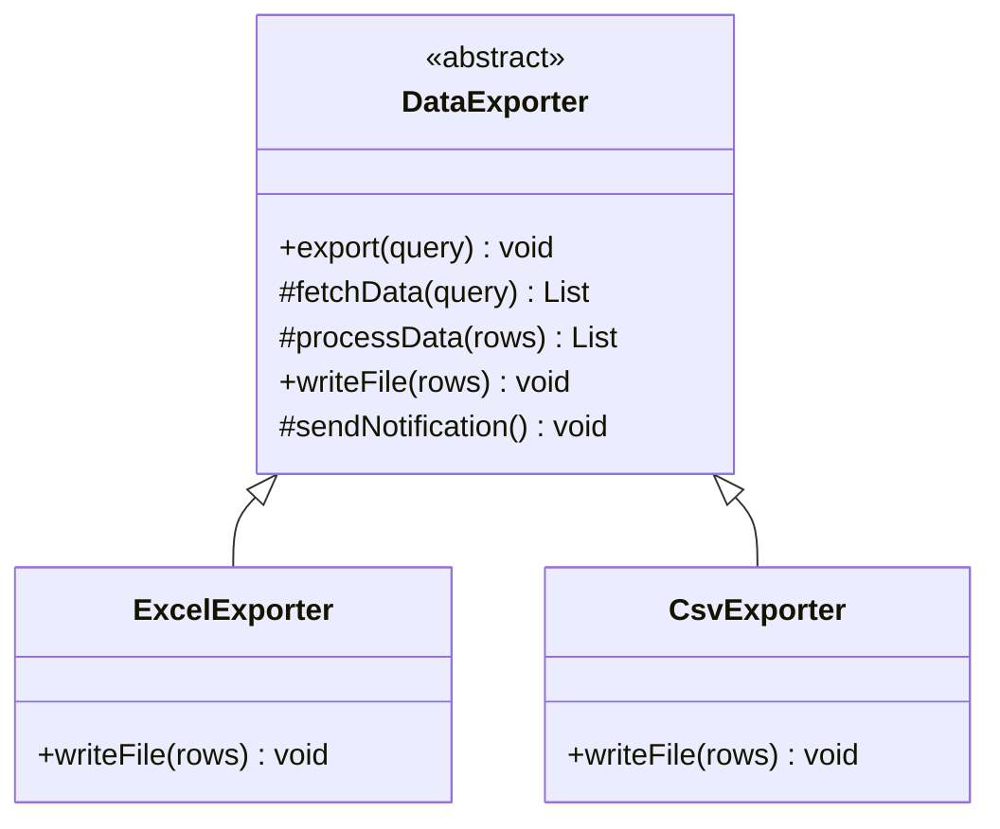

# 模板方法模式

## 定义

模板方法模式（Template Method）在父类中定义一个算法的骨架，将某些步骤延迟到子类中实现。子类可以在不改变算法整体结构的前提下，重新定义某些特定步骤。

## 不使用模板方法存在的问题

数据导出功能支持导出 Excel 和 CSV，两种格式的整体流程（获取数据→处理数据→写入文件→发送通知）完全相同，只有写入格式不同：

``` java title="TemplateMethodBadExample.java"
--8<-- "code/topic/design-patterns/src/main/java/com/example/behavioral/template_method/TemplateMethodBadExample.java"
```

## 设计模式结构说明



父类 `DataExporter` 中的 `export()` 是模板方法——定义了固定流程；`writeFile()` 是抽象钩子，由子类实现。

## 设计模式举例说明

``` java title="TemplateMethodExample.java"
--8<-- "code/topic/design-patterns/src/main/java/com/example/behavioral/template_method/TemplateMethodExample.java"
```

## 优缺点

**优点：**

- 消除重复代码，将公共流程集中在父类
- 子类只需关注自己负责的步骤，职责清晰
- 控制反转：父类控制整体流程，子类填充细节（好莱坞原则："别调用我，我会调用你"）

**缺点：**

- 继承关系增加了代码耦合度，子类依赖父类实现
- 模板方法中步骤越多，子类的灵活性越受限
- 可能导致类层次结构增多

## 与其它模式的关系

**相似模式防混淆：**

| 模式 | 复用手段 | 变化点位置 |
|------|---------|----------|
| 模板方法（Template Method） | 继承 | 子类重写特定步骤 |
| 策略（Strategy） | 组合 | 整个算法在运行时替换 |

> 模板方法在**编译时**确定变化点（继承），策略在**运行时**替换（组合注入）。能用策略就不用模板方法，组合优于继承。

**组合使用：**

模板方法中的钩子方法可以返回策略对象，让子类提供不同策略而非直接实现算法。

## 应用场景

- 多个类有相同的流程，只有某些步骤不同
- 想控制子类扩展：只允许重写特定步骤，不允许改变整体流程
- JDK：`AbstractList`（`get()`/`size()` 是抽象方法，其他方法是模板）
- Spring：`JdbcTemplate`（固定获取连接→执行SQL→处理结果的流程）、`AbstractBeanFactory`
