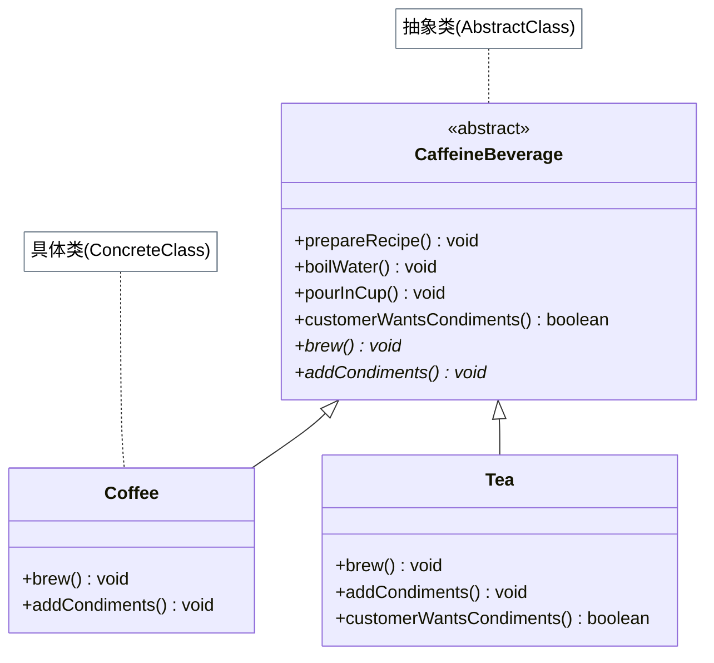

# 模板方法模式

## 从咖啡和茶说起

假设你要实现"冲咖啡"和"冲茶"两个流程：

- 冲咖啡：烧水 → 冲泡咖啡粉 → 倒入杯中 → 加糖和牛奶
- 冲茶：烧水 → 浸泡茶包 → 倒入杯中 → 加柠檬

"烧水"和"倒入杯中"两步完全一样！如果写两个独立的类，这两步就得重复写两遍——这违反了 DRY（Don't Repeat Yourself）原则，也意味着将来修改"烧水"要改两处。

解决方案：提取公共流程到抽象父类 `CaffeineBeverage`，其中的 `prepareRecipe()` 就是**模板方法**——它定义了算法骨架，把差异化的步骤（`brew()`、`addCondiments()`）留给子类实现。

## 🔍 定义

模板方法模式（Template Method）在父类中定义一个算法的骨架，将某些步骤延迟到子类中实现。子类可以在不改变算法整体结构的前提下，重新定义某些特定步骤。

> **设计原则：好莱坞原则 —— 别调用我，我会调用你。**
> 父类（`CaffeineBeverage`）控制流程，调用子类的 `brew()` 和 `addCondiments()`；子类不直接调用父类，只是被调用。

## ⚠️ 不使用模板方法存在的问题

``` java title="TemplateMethodBadExample.java"
--8<-- "code/topic/design-patterns/src/main/java/com/example/behavioral/template_method/TemplateMethodBadExample.java"
```

## 🏗️ 设计模式结构（咖啡因饮料）



| 角色 | 说明 |
|------|------|
| `prepareRecipe()` | 模板方法：`final`，定义固定流程 |
| `boilWater()` / `pourInCup()` | 具体方法：公共步骤，超类统一实现 |
| `brew()` / `addCondiments()` | 抽象方法：差异化步骤，子类必须实现 |
| `customerWantsCondiments()` | 钩子方法（hook）：有默认实现，子类可选重写 |

## 💻 设计模式举例说明

``` java title="TemplateMethodExample.java"
--8<-- "code/topic/design-patterns/src/main/java/com/example/behavioral/template_method/TemplateMethodExample.java"
```

!!! tip "抽象方法 vs 钩子方法（hook）"

    - **抽象方法**：子类**必须**实现，通常是核心差异点（如 `brew()`）
    - **钩子方法**：子类**可选**重写，通常用于影响流程走向（如 `customerWantsCondiments()` 控制是否执行 `addCondiments()`）
    - 钩子方法默认实现一般是"什么都不做"或"返回 true"，让子类以最小代价接入流程控制

## ⚖️ 优缺点

**优点：**

- 消除重复代码，公共流程集中在父类，符合 DRY 原则
- 子类只需关注自己负责的差异步骤，职责清晰
- 好莱坞原则：父类控制整体流程，子类被动填充

**缺点：**

- 继承关系增加了耦合度，子类依赖父类实现
- 模板步骤越多，子类的灵活性越受限
- 可能导致类层次结构增多

## 🔗 与其它模式的关系

| 模式 | 复用手段 | 变化点位置 |
|------|---------|----------|
| 模板方法（Template Method） | 继承 | 子类重写特定步骤（编译时确定） |
| 策略（Strategy） | 组合 | 整个算法在运行时替换 |

> 能用策略就不用模板方法，组合优于继承。但模板方法在流程步骤固定、只需替换个别步骤时更直接。

## 🗂️ 应用场景

- 多个类有相同的流程骨架，只有某些步骤不同
- 想通过 `final` 锁住整体算法，只允许子类扩展特定步骤
- JDK：`AbstractList`（`get()`/`size()` 是抽象方法，其余是模板）
- Spring：`JdbcTemplate`（固定获取连接→执行SQL→处理结果的流程）

## 🏭 工业视角

### 模板方法的两大作用：复用与扩展

《设计模式之美》将模板方法的价值归纳为两点，对应两类典型场景：

**复用**：多个子类共享父类的算法骨架，避免重复代码。JDK `InputStream` 的 `read(byte[], int, int)` 就是模板方法——它实现了循环读取的完整逻辑，唯一留给子类的是单字节 `abstract int read()`；`AbstractList.addAll()` 调用的 `add()` 默认抛出 `UnsupportedOperationException`，强迫子类实现。

**扩展**：框架通过模板方法提供扩展点，让用户在不修改框架源码的情况下嵌入业务逻辑。`HttpServlet.service()` 定义了完整的 HTTP 请求分发流程，子类只需重写 `doGet()` / `doPost()`；JUnit `TestCase.runBare()` 定义了测试执行骨架：

``` java title="JUnit TestCase 模板方法骨架"
public abstract class TestCase {
    public void runBare() throws Throwable {
        setUp();          // 钩子：子类可选重写（准备工作）
        try {
            runTest();    // 模板步骤：执行实际测试
        } finally {
            tearDown();   // 钩子：子类可选重写（清理工作）
        }
    }
    protected void setUp() throws Exception {}
    protected void tearDown() throws Exception {}
}
```

!!! tip "框架扩展点的本质"

    模板方法是"好莱坞原则"的体现——框架调用你，而不是你调用框架。`HttpServlet` 用户永远不需要手动调用 `service()`，只需实现 `doGet()`/`doPost()` 等待容器回调。这种控制反转让框架能够在不修改用户代码的前提下演进底层实现。

### 回调（Callback）：组合替代继承的函数式方案

模板方法用**继承**实现扩展点，但继承有其代价（耦合深、类爆炸）。**回调**用**组合**达到同样目的：将可变逻辑封装成对象（或 lambda）传入，框架在固定流程中调用它。

Spring `JdbcTemplate` 虽名为"Template"，实际上是基于**回调**而非继承实现的：

``` java title="JdbcTemplate 回调实现（核心骨架）"
// 框架固定流程：获取连接 → 执行回调 → 关闭连接
public <T> T execute(StatementCallback<T> action) {
    Connection con = DataSourceUtils.getConnection(getDataSource());
    Statement stmt = con.createStatement();
    try {
        T result = action.doInStatement(stmt); // 调用用户定义的逻辑
        return result;
    } finally {
        JdbcUtils.closeStatement(stmt);
        DataSourceUtils.releaseConnection(con, getDataSource());
    }
}

// 用户侧：只写业务逻辑，连接管理全交给框架
jdbcTemplate.query("select * from user where id=?",
    (rs, rowNum) -> {               // RowMapper 就是回调对象
        User u = new User();
        u.setId(rs.getLong("id"));
        return u;
    }, userId);
```

!!! tip "模板方法 vs 回调：如何选择"

    | | 模板方法 | 回调 |
    |---|---|---|
    | 实现方式 | 继承 | 组合（对象/lambda） |
    | 扩展点数量 | 多个抽象方法，子类一次性实现 | 每次调用传一个回调，更灵活 |
    | 适用场景 | 流程步骤多、子类差异稳定 | 单次定制、函数式风格优先 |

    能用回调（组合）就不用模板方法（继承）——这与"组合优于继承"的设计原则一致。`JdbcTemplate`、`RestTemplate` 都遵循了这个原则。
