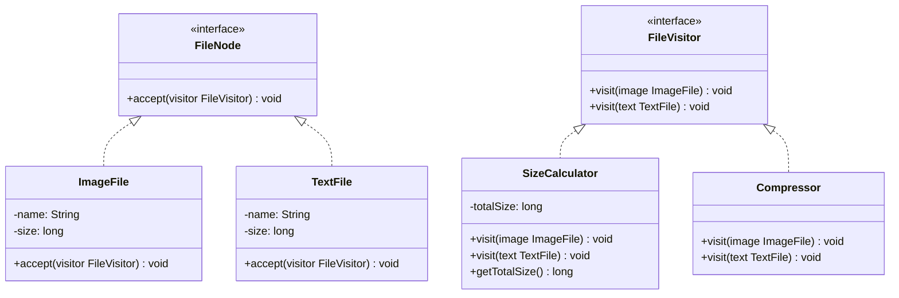

# 访问者模式

## 🔍 定义

访问者模式（Visitor）在不修改已有类的前提下，为对象结构中的元素添加新操作。将操作定义在独立的访问者类中，通过"双分派"机制（`accept()` + `visit()`）使操作与元素类解耦。

## ⚠️ 不使用访问者存在的问题

文件系统有 `ImageFile` 和 `TextFile` 两种节点，现在需要新增"计算大小"和"压缩文件"两种操作：

``` java title="VisitorBadExample.java"
--8<-- "code/topic/design-patterns/src/main/java/com/example/behavioral/visitor/VisitorBadExample.java"
```

如果对象结构类型稳定、但操作频繁变化，就该用访问者。

## 🏗️ 设计模式结构说明



## 💻 设计模式举例说明

``` java title="VisitorExample.java"
--8<-- "code/topic/design-patterns/src/main/java/com/example/behavioral/visitor/VisitorExample.java"
```

## ⚖️ 优缺点

**优点：**

- 符合**开闭原则**：新增操作只需新增访问者类，元素类不变
- 将相关操作集中在访问者类中，避免分散在各个元素类

**缺点：**

- 如果元素类型经常变化（需要新增新节点类型），所有访问者都要修改
- 访问者需要访问元素的内部状态，可能需要暴露本应私有的字段

!!! warning "使用前提"

    访问者模式适合**对象结构稳定（类型不频繁变化）、操作频繁变化**的场景。如果类型本身需要经常新增，该模式反而会带来大量修改。

## 🔗 与其它模式的关系

**相似模式防混淆：**

| 模式 | 谁定义操作 | 对象结构可否变化 |
|------|----------|--------------|
| 访问者（Visitor） | 访问者类（外部） | 稳定（不频繁新增类型） |
| 策略（Strategy） | 策略类（外部） | 不涉及对象结构 |
| 迭代器（Iterator） | 客户端遍历 | 关注顺序访问，不关注操作类型 |

## 🗂️ 应用场景

- 对象结构稳定，但需要频繁添加新操作（如编译器 AST 处理、报表生成）
- 对象结构中的元素有多种类型，需要针对每种类型实现不同的操作逻辑
- Java 编译器的 AST 遍历、XML 处理框架

## 工业视角

### 双分派：Java 用两次多态模拟"类型 × 操作"矩阵

大多数面向对象语言（包括 Java）只支持**单分派（Single Dispatch）**——方法调用时只根据**接收者的运行时类型**决定执行哪个版本。但访问者模式需要同时根据**元素类型**和**访问者类型**两个维度来决定行为，这就是**双分派（Double Dispatch）**。

Java 无法直接支持双分派，访问者模式用两次多态调用来模拟：

``` java title="双分派的两步调用"
// 第一次分派：根据 element 的运行时类型，调用对应的 accept()
element.accept(visitor);        // → ImageFile.accept() 或 TextFile.accept()

// 第二次分派：在 accept() 内部，根据 visitor 的编译时类型，调用对应的 visit()
visitor.visit(this);            // → SizeCalculator.visit(ImageFile) 或 Compressor.visit(ImageFile)
```

两次动态绑定合在一起，实现了"操作类型 × 元素类型"的矩阵式分发。

!!! tip "记忆要点"

    `element.accept(visitor)` 决定"哪种元素"，`visitor.visit(concreteElement)` 决定"哪种操作"。
    拆开看都是普通单分派，合在一起就实现了双分派——这是访问者模式最精妙也最难读懂的地方。

### 实用场景稀少，但编译器是经典落地

访问者模式在工业界使用频率很低，原因是它对"元素类型稳定"的要求极为苛刻——每新增一种节点类型，所有访问者类都必须修改。只有在以下场景才真正值得使用：

- **编译器 / 解释器的 AST 遍历**：语法节点类型固定，但需要频繁新增分析 Pass（类型检查、代码优化、代码生成……）
- **文档树的多种处理**：节点类型稳定，处理逻辑多变

!!! warning "实际开发慎用"

    《设计模式之美》明确建议：在没有特别必要的情况下，不要使用访问者模式。
    双分派机制让代码可读性和可维护性明显变差，结构复杂度远高于收益。
    如果只是想对已有类新增操作，优先考虑直接扩展或函数式方案。
