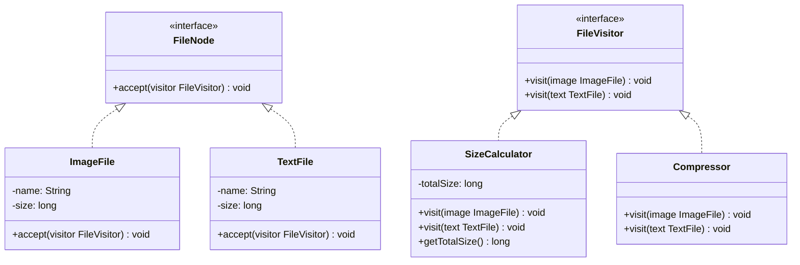

# 访问者模式

## 定义

访问者模式（Visitor）在不修改已有类的前提下，为对象结构中的元素添加新操作。将操作定义在独立的访问者类中，通过"双分派"机制（`accept()` + `visit()`）使操作与元素类解耦。

## 不使用访问者存在的问题

文件系统有 `ImageFile` 和 `TextFile` 两种节点，现在需要新增"计算大小"和"压缩文件"两种操作：

``` java title="VisitorBadExample.java"
--8<-- "code/topic/design-patterns/src/main/java/com/example/behavioral/visitor/VisitorBadExample.java"
```

如果对象结构类型稳定、但操作频繁变化，就该用访问者。

## 设计模式结构说明



## 设计模式举例说明

``` java title="VisitorExample.java"
--8<-- "code/topic/design-patterns/src/main/java/com/example/behavioral/visitor/VisitorExample.java"
```

## 优缺点

**优点：**

- 符合**开闭原则**：新增操作只需新增访问者类，元素类不变
- 将相关操作集中在访问者类中，避免分散在各个元素类

**缺点：**

- 如果元素类型经常变化（需要新增新节点类型），所有访问者都要修改
- 访问者需要访问元素的内部状态，可能需要暴露本应私有的字段

!!! warning "使用前提"

    访问者模式适合**对象结构稳定（类型不频繁变化）、操作频繁变化**的场景。如果类型本身需要经常新增，该模式反而会带来大量修改。

## 与其它模式的关系

**相似模式防混淆：**

| 模式 | 谁定义操作 | 对象结构可否变化 |
|------|----------|--------------|
| 访问者（Visitor） | 访问者类（外部） | 稳定（不频繁新增类型） |
| 策略（Strategy） | 策略类（外部） | 不涉及对象结构 |
| 迭代器（Iterator） | 客户端遍历 | 关注顺序访问，不关注操作类型 |

## 应用场景

- 对象结构稳定，但需要频繁添加新操作（如编译器 AST 处理、报表生成）
- 对象结构中的元素有多种类型，需要针对每种类型实现不同的操作逻辑
- Java 编译器的 AST 遍历、XML 处理框架
