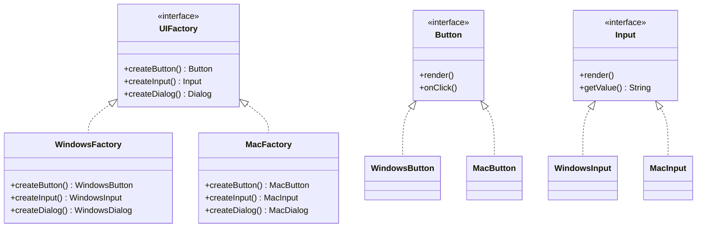

# 抽象工厂模式

## 🔍 定义

**抽象工厂模式**（Abstract Factory Pattern）是一种创建型设计模式，它提供一个接口，用于创建**一系列相关或相互依赖的对象**（产品族），而无需指定它们的具体类。

工厂方法关注的是"创建一种产品的哪个具体变体"，抽象工厂关注的是"创建一整套配套产品，保证它们来自同一族"。

## ⚠️ 不使用该模式存在的问题

一个跨平台 UI 框架需要支持 Windows 风格和 macOS 风格。最初各组件分别创建：

``` java title="AbstractFactoryBadExample.java"
--8<-- "code/topic/design-patterns/src/main/java/com/example/creational/abstract_factory/AbstractFactoryBadExample.java"
```

问题出在每个组件都要单独判断主题：

- **容易混用**：一不小心写成 `new WindowsButton()` + `new MacDialog()`，样式不统一
- **扩展困难**：新增一套主题（如 Linux），要找遍所有创建组件的地方逐一修改
- **违反 OCP**：每次新增主题都修改 `Application` 类

## 🏗️ 设计模式结构说明



核心角色：

| 角色 | 说明 |
|------|------|
| `AbstractFactory`（抽象工厂） | 声明创建产品族的方法 |
| `ConcreteFactory`（具体工厂） | 实现抽象工厂，生产配套的同族产品 |
| `AbstractProduct`（抽象产品） | 声明每类产品的接口 |
| `ConcreteProduct`（具体产品） | 实现各族对应的产品 |

## 💻 设计模式举例说明

以数据访问层（DAO）工厂为例——根据不同数据库（MySQL / H2）切换数据访问实现，保证整套 DAO 来自同一族：

``` java title="AbstractFactoryExample.java"
--8<-- "code/topic/design-patterns/src/main/java/com/example/creational/abstract_factory/AbstractFactoryExample.java"
```

## ⚖️ 优缺点

**优点**：

- 🎯 **产品族一致性**：工厂保证一次性创建的对象都来自同一族，避免"Windows 按钮 + macOS 对话框"的混用问题
- 🎯 **切换产品族方便**：替换整套实现只需换一个工厂实例，业务代码无需修改
- 🎯 **符合开闭原则**：新增产品族只需添加一组新的工厂和产品实现，无需修改现有代码
- 🎯 **解耦**：业务代码只依赖抽象接口，与具体实现完全隔离

**缺点**：

- ⚠️ **难以新增产品类型**：如果要在抽象工厂中新增一种产品（如 `createDialog()`），所有已有工厂类都需要修改——这是抽象工厂最大的缺陷
- ⚠️ **类数量爆炸**：M 个工厂 × N 种产品 = M×N 个具体类，规模大时难以维护
- ⚠️ **适用场景有限**：只适合产品族相对稳定的场景，不适合产品类型频繁变化的系统

## 🔗 与其它模式的关系

| 相关模式 | 关系说明 |
|---------|---------|
| **工厂方法模式** | 抽象工厂在实现时通常基于多个工厂方法，每个方法创建一种产品 |
| **单例模式** | 具体工厂（如 `MySQLDaoFactory`）通常实现为单例——整个应用只需一个工厂实例 |
| **原型模式** | 可以作为抽象工厂的另一种实现——工厂内部保存原型对象，通过克隆原型来创建产品 |
| **桥接模式** | 两者结构相似（都有抽象层和实现层），但目的不同：桥接关注抽象与实现的分离，抽象工厂关注创建配套对象 |

## 🗂️ 应用场景

- 🗂️ **跨数据库 DAO 层**：根据数据库类型（MySQL/Oracle/H2）切换整套 DAO 实现，常见于需要支持多数据库的框架
- 🗂️ **跨平台 UI 框架**：Windows/macOS/Linux 各一套风格统一的组件（Qt、Swing 均采用此模式）
- 🗂️ **测试与生产隔离**：测试环境用内存实现（H2、Map），生产环境用真实实现（MySQL、Redis）
- 🗂️ **Spring DataSource 配置**：`DataSourceAutoConfiguration` 根据 classpath 上的驱动选择合适的 DataSource 实现体系

!!! tip "抽象工厂 vs 工厂方法"

    | 维度 | 工厂方法 | 抽象工厂 |
    |------|---------|---------|
    | 关注点 | 创建**一种**产品 | 创建**一族**产品 |
    | 扩展方式 | 新增产品类 + 工厂子类 | 新增整套产品类 + 工厂类 |
    | OCP | 新增产品类型：✅ 不修改 | 新增产品类型：❌ 所有工厂要改 |
    | 适用场景 | 产品类型会扩展 | 产品族固定、族内实现会变化 |
