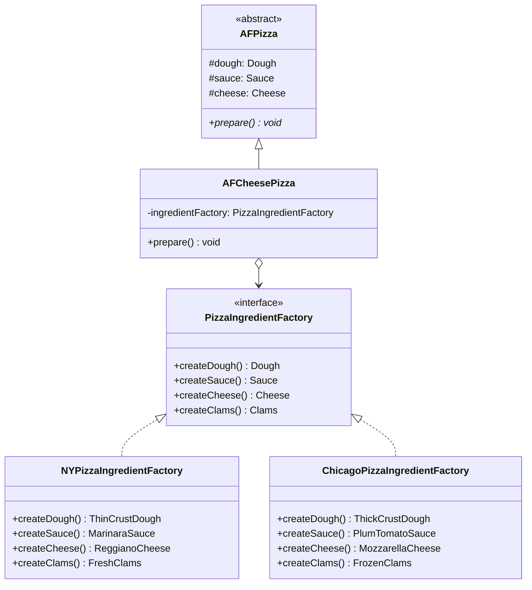

# 抽象工厂模式

## 从披萨原料工厂说起

披萨连锁店做大了，需要保证每家门店用的原料都"正宗"——纽约的薄脆面团、新鲜蛤蜊；芝加哥的厚脆面团、冷冻蛤蜊。问题是，如果每种 Pizza 直接 `new NYDough()`、`new NYSauce()`，那么当你想在加州开店时，就要把所有 Pizza 类都改一遍。

**解决方案：** 建立"原料工厂"接口 `PizzaIngredientFactory`，纽约工厂和芝加哥工厂各自提供一整套原料。Pizza 只面向接口，不依赖任何具体原料类。

## 🔍 定义

抽象工厂模式（Abstract Factory）提供一个接口，用于创建一系列相关或相互依赖的对象（产品族），而无需指定具体类。

工厂方法关注"创建一种产品的哪个变体"，抽象工厂关注"创建一整套配套产品，保证它们来自同一族"。

## ⚠️ 不使用该模式存在的问题

每个城市的门店直接 `new` 具体原料，无法保证原料的一致性：

``` java title="AbstractFactoryBadExample.java"
--8<-- "code/topic/design-patterns/src/main/java/com/example/creational/abstract_factory/AbstractFactoryBadExample.java"
```

## 🏗️ 设计模式结构（披萨原料工厂）



核心角色：

| 角色 | 说明 |
|------|------|
| `PizzaIngredientFactory`（抽象工厂） | 声明创建原料族的方法 |
| `NYPizzaIngredientFactory`（具体工厂） | 生产纽约风格的一套原料 |
| `Dough/Sauce/Cheese`（抽象产品） | 各类原料的接口 |
| `ThinCrustDough`（具体产品） | 纽约风格的薄脆面团 |

## 💻 设计模式举例说明

``` java title="AbstractFactoryExample.java"
--8<-- "code/topic/design-patterns/src/main/java/com/example/creational/abstract_factory/AbstractFactoryExample.java"
```

!!! tip "工厂方法 vs 抽象工厂"

    | 维度 | 工厂方法 | 抽象工厂 |
    |------|---------|---------|
    | 关注点 | 创建**一种**产品 | 创建**一族**产品 |
    | 扩展方式 | 新增产品类 + 工厂子类 | 新增整套产品类 + 工厂类 |
    | 新增产品类型 | ✅ 不修改已有代码 | ❌ 所有工厂都要加方法 |
    | 适用场景 | 产品类型会增长 | 产品族固定，族内实现会变化 |

## ⚖️ 优缺点

**优点：**

- **产品族一致性**：工厂保证一次性创建的对象都来自同一族，不会出现"纽约面团+芝加哥酱料"的混用
- **切换方便**：替换整套实现只需换一个工厂实例，业务代码无需修改
- 符合**开闭原则**：新增城市（新增工厂实现）不改现有代码

**缺点：**

- **难以新增产品种类**：在工厂接口中新增一种原料（如 `createMushroom()`），所有已有工厂类都必须修改
- 类数量较多：M 个工厂 × N 种产品 = M×N 个具体类

## 🔗 与其它模式的关系

| 相关模式 | 关系说明 |
|---------|---------|
| 工厂方法 | 抽象工厂在实现时通常包含多个工厂方法 |
| 单例 | 具体工厂通常实现为单例，整个应用只需一个工厂实例 |
| 原型 | 工厂内部保存原型，通过克隆来创建产品（另一种实现方式） |

## 🗂️ 应用场景

- 跨数据库 DAO 层（MySQL/H2/Oracle，按环境切换整套实现）
- 跨平台 UI 框架（Windows/macOS 各一套风格统一的组件）
- 测试与生产隔离（测试用内存实现，生产用真实实现）

## 🏭 工业视角

### 抽象工厂解决的是"产品族一致性"问题

抽象工厂与工厂方法的核心区别在于粒度：工厂方法创建**一种产品**，抽象工厂创建**一组相关产品**（产品族），并保证它们来自同一家族、可以协同工作。

典型场景：系统需要同时支持 MySQL 和 PostgreSQL，不只是 Connection 要切换，Statement、ResultSet 的处理方式也要配套切换。此时用抽象工厂，一次切换工厂，整套实现全部替换。

``` java title="抽象工厂：一次切换，整套产品族替换"
// 每个工厂提供配套的一组对象，保证产品族内部一致
public interface IConfigParserFactory {
    IRuleConfigParser createRuleParser();   // 规则配置解析器
    ISystemConfigParser createSystemParser(); // 系统配置解析器
}

public class JsonConfigParserFactory implements IConfigParserFactory {
    @Override
    public IRuleConfigParser createRuleParser() {
        return new JsonRuleConfigParser();
    }
    @Override
    public ISystemConfigParser createSystemParser() {
        return new JsonSystemConfigParser();
    }
}
```

### Spring IoC 容器是工厂模式的终极形态

Spring 的 `ApplicationContext` 本质上是一个超级工厂：它读取配置（XML / 注解），动态决定创建哪些对象、如何注入依赖，并管理对象的生命周期。

这正是工厂模式核心价值的极致体现——**将对象的创建与使用完全解耦**。调用方只需声明"我需要一个 `UserService`"，不关心它是如何被创建的、依赖了哪些其他 Bean。

!!! tip "实际工程中的抽象工厂"

    在日常业务开发中，抽象工厂直接出现的频率不高。但"切换整套实现"的需求（多数据源、多环境、测试替身）都是它在解决的问题。
    Spring Profiles + 条件 Bean 配置，是抽象工厂思想的框架级实现。
