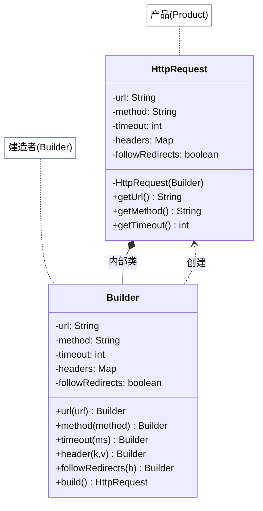

# 建造者模式

## 从 HTTP 请求配置说起

你需要构建一个 HTTP 请求：URL 和请求方法是必填的，但超时时间、重试次数、请求头、认证信息、代理设置……这十几个参数大多数时候用默认值，偶尔才需要自定义几个。

一个接收 12 个参数的构造函数是灾难：`new Request(url, "POST", 5000, 3, null, null, null, headers, null, null, null, null)`，没人看得懂哪个 `null` 代表什么。建造者模式的解法是只声明真正关心的参数，其余保持默认：`Request.builder(url).method("POST").timeout(5000).build()`——清晰、安全、只设置你需要的。

## 🔍 定义

**建造者模式**（Builder Pattern）是一种创建型设计模式，它将一个复杂对象的**构建过程**与其**最终表示**分离，使得同样的构建过程可以产生不同的表示。

核心思想：使用一个专门的 Builder 对象分步骤设置参数，最后调用 `build()` 一次性生成目标对象。这样既保持了对象构建过程的清晰性，又支持创建后的对象不可变（immutable）。

## ⚠️ 不使用该模式存在的问题

一个 HTTP 请求对象有十几个参数，其中多数是可选的：

``` java title="BuilderBadExample.java"
--8<-- "code/topic/design-patterns/src/main/java/com/example/creational/builder/BuilderBadExample.java"
```

两种方式都存在问题：构造函数可读性差，JavaBean 风格无法创建不可变对象且有线程安全隐患。

## 🏗️ 设计模式结构说明



核心角色：

| 角色 | 说明 |
|------|------|
| `Product`（产品） | 最终被构建的复杂对象，通常是不可变的 |
| `Builder`（建造者） | 提供链式设置参数的方法，持有构建参数 |
| `Director`（指导者，可选） | 封装特定的构建流程，复用常见配置组合 |

## 💻 设计模式举例说明

以邮件消息为例，展示带 Director（邮件模板工厂）的完整建造者实现：

``` java title="BuilderExample.java"
--8<-- "code/topic/design-patterns/src/main/java/com/example/creational/builder/BuilderExample.java"
```

## ⚖️ 优缺点

**优点**：

- 🎯 **可读性极佳**：链式调用，每个参数都有名字，代码自描述（`builder.method("POST").timeout(5000)`）
- 🎯 **支持不可变对象**：`build()` 之后对象完全构建完毕，提供只读访问，线程安全
- 🎯 **参数灵活**：可选参数可以随意省略，且带有合理默认值
- 🎯 **可复用构建过程**：Director 可以封装常用配置组合，避免重复代码

**缺点**：

- ⚠️ **代码量增加**：Builder 类几乎是 Product 类的镜像，参数越多 Builder 越臃肿
- ⚠️ **与 Product 强耦合**：Product 字段变化时，Builder 也必须同步修改
- ⚠️ **对简单对象过度设计**：参数少于 4 个且都是必填的对象，直接用构造函数更简洁

## 🔗 与其它模式的关系

| 相关模式 | 关系说明 |
|---------|---------|
| **抽象工厂模式** | 抽象工厂一次性返回完整产品族；建造者关注分步骤构建单个复杂对象，最后调用 `build()` 返回 |
| **模板方法模式** | Director 中封装的构建流程本质上是一种模板方法——骨架固定，具体步骤委托给 Builder |
| **组合模式** | 构建树形结构（如 AST、DOM）时，常用建造者分步组装节点 |
| **原型模式** | 当需要创建"基于某个已有对象的变体"时，原型（clone + 修改）有时比重新用 Builder 构建更简洁 |

## 🗂️ 应用场景

- 🗂️ **复杂配置对象**：`HttpRequest`、`OkHttpClient`、`SSLContext`——参数多且部分可选
- 🗂️ **不可变值对象**：需要线程安全且创建后不可修改的对象
- 🗂️ **SQL 查询构建器**：`QueryBuilder.select("*").from("user").where("id > 10").limit(20).build()`
- 🗂️ **Lombok @Builder**：注解自动生成 Builder，避免手写样板代码
- 🗂️ **Spring Security**：`http.authorizeHttpRequests().requestMatchers(...).permitAll().and()...`
- 🗂️ **JDK 内置**：`StringBuilder`（可变字符串构建）、`ProcessBuilder`（进程构建）

!!! tip "Lombok @Builder 使用"

    实际项目中很少手写 Builder，通常使用 Lombok：

    ``` java
    @Builder
    @Getter
    public class HttpRequest {
        private final String url;
        @Builder.Default private final String method = "GET";
        @Builder.Default private final int    timeout = 3000;
    }

    // 使用
    HttpRequest req = HttpRequest.builder()
            .url("https://api.example.com")
            .method("POST")
            .build();
    ```

## 🏭 工业视角

### 三种对象创建方式的适用边界

| 方式 | 适用场景 | 主要问题 |
|------|---------|---------|
| 构造函数 | 参数少（≤4个），全部必填 | 参数多时可读性差，易传错顺序 |
| set() 方法 | 参数多，大部分可选，允许对象可变 | 无法创建不可变对象；必填项校验无处安放；对象可能处于中间无效状态 |
| Builder | 参数多、有必填/可选之分、参数间有约束、需要不可变对象 | 代码量略多，需多写一个 Builder 内部类 |

Builder 模式真正解决的三个问题：
1. **必填项校验集中**：所有校验逻辑在 `build()` 方法中统一执行，避免遗漏
2. **参数间约束验证**：如 `maxIdle <= maxTotal` 这类跨字段约束，set 方法无法优雅处理
3. **不可变对象**：构造完成后目标类不暴露任何 setter，线程安全

``` java title="Builder 模式：校验集中，创建不可变对象"
// build() 中统一做必填项 + 约束条件校验
public ResourcePoolConfig build() {
    if (StringUtils.isBlank(name)) {
        throw new IllegalArgumentException("name 为必填项");
    }
    if (maxIdle > maxTotal) {
        throw new IllegalArgumentException("maxIdle 不能大于 maxTotal");
    }
    if (minIdle > maxIdle) {
        throw new IllegalArgumentException("minIdle 不能大于 maxIdle");
    }
    return new ResourcePoolConfig(this); // 目标类构造函数私有
}
```

### Builder 与工厂模式的区别

两者都是创建对象，但关注点不同：

- **工厂模式**：关注"创建**哪种**对象"——根据类型参数返回不同子类实例，调用方不关心具体类
- **Builder 模式**：关注"如何**配置**同一种对象"——创建的是同一个类，但参数组合复杂

!!! tip "Lombok 的 @Builder"

    在 Java 项目中，Lombok 的 `@Builder` 注解可以自动生成 Builder 内部类，省去大量样板代码。
    但注意：Lombok 生成的 Builder **不会自动添加必填项校验和约束检查**，如有需要仍需手写 `build()` 方法中的逻辑。
