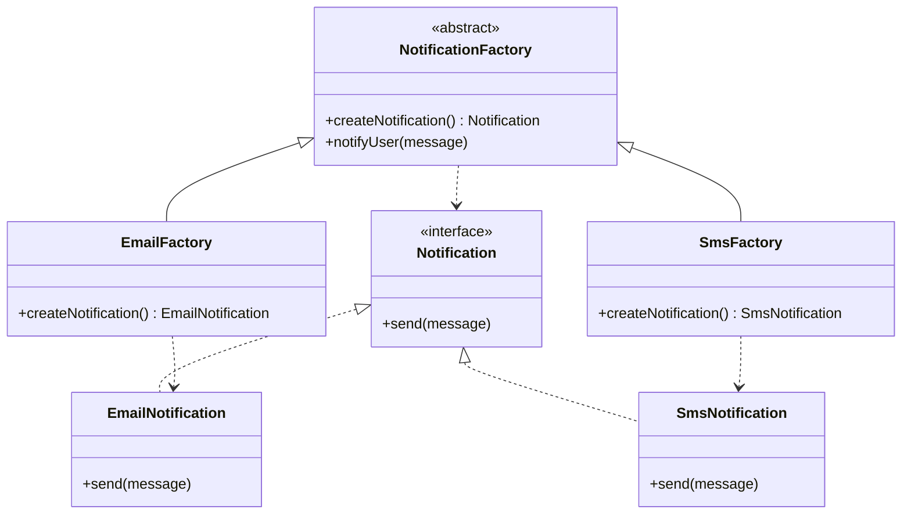

# 工厂方法模式

## 定义

**工厂方法模式**（Factory Method Pattern）是一种创建型设计模式，它定义一个用于**创建对象的接口**，让子类来决定实例化哪个具体类。工厂方法将对象的创建延迟到子类，从而实现创建逻辑的解耦与扩展。

与"简单工厂"（`if-else` 根据参数选择类型）不同，工厂方法通过**继承**实现扩展，新增产品只需新增一对"产品类 + 工厂类"，不需要修改任何已有代码。

## 不使用该模式存在的问题

一个订单系统需要发送通知。起初只有邮件，直接在业务逻辑里 `new EmailNotification()`：

``` java title="FactoryMethodBadExample.java"
--8<-- "code/topic/design-patterns/src/main/java/com/example/creational/factory_method/FactoryMethodBadExample.java"
```

每次新增通知渠道，都要修改 `OrderService`——一个与通知逻辑毫无关系的类。

## 设计模式结构说明



核心角色：

| 角色 | 说明 |
|------|------|
| `Creator`（抽象工厂） | 声明工厂方法，同时包含使用产品的业务逻辑骨架 |
| `ConcreteCreator`（具体工厂） | 重写工厂方法，返回对应的具体产品 |
| `Product`（抽象产品） | 定义工厂生产的所有产品的公共接口 |
| `ConcreteProduct`（具体产品） | 实现产品接口的具体类 |

## 设计模式举例说明

以支付渠道为例，演示完整的工厂方法实现：

``` java title="FactoryMethodExample.java"
--8<-- "code/topic/design-patterns/src/main/java/com/example/creational/factory_method/FactoryMethodExample.java"
```

需要新增银联支付时，只需新增 `UnionPayProcessor` 和 `UnionPayFactory`，业务代码完全不用动。

## 该模式的优缺点

**优点**：

- 🎯 **符合开闭原则**：新增产品只需新增工厂类和产品类，不修改已有代码
- 🎯 **解耦创建与使用**：调用方只依赖抽象接口，不感知具体实现
- 🎯 **单一职责**：每个具体工厂只负责创建一种产品，职责清晰
- 🎯 **灵活配置**：可通过配置文件、Spring 注入等方式动态切换工厂

**缺点**：

- ⚠️ **类数量增多**：每新增一种产品，就需要同时新增一个产品类和一个工厂类，系统类数量快速增长
- ⚠️ **结构复杂**：对于简单场景（只有 1~2 种产品），引入工厂方法反而过度设计，直接 `new` 更简洁

## 与其它模式的关系

| 相关模式 | 关系说明 |
|---------|---------|
| **抽象工厂模式** | 抽象工厂是工厂方法的"升级版"——抽象工厂包含多个工厂方法，创建一个产品族 |
| **模板方法模式** | 工厂方法经常在模板方法中使用，用于在算法骨架中创建所需对象 |
| **原型模式** | 可以替代工厂方法：当产品对象的创建代价高时，直接克隆原型比调用工厂更高效 |
| **迭代器模式** | 集合类的 `iterator()` 方法是工厂方法的经典应用——返回具体集合对应的迭代器 |

## 应用场景

- 🗂️ **多渠道支付**：支付宝/微信/银联，每种渠道一个工厂，按配置切换
- 🗂️ **多格式文档生成**：PDF/Excel/Word，每种格式一个工厂
- 🗂️ **多种数据库连接**：MySQL/PostgreSQL/Oracle，数据源工厂按环境切换
- 🗂️ **JDK 内置**：`Calendar.getInstance()`、`NumberFormat.getInstance()`、`Collection.iterator()`
- 🗂️ **Spring BeanFactory**：`getBean()` 根据 Bean 的类型和配置决定创建哪种实例

!!! tip "简单工厂 vs 工厂方法"

    **简单工厂**（不是 GoF 23 种之一）：一个静态方法，内部 `if-else` 返回不同对象。简单但不符合 OCP，新增类型要改方法体。
    
    **工厂方法**：通过继承扩展，新增类型只需新增子类，不改已有代码。适合产品类型未来会扩展的场景。
