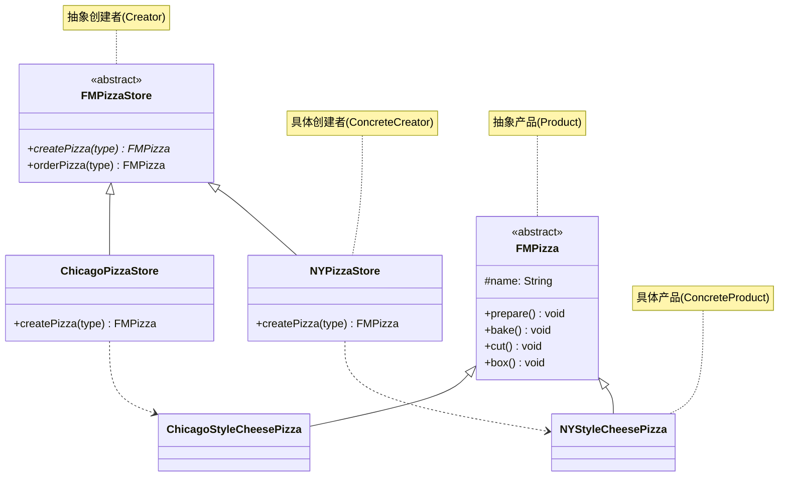

# 工厂方法模式

## 从披萨连锁店说起

你的披萨店大受欢迎，准备在纽约和芝加哥开连锁店。但两个城市的披萨口味不同——纽约用薄脆饼底，芝加哥用厚脆饼底；切法也不同。如果把创建逻辑写在 `PizzaStore.orderPizza()` 里，就变成：

```java
if (style.equals("ny")) {
    pizza = new NYStyleCheesePizza();
} else if (style.equals("chicago")) {
    pizza = new ChicagoStyleCheesePizza();
}
```

这意味着每开一个新城市，都要修改 `PizzaStore`——把变化的部分（"创建哪种披萨"）与不变的部分（"准备-烘烤-切-打包的流程"）耦合在了一起。

**解决方案：** 把 `createPizza()` 声明为抽象方法，让子类来决定实例化哪种 Pizza。

## 🔍 定义

工厂方法模式（Factory Method）定义一个创建对象的接口，由子类决定实例化哪个具体类。工厂方法让创建逻辑推迟到子类，从而实现创建与使用的解耦。

> **设计原则：依赖倒置（DIP）—— 高层组件不应该依赖低层组件，两者都应该依赖抽象。**
> `PizzaStore`（高层）不依赖 `NYStyleCheesePizza`（低层），而是依赖 `Pizza`（抽象）。

## ⚠️ 不使用该模式存在的问题

``` java title="FactoryMethodBadExample.java"
--8<-- "code/topic/design-patterns/src/main/java/com/example/creational/factory_method/FactoryMethodBadExample.java"
```

## 🏗️ 设计模式结构（披萨连锁店）



核心角色：

| 角色 | 说明 |
|------|------|
| `FMPizzaStore`（抽象创建者） | 声明工厂方法，包含 `orderPizza()` 业务骨架 |
| `NYPizzaStore`（具体创建者） | 实现工厂方法，决定创建纽约风格的 Pizza |
| `FMPizza`（抽象产品） | 所有 Pizza 的公共接口 |
| `NYStyleCheesePizza`（具体产品） | 纽约风格的具体 Pizza |

## 💻 设计模式举例说明

``` java title="FactoryMethodExample.java"
--8<-- "code/topic/design-patterns/src/main/java/com/example/creational/factory_method/FactoryMethodExample.java"
```

!!! tip "工厂方法 = 模板方法 + 产品创建"

    `PizzaStore.orderPizza()` 是模板方法，它定义了"准备→烘烤→切→打包"的算法框架；`createPizza()` 是工厂方法，嵌入在模板方法中。子类通过实现 `createPizza()` 同时实现了"创建正确的产品"和"参与到模板流程中"。

## ⚖️ 优缺点

**优点：**

- 符合**开闭原则**：新增城市（新增子类）不修改已有代码
- 符合**依赖倒置**：`PizzaStore` 只依赖抽象 `Pizza`，不依赖任何具体 Pizza 类
- 创建与使用解耦，可以灵活配置

**缺点：**

- 类数量增多：每新增一种产品类型，就需要新增工厂子类 + 产品子类
- 对于简单场景，工厂方法反而过度设计

## 🔗 与其它模式的关系

| 相关模式 | 关系说明 |
|---------|---------|
| 抽象工厂 | 抽象工厂是工厂方法的扩展——包含多个工厂方法，创建一整族产品 |
| 模板方法 | 工厂方法通常嵌入在模板方法中使用 |
| 原型 | 当产品创建代价高时，可用克隆替代工厂方法 |

## 🗂️ 应用场景

- 多渠道支付、多格式文档生成、多数据库连接
- JDK：`Collection.iterator()` 是工厂方法的经典体现（每种集合返回自己的迭代器）
- Spring `BeanFactory.getBean()` 根据配置决定创建哪种 Bean 实例

## 🏭 工业视角

### 工厂方法用多态消除了 if-else，但并未消除选择逻辑

工厂方法的经典结构是：为每种产品创建一个对应的工厂子类，通过多态来替代条件分支。新增一种 Parser，只需新增一个 Factory 实现，原有代码不动——符合开闭原则。

``` java title="工厂方法：多态替代 if-else"
// 每种 Parser 对应一个工厂，新增类型只需新增工厂类
public interface IRuleConfigParserFactory {
    IRuleConfigParser createParser();
}

public class JsonRuleConfigParserFactory implements IRuleConfigParserFactory {
    @Override
    public IRuleConfigParser createParser() {
        return new JsonRuleConfigParser();
    }
}
```

但问题随之而来：**调用方如何选择使用哪个工厂？** 往往还需要一个 if-else 来决定实例化哪个 Factory。此时通常用一个简单工厂（或 Map）来管理 Factory 的选择，形成"工厂的工厂"结构。

### 工厂方法适合创建逻辑本身复杂的场景

工厂方法真正的价值不在于消除 if-else，而在于：**当不同类型对象的创建过程差异很大**，把复杂的创建逻辑封装在各自的 Factory 子类中，职责清晰，互不干扰。

如果只是 `new XxxParser()`，三行以内能写完，用工厂方法反而是过度设计——多出 N 个工厂类，代码量翻倍，可读性下降。

!!! warning "工厂方法的代价"

    引入工厂方法会显著增加类的数量：每种产品需要一个 Factory 子类。
    在类型较多且创建逻辑简单的场景下，简单工厂（一个类 + if-else 或 Map）通常是更务实的选择。
