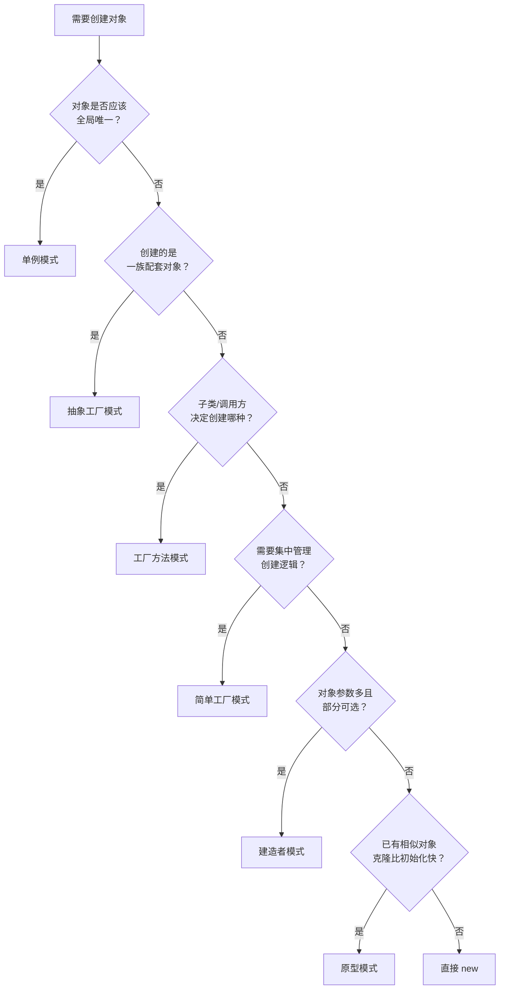

# 创建型模式

创建型模式关注**对象的创建过程**——当直接 `new` 一个对象会带来耦合、复杂度或资源浪费时，这类模式提供了更灵活的对象创建方式。

GoF 定义了 5 种创建型模式，加上常见的简单工厂（非 GoF），共 6 种，每种模式都有独立的详细笔记：

| 模式 | 一句话总结 | 核心手段 |
|------|-----------|---------|
| [单例（Singleton）](singleton/index.md) | 全局只有一个实例 | 私有构造函数 + 静态方法 |
| [简单工厂（Simple Factory）](simple-factory/index.md)* | 工厂类集中管理创建逻辑 | 静态工厂方法 + switch |
| [工厂方法（Factory Method）](factory-method/index.md) | 子类决定创建哪个具体类 | 继承 + 重写工厂方法 |
| [抽象工厂（Abstract Factory）](abstract-factory/index.md) | 创建一族相关对象 | 接口 + 多个工厂方法 |
| [建造者（Builder）](builder/index.md) | 分步骤组装复杂对象 | 链式调用 + `build()` |
| [原型（Prototype）](prototype/index.md) | 克隆现有对象 | `clone()` 深拷贝 |

> *简单工厂不是 GoF 23 种模式之一，但作为工厂方法的入门前置，通常一起学习。

## 模式选型参考

