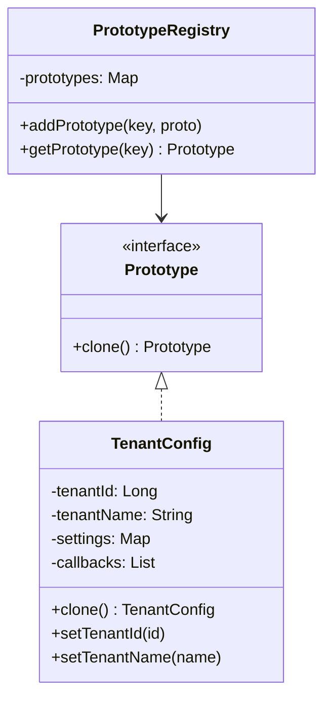

# 原型模式

## 定义

**原型模式**（Prototype Pattern）是一种创建型设计模式，它通过**克隆（复制）**一个已存在的对象来创建新对象，而不是通过调用构造函数从头初始化。

被克隆的对象称为"原型"（Prototype）。克隆出来的新对象与原型具有相同的初始状态，之后可以独立修改，互不影响（前提是进行了深拷贝）。

## 不使用该模式存在的问题

一个配置系统需要为每个租户生成独立的配置对象，所有租户都基于同一份"默认配置"，但可能对部分字段有个性化修改。默认配置的初始化代价很高（从数据库读取、解析 YAML、注册回调）：

``` java title="PrototypeBadExample.java"
--8<-- "code/topic/design-patterns/src/main/java/com/example/creational/prototype/PrototypeBadExample.java"
```

同样的问题还出现在游戏开发中：地图上有成百上千个相似的 NPC，每个 NPC 的基础属性（外观、技能、AI 行为）相同，只有位置和 ID 不同，每次都重新加载资源和初始化行为树代价太高。

## 设计模式结构说明



核心角色：

| 角色 | 说明 |
|------|------|
| `Prototype`（原型接口） | 声明 `clone()` 方法 |
| `ConcretePrototype`（具体原型） | 实现克隆操作，区分浅拷贝与深拷贝 |
| `PrototypeRegistry`（原型注册表，可选） | 缓存多个命名原型，按需克隆 |

## 设计模式举例说明

以租户配置为例，结合原型注册表，演示完整的原型模式实现：

``` java title="PrototypeExample.java"
--8<-- "code/topic/design-patterns/src/main/java/com/example/creational/prototype/PrototypeExample.java"
```

## 该模式的优缺点

**优点**：

- 🎯 **性能提升**：避免重复执行昂贵的初始化过程，克隆远比从头构造快
- 🎯 **运行时创建对象**：无需知道对象的具体类型，通过接口即可克隆出同类对象
- 🎯 **减少子类数量**：当对象变体只是初始状态不同时，用原型替代为每种变体创建一个子类
- 🎯 **复杂对象的简便创建**：深层次对象树的创建，克隆比 Builder 更方便

**缺点**：

- ⚠️ **深拷贝复杂**：对象包含引用类型、循环引用时，手写深拷贝容易出错
- ⚠️ **违反封装**：克隆方法需要访问对象的所有字段，可能暴露私有实现细节
- ⚠️ **克隆包含循环引用的对象**：需要特殊处理（维护已克隆对象的 Map），代码复杂度高

## 与其它模式的关系

| 相关模式 | 关系说明 |
|---------|---------|
| **工厂方法模式** | 两者都能创建对象；当对象创建涉及复杂初始化时用原型，当需要通过子类决定具体类型时用工厂方法 |
| **抽象工厂模式** | 抽象工厂的具体工厂可以用原型实现：工厂内保存原型，通过克隆返回产品，避免子类数量爆炸 |
| **建造者模式** | 两者都能创建复杂对象；建造者关注分步骤构建过程，原型关注复制已有对象。两者可结合：用 Builder 构建第一个原型，后续克隆 |
| **命令模式** | 命令对象有时用原型保存快照，支持历史记录和撤销操作 |

## 应用场景

- 🗂️ **配置模板**：基于默认配置克隆出各环境（dev/staging/prod）或各租户的配置
- 🗂️ **游戏对象**：NPC、子弹、粒子等大量相似对象的快速创建（预设模板 + 克隆）
- 🗂️ **文档/表格模板**：基于模板文档克隆出新文档（如 Word 模板、Excel 报表模板）
- 🗂️ **JDK 内置**：`Object.clone()`、`ArrayList.clone()`、`HashMap.clone()`
- 🗂️ **Spring Bean**：`@Scope("prototype")` — 每次注入时 Spring 克隆一个新实例

!!! warning "浅拷贝 vs 深拷贝"

    Java 的 `Object.clone()` 默认是**浅拷贝**：对象本身被复制，但其中的引用类型字段仍指向同一个对象。
    
    ``` java
    // ❌ 浅拷贝的陷阱
    TenantConfig copy = original.clone();
    copy.getSettings().put("theme", "dark"); // 修改了 copy 的 settings
    System.out.println(original.getSettings().get("theme")); // 输出 "dark"！原型被污染了
    ```
    
    务必对所有**可变引用类型**字段进行深拷贝：`new HashMap<>(original.getSettings())`。
    
    对于嵌套层次很深的对象，可以考虑使用序列化方案（Jackson/Kryo）实现通用深拷贝，但性能较手写深拷贝差。
