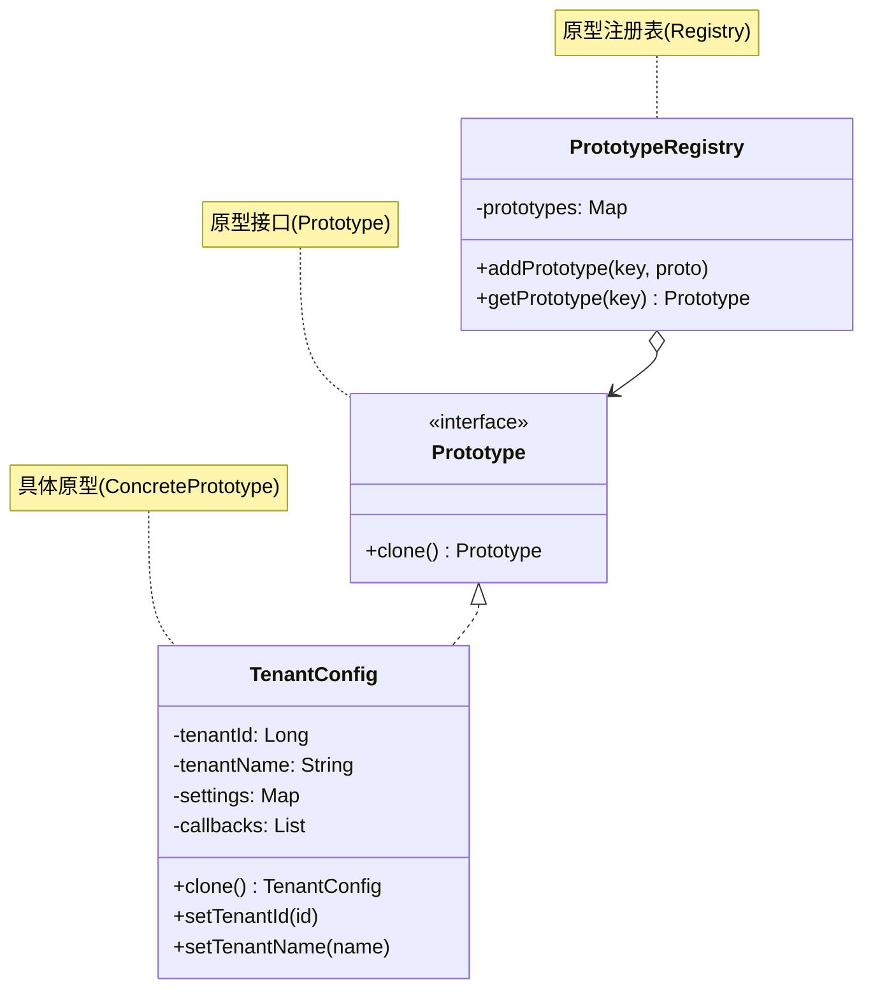

# 原型模式

## 从批量 NPC 生成说起

游戏地图上有 500 个 Goblin，每一个都经历了完整的初始化流程：读取磁盘上的动画帧、解析技能树 XML、注册到 AI 调度器……每次 `new Goblin()` 耗时 100ms，500 次就是 50 秒——地图还没加载完，玩家就已经放弃了。

注意到这 500 个 Goblin 的模型、技能、AI 行为完全一样，只有出生坐标和血量不同。原型模式的解法是：只做一次完整初始化，生成一个"模板 Goblin"，后续通过 `clone()` 快速复制出其他副本，每个副本只需设置独有的坐标和 ID。

## 🔍 定义

**原型模式**（Prototype Pattern）是一种创建型设计模式，它通过**克隆（复制）**一个已存在的对象来创建新对象，而不是通过调用构造函数从头初始化。

被克隆的对象称为"原型"（Prototype）。克隆出来的新对象与原型具有相同的初始状态，之后可以独立修改，互不影响（前提是进行了深拷贝）。

## ⚠️ 不使用该模式存在的问题

一个配置系统需要为每个租户生成独立的配置对象，所有租户都基于同一份"默认配置"，但可能对部分字段有个性化修改。默认配置的初始化代价很高（从数据库读取、解析 YAML、注册回调）：

``` java title="PrototypeBadExample.java"
--8<-- "code/topic/design-patterns/src/main/java/com/example/creational/prototype/PrototypeBadExample.java"
```

同样的问题还出现在游戏开发中：地图上有成百上千个相似的 NPC，每个 NPC 的基础属性（外观、技能、AI 行为）相同，只有位置和 ID 不同，每次都重新加载资源和初始化行为树代价太高。

## 🏗️ 设计模式结构说明



核心角色：

| 角色 | 说明 |
|------|------|
| `Prototype`（原型接口） | 声明 `clone()` 方法 |
| `ConcretePrototype`（具体原型） | 实现克隆操作，区分浅拷贝与深拷贝 |
| `PrototypeRegistry`（原型注册表，可选） | 缓存多个命名原型，按需克隆 |

## 💻 设计模式举例说明

以租户配置为例，结合原型注册表，演示完整的原型模式实现：

``` java title="PrototypeExample.java"
--8<-- "code/topic/design-patterns/src/main/java/com/example/creational/prototype/PrototypeExample.java"
```

## ⚖️ 优缺点

**优点**：

- 🎯 **性能提升**：避免重复执行昂贵的初始化过程，克隆远比从头构造快
- 🎯 **运行时创建对象**：无需知道对象的具体类型，通过接口即可克隆出同类对象
- 🎯 **减少子类数量**：当对象变体只是初始状态不同时，用原型替代为每种变体创建一个子类
- 🎯 **复杂对象的简便创建**：深层次对象树的创建，克隆比 Builder 更方便

**缺点**：

- ⚠️ **深拷贝复杂**：对象包含引用类型、循环引用时，手写深拷贝容易出错
- ⚠️ **违反封装**：克隆方法需要访问对象的所有字段，可能暴露私有实现细节
- ⚠️ **克隆包含循环引用的对象**：需要特殊处理（维护已克隆对象的 Map），代码复杂度高

## 🔗 与其它模式的关系

| 相关模式 | 关系说明 |
|---------|---------|
| **工厂方法模式** | 两者都能创建对象；当对象创建涉及复杂初始化时用原型，当需要通过子类决定具体类型时用工厂方法 |
| **抽象工厂模式** | 抽象工厂的具体工厂可以用原型实现：工厂内保存原型，通过克隆返回产品，避免子类数量爆炸 |
| **建造者模式** | 两者都能创建复杂对象；建造者关注分步骤构建过程，原型关注复制已有对象。两者可结合：用 Builder 构建第一个原型，后续克隆 |
| **命令模式** | 命令对象有时用原型保存快照，支持历史记录和撤销操作 |

## 🗂️ 应用场景

- 🗂️ **配置模板**：基于默认配置克隆出各环境（dev/staging/prod）或各租户的配置
- 🗂️ **游戏对象**：NPC、子弹、粒子等大量相似对象的快速创建（预设模板 + 克隆）
- 🗂️ **文档/表格模板**：基于模板文档克隆出新文档（如 Word 模板、Excel 报表模板）
- 🗂️ **JDK 内置**：`Object.clone()`、`ArrayList.clone()`、`HashMap.clone()`
- 🗂️ **Spring Bean**：`@Scope("prototype")` — 每次请求都创建一个**全新实例**（通过正常实例化，而非 `clone()`；命名借用了"原型"概念，但实现机制不同）

!!! warning "浅拷贝 vs 深拷贝"

    Java 的 `Object.clone()` 默认是**浅拷贝**：对象本身被复制，但其中的引用类型字段仍指向同一个对象。
    
    ``` java
    // ❌ 浅拷贝的陷阱
    TenantConfig copy = original.clone();
    copy.getSettings().put("theme", "dark"); // 修改了 copy 的 settings
    System.out.println(original.getSettings().get("theme")); // 输出 "dark"！原型被污染了
    ```
    
    务必对所有**可变引用类型**字段进行深拷贝：`new HashMap<>(original.getSettings())`。
    
    对于嵌套层次很深的对象，可以考虑使用序列化方案（Jackson/Kryo）实现通用深拷贝，但性能较手写深拷贝差。

## 🏭 工业视角

### 原型模式的真实动机：高成本对象的增量更新

原型模式不是为了"少写一个构造函数"，它真正的应用场景是：**对象的创建成本很高，且新对象与已有对象大部分数据相同**。

典型案例：系统内存中维护了 10 万条搜索关键词的 `HashMap` 索引，每隔 10 分钟需要更新。如果每次都从数据库重新加载全量数据重建 HashMap，代价极高。原型模式的解法是：

1. 浅拷贝当前 `HashMap` 得到 `newKeywords`（只需复制索引，O(n) 但比重建 DB 查询快得多）
2. 从数据库只取出**增量更新**（上次更新时间之后有变化的条目）
3. 将增量更新写入 `newKeywords`
4. 原子切换：`currentKeywords = newKeywords`

``` java title="原型模式：浅拷贝 + 增量更新"
public void refresh() {
    // ① 浅拷贝当前索引作为基础
    HashMap<String, SearchWord> newKeywords =
        (HashMap<String, SearchWord>) currentKeywords.clone();

    // ② 只从 DB 取增量数据
    List<SearchWord> updates = getSearchWords(lastUpdateTime);
    for (SearchWord sw : updates) {
        newKeywords.put(sw.getKeyword(), sw); // 新对象替换旧引用
    }
    // ③ 原子切换，currentKeywords 始终是完整的某一版本
    currentKeywords = newKeywords;
}
```

### 浅拷贝的陷阱：共享可变引用会导致数据版本混乱

`HashMap.clone()` 只复制了索引层（Entry 数组），不复制 Value 对象（`SearchWord`）。如果在 `newKeywords` 上直接修改已有 `SearchWord` 对象的字段（如更新计数），`currentKeywords` 中同一个对象也会被修改，导致两个"版本"互相污染。

正确做法：更新时**创建新的 `SearchWord` 对象**替换引用，而不是修改已有对象的字段。

``` java title="正确：替换引用，不修改共享对象"
// ✅ 新建对象替换引用，currentKeywords 中的旧引用不受影响
newKeywords.put(sw.getKeyword(), sw);

// ❌ 错误：直接修改共享的 SearchWord 对象
SearchWord old = newKeywords.get(sw.getKeyword());
old.setCount(sw.getCount()); // currentKeywords 中的同一个对象也被修改了！
```

### Java `Cloneable` 接口的局限性

Java 的原型机制设计存在几个已知缺陷：

- `Cloneable` 是标记接口，本身没有 `clone()` 方法；`clone()` 来自 `Object`，且是 `protected`——需要子类 `override` 并改为 `public` 才能从外部调用
- `clone()` 默认是浅拷贝，深拷贝需要递归手写，容易遗漏
- 对于嵌套层次深或含循环引用的对象，手写深拷贝极易出错

!!! tip "实践中的深拷贝方案"

    - **手写深拷贝**：逐字段 `new`，性能最好，但维护成本高（每次新增字段都要更新）
    - **序列化方案**：`Jackson ObjectMapper` 或 `Kryo` 序列化再反序列化，通用但有性能开销
    - **构造函数拷贝**：`new SearchWord(original.getKeyword(), original.getCount(), ...)`——最直白，推荐用于简单对象
