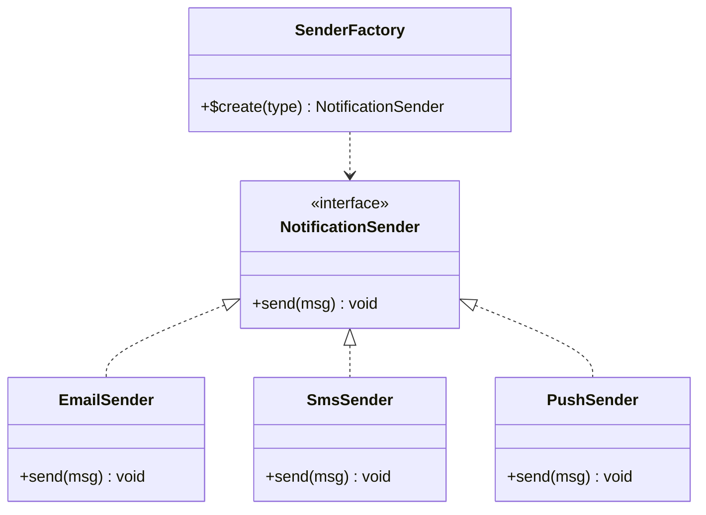

# 简单工厂模式

> 简单工厂（Simple Factory）不是 GoF 23 种设计模式之一，而是一种常见编程惯用法，也是理解工厂方法模式的起点。

## 🔍 定义

简单工厂由一个专门的工厂类（或静态方法）负责创建各种产品对象，客户端只需告诉工厂"我要哪种类型"，无需关心具体类的实例化细节。

## ⚠️ 不使用简单工厂存在的问题

消息通知系统支持邮件、短信、推送三种渠道，客户端直接 `new` 具体类：

``` java title="SimpleFactoryBadExample.java"
--8<-- "code/topic/design-patterns/src/main/java/com/example/creational/simple_factory/SimpleFactoryBadExample.java"
```

## 🏗️ 设计模式结构说明



工厂类集中管理 `new` 操作，客户端只依赖接口 `NotificationSender`。

## 💻 设计模式举例说明

``` java title="SimpleFactoryExample.java"
--8<-- "code/topic/design-patterns/src/main/java/com/example/creational/simple_factory/SimpleFactoryExample.java"
```

## ⚖️ 优缺点

**优点：**

- 将对象创建逻辑集中在一处，客户端无需了解具体类名
- 客户端只依赖接口，符合依赖倒置原则

**缺点：**

- 工厂类职责过重，新增产品类型需要修改工厂（违反**开闭原则**）
- 项目变大后工厂 switch 会越来越臃肿

## 🔗 与其它模式的关系

**相似模式防混淆：**

| 模式 | 扩展方式 | 是否违反 OCP |
|------|---------|------------|
| 简单工厂 | 修改工厂类的 switch | ❌ 违反 OCP |
| 工厂方法 | 新增工厂子类 | ✅ 不违反 OCP |
| 抽象工厂 | 新增工厂实现类 | ✅ 不违反 OCP |

> 工厂方法是简单工厂的演进——将"决定创建哪种对象"的逻辑从 switch 分支改为由子类继承实现，避免修改已有代码。

## 🗂️ 应用场景

- 产品类型相对固定，不会频繁新增
- 需要将对象创建逻辑与使用逻辑分离，降低客户端耦合
- JDK 中：`Calendar.getInstance()`、`NumberFormat.getInstance()` 内部使用了类似思路
