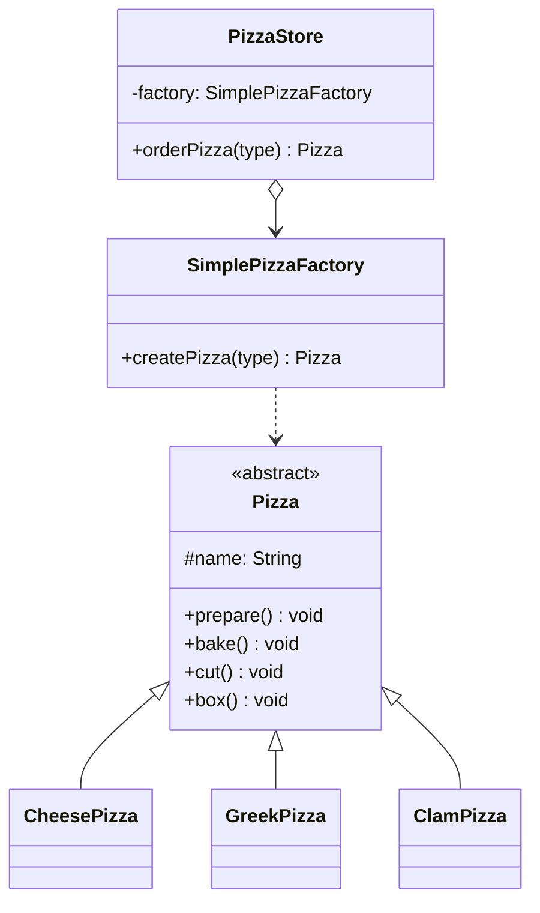

# 简单工厂模式

> 简单工厂（Simple Factory）不是 GoF 23 种设计模式之一，而是一种常见编程惯用法，也是理解工厂方法模式的起点。

## 从披萨店说起

想象你开了一家披萨店。最初只卖三种披萨，于是你在 `orderPizza()` 里写了 if-else——判断类型，`new` 对应的 Pizza，然后执行 prepare/bake/cut/box。

后来生意好了，需要下架希腊披萨、新增蛤蜊披萨，你不得不找到每一处 `orderPizza()` 逐一修改 if-else。改的地方越多，出 bug 的概率越高。

关键的问题在于：**"创建 Pizza 的变化部分"和"处理 Pizza 的不变部分"混在了一起。**

解决方案：把创建逻辑提取到一个专门的工厂类 `SimplePizzaFactory` 中，整个系统中只有这一处 `new` 具体 Pizza。

## 🔍 定义

简单工厂由一个专门的工厂类负责创建各种产品对象，客户端只需告诉工厂"我要哪种类型"，无需关心具体类的实例化细节。

## ⚠️ 不使用简单工厂存在的问题

``` java title="SimpleFactoryBadExample.java"
--8<-- "code/topic/design-patterns/src/main/java/com/example/creational/simple_factory/SimpleFactoryBadExample.java"
```

## 🏗️ 设计模式结构（披萨店）



工厂类集中管理 `new` 操作，`PizzaStore` 只依赖 `SimplePizzaFactory` 和抽象 `Pizza`。

## 💻 设计模式举例说明

``` java title="SimpleFactoryExample.java"
--8<-- "code/topic/design-patterns/src/main/java/com/example/creational/simple_factory/SimpleFactoryExample.java"
```

!!! tip "静态工厂方法"

    `SimplePizzaFactory.createPizza()` 也可以改成静态方法——直接 `SimplePizzaFactory.createPizza("cheese")`，称为**静态工厂**（Static Factory Method）。代价是无法通过子类化来修改工厂的行为。

## ⚖️ 优缺点

**优点：**

- 对象创建逻辑集中在一处，客户端无需了解具体类名
- 客户端只依赖抽象，符合依赖倒置原则

**缺点：**

- 新增产品类型需要修改工厂的 switch（违反**开闭原则**）
- 项目变大后工厂方法会越来越臃肿

## 🔗 与其它模式的关系

| 模式 | 扩展方式 | 是否违反 OCP |
|------|---------|------------|
| 简单工厂 | 修改工厂类的 switch | ❌ 违反 OCP |
| 工厂方法 | 新增工厂子类 | ✅ 不违反 OCP |
| 抽象工厂 | 新增工厂实现类 | ✅ 不违反 OCP |

> 工厂方法是简单工厂的演进——将"决定创建哪种对象"的逻辑从 switch 分支改为由子类继承实现，避免修改已有代码。

## 🗂️ 应用场景

- 产品类型相对固定，不会频繁新增
- 需要将对象创建逻辑与使用逻辑分离，降低客户端耦合
- JDK：`Calendar.getInstance()`、`NumberFormat.getInstance()` 内部使用了类似思路

## 🏭 工业视角

### 简单工厂的本质：封装变化，隔离创建与使用

简单工厂不是为了"高大上的设计模式"，而是一个实用的**封装变化**手段。当对象的创建逻辑（如根据文件后缀选择 Parser）散落在调用方时，每次新增类型都要修改调用方代码。把创建逻辑收拢到工厂类，调用方只需传入类型标识，其余与它无关。

``` java title="简单工厂：将创建逻辑聚拢到一处"
// 工厂类统一管理 Parser 的创建，调用方不依赖任何具体 Parser 类
public class RuleConfigParserFactory {
    private static final Map<String, IRuleConfigParser> cachedParsers = new HashMap<>();

    static {
        cachedParsers.put("json", new JsonRuleConfigParser());
        cachedParsers.put("xml",  new XmlRuleConfigParser());
        cachedParsers.put("yaml", new YamlRuleConfigParser());
    }

    public static IRuleConfigParser createParser(String format) {
        return cachedParsers.get(format.toLowerCase());
    }
}
```

这里同时利用了**缓存**：Parser 无状态，可以复用同一实例，避免重复创建。

### 何时不需要工厂：警惕过度设计

如果创建对象的逻辑只是一行 `new FooClass()`，没有任何条件判断或参数处理，直接 `new` 即可，引入工厂只是增加了一个没有实际价值的间接层。

判断是否需要工厂的关键问题：

- 创建逻辑是否**会变化**（新增类型、切换实现）？
- 创建逻辑是否**足够复杂**（多个条件分支、需要缓存、需要校验）？
- 是否需要**对调用方隐藏**具体类名（依赖倒置）？

三个都是"否"，就直接 `new`。

!!! tip "简单工厂 vs 工厂方法的选择"

    如果创建逻辑简单（几个 if-else），且新增类型不频繁，简单工厂已经足够，不需要引入工厂方法的多态体系。
    工厂方法适合创建逻辑本身就复杂、不同类型的创建过程差异很大的场景。
