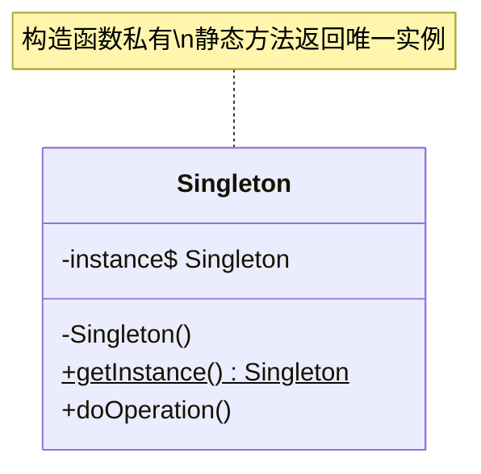

# 单例模式

## 🔍 定义

**单例模式**（Singleton Pattern）是一种创建型设计模式，它确保一个类**只有一个实例**，并提供一个全局访问点来获取该实例。

核心思想：将构造函数私有化，禁止外部直接 `new` 对象；通过静态方法返回唯一实例，并在第一次调用时懒加载或在类加载时提前创建。

## ⚠️ 不使用该模式存在的问题

想象一个数据库连接池对象：建立连接池时需要读取配置、预热连接，这个过程可能耗时数秒。如果不做任何限制，每次需要连接池时都执行 `new ConnectionPool()`：

``` java title="SingletonBadExample.java"
--8<-- "code/topic/design-patterns/src/main/java/com/example/creational/singleton/SingletonBadExample.java"
```

这会带来三个问题：

- **资源浪费**：每个 `ConnectionPool` 都维护着数十条数据库连接，多个实例意味着连接数成倍增加
- **数据不一致**：不同服务持有不同的连接池实例，无法做统一的连接数监控和限流
- **初始化耗时**：频繁重复初始化带来不必要的延迟

## 🏗️ 设计模式结构说明



核心角色：

| 角色 | 说明 |
|------|------|
| `Singleton` | 唯一的类，持有自身的静态实例引用，提供全局访问的静态方法 |

## 💻 设计模式举例说明

以应用配置中心为例，展示四种常见的单例实现方式：

``` java title="SingletonExample.java"
--8<-- "code/topic/design-patterns/src/main/java/com/example/creational/singleton/SingletonExample.java"
```

## ⚖️ 优缺点

**优点**：

- 🎯 **节省资源**：重量级对象（连接池、线程池）只初始化一次，避免重复消耗
- 🎯 **全局一致**：整个应用共享同一个实例，状态统一可控
- 🎯 **懒加载**：使用静态内部类或双重检查锁时，对象在第一次使用时才创建，启动更快

**缺点**：

- ⚠️ **单元测试困难**：全局状态难以在测试间隔离，一个测试的副作用可能影响下一个测试
- ⚠️ **隐藏依赖**：直接调用 `Xxx.getInstance()` 的代码，依赖关系不透明，违反依赖倒置原则
- ⚠️ **多线程陷阱**：实现不当（如忘记 `volatile`）可能在并发场景下创建多个实例
- ⚠️ **可能掩盖设计问题**：过度使用单例有时是"全局变量滥用"的信号

## 🔗 与其它模式的关系

| 相关模式 | 关系说明 |
|---------|---------|
| **外观模式** | 外观对象通常实现为单例——整个应用只需一个入口对象 |
| **享元模式** | 两者都只有一个实例，但目的不同：单例关注"唯一性"，享元关注"共享节省内存" |
| **抽象工厂、建造者、原型** | 这三种创建型模式的工厂/管理类本身，常被实现为单例 |
| **状态模式** | 状态对象通常不需要实例变量，可以用单例替代；但如果状态保存数据，则不能用单例 |

## 🗂️ 应用场景

- 🗂️ **配置中心**：全局只读配置，一份即可（`application.properties` 加载后的包装对象）
- 🗂️ **连接池 / 线程池**：`HikariPool`、`ThreadPoolExecutor` 均应全局唯一
- 🗂️ **日志记录器**：`Logger logger = LoggerFactory.getLogger(...)` 背后的管理器是单例
- 🗂️ **Spring Bean**：默认的 `@Scope("singleton")`，每个 ApplicationContext 中一个实例
- 🗂️ **JDK 内置**：`Runtime.getRuntime()`（JVM 运行时）、`System.console()`

!!! warning "Spring 中的"单例"与 GoF 单例的区别"

    Spring 的单例 Bean 是"容器级别"的唯一——在同一个 `ApplicationContext` 中唯一。如果你创建多个 `ApplicationContext`，同一个 Bean 类会有多个实例。GoF 单例是 JVM 级别的唯一（同一个 ClassLoader 下）。
