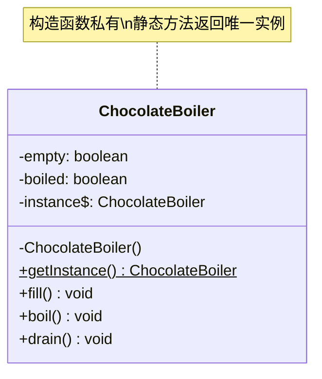

# 单例模式

## 从巧克力锅炉说起

工厂里有一台巧克力锅炉：先 `fill()`（注入原料），再 `boil()`（加热），最后 `drain()`（放出）。这台设备价值昂贵，工厂里只有一台。控制程序必须保证全程只有一个"锅炉控制对象"——如果同时存在两个实例，一个认为锅炉是空的，另一个已经在 `boil()`，就会溢出或损坏设备。

起初，开发者用了"懒加载"写法——第一次调用时才创建实例。但忘了加同步，结果在高并发下，两个线程同时通过了 `if (instance == null)` 的检查，各自创建了一个实例：

## 🔍 定义

单例模式（Singleton）确保一个类**只有一个实例**，并提供一个全局访问点。

核心手段：构造函数私有化 + 静态方法返回唯一实例。

## ⚠️ 不使用该模式存在的问题

``` java title="SingletonBadExample.java"
--8<-- "code/topic/design-patterns/src/main/java/com/example/creational/singleton/SingletonBadExample.java"
```

## 🏗️ 设计模式结构



## 💻 三种线程安全实现

书中重点展示了三种修复方案，各有取舍：

| 方案 | 线程安全 | 懒加载 | 推荐度 |
|------|---------|-------|-------|
| 饿汉式（类加载即创建） | ✅ | ❌ | 适合轻量级对象 |
| 双重检查锁（DCL + volatile） | ✅ | ✅ | ⭐ 生产首选 |
| 枚举 | ✅ | ❌ | 最简洁，防反射/反序列化 |

``` java title="SingletonExample.java"
--8<-- "code/topic/design-patterns/src/main/java/com/example/creational/singleton/SingletonExample.java"
```

!!! warning "为什么 DCL 一定要加 volatile？"

    `new ChocolateBoilerDCL()` 在 JVM 内部分三步：① 分配内存；② 初始化对象；③ 将引用赋值给 `instance`。
    JVM 允许重排序为 ①③②——这时另一个线程在第一次检查时看到 `instance != null`，但对象还未初始化完成，直接返回了一个"半成品"对象。
    `volatile` 禁止这种重排序，确保对象完全初始化后 `instance` 才对其他线程可见。

## ⚖️ 优缺点

**优点：**

- 重量级对象（锅炉、连接池）只初始化一次，节省资源
- 全局共享同一个实例，状态统一可控

**缺点：**

- 单元测试困难：全局状态难以在测试间隔离
- 隐藏依赖：`Xxx.getInstance()` 调用不透明，违反依赖倒置
- 实现不当（漏 `volatile`）在并发下仍会创建多个实例

## 🔗 与其它模式的关系

| 相关模式 | 关系说明 |
|---------|---------|
| 外观模式 | 外观对象通常实现为单例 |
| 享元模式 | 两者都只有一个实例，但目的不同：单例关注"唯一性"，享元关注"共享节省内存" |
| 抽象工厂、建造者、原型 | 这三种模式的工厂/管理类本身，常被实现为单例 |

## 🗂️ 应用场景

- 重量级资源管理：连接池 `HikariPool`、线程池 `ThreadPoolExecutor`
- 全局配置：`application.properties` 加载后的包装对象
- JDK：`Runtime.getRuntime()`、`System.console()`
- Spring Bean 默认 `@Scope("singleton")`（容器级别唯一，非 JVM 级别）

## 工业视角

### 单例的五宗罪：为什么它被称为反模式

单例并不只是线程安全问题，它在工程实践中带来五类真实伤害：

1. **违反 OOP 抽象特性**：`IdGenerator.getInstance().getId()` 是硬编码具体类，无法通过接口替换实现，扩展时要改动所有调用点。
2. **隐藏依赖关系**：单例不通过构造函数或参数声明依赖，阅读代码时必须逐行查找 `getInstance()` 调用，依赖关系完全不透明。
3. **扩展性差**：若需要两个数据库连接池（快 SQL 和慢 SQL 隔离），单例设计就无法适配，需要大规模重构。
4. **可测试性差**：单例持有全局状态，测试用例之间会互相污染；依赖重量级外部资源（如 DB）的单例也无法被 mock 替换。
5. **不支持有参构造**：连接池大小、超时时间等初始化参数无法优雅传入，只能绕路（全局配置类、`init()` 方法等）。

``` java title="单例导致可测试性问题"
// ❌ OrderService 依赖单例 IdGenerator，无法在测试中替换
public class OrderService {
    public void createOrder() {
        long id = IdGenerator.getInstance().getId(); // 全局状态，无法 mock
    }
}

// ✅ 通过构造函数注入，测试时可传入 mock 实现
public class OrderService {
    private final IdGenerator idGenerator;
    public OrderService(IdGenerator idGenerator) {
        this.idGenerator = idGenerator;
    }
}
```

### Spring IoC 是更优雅的"单例管理"方案

Spring 的 Bean 默认是单例作用域（`@Scope("singleton")`），但它的做法与手写单例有本质区别：

- **Bean 本身不知道自己是单例**——类只是普通 POJO，不持有 `getInstance()` 静态方法
- **依赖通过构造函数或 `@Autowired` 注入**——依赖关系可见、可替换
- **测试时可切换 Bean**——`@MockBean`、`@TestConfiguration` 可轻松替换实现

!!! tip "推荐做法"

    在 Spring 体系中，让容器管理对象的生命周期和唯一性，而不是在类内部手写单例逻辑。
    需要全局唯一的对象，用 `@Component` + `@Autowired` 注入，而非 `Singleton.getInstance()`。

### 单例的唯一性边界：进程而非集群

经典单例模式保证的是**进程内唯一**——不同进程（包括同一机器上的多个 JVM 实例）各有独立的单例对象。

在分布式/微服务场景下，"全局唯一"需要借助外部共享存储（如 Redis 分布式锁 + 序列化存储）才能实现，手写单例模式无能为力。

!!! warning "Java 的额外边界"

    严格来说，Java 单例的唯一性作用范围是**类加载器（ClassLoader）**，而非进程。
    同一进程内若存在多个 ClassLoader（如 OSGi、插件容器），同一类可被加载多次，单例保证即告失效。
