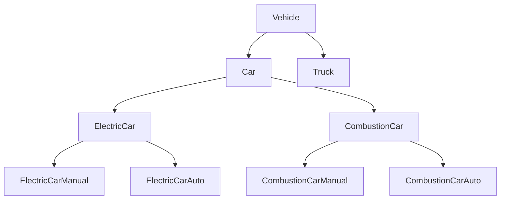

# 设计原则

设计模式是"套路"，而设计原则是"道理"。先理解原则背后的思想，才能在实际项目中判断什么时候用哪种模式，而不是生搬硬套。

《Head First Design Patterns》在每个模式章节末尾都会积累一块"OO 设计原则工具箱"，本文将这些原则与 SOLID 整合，形成一份完整的原则清单。

## 核心 OO 设计原则

### 封装变化

> **找出应用中可能需要变化的部分，把它们从不会变化的部分中分离出来，独立封装。**（《Head First》第 1 章）

这是设计模式最基础的原则——几乎所有模式都是"封装变化"这一思想在不同场景下的具体实现。

**为什么要封装变化？** 代码中频繁修改的部分就是"变化点"，把它们和稳定部分混在一起，每次改动都有引入 bug 的风险。一旦把变化点独立封装，稳定的部分就不再受到干扰。

``` java title="未封装变化 — 飞行行为硬编码在 Duck 基类"
// ❌ 飞行行为直接写在基类，RubberDuck 被迫继承并覆盖为空
public abstract class Duck {
    public void fly() {
        System.out.println("我在飞！"); // ← 变化点混在稳定行为里
    }
    public abstract void display();
}

public class RubberDuck extends Duck {
    @Override
    public void fly() { /* 橡皮鸭不会飞，什么都不做 */ } // ❌ 被迫的空实现
}
```

``` java title="封装变化 — 飞行行为独立为接口"
// ✅ 把"飞行行为"（变化点）提取为独立接口
public interface FlyBehavior {
    void fly();
}

public class FlyWithWings implements FlyBehavior {
    @Override public void fly() { System.out.println("我在用翅膀飞！"); }
}

public class FlyNoWay implements FlyBehavior {
    @Override public void fly() { System.out.println("我飞不起来"); } // 橡皮鸭用此
}

// Duck 的稳定部分（游泳、display）不受飞行变化影响
public abstract class Duck {
    private FlyBehavior flyBehavior; // HAS-A 持有行为

    public void performFly() { flyBehavior.fly(); }
    public abstract void display();
}
```

!!! tip "与策略模式的关系"

    策略模式就是"封装变化"原则的直接体现——把算法（变化点）封装为策略接口，与使用算法的上下文（稳定部分）分离。

### 针对接口编程，不针对实现编程

> **针对接口编程，不针对实现编程。**（《Head First》第 1 章）

这里的"接口"指广义的接口——Java `interface` 或抽象类都算。核心思想是：调用方只依赖抽象（接口/抽象类），不直接依赖具体实现类。

``` java title="针对实现编程 — 耦合具体类"
// ❌ Dog 直接 new 了一个 Animal 的具体子类 — 鸭子嗯
Dog d = new Dog();
d.bark(); // 调用方与 Dog 这个具体类绑定
```

``` java title="针对接口编程 — 依赖抽象"
// ✅ 变量声明为接口类型，具体实现从外部注入
Animal animal = new Dog();     // 可以换成 Cat、Duck...
animal.makeSound();            // 调用接口方法，不知道也不关心具体是什么
```

``` java title="结合策略模式"
// ✅ Duck 只知道 FlyBehavior 接口，不关心具体是哪种飞法
public abstract class Duck {
    FlyBehavior flyBehavior;   // ← 变量类型是接口，不是 FlyWithWings

    public void setFlyBehavior(FlyBehavior fb) {
        this.flyBehavior = fb; // 运行时可以更换飞行行为
    }
}
```

!!! tip "与依赖倒置原则（DIP）的关系"

    DIP（依赖抽象，不依赖具体）是"针对接口编程"的 SOLID 表述版本，两者本质相同，只是出处不同。

### 松耦合设计

> **努力在交互对象之间实现松耦合设计。**（《Head First》第 2 章）

松耦合（Loose Coupling）指对象之间相互知道的信息越少越好——对象可以交互，但不必深入了解对方的内部实现。

松耦合的好处是：一方变化时，另一方几乎不受影响；替换具体实现时，调用方代码不需要修改。

``` java title="紧耦合 — 主题直接操作观察者的具体方法"
// ❌ WeatherData 直接调用显示板的具体方法
public class WeatherData {
    private CurrentConditionsDisplay currentDisplay;
    private StatisticsDisplay statisticsDisplay;

    public void measurementsChanged() {
        // 直接调用具体显示板 — 添加新显示板必须修改这里 ❌
        currentDisplay.update(temperature, humidity, pressure);
        statisticsDisplay.update(temperature, humidity, pressure);
    }
}
```

``` java title="松耦合 — 通过接口交互"
// ✅ Subject 和 Observer 只通过接口彼此认识
public interface Observer {
    void update(float temp, float humidity, float pressure);
}

public class WeatherData implements Subject {
    private List<Observer> observers = new ArrayList<>();

    @Override
    public void notifyObservers() {
        for (Observer o : observers) {
            o.update(temperature, humidity, pressure); // 只知道 Observer 接口
        }
    }
}
```

!!! tip "观察者模式的精髓"

    观察者模式就是松耦合原则在一对多通知场景下的具体实现——主题（Subject）和观察者（Observer）可以独立复用和扩展，相互之间只通过接口认识对方。

### 组合优于继承

> **多用组合，少用继承。**（《Head First》第 1 章）

继承在代码量少时很方便，但一旦类的变化维度超过一个，就会触发**继承爆炸**问题。

假设你要为汽车制造商创建一个目录系统，车辆有三个维度的变化：

- **车型**：轿车、卡车
- **动力**：电动、汽油
- **驾驶**：手动、自动驾驶

用继承实现，需要创建 2 × 2 × 2 = **8 个子类**——增加任何一个维度（如混合动力），类的数量立刻翻倍：



用**组合**改写——把每个变化维度独立为接口，车辆对象持有对应接口的引用：

``` java title="组合优于继承 — 三个维度各自独立，组合使用"
// 三个变化维度各自独立为接口
public interface Engine {
    void run();
}

public interface DriveControl {
    void control();
}

// 具体实现：电动 / 汽油
public class ElectricEngine implements Engine { ... }
public class CombustionEngine implements Engine { ... }

// 具体实现：手动 / 自动驾驶
public class ManualControl  implements DriveControl { ... }
public class AutopilotControl implements DriveControl { ... }

// 车辆通过组合持有各维度的实现
public class Car {
    private Engine engine;           // 可以是 ElectricEngine 或 CombustionEngine
    private DriveControl control;    // 可以是 ManualControl 或 AutopilotControl

    public Car(Engine engine, DriveControl control) {
        this.engine = engine;
        this.control = control;
    }
}

// 使用时按需组合，无需预先创建所有组合子类
Car electricAutoCar = new Car(new ElectricEngine(), new AutopilotControl());
Car gasManualTruck = new Car(new CombustionEngine(), new ManualControl());
```

新增一个维度（如混合动力）只需加一个 `HybridEngine` 实现类，**不需要修改任何现有代码**。

!!! tip "继承 vs 组合的选择依据"

    **继承**适合于：IS-A 关系成立，且子类确实是父类行为的扩展（Rectangle → ColoredRectangle）。

    **组合**适合于：HAS-A 关系，或类的变化来自多个维度（车型 × 动力 × 驾驶）——此时继承会导致子类数量爆炸。

    实践口诀：「先考虑组合，继承有理由再用」。

## SOLID 原则

SOLID 是五条面向对象设计原则的缩写，由 Robert C. Martin（"Uncle Bob"）整理推广：

| 字母 | 原则 | 一句话总结 |
|------|------|-----------|
| S | 单一职责原则（SRP） | 一个类只做一件事 |
| O | 开闭原则（OCP） | 对扩展开放，对修改关闭 |
| L | 里氏替换原则（LSP） | 子类可以无缝替换父类 |
| I | 接口隔离原则（ISP） | 接口要细化，不强迫依赖不需要的方法 |
| D | 依赖倒置原则（DIP） | 依赖抽象，不依赖具体实现 |

### 单一职责原则

当一个类承担的职责越多，它被修改的理由就越多，耦合就越高——任何一处改动都可能引发意外的连锁反应。

``` java title="违反 SRP"
// ❌ User 类承担了三件事：数据存储、发邮件、写日志
public class User {
    private String name;
    private String email;

    // 职责一：业务数据
    public void setName(String name) { this.name = name; }

    // 职责二：发邮件（和用户数据无关）
    public void sendWelcomeEmail() {
        // 调用邮件服务...
    }

    // 职责三：记录日志（和用户数据无关）
    public void logUserCreation() {
        // 写日志文件...
    }
}
```

``` java title="遵循 SRP"
// ✅ 职责拆分后，每个类只做一件事
public class User {
    private String name;
    private String email;
    // 只管数据
}

public class EmailService {
    public void sendWelcomeEmail(User user) {
        // 只管发邮件
    }
}

public class UserLogger {
    public void logCreation(User user) {
        // 只管日志
    }
}
```

!!! tip "判断技巧"

    判断是否违反 SRP，可以问：「这个类为什么会被修改？」如果有多个答案，就需要拆分。

### 开闭原则

每次修改已有代码都有引入新 bug 的风险，而扩展新代码只会增加，不会破坏已有逻辑。

``` java title="违反 OCP"
// ❌ 每次新增折扣类型，都要修改这个方法
public class OrderService {
    public double calculateDiscount(Order order, String discountType) {
        if ("VIP".equals(discountType)) {
            return order.getAmount() * 0.8;
        } else if ("STUDENT".equals(discountType)) {
            return order.getAmount() * 0.9;
        } else if ("EMPLOYEE".equals(discountType)) { // ← 新增时要改这里
            return order.getAmount() * 0.7;
        }
        return order.getAmount();
    }
}
```

``` java title="遵循 OCP"
// ✅ 定义折扣策略接口，新增折扣类型只需新增实现类，无需改已有代码
public interface DiscountStrategy {
    double calculate(double amount);
}

public class VipDiscount implements DiscountStrategy {
    @Override
    public double calculate(double amount) {
        return amount * 0.8; // VIP 八折
    }
}

public class StudentDiscount implements DiscountStrategy {
    @Override
    public double calculate(double amount) {
        return amount * 0.9; // 学生九折
    }
}

// 新增员工折扣：只需加这个类，其他代码不动
public class EmployeeDiscount implements DiscountStrategy {
    @Override
    public double calculate(double amount) {
        return amount * 0.7; // 员工七折
    }
}
```

!!! tip "实践提示"

    "关闭修改"不等于"永不修改"——bug 修复和重构仍然需要修改代码。OCP 的重点是设计扩展点，让新需求通过"加法"而非"改法"来实现。

### 里氏替换原则

里氏替换原则（Liskov Substitution Principle）由 Barbara Liskov 在 1987 年提出：**子类对象能够替换其父类对象，并且程序行为不变。**

经典的反例：`Square`（正方形）继承 `Rectangle`（矩形）。

``` java title="违反 LSP"
// ❌ Square 继承 Rectangle，但行为不一致
public class Rectangle {
    protected int width;
    protected int height;

    public void setWidth(int width)   { this.width = width; }
    public void setHeight(int height) { this.height = height; }
    public int area() { return width * height; }
}

public class Square extends Rectangle {
    @Override
    public void setWidth(int width) {
        this.width = width;
        this.height = width; // ← 修改了高度！违背矩形约定
    }

    @Override
    public void setHeight(int height) {
        this.width  = height;
        this.height = height;
    }
}

// 调用方按矩形理解使用，结果出错
void useRectangle(Rectangle r) {
    r.setWidth(5);
    r.setHeight(3);
    System.out.println(r.area()); // 期望 15，但 Square 输出 9！ ❌
}
```

``` java title="修复方案"
// ✅ Rectangle 和 Square 各自独立，不存在继承关系
public interface Shape {
    int area();
}

public class Rectangle implements Shape { ... }
public class Square    implements Shape { ... }
```

!!! tip "实践提示"

    不是所有"IS-A"的语义关系都适合用继承——正方形在数学上是矩形，但在代码里不一定是。用继承前先问：「子类是否完全满足父类的所有契约？」

### 接口隔离原则

一个接口方法越多，实现它的类就越可能被迫实现"用不到"的方法，导致空实现或异常抛出。

``` java title="违反 ISP"
// ❌ 胖接口：Dog 被迫实现 fly()
public interface Animal {
    void eat();
    void fly();   // 狗不会飞！
    void swim();
}

public class Dog implements Animal {
    @Override public void eat()  { System.out.println("吃饭"); }
    @Override public void fly()  { throw new UnsupportedOperationException("狗不会飞"); } // ❌ 被迫的空实现
    @Override public void swim() { System.out.println("游泳"); }
}
```

``` java title="遵循 ISP"
// ✅ 细粒度接口：按行为能力拆分
public interface Eatable  { void eat(); }
public interface Flyable  { void fly(); }
public interface Swimmable { void swim(); }

// Dog 只实现它能做到的
public class Dog implements Eatable, Swimmable {
    @Override public void eat()  { System.out.println("吃饭"); }
    @Override public void swim() { System.out.println("游泳"); }
}

// Bird 实现飞行和进食
public class Bird implements Eatable, Flyable {
    @Override public void eat() { System.out.println("啄食"); }
    @Override public void fly() { System.out.println("飞翔"); }
}
```

!!! tip "实践提示"

    接口不是越细越好——过度拆分会导致接口爆炸。合理的粒度是"按角色"或"按能力维度"划分，而非"一个方法一个接口"。

### 依赖倒置原则

高层模块（业务逻辑）不应该直接依赖低层模块（数据库、文件系统等具体实现），两者都应该依赖抽象（接口或抽象类）。

``` java title="违反 DIP"
// ❌ 高层模块直接依赖低层具体类
public class UserService {
    private MySQLUserRepository repository; // ← 直接依赖 MySQL 实现

    public UserService() {
        this.repository = new MySQLUserRepository(); // ← 硬编码创建
    }
}
// 想换成 MongoDB？UserService 必须修改——这正是耦合的危害
```

``` java title="遵循 DIP"
// ✅ 依赖抽象接口，具体实现通过构造函数注入
public interface UserRepository {
    User findById(Long id);
    void save(User user);
}

public class MySQLUserRepository implements UserRepository { /* MySQL 实现 */ }
public class MongoUserRepository  implements UserRepository { /* MongoDB 实现 */ }

// UserService 只知道 UserRepository 接口，不关心具体实现
public class UserService {
    private final UserRepository repository;

    // 通过构造函数注入（Spring 的 @Autowired 就是这个原理）
    public UserService(UserRepository repository) {
        this.repository = repository;
    }

    public User findById(Long id) {
        return repository.findById(id);
    }
}
```

!!! tip "实践提示"

    DIP 是 Spring IoC（控制反转）的理论基础。你写 `@Autowired UserRepository repository` 时，就是在践行依赖倒置原则。

## 其他常用原则

### DRY（Don't Repeat Yourself）

不要重复你自己。每一份知识（逻辑、数据）都应该在系统中有且只有一处权威表示。

重复代码带来的问题：修改一处逻辑时，必须找到所有副本逐一修改——遗漏一处就是 bug。

``` java title="违反 DRY — 最典型的代码重复"
// ❌ 两处都写了相同的邮箱校验逻辑
public class UserController {
    public void register(String email) {
        if (!email.contains("@") || email.length() < 5) { // ← 重复
            throw new IllegalArgumentException("邮箱格式不正确");
        }
    }
}

public class AdminController {
    public void addAdmin(String email) {
        if (!email.contains("@") || email.length() < 5) { // ← 重复
            throw new IllegalArgumentException("邮箱格式不正确");
        }
    }
}
```

``` java title="遵循 DRY — 提取公共工具类"
// ✅ 提取为公共工具类，只有一处权威逻辑
public class EmailValidator {
    public static boolean isValid(String email) {
        return email.contains("@") && email.length() >= 5;
    }
}
```

💡 但 DRY 有一个常见的误区：**代码看起来一样，不一定违反 DRY；代码看起来不同，不一定不违反 DRY**。判断标准是**语义**，不是代码形式。

**误区一：实现逻辑重复，但语义不同 → 不违反 DRY**

``` java title="看似重复，其实不违反 DRY"
// isValidUsername 和 isValidPassword 实现完全一样，但语义不同
// ✅ 不应该合并！因为两者将来会独立演变（密码允许大写、更长长度...）
private boolean isValidUsername(String username) {
    if (StringUtils.isBlank(username)) return false;
    int length = username.length();
    if (length < 4 || length > 64) return false;
    if (!StringUtils.isAllLowerCase(username)) return false;
    return true;
}

private boolean isValidPassword(String password) {
    if (StringUtils.isBlank(password)) return false; // ← 当前实现一样
    int length = password.length();
    if (length < 4 || length > 64) return false;    // ← 但密码规则未来会不同
    if (!StringUtils.isAllLowerCase(password)) return false;
    return true;
}
```

**误区二：功能语义相同，但代码形式不同 → 违反 DRY**

``` java title="看似不同，实则违反 DRY"
// ❌ 两个方法功能完全一样，都在校验 IP 合法性，却有两份实现
public boolean isValidIp(String ipAddress) {
    // ... 用正则实现
}

public boolean checkIfIpValid(String ipAddress) {
    // ... 用字符串分割实现
}
// 问题：校验规则变化时，只更新了一处，另一处变成了 bug
```

!!! tip "判断 DRY 的关键"

    问自己：「如果这个功能的规则变了，我需要改几处代码？」
    如果答案是"多处"，就违反了 DRY。如果多处代码语义独立，即使实现相同也不违反。

### KISS（Keep It Simple, Stupid）

KISS 的核心是保持代码的**可读性和可维护性**。但"简单"不等于"代码行数少"，一段难以理解的短代码反而比一段清晰的长代码更复杂。

**「简单」不是行数少**

同样是校验 IP 地址合法性，下面三种实现哪个最"简单"？

``` java title="V1：正则表达式（行数最少，但不简单）"
// ❌ 行数最少，但正则本身难以阅读和维护
public boolean isValidIpV1(String ipAddress) {
    if (StringUtils.isBlank(ipAddress)) return false;
    String regex = "^(1\\d{2}|2[0-4]\\d|25[0-5]|[1-9]\\d|[1-9])\\."
        + "(1\\d{2}|2[0-4]\\d|25[0-5]|[1-9]\\d|\\d)\\."
        + "(1\\d{2}|2[0-4]\\d|25[0-5]|[1-9]\\d|\\d)\\."
        + "(1\\d{2}|2[0-4]\\d|25[0-5]|[1-9]\\d|\\d)$";
    return ipAddress.matches(regex);
}
```

``` java title="V2：工具类拆分（✅ 最符合 KISS）"
// ✅ 逻辑清晰，借助标准工具类，团队中大多数人都能读懂
public boolean isValidIpV2(String ipAddress) {
    if (StringUtils.isBlank(ipAddress)) return false;
    String[] parts = StringUtils.split(ipAddress, '.');
    if (parts.length != 4) return false;
    for (int i = 0; i < 4; i++) {
        int val = Integer.parseInt(parts[i]); // 非法格式会抛异常
        if (val < 0 || val > 255) return false;
        if (i == 0 && val == 0) return false;
    }
    return true;
}
```

``` java title="V3：手动处理字符（性能最高，但比 V2 复杂）"
// ⚠️ 除非是性能瓶颈，否则这种底层优化增加了不必要的复杂度
public boolean isValidIpV3(String ipAddress) {
    char[] chars = ipAddress.toCharArray();
    // ... 逐字符手动解析（约 30 行）
}
```

V2 最符合 KISS——不是因为最短，而是因为逻辑清晰、易读易维护。正则表达式（V1）本身就有复杂度，不是每个人都精通；手动字符处理（V3）是过度优化，只有在 `isValidIp()` 真正成为性能瓶颈时才值得考虑。

**复杂的问题 → 复杂的解法，不违反 KISS**

KMP 字符串匹配算法代码逻辑复杂，实现难度大，但处理大文本匹配时是合理选择——本身就复杂的问题，用合适的复杂算法解决，并不违背 KISS。反而对一个简单的小文本搜索场景强行使用 KMP，才违反了 KISS。

!!! tip "写出 KISS 代码的三个方向"

    - **不用团队成员不熟悉的技术**：正则、位运算技巧等，牺牲可读性换来的那点简洁不值得
    - **善用现成工具类**：不重复造轮子，`StringUtils`、`Collections` 等库经过充分验证
    - **不过度优化**：位运算替代乘除、奇技淫巧的条件语句，除非有明确的性能数据支撑

!!! warning "警惕过度设计"

    刚学会某个模式的程序员往往会过度使用它，看什么都像钉子。如果简单的 if-else 就能解决问题，就不需要策略模式。

### YAGNI（You Aren't Gonna Need It）

**不要构建当前用不到的功能**。你脑海中那些"以后可能会用到"的设计，大多数根本不会被用到——却提前增加了代码复杂度和维护负担。

YAGNI 解决的是「**要不要做**」的问题，而 KISS 解决的是「**怎么做**」的问题，两者不是一回事。

**场景一：配置存储**

系统目前只用 Redis 存配置，你觉得未来可能换成 ZooKeeper，于是提前把 ZooKeeper 的整套集成代码都写好了。

但按照 YAGNI 原则：在真正需要 ZooKeeper 之前，不要写这部分代码。当然，你仍然需要通过接口抽象（OCP）**预留好扩展点**，等需求真的来了，再去实现。YAGNI 的意思是"不实现"，而不是"不设计扩展点"。

**场景二：Maven 依赖**

有些开发者为了避免频繁改 `pom.xml`，提前把一堆"可能用到"的库都引进来。这也违反了 YAGNI——未使用的依赖增加了构建时间和包体积，还会引入不必要的安全风险。

!!! tip "YAGNI 与 OCP 的区别"

    两者看似矛盾——一个说"不要预留扩展点"，一个说"设计扩展点"。区别在于：**已知会变化的点**（如折扣类型、支付方式）应用 OCP 设计扩展点；**臆想可能变化的点**应用 YAGNI，等真正需要时再扩展。

### 迪米特法则

迪米特法则（Law of Demeter，LoD）也叫"最少知识原则"：**一个类对其他类知道的越少越好**。利用这个法则，能实现代码的"高内聚、松耦合"。

**高内聚与松耦合**

- **高内聚**：相近的功能放到同一个类，不相近的功能分割开。类职责单一，修改集中，不会"牵一发而动全身"。
- **松耦合**：类之间依赖关系简单清晰。一个类的改动，不会或很少影响到依赖它的其他类。

高内聚有助于松耦合，松耦合又需要高内聚来支撑，两者相辅相成。

**什么是"直接朋友"？**

只和你的"直接朋友"说话：方法的参数、成员变量、方法内创建的对象、方法的返回值，这四类是"直接朋友"；其他的都是"陌生人"，不要直接调用。

``` java title="违反迪米特法则 — 链式调用暴露内部结构"
// ❌ 深层链式调用，需要了解 Order → Customer → Address → City 的内部结构
public class OrderService {
    public String getCityName(Order order) {
        return order.getCustomer().getAddress().getCity().getName();
    }
}
```

``` java title="遵循迪米特法则 — 封装内部细节"
// ✅ 通过封装隐藏内部结构，OrderService 只和 Order 这一个"朋友"交互
public class Order {
    public String getCustomerCityName() {
        return customer.getCityName(); // 代理给直接朋友 Customer
    }
}

public class Customer {
    public String getCityName() {
        return address.getCityName(); // 代理给直接朋友 Address
    }
}
```

**不该有直接依赖的类，就不要建立依赖**

``` java title="错误：Document 直接创建 HtmlDownloader"
// ❌ Document 的职责是表示网页内容，它不应该关心"怎么下载网页"
public class Document {
    private Html html;
    public Document(String url) {
        HtmlDownloader downloader = new HtmlDownloader(); // ← 越界了
        this.html = downloader.downloadHtml(url);
    }
}
```

``` java title="正确：由外部注入，Document 只管自己的职责"
// ✅ 下载逻辑由调用方负责，Document 只负责持有和处理 Html 内容
public class Document {
    private Html html;
    public Document(Html html) {
        this.html = html; // ← 直接依赖传入，不关心怎么来的
    }
}
```

!!! tip "实践提示"

    链式调用 `a.getB().getC().getD()` 通常是迪米特法则的警报信号。但 Builder 模式的链式调用（`builder.setA().setB().build()`）和流式 API（`stream.filter().map().collect()`）是例外——它们都作用于同一个对象。

### 合成复用原则

优先使用组合（Composition）而不是继承（Inheritance）来复用代码。

继承复用的缺点：子类与父类高度耦合，父类的修改直接影响所有子类；继承关系在编译时固定，运行时无法切换行为。

``` java title="用继承复用（不推荐）"
// ❌ 用继承复用日志功能：与 LoggableService 强绑定
public class LoggableService {
    protected void log(String msg) { System.out.println("[LOG] " + msg); }
}

public class UserService extends LoggableService {
    public void createUser() {
        log("创建用户");
    }
}
```

``` java title="用组合复用（推荐）"
// ✅ Logger 作为成员变量注入，耦合度更低
public class Logger {
    public void log(String msg) { System.out.println("[LOG] " + msg); }
}

public class UserService {
    private final Logger logger;

    public UserService(Logger logger) { this.logger = logger; }

    public void createUser() {
        logger.log("创建用户");
    }
}
```

!!! tip "实践提示"

    "继承"适合真正的 IS-A 关系（`Dog IS-A Animal`），"组合"适合 HAS-A 关系（`Car HAS-A Engine`）。实践中，组合比继承用得更多，因为它更灵活、耦合度更低。

### 好莱坞原则

> **别调用我们，我们会调用你。**（《Head First》第 8 章）

好莱坞（Hollywood Principle）的名字来自影视圈的一句话："别打电话给我们，等我们联系你。"在设计中的含义是：**高层组件调用低层组件，低层组件不主动调用高层组件**——从而防止"依赖腐烂"（高层依赖低层，低层又依赖更高层，依赖关系乱成一团）。

``` java title="违反好莱坞原则 — 子类主动调用父类"
// ❌ 子类主动调用父类方法，控制权在子类
public class Tea {
    void prepareRecipe() {
        boilWater();        // 自己调用父类方法
        steepTeaBag();
        pourInCup();
        addLemon();
    }
    void boilWater()    { System.out.println("煮水"); }
    void pourInCup()    { System.out.println("倒入杯中"); }
    void steepTeaBag()  { System.out.println("浸泡茶包"); }
    void addLemon()     { System.out.println("加柠檬"); }
}
```

``` java title="遵循好莱坞原则 — 父类控制流程，子类等待被调用"
// ✅ 父类（高层组件）掌控算法骨架，子类（低层组件）只提供具体实现
public abstract class CaffeineBeverage {
    // 模板方法 — 父类调用子类，子类不调用父类
    final void prepareRecipe() {
        boilWater();
        brew();          // ← 父类在适当时机"调用"子类
        pourInCup();
        addCondiments(); // ← 父类决定是否调用子类的钩子
    }

    abstract void brew();
    abstract void addCondiments();

    private void boilWater() { System.out.println("煮水"); }
    private void pourInCup() { System.out.println("倒入杯中"); }
}

public class Tea extends CaffeineBeverage {
    @Override void brew()          { System.out.println("浸泡茶包"); }
    @Override void addCondiments() { System.out.println("加柠檬"); }
    // 子类只提供具体实现，不主动控制流程 ✅
}
```

!!! tip "好莱坞原则 vs 依赖倒置原则"

    两者都是为了降低耦合，但关注层面不同：DIP 关注「依赖抽象而不是具体」，好莱坞原则关注「控制权在高层」。模板方法模式是好莱坞原则的直接体现——父类控制算法流程，子类等待被调用填充细节。

## 原则总览

| 来源 | 原则 | 一句话总结 |
|------|------|-----------|
| 《Head First》Ch1 | 封装变化 | 把变化点从稳定点中分离出来 |
| 《Head First》Ch1 | 针对接口编程 | 依赖抽象，不依赖具体实现 |
| 《Head First》Ch2 | 松耦合设计 | 交互对象之间相互知道的越少越好 |
| 《Head First》Ch8 | 好莱坞原则 | 高层调用低层，低层等待被调用 |
| SOLID - S | 单一职责（SRP） | 一个类只做一件事 |
| SOLID - O | 开闭原则（OCP） | 对扩展开放，对修改关闭 |
| SOLID - L | 里氏替换（LSP） | 子类可以无缝替换父类 |
| SOLID - I | 接口隔离（ISP） | 接口要细化，不强迫依赖不需要的方法 |
| SOLID - D | 依赖倒置（DIP） | 依赖抽象，不依赖具体实现 |
| 通用 | DRY | 不要重复你自己 |
| 通用 | KISS | 保持简单 |
| 通用 | YAGNI | 不要实现你暂时用不到的功能 |
| 通用 | 迪米特法则（LoD） | 只和直接朋友说话 |
| 通用 | 合成复用原则 | 优先用组合，而非继承 |
